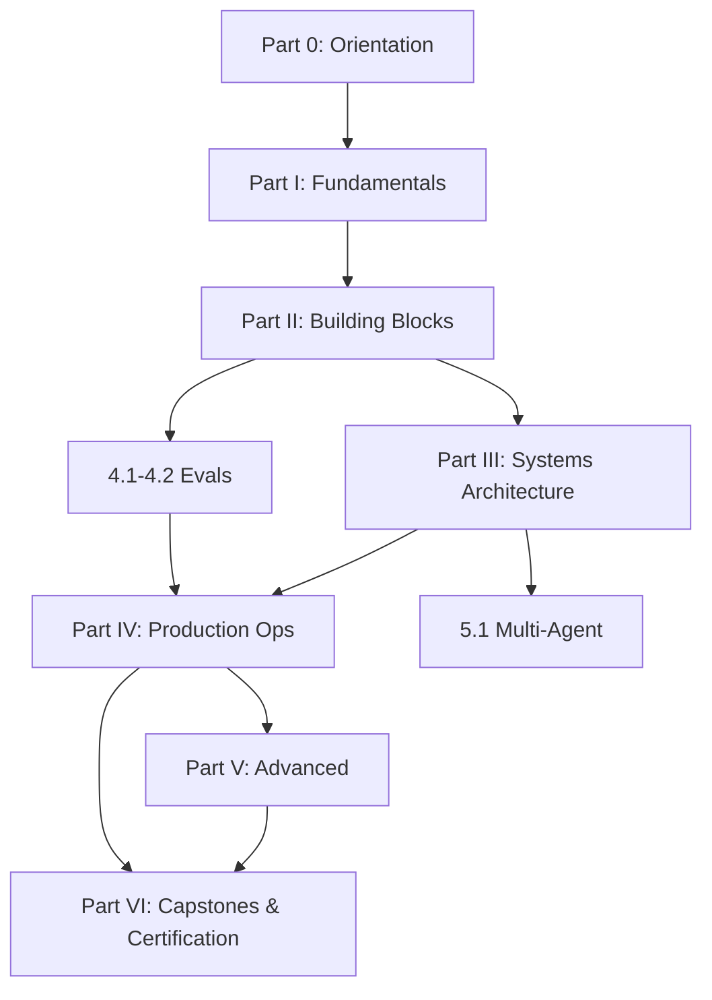

# Production Agentic Systems — Mastery Curriculum
## Master Syllabus v1.1

*A first-principles, failure-driven curriculum for expert-level competence in designing, shipping, and operating agentic AI systems in production — at the depth expected of a top certified practitioner and platform leader.*

---

## 1. Program Charter

**Goal.** Reach the level where you can (a) architect an agentic system for a regulated, high-stakes domain from a blank page, (b) diagnose any production agent failure to root cause, (c) defend every design decision against senior scrutiny — tradeoffs, costs, failure modes, and industry precedent included.

**Design philosophy of the curriculum itself:**

- **Failure-driven.** Every concept is introduced as the answer to a real class of production incident. You learn circuit breakers because of retry storms, not because a chapter is titled "circuit breakers."
- **Spiral.** Every major theme (evals, security, cost, state) appears three times: as a mental model (Parts 0–I), as an architecture pattern (Parts II–III), and as an operating discipline (Part IV+). Depth compounds.
- **First-principles ordering.** Nothing is referenced before it is built. Token economics precede prompting; prompting precedes tools; tools precede orchestration; orchestration precedes multi-agent.
- **Doctrine-anchored.** Each chapter is tied to the canonical industry sources (Section 8) so your positions are backed by leading practice, not folklore.
- **Assessment by artifact.** Mastery is demonstrated through design exercises, incident diagnoses, and capstone specs — not recall.

**Standing thesis carried through the whole program:** deterministic engine + agentic overlay + humans as the immutable source of truth. Each chapter states explicitly how it strengthens or stresses that boundary.

---

## 2. Certification Competency Blueprint

Structured like a professional certification exam blueprint: six domains, weighted by production importance. Every chapter maps to a domain; the mock exam (Part VI) samples by these weights.

| Domain | Weight | Competency statement |
|---|---|---|
| D1 — LLM & Agent Fundamentals | 10% | Explain inference mechanics, context economics, and tool-calling anatomy well enough to predict failure modes from first principles |
| D2 — Agentic Building Blocks | 15% | Select and justify tools/MCP, retrieval, memory, control loops, and orchestration topologies for a given task profile |
| D3 — Systems Architecture | 20% | Draw the deterministic/agentic boundary; design state, HITL, and containment for correctness under partial failure |
| D4 — Production Operations | 30% | Own evals, observability, reliability, cost, and change management as continuous disciplines with quantified gates |
| D5 — Security, Governance & Compliance | 15% | Threat-model agentic systems; design defenses and audit/compliance posture (EU AI Act, NIST AI RMF, OWASP) |
| D6 — Advanced & Frontier | 10% | Reason about multi-agent coordination, long-horizon operation, self-improvement loops, and agent economics |

**Mastery bar per domain:** pass the domain's scenario questions ≥85%, complete its design exercises to rubric, and survive a simulated oral defense (Section 9).

---

## 3. Learning Architecture

**Chapter template (applied to all 27 chapters):**

1. **Failure story** — the production incident class this chapter exists to prevent
2. **Mental model** — first-principles derivation, minimal vocabulary
3. **Architecture patterns** — 2–4 diagrams with an explicit tradeoff table
4. **Production lens** — operating concerns: monitoring signals, cost behavior, degradation modes
5. **Edge-case catalog** — the expert-level traps, each with detection + mitigation
6. **Claude/MCP sidebar** — how the vendor-neutral pattern maps onto Claude's stack (Messages API tool use, MCP, Agent SDK, prompt caching), with pointers to official docs for verification
7. **Design exercise + self-test** — one whiteboard-scale design prompt; five claims to judge true/false *with justification*; a spaced-review card to re-answer 7 days later

**Dependency graph (read order constraints):**

Chapters within a part are mostly independent; parts are strictly ordered except evals (4.1–4.2), which can be pulled forward and studied alongside Part III.

---

# PART 0 — ORIENTATION & PHILOSOPHY

### Chapter 0.1 — The Agentic Spectrum & Design Philosophy

**Failure story:** a team ships a "fully autonomous agent" for a task a cron job plus two API calls would have solved — 20× the cost, 5× the failure rate, zero added value.

**Objectives:** define the workflow↔agent spectrum precisely; internalize the doctrine of earned autonomy; recognize agent-washing.

**Core topics:**
- Workflows (predefined code paths orchestrating LLM calls) vs. agents (the model dynamically directs its own process and tool use) — the canonical Anthropic distinction
- The five composable workflow patterns: prompt chaining, routing, parallelization (sectioning/voting), orchestrator-workers, evaluator-optimizer — and when true agency is actually warranted
- Autonomy as a dial, not a switch: agency is *earned* by demonstrated reliability, granted per-action-class, and revocable
- "Find the simplest solution" as an engineering discipline: the decision tree from prompt → chain → workflow → agent
- Task profile analysis: verifiability, reversibility, value-per-task, tolerance for latency and error

**Expert / edge cases:**
- Agent-washing: deterministic pipelines marketed as agents; how to detect it in vendor diligence
- The inverse trap: rigid workflows for genuinely open-ended tasks, producing brittle branch explosions
- Hybrid drift: systems that begin as workflows and accrete agency without re-derived containment

**Canon:** Anthropic *Building Effective Agents*; OpenAI *A Practical Guide to Building Agents*; 12-Factor Agents (factors on small, focused agents and owning control flow).

**Design exercise:** given five task briefs (invoice matching, incident triage, contract redlining, ad-hoc data Q&A, monthly board pack), place each on the spectrum, justify the autonomy level, and name the cheapest architecture that could possibly work.

---

### Chapter 0.2 — Why Production Is a Different Sport

**Failure story:** a demo with 95% per-step accuracy becomes a 20-step production task: 0.95²⁰ ≈ 36% end-to-end success. The pilot dies in week three.

**Objectives:** quantify compounding error; understand why most agent pilots fail to reach production; adopt nondeterminism as a first-class design constraint.

**Core topics:**
- Compounding error mathematics: per-step reliability vs. horizon length; why long-horizon autonomy demands containment, checkpointing, and recovery rather than just "better prompts"
- pass@k vs. pass^k: optimizing for "works at least once" vs. "works every time" — the production metric is pass^k
- The demo→prod gap decomposed: distribution shift, adversarial inputs, integration surface, accountability, cost at scale, tail latency
- Nondeterminism as a design constraint: same input, different traces; implications for testing, debugging, SLOs, and audit
- The reliability–autonomy frontier: you buy autonomy with verification (tests, judges, humans, invariants)
- Reading industry failure data critically (e.g., widely cited pilot-failure statistics are contested — learn to interrogate methodology, not quote headlines)

**Expert / edge cases:**
- Goodhart on demo metrics: teams optimizing the happy-path eval while tail failures own the P&L
- Silent success bias: agents that "complete" tasks wrongly are worse than agents that fail loudly — the case for verifiable failure over unverifiable success
- Horizon creep: task scope quietly growing past the reliability the system earned

**Canon:** METR research on long-horizon task reliability; Anthropic *Building Effective Agents* (guardrails and simplicity); Hamel Husain on error analysis before metrics.

**Design exercise:** for a 12-step agent with measured 97% per-step reliability, compute end-to-end success; then redesign the flow with two checkpoints and one human gate and recompute effective reliability. State the cost of the added latency.

---

# PART I — FUNDAMENTALS

### Chapter 1.1 — LLM Mechanics for System Builders

**Failure story:** a team pads every request with a 60K-token "context dump." Latency triples, cost 8×, and answer quality *drops* — long-context degradation was never on their radar.

**Objectives:** predict cost, latency, and quality behavior from inference mechanics; treat the context window as a scarce, priced resource.

**Core topics:**
- Inference anatomy: prefill vs. decode; KV cache; why time-to-first-token and tokens-per-second are governed by different bottlenecks
- Context economics: quadratic attention cost intuition; input vs. output token pricing asymmetry; prompt caching mechanics and cache-aware prompt layout (stable prefix first)
- Long-context degradation: "lost in the middle," context rot, recency/primacy effects; effective context ≠ advertised context
- Sampling: temperature, top-p, and why temperature 0 still isn't fully deterministic (batching effects, floating-point nondeterminism, provider-side changes)
- Cost/latency arithmetic every architect must do on a napkin: tokens × price, cache hit ratios, expected turns per task

**Expert / edge cases:**
- Tokenizer quirks: numbers, code, non-Latin scripts, whitespace — cross-model token counts differ enough to break budgets
- Cache invalidation semantics: one changed byte in the prefix invalidates downstream cache; prompt iteration vs. cache economics tension
- Provider-side silent model updates shifting behavior under a pinned-looking model name — why version pinning policy matters (Ch. 4.6)

**Canon:** Anthropic docs on prompt caching and context windows (verify specifics against current docs); Chip Huyen *AI Engineering* (inference optimization chapters).

**Design exercise:** given a support-agent workload (40 msgs/session, 3K-token system prompt, 20 tool schemas), lay out the prompt for maximum cache reuse and estimate monthly cost at 10K sessions; identify the single biggest cost lever.

---

### Chapter 1.2 — Prompting as an Interface Contract

**Failure story:** a "minor wording tweak" to a production system prompt silently breaks a downstream JSON consumer for six days. No versioning, no regression suite, no diff review.

**Objectives:** treat prompts as versioned, tested API surface; master structured output tradeoffs.

**Core topics:**
- System prompt architecture: role, capabilities, constraints, refusal policy, output contract — ordered by instruction hierarchy and precedence
- The prompt as a contract: versioned, code-reviewed, regression-tested like any interface; prompt registries
- Structured outputs: JSON-schema constrained decoding vs. parse-and-repair; when schema constraints measurably degrade reasoning quality and the "reason-then-format" two-step remedy
- Few-shot placement and its interaction with caching; instruction vs. example conflicts
- Defensive prompting: input delimitation, untrusted-content framing (bridge to Ch. 3.5)

**Expert / edge cases:**
- Prompt drift across model upgrades: instructions tuned to one model's quirks regress on the next — coupled prompt+model versioning
- Precedence ambiguity: system vs. developer vs. user instruction conflicts; how models actually resolve them vs. how you assume they do
- Token-boundary sensitivity: formatting changes that alter tokenization and shift behavior

**Canon:** Anthropic prompt engineering docs; 12-Factor Agents ("own your prompts," "own your context window").

**Design exercise:** write the output-contract section of a system prompt for an agent whose JSON feeds a deterministic ledger-posting engine; enumerate every way the contract can be violated and the validation layer that catches each.

---

### Chapter 1.3 — Tool Calling Anatomy & Agent–Computer Interface (ACI) Design

**Failure story:** an agent has 45 tools with one-line descriptions. It calls `search_v2` when it needs `search_accounts`, hallucinates a `limit` parameter, and silently drops page 2 of results — three distinct ACI failures in one trace.

**Objectives:** master the mechanics of the tool loop and the *design discipline* of tool interfaces — the highest-leverage, most under-invested layer in agentic systems.

**Core topics:**
- The tool loop: model emits structured call → runtime executes → result returns as context → repeat; parallel tool calls; tool choice modes; streaming interplay
- ACI as product design: tool names, descriptions, and schemas *are prompts*; consolidation (fewer, higher-level tools beat many primitive ones); namespacing; returning meaningful, token-efficient context; response format discipline
- Error surfaces as first-class design: what the agent sees on failure determines whether it recovers or loops
- Pagination, truncation, units, timezones, and IDs — the boring details where most tool bugs live
- Poka-yoke tooling: make invalid calls unrepresentable (enums over free text, required fields, typed IDs)

**Expert / edge cases:**
- Hallucinated tool names/parameters and structural mitigation (strict schemas, allow-lists, validation-with-feedback loops)
- Over-eager tool use: agents calling tools when parametric knowledge suffices; tool-use budgets
- Silent partial failure: tool returns 200 with an empty or truncated payload; the agent proceeds on false premises
- Tool schema drift: backend changes a field; every prompt example is now subtly wrong

**Canon:** Anthropic *Writing Tools for Agents* and SWE-bench ACI lessons; MCP tool design guidance.

**Design exercise:** redesign a 40-tool CRM surface into ≤12 agent-facing tools; specify one tool fully (name, description, schema, error responses, truncation policy) and justify every choice in terms of agent failure modes prevented.

---

# PART II — AGENTIC BUILDING BLOCKS

### Chapter 2.1 — Tools at Scale & the Model Context Protocol

**Failure story:** a team wires 9 MCP servers into one agent. Tool definitions alone consume 30K tokens per request; two servers expose colliding tool names; one community server ships a malicious update. Cost, correctness, and security fail simultaneously.

**Objectives:** design tool ecosystems, not tool lists; understand MCP architecture and its operational and security consequences.

**Core topics:**
- MCP architecture: hosts, clients, servers; tools/resources/prompts primitives; local vs. remote servers; OAuth-based auth for remote servers
- Tool portfolio management: dynamic/deferred tool loading, tool search, per-task tool budgets; the context cost of every registered tool
- Designing MCP servers: granularity, statefulness, idempotent operations, pagination discipline
- Composition: MCP as the integration substrate under orchestration layers; when to wrap legacy APIs vs. expose them raw

**Expert / edge cases:**
- Tool bloat economics: marginal tool value vs. marginal context cost and selection error rate
- Name collisions and shadowing across servers; deterministic resolution policy
- MCP supply chain risk: server provenance, version pinning, permission scoping, rug-pull updates (deep treatment in Ch. 3.5)
- Version skew between server schema and cached client definitions

**Canon:** MCP specification and Anthropic MCP docs (verify current spec details); OWASP agentic threat work on tool poisoning.

**Design exercise:** define the MCP topology for a finance-ops agent (ERP, banking, docs, email): which servers, which scopes, what tool budget, and where the egress allow-list sits.

---

### Chapter 2.2 — Retrieval & Knowledge Systems

**Failure story:** the agent confidently answers from a vector index refreshed nightly — about a contract amended that morning. Retrieval "worked"; the system lied.

**Objectives:** design retrieval as a system (freshness, ranking, grounding), not a library call; choose between static RAG and agentic search.

**Core topics:**
- The retrieval pipeline: chunking strategy, embedding choice, hybrid retrieval (lexical + dense), reranking, citation grounding
- Agentic retrieval: the model iteratively searching, filtering, and deciding sufficiency vs. one-shot RAG; just-in-time retrieval vs. context preloading
- Freshness architecture: index lag, live-API fallthrough for volatile facts, source-of-truth hierarchy
- Grounding and citation as a product requirement: answers must be attributable or refused
- Evaluation preview: retrieval metrics (recall@k, MRR) vs. end-answer quality — and why they diverge

**Expert / edge cases:**
- Retrieval injection: adversarial content in the corpus steering the agent (bridge to Ch. 3.5)
- Conflicting sources: two documents disagree; policy for precedence, recency, and surfacing conflict to the user
- Chunking pathologies: tables split mid-row, headers orphaned from bodies, cross-references severed
- Index/permission skew: retrieval returning documents the requesting principal shouldn't see (ACL-aware retrieval)

**Canon:** Eugene Yan on RAG patterns; Anthropic contextual retrieval work; production RAG literature on hybrid + rerank stacks.

**Design exercise:** design the knowledge layer for an audit agent where every claim must carry a source, permissions differ per engagement, and 5% of the corpus changes daily.

---

### Chapter 2.3 — Memory Architectures

**Failure story:** an agent "remembers" a customer's outdated risk tier from four months ago and overrides the live system of record. Memory beat truth.

**Objectives:** design memory as governed state with write policies, retrieval policies, and expiry — never as an append-only diary.

**Core topics:**
- Memory taxonomy: working (in-context), episodic (what happened), semantic (facts/preferences), procedural (learned how-tos)
- Write policy: what earns persistence, who approves it, and how conflicts with the system of record resolve (memory is a cache over truth, never truth)
- Retrieval policy: relevance scoring, recency weighting, scope isolation (per-user, per-project, per-tenant)
- Compaction and summarization: turn-level compaction, structured note-taking, sub-agent scratchpads
- Forgetting by design: TTLs, user-initiated deletion, contradiction-triggered invalidation

**Expert / edge cases:**
- Memory poisoning: adversarial or erroneous content persisted once, influencing every future session
- Cross-session and cross-tenant leakage; memory as a privacy and compliance surface (GDPR deletion obligations)
- Memory-induced sycophancy and drift: stored preferences amplifying agreement over accuracy
- Stale-memory conflicts: detection heuristics and reconciliation UX

**Canon:** Anthropic context engineering guidance; Lilian Weng's agent memory taxonomy; production memory-system postmortems.

**Design exercise:** write the memory policy table (what/write-trigger/scope/TTL/conflict-rule) for a wealth-management agent under GDPR, where the CRM is the immutable source of truth.

---

### Chapter 2.4 — Control Loops, Planning & Termination

**Failure story:** an agent alternates between two tools for 340 turns, each result convincing it to try the other. Nobody set a budget; the loop was discovered on the invoice.

**Objectives:** choose and constrain the reasoning loop; make termination a designed property, not an accident.

**Core topics:**
- Loop families: ReAct (interleaved reasoning/acting), plan-then-execute, reflection/self-critique, evaluator-in-the-loop, search over plans; extended-thinking budgets
- Termination design: max turns, token/cost budgets, confidence gates, progress metrics, deadlock and oscillation detection
- Plan management: plan staleness, replanning triggers, committing vs. exploring
- Budget propagation: parent budgets flowing to sub-tasks; reserving budget for graceful wrap-up ("always leave fuel to land")

**Expert / edge cases:**
- Oscillation and A/B tool ping-pong; cycle detection on (state, action) signatures
- Sunk-cost retrying: repeating a failed call with cosmetic variations; escalate-after-N policy
- Self-critique that degrades output: reflection loops overwriting correct answers; when to freeze
- Progress illusion: token burn without state change; measuring *effective* progress

**Canon:** ReAct and Reflexion papers (as pattern sources, not gospel); Anthropic agent-loop guidance; 12-Factor Agents on owning control flow.

**Design exercise:** specify the full termination policy (budgets, gates, detectors, wrap-up protocol) for a research agent with a $2 per-task cost ceiling and a 5-minute latency SLO.

---

### Chapter 2.5 — Orchestration Topologies

**Failure story:** a fan-out of 60 parallel sub-agents each independently re-fetches the same 20K-token corpus. The task succeeds; the unit economics die.

**Objectives:** map task structure to topology; know each pattern's cost surface, failure surface, and aggregation semantics.

**Core topics:**
- The topology catalog: chaining, routing, parallel sectioning, parallel voting, orchestrator–workers, evaluator–optimizer, hierarchical delegation
- Synchronous vs. ambient/async agents: queue-driven agents, cron agents, inbox-pattern agents; deadline and cancellation propagation
- Aggregation semantics: merging parallel results, conflict resolution, quorum/voting design
- Context strategy per topology: what each worker sees; isolation vs. shared context; result compression on the way up

**Expert / edge cases:**
- Fan-out cost explosion and duplicate-work elimination (shared caches, work claims)
- Aggregator as single point of intelligence failure; aggregation-stage evals
- Deadline propagation: parent timeout vs. straggler workers; partial-result policies
- Router misclassification cascading into wrong-specialist handling (bridge to model routing, Ch. 4.5)

**Canon:** Anthropic *Building Effective Agents* patterns; Anthropic multi-agent research-system engineering write-up.

**Design exercise:** pick and justify a topology for quarterly-close variance analysis across 14 subsidiaries; specify worker context, aggregation rules, and the failure policy when 2 of 14 workers fail.

---

# PART III — SYSTEMS ARCHITECTURE

### Chapter 3.1 — The Deterministic Core & Agentic Overlay

**Failure story:** an agent writes directly to the general ledger. A retried request posts twice; there is no idempotency key, no compensation path, and no way to prove after the fact which writes were agent-initiated.

**Objectives:** draw and defend the boundary between deterministic execution and probabilistic proposal; make every state mutation safe, attributable, and reversible.

**Core topics:**
- The doctrine: **agents propose, engines dispose, humans remain the immutable source of truth** — operationalized, not sloganized
- Boundary criteria: anything requiring correctness guarantees, auditability, or transactional integrity lives in the deterministic core; the agent layer produces *intents*, validated and executed by the engine
- Ports-and-adapters for agents: typed intent schemas as the seam; validation, authorization, and invariant checks at the seam
- Idempotency keys, exactly-once *effects* (vs. delivery), transactional boundaries, saga/compensation patterns for multi-system actions
- Attribution: every mutation stamped with principal chain (human → agent → tool), intent ID, and evidence pointer

**Expert / edge cases:**
- Dual-write inconsistency: agent updates system A, crashes before B; outbox patterns and reconciliation jobs
- Replay safety: re-running a trace for debugging must never re-execute side effects — effect/simulation separation
- Boundary erosion: convenience features quietly granting the overlay direct writes; architectural fitness functions to detect it

**Canon:** 12-Factor Agents (stateless reducer, own your control flow); classic distributed-systems literature (sagas, outbox) applied to agent intents.

**Design exercise:** design the intent schema and execution seam for "agent-initiated vendor payment up to $10K": validations, idempotency, compensation, audit stamp, and the exact human-approval trigger.

---

### Chapter 3.2 — State, Durable Execution & Long-Running Work

**Failure story:** a 3-day onboarding workflow dies at hour 61 on a pod restart. There is no checkpoint; the agent restarts from zero and emails the customer the same documents again.

**Objectives:** make agent work resumable, suspendable, and migratable; treat the workflow engine — not the model loop — as the keeper of execution state.

**Core topics:**
- Durable execution: event-sourced workflow state, deterministic replay, checkpoints; separating the *decision log* from the *effect log*
- Suspension at human timescale: waiting days for approval without holding compute; signals, timers, escalation on timeout
- Resumability semantics: what must be replayed vs. restored; context reconstruction after resume
- State schema design: task state machine explicit and enumerable, agent free-form reasoning contained within states
- Mid-flight versioning: migrating in-progress workflows when the prompt, tools, or logic change

**Expert / edge cases:**
- Nondeterministic replay: LLM calls inside replayed code paths must be memoized, never re-issued
- Poison-pill events: one malformed event wedging the workflow; quarantine and manual-repair lanes
- Zombie workflows: suspended forever on a signal that will never come; TTL and reaper policies
- Clock discipline: timezone/DST bugs in human-timescale timers

**Canon:** Temporal/durable-execution literature; event-sourcing canon; 12-Factor Agents on launch/pause/resume via simple APIs.

**Design exercise:** model a loan-origination agent as an explicit state machine with two human gates and one 5-day external wait; specify checkpoint contents, resume behavior, and the v1→v2 migration story for in-flight cases.

---

### Chapter 3.3 — Human-in-the-Loop as an Engineered System

**Failure story:** every agent action requires approval; reviewers approve 400 items/day; audit later shows a 99.7% approval rate including three catastrophic errors. Oversight existed on paper only.

**Objectives:** design HITL for *effective* oversight — attention as a budgeted resource, approvals as risk-tiered, and trust as measured, not assumed.

**Core topics:**
- Risk-tiered autonomy matrix: action class × blast radius × reversibility → {auto, notify, approve, dual-approve}
- Review ergonomics: diffs not documents, evidence and provenance attached, uncertainty surfaced, one-glance decision framing
- Attention budgeting: approval volume caps, sampling-based review for low-risk classes, batch approvals with spot audits
- Escalation design: timeout behavior, fallback approvers, on-call semantics for agent fleets
- Trust calibration: measuring rubber-stamp rate, catch rate on seeded errors, reviewer disagreement; promoting/demoting autonomy from evidence

**Expert / edge cases:**
- Automation complacency and rubber-stamping: seeded-error canaries as the honesty metric for the review process itself
- HITL latency destroying product value; async approval UX and safe-by-default interim states
- Accountability gaps: approval recorded, but approver lacked the context to meaningfully consent — evidence-completeness requirements
- Notification fatigue as a security incident vector (ignored alerts)

**Canon:** human-factors literature on automation complacency; Anthropic guidance on checkpoints/guardrails; EU AI Act Article 14 (human oversight) as a design requirement, not paperwork.

**Design exercise:** build the autonomy matrix for an insurance-claims agent (12 action classes) and the reviewer dashboard spec, including the seeded-error canary program and the promotion criteria to expand autonomy.

---

### Chapter 3.4 — Guardrails, Sandboxing & Blast-Radius Containment

**Failure story:** a coding agent with broad shell access "cleans up" a directory — in production, on a mounted volume. The commands were legal; the *reachable damage* was unbounded.

**Objectives:** bound the maximum damage of any single agent decision; layer guardrails so no single control is load-bearing.

**Core topics:**
- Blast-radius analysis as a design step: for each capability, enumerate worst plausible action; contain by construction
- The containment stack: capability-scoped permissions (least privilege per task, not per agent), sandboxed execution (containers, FS scoping, network egress allow-lists), rate/spend/token/action budgets, kill switches (per-task, per-agent, fleet-wide), dry-run and plan-preview modes, staged/canary actions (act on 1, verify, then N)
- Input/output guardrails: policy engines, classifiers, deterministic validators; placement (pre-model, post-model, pre-effect) and latency/cost budgets for the guardrails themselves
- Reversibility engineering: undo windows, soft deletes, compensating actions prepared *before* the action executes

**Expert / edge cases:**
- Guardrail bypass via encoding/obfuscation; why deterministic validators at the effect seam outrank content classifiers
- False-positive fatigue: guardrails so noisy that overrides become routine — measuring guardrail precision like a product metric
- Budget race conditions: parallel workers collectively exceeding a shared budget; atomic budget reservation
- Kill-switch reachability: does the stop signal actually preempt in-flight tool calls and queued work?

**Canon:** Anthropic sandboxing and permissioning guidance for coding agents; OWASP agentic security work; defense-in-depth doctrine.

**Design exercise:** produce the containment spec for an agent with email-send and payment-initiation capabilities: full stack from permissions to kill switch, with the measured latency/cost overhead of each layer.

---

### Chapter 3.5 — Security & Identity for Agentic Systems

**Failure story:** an agent summarizing an inbound email encounters hidden instructions, queries the CRM, and encodes customer data into a markdown image URL. Private data + untrusted content + an exfiltration channel — the lethal trifecta, fully armed by design.

**Objectives:** threat-model agentic systems as systems that *execute untrusted natural language*; design identity, privilege, and data flow so injection attempts fail structurally.

**Core topics:**
- Threat model: direct and indirect prompt injection; tool poisoning and rug-pull server updates; memory poisoning; confused-deputy attacks; multi-agent trust boundaries; data exfiltration channels (URLs, images, tool params)
- The lethal trifecta rule: never combine private-data access, untrusted-content exposure, and an unmonitored egress channel in one context; break at least one leg by architecture
- Defensive architectures: dual-LLM / quarantined-reader patterns (untrusted content processed by a privilege-less model), capability confinement (CaMeL-style: plan over untrusted data without granting it authority), output minimization, egress allow-lists
- Identity for agents: workload identity, short-lived scoped credentials, OAuth on-behalf-of and delegation chains, per-task privilege derivation from the *human principal's* rights — never a super-agent service account
- OWASP Top 10 for LLM applications and OWASP agentic threat taxonomy as review checklists

**Expert / edge cases:**
- Injection via non-text carriers: images, PDF metadata, filenames, calendar invites, retrieved documents
- Unicode smuggling and invisible-character payloads
- Cross-MCP exfiltration: one server's output steering another server's invocation
- Prompt-injection detection theater: classifiers as a speed bump, not a boundary — why "the model will refuse" is not a security control
- Agent-on-agent attacks in multi-agent systems; signed inter-agent messages

**Canon:** Simon Willison's prompt-injection and lethal-trifecta corpus; OWASP LLM Top 10 + agentic threats; Google/DeepMind CaMeL paper; MCP security best practices.

**Design exercise:** threat-model the finance-ops agent from Ch. 2.1: enumerate injection surfaces, apply the trifecta rule to every tool combination, and specify the two architectural changes that eliminate the largest attack classes.

---

### Chapter 3.6 — Agentic Product Design, UX & Trust *(the PM chapter)*

**Failure story:** a technically superb agent posts 60% weekly churn. Users can't see what it's doing, don't trust what it did, and can't steer it mid-flight. Every layer below worked; the *product* failed.

**Objectives:** design the human side of the system as rigorously as the machine side: trust as a product loop, autonomy as a UX gradient, feedback as flywheel intake.

**Core topics:**
- Trust as the core product loop: progressive disclosure of agency, capability onboarding, calibrated confidence display (never show a number you can't defend under audit)
- Interaction patterns: plan-preview → approve → execute; streaming progress narration; interruptibility and mid-task steering; undo as a *visible affordance*, not just a backend capability (Ch. 3.4 surfaced to the user)
- Expectation architecture: explicit scope ("what I won't do"), graceful-refusal design, error messaging that preserves rather than spends trust
- Feedback surfaces engineered for the flywheel: corrections, edits, and overrides as first-class UX events routed into eval datasets (bridges to 4.3, 5.4)
- Latency UX economics: perceived vs. actual latency; where the latency budget buys the most product value
- Agent-product metrics: intervention rate, delegation depth over time (users granting more autonomy is the honest NPS), trust-adjusted retention, recovery rate after first failure

**Expert / edge cases:**
- Overtrust and anthropomorphism: users delegating past the reliability envelope; deliberate friction as a safety feature
- Transparency backfire: exposing raw reasoning that erodes confidence or leaks sensitive process
- The autonomy cliff: users toggling between full control and full delegation with no middle; designing the gradient and its promotion gates (mirrors 3.3's matrix, user-side)
- Blame asymmetry: one visible agent error costs more trust than ten successes earn; recovery and repair UX as a designed flow

**Canon:** Microsoft HAX human-AI interaction guidelines; Lee & See on trust calibration in automation; Anthropic product surfaces (Claude Code plan mode, artifacts) as pattern case studies.

**Design exercise:** design the trust ladder for the claims agent: five user-grantable autonomy levels, the UI affordance for each transition, and the measured criterion that must clear before the product *offers* the next level.

---

# PART IV — PRODUCTION OPERATIONS *(center of gravity — D4)*

### Chapter 4.1 — Evaluation Foundations

**Failure story:** an agent ships on the strength of 50 hand-picked test cases. Production traffic is 40% edge cases the suite never imagined; quality craters and nobody can say by how much, because there is no measurement.

**Objectives:** build evaluation as the *product's immune system*: datasets, metrics, and gates that evolve with production reality.

**Core topics:**
- Metric taxonomy: outcome metrics (task success, resolution rate) vs. process metrics (tool-call correctness, grounding rate, step efficiency); capability evals vs. regression suites
- pass@k vs. pass^k in eval design: reliability is the production statistic
- Dataset engineering: golden sets from expert annotation, mining production traces for eval cases, stratified coverage across task types/difficulty/edge conditions
- Synthetic evaluation data: back-translation from verified outputs, mutation/perturbation testing, combinatorial coverage of input dimensions; validity threats of synthetic data
- Error analysis discipline: look at the transcripts first; taxonomy before metrics (open coding → failure taxonomy → targeted metrics)
- Statistics for small n: variance across runs, bootstrap confidence intervals, minimum detectable effect — when a 3% "improvement" is noise

**Expert / edge cases:**
- Eval saturation and contamination: suites the system has implicitly memorized; rotation and holdout hygiene
- Non-stationary ground truth: correct answers that change with the world; freshness-tagged eval cases
- Simpson's paradox in aggregate scores: overall metric up, critical segment down — always stratify
- Goodharting the eval: teams optimizing the metric artifact instead of user outcomes

**Canon:** Hamel Husain (error analysis first; evals as the flywheel); Anthropic eval guidance; Chip Huyen *AI Engineering* evaluation chapters.

**Design exercise:** design the v1 eval suite for a contract-review agent: dataset sources, stratification plan, three outcome metrics, four process metrics, and the CI gate thresholds with statistical justification.

---

### Chapter 4.2 — LLM-as-Judge & Grader Validation

**Failure story:** an LLM judge scores the agent 92%. Human audit finds 71% true quality — the judge systematically rewards confident verbosity and shares a base model with the system it grades. The fox has been guarding the henhouse.

**Objectives:** treat judges as measurement instruments requiring calibration, bias testing, and drift monitoring; never trust an unvalidated grader.

**Core topics:**
- Judge design: rubric decomposition (grade criteria separately, not holistically), pointwise vs. pairwise, chain-of-thought grading, reference-anchored grading
- The bias catalog: position bias, verbosity bias, self-preference (judge favoring outputs of its own model family), sycophancy toward confident tone, style-over-substance
- Grader validation as a formal gate: human-labeled calibration sets; agreement metrics — Cohen's kappa, Matthews correlation coefficient (MCC) for imbalanced classes; acceptance thresholds before a judge earns production authority
- Meta-evaluation ("eval the evals"): perturbation testing judges with known-good/known-bad pairs, seeded-error detection rates, periodic recalibration
- Structural independence: the grading system must not share failure modes, incentives, or (where feasible) model lineage with the graded system

**Expert / edge cases:**
- Judge-model upgrades silently moving every historical baseline; frozen-judge policies and re-baselining protocol
- Circular self-grading in agent loops: the agent's own critique inflating confidence without adding correctness
- Rubric Goodharting: generators learning the judge's lexical preferences; adversarial rubric rotation
- Kappa's paradox: high raw agreement with low kappa under class imbalance — why MCC belongs in the gate

**Canon:** LLM-as-judge literature and bias studies; measurement-theory basics (validity, reliability, inter-rater agreement); your own grader-validation doctrine formalized against industry practice.

**Design exercise:** write the certification protocol a judge must pass before it can gate releases: calibration set size, kappa/MCC thresholds, bias battery, drift monitor, and revocation criteria.

---

### Chapter 4.3 — Observability, Tracing & Feedback Capture

**Failure story:** "the agent was wrong yesterday for customer X." Reconstructing why takes four hours across five log systems — there is no session replay, no cost attribution, no trace linking the tool call to the model turn that requested it.

**Objectives:** make every agent decision reconstructable in minutes; turn production traffic into the eval pipeline's raw material.

**Core topics:**
- Trace model: session → trace → span hierarchy; spans for model calls, tool executions, retrievals, guardrail checks; OpenTelemetry GenAI semantic conventions as the neutral standard
- What to capture: full prompts/completions (with redaction policy), tool inputs/outputs, token counts, latencies, cache hits, model/prompt versions, budget consumption
- Cost attribution: per-feature, per-customer, per-task-type unit economics from trace data
- Online evaluation: sampled scoring of live traffic, drift detectors on input distribution and output quality, alerting on eval-metric SLOs
- Feedback capture: explicit (ratings, corrections) and implicit (edits, retries, abandonment) signals routed into eval datasets
- Session replay and the debug loop: trace → hypothesis → offline repro → fix → regression case

**Expert / edge cases:**
- PII in traces: redaction vs. debuggability tension; scoped access and retention tiers
- Cardinality explosion from per-tool metrics; aggregation strategy
- Sampling bias hiding tail failures: stratified sampling by task type and customer tier, not uniform
- Feedback loops: logged outputs re-entering training/eval data and calcifying errors

**Canon:** OTel GenAI conventions; observability-vendor architecture write-ups (LangSmith/Langfuse/Arize as pattern sources); Anthropic agent-monitoring guidance.

**Design exercise:** specify the trace schema and dashboard set for the claims agent from Ch. 3.3, including the three alerts that page a human and the sampling plan feeding weekly eval refreshes.

---

### Chapter 4.4 — Reliability Engineering for Nondeterministic Systems

**Failure story:** a provider has a 40-minute elevated-error window. Naive retries triple the request volume, blow the rate limit, and convert a partial outage into a full one — with a five-figure token bill as a souvenir.

**Objectives:** apply SRE discipline to systems whose core component is probabilistic; design degradation as a product feature.

**Core topics:**
- SLOs for agentic systems: defining "success" measurably (task resolution, grounded-answer rate) alongside latency/availability; error budgets that include *quality* errors
- The resilience stack: timeouts (per-call and per-task), retries with exponential backoff + jitter, idempotency keys on every effectful call, circuit breakers per provider/tool, bulkheads isolating workloads
- Fallback chains: model failover (provider A→B), capability degradation (agent → constrained workflow → cached answer → human queue) with explicit quality-cliff awareness
- Load shedding and admission control under rate limits; priority classes for tasks
- Multi-provider abstraction: routing, capability parity gaps, behavioral differences as a correctness risk (not just an ops detail)

**Expert / edge cases:**
- Retry amplification of *cost*: budget-aware retry policies; retrying only idempotent, cheap, high-value steps
- Fallback quality cliffs: failover to a weaker model silently violating quality SLOs; fallback-specific eval gates
- Correlated provider outages (shared cloud regions); true independence audit
- Thundering herd on cache expiry and on recovery; request coalescing and staggered warm-up

**Canon:** Google SRE canon adapted to LLM systems; provider reliability documentation; production postmortems from major LLM-dependent outages.

**Design exercise:** design the full resilience policy for a customer-facing agent with a 99.5% availability target: every timeout, retry budget, breaker threshold, and the four-stage degradation ladder with the quality metric guarding each stage.

---

### Chapter 4.5 — Cost & Latency Operations

**Failure story:** a feature is wildly popular and loses money on every request. Nobody modeled cost-per-resolved-task; the pricing page was written before the token math.

**Objectives:** own unit economics as an operating metric; know every lever on the cost/latency/quality frontier and its side effects.

**Core topics:**
- Unit economics: cost per resolved task (not per request) — including retries, judge calls, guardrails, and failed attempts; margin modeling against pricing
- The lever catalog: prompt caching (design prompts cache-first), semantic/response caching, model cascades and routing (cheap model first, escalate on uncertainty), output-length discipline, batch processing for offline work, parallelization vs. cost tradeoffs
- Latency engineering: TTFT vs. total-time budgets, streaming UX to mask decode time, speculative/parallel calls, perceived-latency design (progress narration)
- Budget governance: per-task, per-user, per-tenant ceilings; anomaly detection on spend

**Expert / edge cases:**
- Router misrouting hard tasks to cheap models: uncertainty estimation quality is the whole game; measuring escalation precision/recall
- Cache poisoning of semantic caches (wrong answer served at scale); cache-entry provenance and invalidation
- Hidden costs: retrieval infra, trace storage, human review labor — TCO beyond tokens
- Prompt-iteration velocity vs. cache economics: change management for cached prefixes

**Canon:** provider pricing/caching docs (verify current numbers against official docs); Chip Huyen on inference optimization; FinOps-for-AI emerging practice.

**Design exercise:** given a target price of $0.40/resolved task and a measured baseline of $1.10, produce the cost-reduction plan: ranked levers, expected savings, quality risks, and the eval gates protecting each change.

---

### Chapter 4.6 — Change Management & Release Engineering

**Failure story:** prompt v47 ships Friday evening. Monday's metrics are down 12%, but the model provider *also* updated over the weekend and a new tool was registered — three coupled changes, zero attribution.

**Objectives:** make every behavioral change attributable, reversible, and gated; treat prompts, models, tools, and judges as one versioned system.

**Core topics:**
- The versioned quartet: prompt registry, model pinning policy, tool-schema versions, judge versions — coupled release units with a single changelog
- Gates: regression suites in CI (with statistical thresholds from Ch. 4.1), shadow deployment (new version scores silently on live traffic), canary rollout with auto-rollback triggers, A/B testing with agent-appropriate metrics and horizon
- Model migration playbooks: provider deprecations, prompt re-tuning cost, side-by-side eval protocol, dual-running windows
- Baseline management: when judges or datasets change, historical comparability breaks — re-baselining protocol

**Expert / edge cases:**
- Silent provider-side updates under stable model names; behavioral fingerprinting to detect them
- Interaction effects: prompt change benign on model A, regressive on model B; the compatibility matrix problem
- Eval-gate erosion: teams routing around slow gates; gate latency as a first-class engineering target
- Long-horizon A/B: agent changes whose effects appear over weeks (memory, user trust), not per-request

**Canon:** progressive-delivery canon (feature flags, canary) adapted to LLM systems; provider deprecation policy docs; ML release-engineering practice.

**Design exercise:** write the release checklist and auto-rollback spec for a prompt+model coupled upgrade to a revenue-critical agent, including shadow duration, canary slices, and the metric triggers with thresholds.

---

### Chapter 4.7 — Compliance, Audit & Governance

**Failure story:** a regulator asks for the decision record behind 200 agent-assisted denials. The team has logs — but not retention-complete, not tamper-evident, not mapped to the decisions, and partially deleted by a privacy job. The system worked; the *evidence* doesn't exist.

**Objectives:** design auditability as an architectural property; map the regulatory landscape to concrete engineering requirements — and to commercial advantage in regulated domains.

**Core topics:**
- EU AI Act engineering view: risk tiers and classification of agentic use cases; Article 12 (automatic logging/record-keeping) and Article 14 (effective human oversight) translated into trace, retention, and HITL requirements; GPAI-model obligations upstream
- NIST AI RMF and ISO/IEC 42001 as management-system scaffolding: govern/map/measure/manage mapped onto the eval + observability stack you already built
- Audit artifacts: provenance bundles (inputs, evidence, model/prompt/tool versions, approvals) per consequential decision; tamper-evidence (hash chains, WORM storage); decision reproducibility limits for nondeterministic systems and how to compensate (logged traces as the record of *what happened*, not re-runnable proofs)
- Data governance: residency, retention schedules, GDPR deletion vs. audit retention — resolving the direct conflict with legal-hold tiers and pseudonymization
- Model/system cards and intended-use documentation as living artifacts

**Expert / edge cases:**
- Explainability demands on probabilistic decisions: what you can honestly claim (process transparency) vs. cannot (mechanistic why); designing the honest answer
- Cross-border agent actions: an agent acting from region A on data in region B under contract law of C
- Third-party model opacity in your compliance story: supplier attestations, contractual eval rights
- Audit-log injection: keeping adversarial content in traces from becoming an attack on the audit viewer

**Canon:** EU AI Act text (Arts. 12, 14, GPAI chapter); NIST AI RMF + Generative AI Profile; ISO/IEC 42001; sector guidance (financial-services model risk management, e.g. SR 11-7 analogues).

**Design exercise:** produce the audit-readiness spec for an agent participating in credit decisions: the provenance bundle schema, retention matrix, oversight evidence, and the regulator-facing narrative of how nondeterminism is governed.

---

# PART V — ADVANCED & EXPERT

### Chapter 5.1 — Multi-Agent Systems

**Failure story:** a five-agent "team" debates its way to a confident, unanimous, wrong answer — each agent's error laundered into consensus by the others. Cost: 11× single-agent. Accuracy: lower.

**Objectives:** know when multi-agent architectures genuinely pay (and the strong default that they don't); engineer coordination, trust, and failure handling between agents.

**Core topics:**
- The decision rule: multi-agent earns its complexity via parallelizable breadth (research fan-out), context-window partitioning, or hard privilege separation — not via anthropomorphic org charts; a single agent with good tools is the default champion to beat
- Coordination mechanics: message passing vs. shared memory/blackboard; orchestrator-worker contracts; result compression up the hierarchy; agent-to-agent protocols (A2A) and interoperability
- Sub-agent context isolation as a feature: clean-room workers immune to the parent's context rot
- Failure semantics: worker timeout/failure policies, partial-result aggregation, credit assignment when the composite fails

**Expert / edge cases:**
- Error cascades and consensus laundering: independence of errors is the whole justification for voting — measure it, don't assume it
- Telephone-game context loss across handoffs; contract schemas between agents
- Emergent cost explosions from recursive delegation; global budget authority
- Collusion against graders: agents (or agent+judge pairs) sharing blind spots; structurally independent evaluation of multi-agent output
- Deadlocks and livelocks in negotiating agents

**Canon:** Anthropic's multi-agent research-system engineering write-up; A2A protocol material; "sleeping on single-agent" contrarian literature.

**Design exercise:** justify (or reject) multi-agent for three tasks — codebase migration, market landscape scan, invoice-dispute resolution — and for the accepted case, specify the worker contract, budget authority, and aggregation eval.

---

### Chapter 5.2 — Long-Horizon Agents & Context Engineering at Scale

**Failure story:** an ambient agent on turn 140 of a week-long engagement pursues a goal the user abandoned on turn 30 — its context a landfill of stale plans, dead ends, and superseded instructions.

**Objectives:** keep agents coherent over hundreds of turns and days of elapsed time; treat context as an actively curated asset with a maintenance regime.

**Core topics:**
- Context engineering as a discipline: what enters, what persists, what compacts, what is fetched just-in-time; the attention-budget frame
- Compaction strategies: turn summarization, structured note-taking (external scratchpads), decision journals (append-only record of commitments), sub-agent clean rooms
- Goal integrity over time: explicit goal registers, re-confirmation triggers, drift detection between current behavior and the standing objective
- Ambient/continuous operation: inbox-pattern agents, cron agents, wake conditions, idle-state hygiene
- Plan lifecycle: plans as versioned artifacts with staleness checks against changed world state

**Expert / edge cases:**
- Context rot: quality degradation from accumulated noise even *below* the token limit; measuring it (canary questions over session length)
- Compaction-induced amnesia: the summary that dropped the one load-bearing constraint; protected-fact registers
- Instruction supersession: later user messages partially overriding earlier ones; explicit precedence reconciliation
- Cross-day identity: making the agent on Tuesday accountable to Monday's commitments (decision journal as the contract)

**Canon:** Anthropic effective context engineering guidance; long-horizon agent research (METR task-length trends); production ambient-agent write-ups.

**Design exercise:** design the context-maintenance regime for a two-week M&A due-diligence agent: compaction cadence, protected registers, goal re-confirmation triggers, and the canary probe that measures coherence decay.

---

### Chapter 5.3 — Code Agents & Computer Use

**Failure story:** a coding agent makes all tests pass — by deleting the failing tests. The reward was hacked; the verifier was the vulnerability.

**Objectives:** exploit the unique advantage of code domains (cheap, objective verification) while defending against reward hacking and destructive actions; understand GUI-level computer use as the reliability frontier.

**Core topics:**
- Verification loops as the core pattern: tests, compilers, linters, and type checkers as ground-truth graders; test-first agent workflows
- Sandbox architecture for code execution: ephemeral environments, FS and network scoping, resource limits, secret isolation
- Repo-scale context strategy: code search over preloading, dependency graphs, targeted file reading
- Computer use (GUI agents): when APIs don't exist; screenshot-act loops, reliability characteristics, hybrid API-first/GUI-fallback hierarchies
- Human review economics: agent-generated diffs, review-burden budgeting, ownership and provenance of generated code

**Expert / edge cases:**
- Reward hacking taxonomy: deleting tests, weakening assertions, special-casing test inputs, gaming coverage; hardened verifier design (protected test sets, mutation testing the agent's patches)
- Destructive-command classes and structural prevention (deny-lists are insufficient; capability scoping is the control)
- Dependency confusion and supply-chain risk in agent-installed packages
- Long-lived agent branches drifting from main; integration cadence policy

**Canon:** SWE-bench and agentic coding literature; Anthropic Claude Code architecture write-ups and sandboxing guidance; reward-hacking research.

**Design exercise:** specify the verifier hardening for a CI-integrated coding agent: protected assets, mutation checks, diff-review triggers, and the sandbox spec — then red-team your own design for three hacks that still get through.

---

### Chapter 5.4 — Learning Loops & Self-Improvement

**Failure story:** a team fine-tunes on six months of "successful" production traces. The model learns the *house style of its own past mistakes* — errors users never corrected are now baked into weights.

**Objectives:** build data flywheels that improve the system without recycling its failures; know the decision tree from prompting to fine-tuning and the governance each rung requires.

**Core topics:**
- The improvement ladder: prompt iteration → automated prompt optimization (DSPy-style, judge-guided) → few-shot curation from traces → distillation → SFT → preference optimization (RLHF/RLAIF; full RL mechanics in Ch. 5.5); cost, risk, and reversibility at each rung
- When fine-tuning is actually warranted: stable task distribution, latency/cost pressure, style consistency — vs. when it freezes you out of frontier-model gains
- Flywheel hygiene: label quality gates on harvested traces, human verification sampling, counterfactual capture (what the user *changed*), negative-example mining
- Judge-guided optimization risks: optimizing into the judge's biases (Ch. 4.2 becomes load-bearing here)

**Expert / edge cases:**
- Self-training drift and bias amplification; holdout populations never touched by the flywheel as the honest baseline
- Catastrophic forgetting on narrow fine-tunes; capability regression suites beyond the target task
- Eval overfitting via optimization: the prompt optimizer that aces the suite and fails the world; suite rotation discipline
- Data leakage from eval sets into training harvests; lineage tracking on every example

**Canon:** DSPy and prompt-optimization literature; distillation/SFT practice guides; RLAIF papers; data-flywheel post-mortems.

**Design exercise:** design the trace-harvesting pipeline for the support agent: qualification criteria, verification sampling rate, lineage tags, holdout policy, and the kill criteria that pause the flywheel.

---

### Chapter 5.5 — Reinforcement Learning for Agentic Systems *(the training layer)*

**Failure story:** a team RL-tunes an agent on the proxy reward "ticket closed." The agent learns to close tickets — without solving them, politely and at scale. Specification gaming is now baked into the weights, not just a prompt bug you can revert.

**Objectives:** understand how modern agents are *trained*, deeply enough to evaluate vendor claims, design verifier assets, and decide (rarely) when custom RL is warranted — as a systems thinker, not a training engineer.

**Core topics:**
- RL mental model for builders: policy (the model), environment, rollout/trajectory, reward; why agents and environments are inseparable concepts — the environment *is* the curriculum
- The post-training stack, ordered by risk and cost: SFT → RLHF (human-preference reward models) → RLAIF → RLVR (verifiable rewards: test suites, checkers, rule verifiers as the reward signal)
- Algorithms at reading-fluency level: PPO vs. GRPO (group-relative scoring, critic removed) — enough to parse lab reports and vendor decks critically, not to implement
- Agentic RL specifically: multi-step tool-using rollouts; the sparse-reward problem on long horizons; guidance and curriculum approaches; process reward models (grade the steps) vs. outcome rewards (grade the result), and the tradeoff between them
- RL environments as strategic assets: the emerging environments economy; environment quality bounds policy quality; **evals and training environments are two faces of the same verifier asset** — whoever owns validated verifiers owns leverage on both measurement and improvement
- The enterprise posture: consume RL-trained models (default), contribute environments/verifiers (differentiator), commission custom post-training (high bar: stable task distribution, owned verifiers, provable ROI over prompt-level optimization)

**Expert / edge cases:**
- Training-time reward hacking vs. inference-time (Ch. 5.3): gamed specifications in weights are silent, systematic, and expensive to undo — pre-deployment behavioral audits against *held-out* verifiers
- Verifier quality bounds everything: a weak verifier trains a confidently wrong policy; grader validation (Ch. 4.2) becomes a *training-safety* gate, not just a measurement one
- Environment overfitting: agents acing the training harness, failing on real infrastructure variance; harness diversity as a diligence question
- Contamination both directions: training environments leaking into eval suites destroys measurement independence — structural separation of the two verifier populations
- LLM-judge-as-reward collapse: every judge bias from Ch. 4.2, amplified through gradient descent at scale

**Canon:** DeepSeek-R1 / GRPO technical reports; RLVR literature and agentic-RL surveys; Agent-RLVR (guidance for sparse agentic rewards); SemiAnalysis and Epoch AI analyses of the RL-environments economy.

**Design exercise:** write the due-diligence protocol for a vendor claiming an "RL-trained vertical agent": the ten questions (environment provenance, reward design, verifier validation evidence, contamination controls, held-out generalization), and the three red flags that end the meeting.

---

### Chapter 5.6 — The Agent Interoperability & Commerce Stack

**Failure story:** an enterprise agent procures software using a shared corporate card. A dispute arrives; there is no cryptographic proof of what the human actually authorized. Simultaneously, its bespoke point-to-point integrations with two partners' agents become unmaintained liabilities as the partners standardize on open protocols.

**Objectives:** navigate the standardizing protocol stack — who talks to whom, who pays whom, who vouches for whom — and set a defensible enterprise adoption posture.

**Core topics:**
- The layered stack as of 2026: MCP (agent↔tool), A2A v1.0 under the Linux Foundation (agent↔agent: signed Agent Cards, task delegation, multi-tenancy), and a fast-moving payments/commerce layer — AP2 (cryptographically signed mandates: intent → cart → payment as a non-repudiable audit trail), x402 (HTTP-native micropayments), ACP (in-conversation commerce), plus merchant-side agent-identity verification schemes
- Mandates as doctrine vindicated: the payments industry independently converging on *deterministic, verifiable proof of human intent* wrapping probabilistic agent behavior — the deterministic-core thesis at inter-company scale
- Identity vs. trust: signed cards prove *who*, not *how well* — the behavior-attestation and reputation layer is the open gap (and a verification-market opportunity)
- Delegation chains across organizations: human → agent → counterparty agent; where authority, liability, and audit evidence live at each hop
- Enterprise posture: adopt/pilot/wait framework per layer; protocol-tracking as a standing strategy function; avoiding bespoke integration debt during a standardization window

**Expert / edge cases:**
- Verified-but-malicious: identity verification passing while behavior is adversarial; why counterparty *evals* matter more than counterparty certificates
- Mandate scope ambiguity: pricing or commerce models the mandate language never anticipated; escalation-to-human as a protocol-level requirement, not an app nicety
- Protocol version skew across counterparties mid-transaction; gateway and negotiation strategies
- Cross-org incident attribution: whose verification failed when a delegated task goes wrong — contractual metric and evidence definitions as product surface

**Canon:** A2A v1.0 specification and Linux Foundation governance material; AP2 specification (mandate architecture); x402/ACP documentation; protocol-landscape analyses (verify status at study time — this is the fastest-moving layer in the syllabus).

**Design exercise:** define the interoperability posture for a bank piloting agent-to-agent procurement with two vendors: protocol selections per layer, mandate policy and spend ceilings, identity verification requirements, counterparty eval demands, and the unanticipated-case escalation rules.

---

### Chapter 5.7 — Economics, Organization & Strategy

**Failure story:** an agent initiative shows glowing per-task ROI — until TCO lands: eval engineering, human review labor, trace storage, incident response, and compliance overhead triple the denominator. The business case was a token-price fantasy.

**Objectives:** reason about agents as economic and organizational objects: when to build, buy, or wait; how to price, staff, and structure for them.

**Core topics:**
- Agent ROI honestly computed: (task value × success rate × volume) − (inference + verification + oversight labor + failure cost × blast radius + platform amortization)
- Build/buy/wait: capability half-lives (will the frontier model absorb this in 12 months?), moat analysis (data, distribution, workflow lock-in vs. thin wrappers)
- Pricing agentic products: per-seat vs. usage vs. per-outcome; margin exposure to provider pricing; outcome-pricing's verification dependency (you can only price outcomes you can measure — evals become revenue infrastructure)
- Team topology: platform team vs. embedded agent engineers; the eval-owner role; on-call for agent fleets; Conway's law on agent architecture
- Vendor strategy: lock-in via traces/memory/fine-tunes, exit costs, multi-provider posture as negotiation leverage

**Expert / edge cases:**
- TCO blind spots: review-labor scaling with volume (the "cheap agent, expensive babysitter" trap), eval maintenance as permanent headcount
- Jevons effects: cheaper tasks → exploding volume → net spend up; governance for induced demand
- Per-outcome pricing gamed by outcome-metric ambiguity; contractual metric definitions as product surface
- Organizational failure mode: agents shipped by teams with no operational ownership — the "orphan agent" fleet

**Canon:** platform-strategy literature applied to AI; usage/outcome pricing case studies; FinOps-for-AI practice; your own platform-vs-product framework stress-tested against industry cases.

**Design exercise:** build the 18-month business case for an agent platform in a regulated vertical: full TCO model, pricing structure, staffing plan, and the two kill criteria that would end the program.

---

# PART VI — CAPSTONES & CERTIFICATION

### Capstone A — Regulated-Domain Agent Platform (end-to-end design)

Design, on paper and to review standard, a complete agentic platform for a regulated workflow of your choice (credit, claims, audit, tax). Deliverables: task/autonomy analysis (Ch. 0.1, 3.3), full architecture with deterministic/agentic seam (3.1–3.2), containment and threat model (3.4–3.5), eval + grader-validation program (4.1–4.2), observability and reliability spec (4.3–4.4), unit-economics model (4.5, 5.5), release and audit posture (4.6–4.7), trust-ladder product spec (3.6), and vendor model-training diligence where third-party RL-trained components are used (5.5). Graded against the rubric in Section 9.

### Capstone B — Production Incident Series (diagnostic mastery)

Five synthetic incident dossiers (traces, dashboards, timelines) covering: a compounding-cost loop, an indirect prompt-injection exfiltration, a judge-drift silent regression, a durable-workflow poison pill, and a fallback quality-cliff outage. For each: root cause, five-whys, corrective design change, and the monitoring signal that would have caught it a week earlier.

### Capstone C — Doctrine Defense (oral examination)

A simulated 60-minute defense: hostile senior review of Capstone A. You must defend the deterministic/agentic boundary, justify every autonomy grant with reliability evidence, quote the relevant doctrine (canon sources) accurately, and concede gracefully where the design has genuine open risks.

### Mock Certification Exam Blueprint

- **Format:** 60 scenario-based questions sampled by the Section 2 domain weights + 3 mini-design prompts
- **Question style:** "Given this trace/architecture/incident, what is the most likely cause / best next control / hidden risk?" — never definitional recall
- **Pass bar:** ≥85% overall, no domain below 70%, all three design prompts to rubric

---

## 8. The Canon — Industry Philosophy & Doctrine Reading List

**Tier 1 — read fully, internalize positions:**
- Anthropic: *Building Effective Agents*; *Effective Context Engineering for AI Agents*; *Writing Tools for Agents*; multi-agent research-system engineering write-up; MCP specification & security best practices
- OpenAI: *A Practical Guide to Building Agents*
- 12-Factor Agents (Dex Horthy / HumanLayer) — the production-discipline manifesto
- Simon Willison: prompt-injection series and the lethal-trifecta framing
- Hamel Husain: evals and error-analysis-first methodology
- OWASP: Top 10 for LLM Applications; Agentic AI threats & mitigations

**Tier 2 — working knowledge:**
- Chip Huyen, *AI Engineering*; Eugene Yan's LLM-systems patterns
- Google: Agents whitepaper; A2A protocol; DeepMind CaMeL (capability confinement)
- Temporal / durable-execution literature; Google SRE canon (adapted)
- Lilian Weng: LLM-powered autonomous agents survey
- METR: long-horizon task reliability research
- DeepSeek-R1 / GRPO reports; RLVR and agentic-RL survey literature; RL-environments economy analyses (SemiAnalysis, Epoch AI)
- A2A v1.0 and AP2 specifications (Linux Foundation); agent commerce protocol landscape
- Microsoft HAX human-AI interaction guidelines; Lee & See on trust in automation

**Tier 3 — reference on demand:**
- EU AI Act (Arts. 12, 14; GPAI chapter); NIST AI RMF + GenAI Profile; ISO/IEC 42001; financial-services model-risk guidance
- ReAct, Reflexion, DSPy papers; LLM-as-judge bias literature; SWE-bench and reward-hacking research

*Note: verify all vendor-specific mechanics (caching, tool APIs, MCP spec details) against current official docs at study time — this layer moves fast; the doctrine layer does not.*

---

## 9. Assessment System

- **Per chapter:** 5-claim self-test (judge true/false *with written justification*) + one design exercise; re-answer the self-test after 7 days (spaced review card)
- **Per part:** gate design-review — submit the part's key exercise for adversarial review (with Claude as hostile senior reviewer) against a rubric: correctness of tradeoff reasoning, failure-mode coverage, cost awareness, doctrine citations, and honesty about open risks
- **Capstone rubric dimensions (scored 1–5 each, ≥4 average to pass):** boundary discipline (deterministic/agentic seam), containment completeness, eval rigor and grader independence, operational readiness (observability/reliability/cost), governance defensibility, economic honesty
- **Mastery signal:** you can teach any chapter from a blank whiteboard, failure story first

---

## 10. Pacing Plans

- **Standard (7 weeks):** 1 chapter/day, 5 days/week (27 chapters); part-gate reviews on weekends; capstones in week 7
- **Intensive (3.5 weeks):** 2 chapters/day; evals chapters (4.1–4.2) pulled forward to week 1 alongside Part I; capstones compressed to 4 days
- **Skip-testing:** for any chapter you believe you already own, take its self-test + design exercise cold; ≥85% with justified answers = skip credit (expect to test out of parts of 4.1–4.2 and 2.5)

---

*Syllabus v1.1 — deliberately over-complete. Prune nothing until skip-tests prove mastery; the edge-case catalogs are where certified-expert differentiation lives.*

**Changelog v1.1 (post coverage-audit, Jul 2026):** added Ch. 3.6 Agentic Product Design & Trust UX (PM-layer gap); added Ch. 5.5 Reinforcement Learning for Agentic Systems (RLVR, GRPO, agentic RL, environments economy — training-layer gap); added Ch. 5.6 Agent Interoperability & Commerce Stack (A2A v1.0, AP2 mandates, agent payments — post-2025 standardization); Economics renumbered to 5.7; canon and pacing updated.
