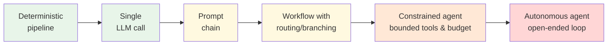
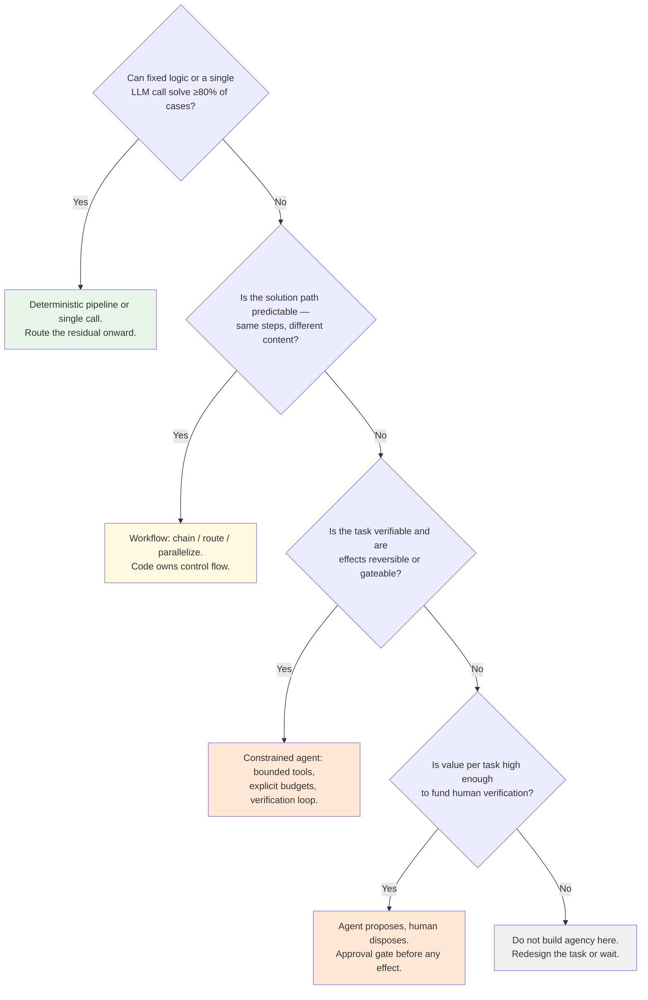

# Chapter 0.1 — The Agentic Spectrum & Design Philosophy

*Part 0 — Orientation & Philosophy · Domain D1 · Reading time ~25 min · Prerequisites: none*

---

## 1. The failure story

In early 2025, the ops team at a mid-size fintech built what the internal demo deck called "InvoiceGPT" — an autonomous agent that ingested supplier invoices, matched them against purchase orders, resolved discrepancies, and queued payments. The demo was electric: the agent handled a gnarly three-way-match exception live, narrating its reasoning. Leadership approved production rollout the same week.

Six months later the numbers told a different story. Of the ~11,000 monthly invoices, 83% were exact or near-exact matches — cases a rules engine with fuzzy matching would have settled deterministically, instantly, and for fractions of a cent each. The agent processed those same invoices at roughly 20× the cost, 40× the latency, and — this is the part that hurt — *introduced* errors into cases that had never failed before, because a probabilistic system was now making decisions a lookup table used to make. Meanwhile, on the hard 17% that justified the agent's existence, end-to-end accuracy was 74%: good, but every failure required a human to unwind an agent's multi-step reasoning rather than read a one-line rule rejection.

The rebuild took one quarter. A deterministic matching engine handles the 83%. A constrained agent handles the residual 17%, proposing resolutions that a human approves above a threshold. Cost dropped 91%, accuracy rose on both segments, and — critically — every payment decision became auditable.

Nobody on the original team was incompetent. They simply never asked the first question of agentic design: **where on the spectrum does this task actually live?** This chapter exists so you never skip that question.

---

## 2. The mental model

### 2.1 Two definitions, one spectrum

The industry's most durable distinction comes from Anthropic's *Building Effective Agents*, and it is worth internalizing verbatim in spirit:

> A **workflow** is a system where LLM calls are orchestrated through *predefined code paths*. The developer decides the sequence; the model fills in the steps.
>
> An **agent** is a system where the model *dynamically directs its own process* — deciding which tools to use, in what order, and when the task is done.

The distinction is not about intelligence or capability. It is about *who owns control flow*. In a workflow, your code owns it. In an agent, the model owns it. Everything else — cost profile, failure modes, testability, audit story — cascades from that single design decision.

And it is a spectrum, not a binary:

Reading left to right: **predictability falls, flexibility rises, and the burden of verification shifts from compile-time to run-time.** On the left, you prove correctness once, in code review. On the right, you must verify correctness on *every execution*, forever, because no two runs are guaranteed identical.

That last sentence is the economic heart of this entire curriculum. Agency is not free. **You buy autonomy with verification** — with evals, judges, human review, invariant checks, and containment. A team that grants agency without budgeting for verification hasn't built an agent; it has built an incident.

### 2.2 The doctrine: earned autonomy

Every well-run agentic system in a high-stakes domain converges on the same governance shape, whether its builders articulate it or not:

**Autonomy is granted per action class, earned by demonstrated reliability, and revocable at any time.**

Not "the agent is autonomous." Rather: *this* agent may auto-approve invoice matches under $500 with confidence above threshold, because it has demonstrated 99.4% precision on that class over 8,000 production cases; it may *propose* resolutions on three-way-match exceptions; it may not touch payment execution at all. Three action classes, three autonomy levels, each backed by evidence, each with a demotion path if reliability drifts.

This is the operational form of the standing thesis of this manual — **deterministic engine + agentic overlay + humans as the immutable source of truth**. The spectrum position of any capability is not a one-time architectural choice; it is a *dial you move with evidence*. Chapter 3.3 builds the promotion/demotion machinery; here you only need the principle: the question is never "should we build an agent?" but "which action classes deserve which autonomy level, today, given the evidence we hold?"

### 2.3 Task profile analysis: the five dimensions

To place a task on the spectrum, profile it along five dimensions. This table is the single most reusable artifact in the chapter — it will reappear in interviews, design reviews, and vendor diligence for the rest of your career:

| Dimension | Question | Pushes toward workflow | Pushes toward agent |
|---|---|---|---|
| **Input variance** | How open-ended are the inputs? | Enumerable cases, stable formats | Long tail, unstructured, novel combinations |
| **Verifiability** | Can we cheaply check the output? | Hard to verify → keep humans/rules in control | Cheap, objective verification (tests, reconciliation) makes agency *safe to grant* |
| **Reversibility** | Can a wrong action be undone? | Irreversible effects (payments, sends, deletes) | Sandboxed, draft-stage, or easily compensated actions |
| **Value per task** | What is one successful completion worth? | Low value → agency overhead never pays back | High value justifies verification cost |
| **Error tolerance** | What does one bad outcome cost? | Regulatory, financial, or trust damage | Errors are cheap and contained |

Notice the asymmetry hiding in row two: verifiability doesn't just tell you whether an agent will *work* — it tells you whether you can *afford to find out*. A highly verifiable task (code with tests, reconciliation against a ledger) lets you grant agency and catch failures mechanically. A hard-to-verify task (strategic advice, subjective quality) means every grant of autonomy is a grant of *unaudited* autonomy. In regulated domains, that is usually the deciding row.

### 2.4 The decision tree

Profiling feeds a decision procedure. The discipline — again from the canon, and violated constantly in the wild — is to **find the simplest architecture that could possibly work**, and only move right on the spectrum when the evidence demands it:

Two things to notice. First, the tree terminates in "do not build" — a legitimate, professional answer that weak teams never give. Second, the InvoiceGPT team's error is visible at the very first node: 83% of their volume answered "yes" to the first question, and they never asked it.

### 2.5 The composable patterns (preview)

Between "single call" and "agent" lives a rich middle: the five workflow patterns — **prompt chaining** (fixed sequence, each step's output feeding the next), **routing** (classify, then dispatch to a specialist path), **parallelization** (split or vote), **orchestrator–workers** (a model decomposes; workers execute), and **evaluator–optimizer** (generate, critique, regenerate). Chapter 2.5 treats each in depth with its cost surface and failure semantics. For now, hold one idea: these patterns capture most of the *perceived* need for agents. When a stakeholder says "we need an agent," they usually need routing plus one specialist chain. The word "agent" in a meeting is a symptom to diagnose, not a requirement to implement.

---

## 3. Production lens

What actually changes, operationally, as you move right on the spectrum? Four cost curves bend upward together:

*Verification surface.* A workflow needs its branches tested. An agent needs its *behavior distribution* characterized — eval suites, regression gates, online sampling (Part IV). Budget rule of thumb from mature teams: for a production agent in a consequential domain, expect evaluation and observability to consume an engineering effort comparable to the agent itself. If that sounds unaffordable, the task belongs further left on the spectrum.

*Unit economics.* In the invoice case: the deterministic match cost ~$0.002 per invoice in compute; the agent averaged $0.19 (multi-turn reasoning, tool calls, retries) plus judge sampling plus a share of human review labor. At 11,000 invoices/month, pushing the deterministic 83% through the agent burned roughly $20K/year to make those cases *slower and less reliable*. Always compute cost per *resolved* task, segmented by case difficulty — blended averages hide exactly this pathology.

*Debuggability.* A workflow failure points at a branch. An agent failure requires trace archaeology: which turn, which tool result, which piece of context sent it sideways. Until you have the tracing discipline of Chapter 4.3, every agent incident costs hours. This is a real operating cost; price it in.

*On-call semantics.* Workflows fail loudly and locally. Agents fail *creatively* — the failure mode set is open-ended, which is why containment (Ch. 3.4) is architectural, not optional. The left side of the spectrum pages you rarely and legibly; the right side pages you rarely and *illegibly*, which is worse.

> **Doctrine check.** At every spectrum position, ask: where does the deterministic core sit? Even a fully agentic system in this curriculum's philosophy has one — the seam where agent *proposals* become validated, idempotent, attributable *effects* (Ch. 3.1). If you cannot point to that seam on the architecture diagram, the design is not done.

---

## 4. Edge-case catalog

| # | Edge case | What it looks like | Detection | Mitigation |
|---|---|---|---|---|
| 1 | **Agent-washing** | Vendor sells a rules pipeline as an "AI agent"; or your own team brands a chain as agentic for the roadmap slide | Ask: "show me a trace where the system chose a different tool sequence for the same task type." No such trace → it's a workflow (which may be fine — but price and diligence it as one) | Diligence question set keyed to control-flow ownership, not marketing language |
| 2 | **The inverse trap** | Genuinely open-ended task forced into a workflow; branch count explodes as edge cases accrete; each patch adds a path | Branch/config growth rate; rising "unhandled case" escalations; the workflow's router prompt exceeding a page | Concede the residual to a constrained agent with verification, rather than chasing enumerability that doesn't exist |
| 3 | **Hybrid drift** | System starts as a workflow, quietly accretes agency — someone adds a tool here, loosens a constraint there — without anyone re-deriving containment or eval coverage | Architecture reviews diff *autonomy grants*, not just code; any new tool or removed constraint triggers the Ch. 3.4 checklist | Autonomy changes treated as release-gated events (Ch. 4.6), never as prompt tweaks |
| 4 | **Demo seduction** | Stakeholders extrapolate from a curated demo to production reliability; the spectrum question is skipped under enthusiasm | The deck shows 3 handpicked traces and zero segment-level metrics | Institutional rule: no autonomy decision without task profiling (§2.3) and per-segment baseline numbers |
| 5 | **Spectrum position as identity** | Team defends "we built an agent" as an achievement, resisting the evidence that a workflow serves users better | Post-launch metrics reviewed against the *simplest alternative*, not against zero | Frame reviews around cost per resolved task and error rate vs. the counterfactual architecture |

---

## 5. Claude & MCP sidebar

Mapping the spectrum onto Claude's stack (verify specifics against current docs at [docs.claude.com](https://docs.claude.com) — mechanics move; the mapping doesn't):

A *single call* is one Messages API request, optionally with tool definitions the model may invoke once. A **workflow** is your code making multiple Claude calls along paths you control — the model never sees the whole plan. A **constrained agent** is Claude in a loop: the API returns a tool-use request, your runtime executes it and returns the result, and the loop continues until Claude signals completion or your budget stops it — with MCP standardizing how those tools are discovered and served. The **Claude Agent SDK** and **Claude Code** are reference implementations of that loop with containment built in: permission prompts, sandboxing options, and plan-preview modes that are essentially Chapter 3.3–3.4 shipped as product. Studying how Claude Code asks permission before destructive actions is a free masterclass in **earned autonomy** UX.

---

## 6. Design exercise

Profile each of the five task briefs below along the five dimensions (§2.3), place it on the spectrum, and name the *cheapest architecture that could possibly work*. For any placement right of "workflow," specify the verification mechanism that funds the autonomy and the one action class you would gate behind a human.

1. **Invoice matching** for a 2,000-supplier manufacturer (you know how this one ends — but do the profiling honestly and find where the residual agent's autonomy boundary sits)
2. **Incident triage** for a SaaS on-call rotation: read alerts, correlate, draft a severity assessment and first-response plan
3. **Contract redlining** against a company playbook for a legal team, output consumed by attorneys
4. **Ad-hoc data Q&A** over a governed warehouse for business users ("why did EMEA churn spike in March?")
5. **Monthly board pack assembly** from finance systems, prior decks, and KPI narratives

*Review standard:* your placements must disagree across the five (they genuinely differ), and at least one must terminate in "mostly deterministic, agent only on the residual."

## 7. Self-test — judge each claim, justify in one sentence

1. "The difference between a workflow and an agent is primarily model capability."
2. "High verifiability makes a task safer to delegate to an agent."
3. "A system where an LLM chooses between three hardcoded branches is an agent, because the model is making decisions."
4. "In regulated domains, low reversibility can be compensated by putting an approval gate before effects."
5. "If an agent outperforms humans on a task in evals, autonomy should be granted for that task."

*(Answers are argued, not looked up: 1-false — it's about control-flow ownership; 2-true — verification funds autonomy; 3-false-ish — that is routing, a workflow pattern, the model doesn't own the loop; 4-true — that is exactly the propose/dispose seam; 5-false as stated — autonomy attaches to action classes with evidence, containment, and a demotion path, not to eval wins alone.)*

## 8. Spaced-review card *(re-answer in 7 days, from memory)*

- Draw the spectrum and mark where verification shifts from compile-time to run-time.
- Recite the five task-profile dimensions and which one usually decides in regulated domains.
- State the earned-autonomy doctrine in one sentence, including what makes it revocable.

---

*Next: Chapter 0.2 — Why Production Is a Different Sport, where 95% per-step accuracy meets a 20-step task and loses.*
