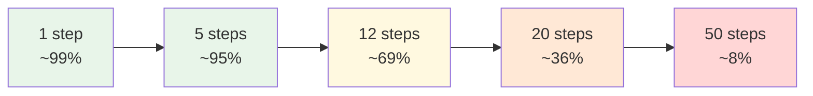

# Chapter 0.2 — Why Production Is a Different Sport

*Part 0 — Orientation & Philosophy · Domain D1 · Reading time ~25 min · Prerequisites: Ch. 0.1*

---

## 1. The failure story

The demo was flawless. A logistics startup had built a shipment-exception agent: it read a delayed-freight alert, pulled the carrier record, checked the contract SLA, drafted a customer notification, proposed a goodwill credit, and opened a remediation ticket. Six tool calls, one clean narrated trace, and the room applauded. The engineer had run it maybe thirty times during development and eyeballed the results as "about 95% right on each step" — a fair read; individual steps really were strong.

Production told a different story within three weeks. The task was not six steps; once you counted retrieval, three tool calls, two reasoning hops, a classification, and the draft, it was closer to twenty discrete steps that each had to land. At a genuine 95% per-step success rate, end-to-end success is 0.95²⁰ ≈ **36%**. Nearly two of every three exceptions came out subtly wrong: a credit computed against the wrong SLA tier, a notification citing a delay that had already cleared, a ticket routed to a decommissioned queue. None of these threw an error. They completed — incorrectly — and a human found out only when a customer replied "this makes no sense."

The team's first instinct was to fix the prompt. They spent two weeks raising per-step accuracy from ~95% to ~97%. Real improvement — and 0.97²⁰ ≈ **54%**, still a coin-flip product. The pilot was quietly shelved in week three, filed internally as "the model isn't good enough yet." The model was fine. The **architecture** asked a probabilistic component to survive twenty consecutive unaided steps, and no per-step number available on any frontier model in 2025 makes that arithmetic work.

Nobody asked the question that governs every long-running agent: **how many steps must succeed in a row before anything catches a mistake, and what is that product?** This chapter exists so that number is the first thing you compute, not the last thing you discover.

---

## 2. The mental model

### 2.1 The compounding-error law

Reliability does not add across steps; it multiplies. If a task requires *n* independent steps that each succeed with probability *p*, and any single failure ruins the outcome, end-to-end success is *pⁿ*. The consequence is brutal and non-intuitive: excellent per-step numbers produce mediocre end-to-end numbers as soon as the horizon grows.

| Per-step *p* | 5 steps | 10 steps | 20 steps | 50 steps |
|---|---|---|---|---|
| **90%** | 59% | 35% | 12% | 0.5% |
| **95%** | 77% | 60% | 36% | 8% |
| **99%** | 95% | 90% | 82% | 61% |
| **99.9%** | 99.5% | 99% | 98% | 95% |

Read the table the way an operator must. Moving from 95% to 99% per step is a 4-point local gain and a **46-point** end-to-end gain at 20 steps. That is why prompt-tuning your way from 95% to 97% felt like progress and changed nothing that mattered — you were adding points where the exponent punishes you, instead of attacking the exponent itself. The two levers that actually move *pⁿ* are raising *p* toward three-nines (rarely available from prompting alone) and, far more reliably, **shrinking *n*** — the number of steps that must survive without a checkpoint.

This is the first-principles reason the doctrine of Ch. 0.1 exists at all. The independence assumption is itself a simplification — real agent errors are often correlated, sometimes for you (a good trajectory stays good) and often against you (one bad retrieval poisons every downstream step). Correlation changes the exact number; it never changes the direction. **End-to-end reliability is the product of per-step reliability and horizon length; you do not fix a long-horizon agent with a better prompt, you fix it by shortening the horizon the model must survive unaided.**

### 2.2 pass@k versus pass^k: the metric switch that separates demos from production

Research and demos optimize a metric that quietly lies to operators: **pass@k**, the probability that *at least one* of *k* attempts succeeds. It is the right metric for "can this system ever do the task" — capability. Production runs on its unforgiving sibling, **pass^k**, the probability that *k* independent attempts *all* succeed — reliability.

The gap is enormous. An agent that succeeds 70% of the time per attempt has pass@3 ≈ 97% (looks production-ready in a demo where you retry until it works) and pass^3 ≈ 34% (three real customers in a row, all correct — a third of the time). Demos live in pass@k because the presenter re-rolls until the good trace appears. Customers live in pass^k because every one of them is a fresh, un-retried roll. **The number on your slide and the number your users feel are computed with opposite operators.** When a stakeholder quotes a success rate, your first question is always: at-least-once, or every-time?

### 2.3 The demo→prod gap, decomposed

Compounding error is the largest term, but the gap between a working demo and a surviving product has five other contributors, each of which independently kills pilots:

**Distribution shift.** Your thirty dev runs were drawn from cases you could imagine. Production traffic has a long tail you could not — the malformed input, the carrier not in the lookup, the SLA clause written before the template. Demo accuracy is measured on the head of the distribution; the P&L is written in the tail.

**Adversarial and hostile inputs.** Some fraction of real input is not merely unusual but constructed — by users gaming the system or by content carrying injected instructions (Ch. 3.5). Zero of your demo cases were adversarial.

**Integration surface.** The demo's tools were mocked or hit a clean staging API. Production adds rate limits, timeouts, partial failures, stale caches, and the 200-response-with-empty-body — each an opportunity for a step to "succeed" wrongly.

**Accountability.** In a demo, a wrong answer is a laugh. In production, someone owns the credit that was miscomputed, and someone must reconstruct why (Ch. 4.3). The cost of a single failure is not the token spend; it is the human hour of unwinding it.

**Cost and tail latency at scale.** The demo ran once. Production runs the P99, where a retry storm or a straggling tool call turns an acceptable median into an SLA breach (Ch. 4.4–4.5).

### 2.4 Nondeterminism as a first-class design constraint

There is a deeper break with the software you have shipped before: **same input, different trace.** Even at temperature 0, batching effects, floating-point non-associativity, and silent provider-side model updates mean you cannot assume byte-identical outputs across runs (Ch. 1.1). This is not a bug to suppress; it is a property to design around, and it invalidates habits you have relied on for a career:

You cannot write an assertion that the output equals a golden string — you assert over *properties* and distributions. You cannot reproduce a bug by re-running the input — you must have captured the *original trace*, because the failure may not recur (Ch. 4.3). You cannot certify correctness once at code review — you must characterize behavior continuously (Ch. 4.1). And you cannot promise a regulator that a decision is reproducible — you promise that it is *logged, attributable, and governed*, which is a different and honest claim (Ch. 4.7). Nondeterminism is why verification is continuous rather than one-time, which is the entire economic argument of this curriculum restated: you buy autonomy with verification because there is no compile-time proof to buy it with.

### 2.5 The reliability–autonomy frontier: shortening the horizon

If *pⁿ* is the enemy and you cannot cheaply raise *p*, you attack *n*. Every reliability technique in Parts III–IV is, underneath, a way to shorten the horizon the model must survive unaided by inserting a **checkpoint** — a point where correctness is re-established so the error product resets rather than compounds:

- A **deterministic validator** at a step boundary (Ch. 3.1) catches the bad credit before it becomes an effect, converting a silent wrong-completion into a caught, retryable failure.
- A **human gate** (Ch. 3.3) on the one irreversible action turns twenty-in-a-row into "nineteen cheap steps plus one supervised one."
- A **checkpoint with recovery** (Ch. 3.2) means a hour-61 crash resumes from hour-60, not from zero.
- An **eval-verified sub-task** lets you treat a validated segment as a single high-*p* step.

The redesign of the logistics agent illustrates it exactly: split the twenty-step monolith into three verified segments with a deterministic validator between each and one human approval before the credit posts. If each segment fails independently at 10% but a validator catches and repairs 80% of those failures before they propagate, the *effective* per-segment reliability climbs well past what any prompt achieved, and three segments compound far more gently than twenty steps. You did not make the model better. You stopped asking it to be lucky twenty times in a row.

---

## 3. Production lens

What operationally distinguishes a system built for pass^k from one built for the demo?

**You measure the product, not the parts.** Dashboards that show per-step accuracy are comforting and misleading; the number that matters is end-to-end task success on unretried production traffic, segmented by difficulty. If your monitoring cannot show pass^k on the real distribution, it is showing you the demo forever.

**Failures must be loud, not silent.** The logistics agent's core pathology was *silent success bias*: it completed wrongly and reported completion. A production-grade design spends effort making failure *detectable* — verifiers, invariant checks, confidence gates — because a caught failure costs a retry while an uncaught one costs a customer and a human investigation. A system that fails loudly at 60% is often more valuable than one that "succeeds" opaquely at 85%.

**Horizon is a budgeted quantity.** Mature teams track how many unverified steps any task runs between checkpoints and treat growth in that number as a reliability regression, not a feature. Scope that quietly expands — the agent asked to also handle refunds, then disputes, then chargebacks — lengthens the horizon past the reliability the system earned. Watch step-count-between-checkpoints the way you watch latency.

**The cost of a failure includes the human tail.** Unit economics that count only tokens are fiction. Every silent wrong-completion carries an expected human-remediation cost; a 36%-success agent on 11,000 tasks/month generates roughly 7,000 wrong outcomes, and even at fifteen minutes each to unwind, that is a full-time salvage operation the pilot budget never named.

> **Doctrine check.** The horizon question is a direct probe of the deterministic core. Every checkpoint that shortens *n* is a seam where a probabilistic proposal becomes a validated, attributable state (Ch. 3.1). If you cannot point to the checkpoints on the architecture diagram — the places where the error product resets to zero — then the design is one long unbroken multiplication, and you already know what that product equals.

---

## 4. Edge-case catalog

| # | Edge case | What it looks like | Detection | Mitigation |
|---|---|---|---|---|
| 1 | **Silent success bias** | Agent reports "done"; output is subtly wrong (wrong tier, stale fact); no error thrown, so metrics look healthy while customers churn | Verifiable-outcome sampling: re-check a stratified slice of "successful" completions against ground truth; watch the gap between self-reported and audited success | Design for verifiable failure over unverifiable success — validators and invariant checks at step boundaries that convert wrong-completions into caught, retryable errors |
| 2 | **Goodhart on the demo metric** | Team optimizes happy-path eval to 95%+ while the tail that owns the P&L is never in the suite; the number rises, the product doesn't | Stratify success by difficulty and input source; if aggregate climbs while the hard-segment or novel-input segment is flat or falling, the metric is being gamed (Simpson's paradox, Ch. 4.1) | Eval datasets mined from production tails, not authored from imagination; gate on the segment that hurts, not the blended average |
| 3 | **Horizon creep** | Task scope grows quietly — "also handle X" — pushing step-count-between-checkpoints past the reliability the system was validated for | Track unverified-steps-per-task as a first-class metric; alert on growth; diff autonomy/scope grants at review (mirrors Ch. 0.1 hybrid drift) | Treat scope expansion as a release-gated event (Ch. 4.6): new steps require new checkpoints and re-validated end-to-end pass^k |
| 4 | **pass@k in a pass^k world** | Success rate quoted from best-of-*k* dev runs or retried demos; reliability collapses on first-attempt production traffic | Ask which operator produced the number; measure first-attempt, unretried success on live traffic | Report pass^k as the headline reliability metric; reserve pass@k for capability claims and label it as such |
| 5 | **Reproduction-by-rerun assumption** | Debugging process assumes re-running the failing input reproduces the bug; nondeterminism means it often doesn't, so root cause is never found | Failed repro attempts on known-bad cases; "cannot reproduce" closing a real incident | Capture and replay the *original trace* (Ch. 4.3), not the input; assert over properties, never golden strings |
| 6 | **Contested failure statistics** | A headline ("95% of agent pilots fail") is quoted to justify a build/kill decision without interrogating its methodology or definitions | Ask what counted as a "pilot," what "fail" meant, and who funded the study; check whether the denominator matches your situation | Interrogate methodology before citing; make build/kill calls on your own segmented pass^k, not on someone else's headline |

---

## 5. Claude & MCP sidebar

Nothing about compounding error is Claude-specific — it is arithmetic — but the mitigation surface maps cleanly onto Claude's stack (verify current mechanics at [docs.claude.com](https://docs.claude.com); the mapping is durable, the specifics move). Each Messages API call is one step in the product *pⁿ*; a multi-tool agent loop chains many, so the horizon is however many turns the loop runs before your runtime re-establishes correctness. You shorten the horizon in *your* code, not the model's: your runtime inspects each tool result and can validate, gate, or checkpoint before continuing the loop, and MCP is where those validating tools are served. The **Claude Agent SDK** and **Claude Code** are worth studying precisely as horizon-shortening machines — plan-preview mode inserts a human checkpoint before execution, and permission prompts gate the irreversible step, both of which convert a long unaided run into a series of shorter verified ones. Do not quote per-step accuracy figures for any model from memory; measure *your* per-step *p* on *your* task, because that number, not a benchmark, is the base of your exponent.

---

## 6. Design exercise

You are handed a 12-step agent with a measured, honest **97% per-step reliability** on production-representative traffic.

1. Compute end-to-end success as-is. (0.97¹² — do the arithmetic and state it.)
2. Redesign the flow with **two deterministic checkpoints** that partition the 12 steps into three segments, plus **one human gate** before the single irreversible effect. Assume each checkpoint catches and repairs 75% of the errors reaching it before they propagate. Estimate the effective end-to-end reliability of the redesigned flow, stating every assumption you make about error independence and repair success.
3. State the **cost of the added latency**: the two checkpoints add validator compute and the human gate adds wall-clock wait. Quantify both in plausible magnitudes and say what product value that latency buys.

*Review standard:* your as-is number must be materially below your redesigned number (if it isn't, your checkpoints are misplaced); you must name at least one assumption that, if wrong, would collapse the redesign's gains (e.g., correlated errors that no single checkpoint catches); and your latency cost must be stated as a concrete tradeoff, not waved away.

---

## 7. Self-test — judge each claim, justify in one sentence

1. "Raising per-step accuracy from 95% to 97% is a reasonable primary strategy for fixing a failing 20-step agent."
2. "pass@k and pass^k measure the same thing at different sample sizes."
3. "An agent that fails loudly 40% of the time can be more production-valuable than one that silently succeeds-or-fails at 85%."
4. "Because LLM outputs are nondeterministic, you can reproduce any production bug by re-running its input."
5. "If a task is genuinely 20 sequential steps, no amount of architecture can beat the model's raw per-step reliability."

*(Answers are argued, not looked up: 1-false — 0.97²⁰ ≈ 54% is still a coin flip; the exponent, not the base, is the lever, so shorten the horizon with checkpoints; 2-false — pass@k is at-least-once (capability), pass^k is every-time (reliability), computed with opposite operators and diverging hugely; 3-true — a caught failure costs a retry while a silent wrong-completion costs a customer plus human remediation, so detectable failure can dominate opaque success; 4-false — nondeterminism means the input may not reproduce the failure, which is why you capture and replay the original trace, not the input; 5-false — checkpoints, validators, and human gates reset the error product, so effective reliability is an architectural property, not a fixed function of raw per-step p.)*

## 8. Spaced-review card *(re-answer in 7 days, from memory)*

- Write the compounding-error law and compute *pⁿ* for p=0.95, n=20 from memory; state which lever (p or n) you attack first and why.
- Define pass@k versus pass^k in one line each and give an example where they diverge by more than 50 points.
- Name the four checkpoint types that shorten the horizon and, for each, the chapter that builds it.

---

*Next: Chapter 1.1 — LLM Mechanics for System Builders, where a 60K-token "context dump" triples latency, multiplies cost 8×, and makes the answer worse — because the context window is a priced, scarce resource, not a free bucket.*
