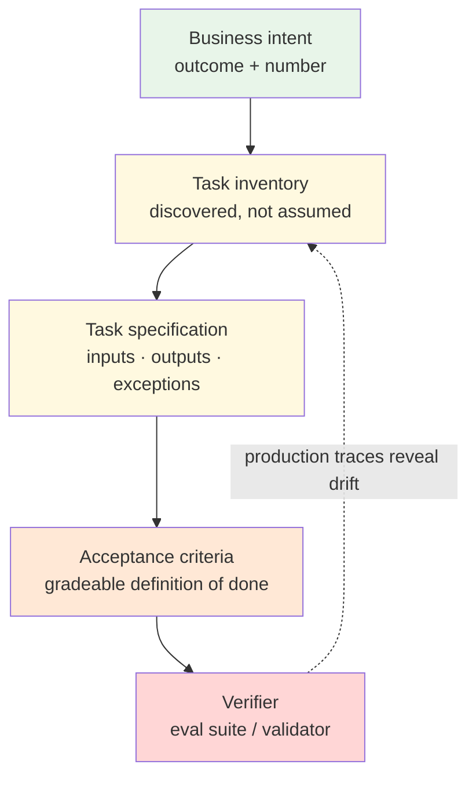

# Chapter 0.3 — From Process to Specification: Task Discovery, Expert Knowledge & the Definition of Done

*Part 0 — Orientation & Philosophy · Domain D1 · Reading time ~28 min · Prerequisites: Ch. 0.1–0.2*

---

## 1. The failure story

A regional insurer commissioned a claims-intake agent and did everything Chapter 0.2 demands. The team decomposed the task, inserted deterministic checkpoints, gated the irreversible step behind a human, and built an eval suite before launch. The suite scored **94%** on the release candidate. The architecture review passed on the first attempt. Six weeks after launch, the adjuster override rate — the fraction of agent outputs a human changed before accepting — was **31%**, and a stratified audit of those overrides found that roughly **80% of them were correct**: the humans were fixing genuine agent mistakes, not exercising taste.

How does a system pass a 94% eval and fail a third of the time in the field? The forensics took a week and embarrassed everyone. The agent had been built from the department's 40-page standard operating procedure, and the SOP was, in the words of the claims director, "aspirational." Written four years earlier for a compliance audit, it described a clean linear process nobody followed. Real intake ran on undocumented judgment: a severity heuristic passed adjuster-to-adjuster by apprenticeship, three carve-outs for a legacy policy block the SOP never mentioned, and a workaround for a core-system quirk that silently re-coded certain loss dates. The eval suite was authored from the same SOP, so agent and exam shared the same fiction — the suite certified, with high precision, conformance to a process that did not exist. Rebuilding the specification from observed traces and structured expert interviews, then rebuilding the eval from the new spec, consumed **14 engineer-weeks** — more than the original build.

Nobody had asked the question that precedes every architecture decision in this curriculum: **is the process we are automating the process that actually happens, and would we know?** Chapter 0.2 taught you to compute the reliability of the system you are building. This chapter is about making sure you are building the right system at all.

---

## 2. The mental model

### 2.1 The specification stack

Teams say "automate the claims process" as if that sentence named a buildable thing. It names a direction. Between a business intent and a runnable agent sits a stack of artifacts, and every layer you skip becomes a layer the model improvises at runtime:

| **Layer** | **Artifact** | **Question it answers** | **Failure when skipped** |
|---|---|---|---|
| **Business intent** | Outcome statement with a number | Why does this exist; what moves? | Agent optimizes activity, not outcome |
| **Task inventory** | Decomposed list of discrete tasks | What are the units of work? | One agent asked to do "the process" — a 20-step horizon (Ch. 0.2) |
| **Task specification** | Inputs, outputs, constraints, exceptions per task | What exactly is this unit? | Model fills gaps with plausible invention |
| **Acceptance criteria** | Gradeable definition of done | How do we know one instance succeeded? | "Looks right" review; silent success bias |
| **Verifier** | The eval or validator built from the criteria (Ch. 4.1) | Can we check it mechanically, at scale? | Quality is asserted, never measured |

The stack is strictly ordered: each layer is derivable only from the one above it. You cannot write acceptance criteria for a task you have not specified, and you cannot specify a task you have not discovered — you can only transcribe the SOP, which is where the insurer died. Notice what the top and bottom of the stack are: the top is a business number, the bottom is a verifier. The entire discipline of this chapter is the pipeline that connects them, and the entire discipline of Part IV assumes that pipeline exists. Chapter 4.1 teaches you to build evals; this chapter is where the content of those evals comes from.

*Green: the intent is usually genuinely known. Yellow: discovery and specification, where fiction enters. Orange-to-red: the layers most often skipped entirely — and the dotted return edge is Section 2.5's drift loop, because the stack is never finished.*

### 2.2 Task discovery: the work as done, not the work as imagined

Safety engineering has a name for the insurer's gap: **work-as-imagined versus work-as-done**. The SOP is work-as-imagined. The severity heuristic and the loss-date workaround are work-as-done. Agents built from work-as-imagined fail on contact with work-as-done, and the failure is the worst kind — confident, plausible, and invisible to an eval authored from the same imagination.

Discovery means going to the evidence. Three sources, in descending order of trustworthiness. First, **system traces**: tickets, case logs, audit trails, the actual artifacts the process emits. Mining even a few hundred completed cases tells you the real path frequencies — which "rare" exception fires weekly, which "mandatory" step is skipped 60% of the time. Second, **observation**: watching five real cases end-to-end surfaces the workarounds no one thinks to mention because they stopped seeing them years ago. Third — and only third — **documentation and interviews**, both of which report work-as-imagined unless you force them off it (Section 2.3 is about the forcing).

Discovery feeds **portfolio triage**, because you never automate a process; you automate specific tasks from its inventory, chosen deliberately. Score each discovered task on three axes you already own from Ch. 0.1: value at stake (volume × time × error cost), autonomy feasibility (reversibility, blast radius), and — the axis teams forget — **verifiability**, how cheaply a correct outcome can be distinguished from a plausible wrong one. A high-value task with no affordable verifier is not a good first agent; it is a liability with good marketing. The best first agent in a portfolio is usually the second-most-valuable task with the cheapest verifier, not the most valuable task with none.

### 2.3 Expert knowledge elicitation is an engineering discipline

The knowledge that makes a senior adjuster senior is largely **tacit** — she can act on it but cannot enumerate it. Ask her how she assesses severity and you get the SOP recited back, sincerely. This is not evasion; it is how expertise is stored. Extracting it requires technique, not a meeting:

**Exception-first interviewing.** Never ask "walk me through the process" — that retrieves work-as-imagined. Ask "tell me about the last case that surprised you," "what would a smart new hire get wrong in month one," "when did you last override the system, and why." Experts store their real knowledge indexed by exceptions; the happy path is precisely the part they have automated out of their own awareness.

**Contrastive pairs.** Show the expert two real cases that look similar and ask why they were handled differently, or take one case and ask "what is the smallest change that would flip your decision?" Boundaries are where the decision logic lives, and contrast is the only reliable way to make an expert articulate a boundary rather than a vibe.

**Adjudicated disagreement.** Give the same ten cases to three experts independently. Where they agree, you have a rule worth encoding. Where they split — and on real judgment tasks they will, more than anyone expects — you have found either a genuine policy ambiguity that a *human* owner must resolve before any agent touches the task, or a legitimate judgment zone that must be specified as "escalate," not papered over by averaging. An agent built on unadjudicated disagreement launders an organizational ambiguity into a model behavior, and it will be discovered later as "the agent is inconsistent" when the truth is *the institution* was inconsistent and nobody had ever measured it.

Each session's output is not notes. It is **candidate acceptance criteria and labeled cases** — every elicited rule becomes a line in the spec, and every discussed case becomes eval data with an expert-attributed label. Elicitation that does not terminate in gradeable artifacts is anthropology, not engineering.

### 2.4 The definition of done under nondeterminism

Deterministic software gets its definition of done for free: the spec says `f(x) = y`, the test asserts it. Chapter 0.2 took that away — same input, different trace — so "done" must be redefined over properties and distributions, at three levels. **Hard constraints**: invariants that must hold on every single output — schema validity, the cited policy clause exists, the computed figure reconciles to the source system, no PII beyond the allowed fields. These are cheap, deterministic, and non-negotiable; they become the validators of Ch. 3.1. **Graded qualities**: dimensions scored against an expert-anchored standard — is the severity classification defensible, is the customer summary faithful. These become rubrics for the judges of Ch. 4.2, and every rubric line must trace back to an elicited criterion, not an engineer's guess about what quality means. **Escalation conditions**: the specified boundary beyond which the correct output *is* "hand this to a human" — and note that this makes escalation a success mode in the spec, not a failure the dashboard should minimize toward zero.

The test for every criterion is graderability: could a competent third party — human or machine — apply it to one output and reach a verdict without asking the author what they meant? "The summary should be accurate and professional" fails that test. "Every factual claim in the summary must appear in the source record, and a named adjuster reading only the summary must reach the same severity band" passes it. **A task specification that cannot be graded was never a specification — it was a hope.** And a hope handed to a probabilistic system returns exactly what the insurer got: 94% conformance to fiction, discovered at 31% override.

### 2.5 The spec is a living source artifact

The last mistake is treating the finished spec as a document. It is a **source artifact** — the upstream of everything downstream: eval datasets derive from its criteria (Ch. 4.1), grader rubrics quote it (Ch. 4.2), autonomy grants cite its blast-radius analysis (Ch. 3.3), the audit trail references the version that governed each decision (Ch. 4.7), and if you ever train — RLVR turns verifiers into the training signal itself (Ch. 5.5) — the spec is literally the environment definition. That is also the economic argument: Chapter 5.7 will show that outcome pricing depends on measurable outcomes and that eval suites are durable competitive assets. Both are restatements of this chapter — the encoded, verified judgment of your best experts is a moat precisely because your competitor cannot mine it from any public dataset.

Living means versioned and drift-checked. The real process keeps evolving after you specify it — a regulation changes, a workaround appears, the mix shifts — and the spec silently rots. The signal is in production: a rising override rate on a previously quiet stratum, escalations arriving for reasons the spec never enumerated, experts labeling new eval cases in ways that contradict old criteria. Route those signals back into the spec on a review cadence, exactly as Ch. 4.1 routes production failures into the eval suite. Same flywheel, one layer up.

---

## 3. Production lens

Discovery and specification are the first line of the platform budget, and mature teams cost them explicitly rather than discovering them as overrun. For a mid-complexity task in a regulated workflow, plausible magnitudes: 2–4 weeks of trace mining and observation, 15–25 expert-hours of structured elicitation (the scarce, expensive resource — senior-adjuster time runs $80–150/hour loaded, and pulling it is an operational negotiation, not a calendar invite), and a labeled seed set of 150–300 adjudicated cases before the first eval run of Ch. 4.1 is even possible. Call it $30–60K per task, before any engineering. Against the insurer's 14 engineer-weeks of rework — roughly $120K, plus six weeks of eroded adjuster trust that no invoice captures — the specification phase is the cheapest insurance in the entire lifecycle.

Once live, the spec has operating signals of its own. **Override rate, segmented and audited** is the headline: overrides where the human was right are spec-or-model defects to mine; overrides where the human was wrong are training and trust problems (Ch. 3.6 will pick this up as trust calibration). A composite override rate is as misleading as any blended average in this curriculum — the insurer's 31% was 8% on the strata the spec actually covered and catastrophic on the strata it invented. **Escalation-reason novelty** is the second signal: escalations citing reasons outside the spec's enumeration mean the world has drifted past the document. **Expert-label disagreement over time** is the third: when this month's labelers contradict last quarter's criteria, schedule a spec review, not a model retrain.

> **Doctrine check.** The deterministic core of Ch. 0.1 needs contents, and this chapter is where the contents come from: every hard constraint the engine enforces is an elicited, adjudicated, versioned piece of expert judgment. Agents propose, engines dispose — but an engine disposes according to *rules*, and rules extracted from a fictional SOP make the deterministic core deterministic fiction. Humans as the immutable source of truth begins before runtime: the experts are the source of truth about what the task *is*, and elicitation is how that truth enters the system. If you cannot point to the expert, the cases, and the adjudication behind each validator rule, your deterministic core is load-bearing guesswork.

---

## 4. Edge-case catalog

| # | Edge case | What it looks like | Detection | Mitigation |
|---|---|---|---|---|
| 1 | **The fictional SOP** | Documentation describes work-as-imagined; agent and eval are both built from it, so the eval certifies conformance to fiction and the field discovers the truth | Trace-vs-document diff before build: mine 200+ completed cases and measure how often the documented path was actually followed; large gaps = fiction | Specify from traces and observation first; use documents only as hypotheses to test against evidence; require every spec rule to cite a real-case exemplar |
| 2 | **Expert disagreement laundering** | Three experts decide the same case three ways; the spec (or the fine-tune) silently averages them; the agent ships an inconsistency the org never knew it had | Independent multi-expert labeling on a shared case set during elicitation; measure inter-rater agreement (Ch. 4.2's kappa, applied to humans) before any criteria are frozen | Adjudicate: a named business owner resolves each split into a rule or an explicit escalate-zone; unresolved ambiguity becomes "escalate," never a model default |
| 3 | **Ungradeable acceptance criteria** | Spec says "accurate, professional, appropriate"; every reviewer applies a private standard; evals built on it measure the judge's mood (Ch. 4.2 judge drift begins here) | Third-party graderability test: give criterion + one output to an uninvolved reviewer; if they must ask what a term means, the criterion fails | Rewrite each criterion as hard constraint, anchored rubric line, or escalation condition; every rubric anchor cites a real adjudicated exemplar case |
| 4 | **Exception blindness** | Discovery captures the 80% happy path; the 20% of exceptional cases that consume 80% of expert judgment are absent from spec and eval; agent is confidently wrong exactly where wrongness is most expensive | Compare spec's exception inventory against the tail of mined traces; exception-first interview yield (a senior expert who generates no exceptions is being interviewed wrong) | Exception-first elicitation as standing method; weight eval strata by consequence, not frequency (Ch. 4.1); specify unknown-exception behavior as mandatory escalation |
| 5 | **Spec–reality drift** | Process evolves post-launch — new regulation, new workaround, shifted mix; spec, evals, and validators still encode the old world; quality decays while the eval stays green | Rising audited-correct override rate on a previously quiet stratum; escalation reasons outside the spec's enumeration; new expert labels contradicting frozen criteria | Version the spec; scheduled re-elicitation cadence in regulated domains; route production override/escalation signals into spec review exactly as Ch. 4.1 routes failures into the eval suite |

---

## 5. Claude & MCP sidebar

Discovery and elicitation are human disciplines, but the stack helps at every layer (verify current mechanics at [docs.claude.com](https://docs.claude.com); the pattern is durable, the product surface moves). Claude is a strong *trace-mining analyst*: fed exported case logs, it can draft the observed-path inventory, flag where reality diverges from the SOP, and propose candidate exception categories for the interviews — proposals a human confirms, in exactly the propose/dispose shape of the doctrine. In elicitation itself, Claude can generate contrastive case pairs to put in front of experts and can turn raw interview transcripts into candidate acceptance criteria, each tagged with the quote it came from so the expert can veto misreadings. A **Claude Project** with the versioned spec as project knowledge gives every subsequent session — eval authoring, rubric drafting, architecture review — the same source artifact rather than a memory of it. And when the build starts, **MCP** is where the spec's hard constraints become real: the validators you specified become tools the runtime calls at the seams, served alongside the systems of record they check against. Do not let any model draft criteria from its general knowledge of your industry — its priors describe everyone's claims process, which is precisely a work-as-imagined document with better grammar.

---

## 6. Design exercise

A P&C insurer wants an agent for **subrogation recovery** — identifying claims where a third party is liable and the insurer can recover paid amounts. Today: a 12-page SOP nobody has audited in three years, two senior recovery specialists who "just know" which files have recovery potential, a queue of ~900 closed files/month of which specialists currently review ~30%, and an estimated seven-figure annual sum in missed recoveries.

Design the discovery-and-specification phase only — no architecture. Deliver: (1) a discovery plan naming your evidence sources in priority order and what each will tell you that the others cannot; (2) an elicitation protocol for the two specialists — the specific exception-first questions, the contrastive-pair design, and how you will detect and adjudicate disagreement between them given n=2; (3) a draft definition of done for "assess recovery potential on one closed file," split into hard constraints, graded qualities, and escalation conditions, every line gradeable; (4) the labeled seed set plan — size, stratification, and who adjudicates; (5) the portfolio-triage argument for whether this is even the right first task, using value × feasibility × verifiability.

*Review standard:* every acceptance criterion must pass the third-party graderability test (a reviewer could apply it without asking you what it means); your elicitation protocol must name at least one mechanism that would surface the specialists *disagreeing* and a named role who adjudicates; your triage answer must engage seriously with verifiability — recovery potential has a delayed, partially observable ground truth, and if you did not notice that, you have not done the exercise.

---

## 7. Self-test — judge each claim, justify in one sentence

1. "A thorough, current SOP is a sufficient basis for specifying an agent task."
2. "If three domain experts disagree on a case, the spec should encode the majority position."
3. "An eval suite can score 94% while the production override rate sits at 31%, without either number being wrong."
4. "'The output should be accurate and professional' is an acceptance criterion."
5. "Escalation to a human is a failure mode to be minimized toward zero."

*(Answers are argued, not looked up: 1-false — an SOP is work-as-imagined and must be tested against mined traces and observation before anything is built on it, because agent and eval built from the same fiction certify each other; 2-false — majority-encoding launders an institutional ambiguity into a model behavior; disagreement requires named-owner adjudication into a rule or an explicit escalate-zone; 3-true — both numbers are accurate measurements of different things: the eval measures conformance to the specified process, the override rate measures fit to the real one, and the gap is exactly the spec defect; 4-false — it fails the graderability test since every reviewer applies a private standard; it must decompose into hard constraints, anchored rubric lines, or escalation conditions; 5-false — within spec, escalation is a designed success mode marking the boundary of earned autonomy, and driving it to zero simply forces the agent to guess in the judgment zone.)*

## 8. Spaced-review card *(re-answer in 7 days, from memory)*

- Draw the five-layer specification stack from memory and name the failure mode created by skipping each layer.
- State the work-as-imagined vs. work-as-done distinction and list the three discovery evidence sources in descending trustworthiness.
- Write the graderability test in one sentence and decompose a definition of done into its three levels, with one example each.

---

*Next: Chapter 1.1 — LLM Mechanics for System Builders, where a 60K-token "context dump" triples latency, multiplies cost 8×, and makes the answer worse — because the context window is a priced, scarce resource, not a free bucket.*
