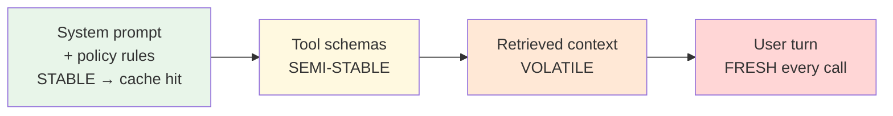

# Chapter 1.1 — LLM Mechanics for System Builders

*Part I — Fundamentals · Domain D1 · Reading time ~28 min · Prerequisites: Ch. 0.1–0.2*

---

## 1. The failure story

A healthcare-ops team built a prior-authorization assistant that answered clinician questions against policy. Early accuracy was mediocre, so someone proposed the obvious fix: give the model *everything*. Each request began stuffing the full plan document, the member's history, and a library of prior determinations into the prompt — a standing 60,000-token preamble on top of the actual 7,000-token question. "More context, better answers" was the theory, and on a handful of test cases it even looked true.

The bill and the pager disagreed. Per-call input jumped from ~7K tokens to ~67K; at the plan's token pricing this moved cost per call from roughly $0.02 to $0.16 — an **8×** increase across millions of monthly calls. Time-to-first-token went from about 0.8s to 2.4s — a **3×** latency regression that pushed the P95 past the product's 3-second budget. And the part nobody predicted: end-to-end answer accuracy on the team's own eval set *fell* from 91% to **78%**. The determination the clinician needed was often buried in the middle of the 60K dump, exactly where models attend least, while three superseded prior determinations sat near the top where the model weighted them most. The system was now confidently citing the wrong precedent.

The rebuild inverted the theory. A retrieval step selected the three most relevant policy sections (≈2K tokens), the stable plan rules moved into a cached prefix, and the volatile member context went last. Cost per call dropped below the *original* baseline, TTFT returned under a second, and accuracy rose to 93% — higher than either prior version, because the model now saw a short, ordered, relevant working set instead of a landfill.

Nobody had asked the question that governs every token you send: **what does this context cost in dollars, in latency, and in quality — and is the model even able to use it?** This chapter makes the context window what it actually is: a priced, scarce, quality-sensitive resource.

---

## 2. The mental model

### 2.1 Inference anatomy: two phases, two bottlenecks

An LLM request runs in two mechanically different phases, and conflating them is the root of most cost and latency misdiagnosis.

**Prefill** processes your entire input prompt in parallel to build the model's internal state — the key/value tensors for every token, cached in what everyone calls the **KV cache**. Prefill is *compute-bound*: the GPU is saturated doing matrix math over all input tokens at once. Its duration scales with input length and sets your **time-to-first-token (TTFT)**.

**Decode** then generates output tokens one at a time, each new token attending back over the whole KV cache. Decode is *memory-bandwidth-bound*: the bottleneck is reading that growing cache from memory, not raw compute. Its speed is your **tokens-per-second (TPS)**, and total decode time scales with output length.

The operational consequence is a rule most teams learn too late: **input tokens and output tokens are governed by different physics and priced differently — long inputs tax your TTFT and your prefill cost, long outputs tax your total latency and your decode cost, and you optimize them with different levers.** A verbose system prompt hurts TTFT; a rambling output format hurts total time. Diagnosing "the agent is slow" without separating these two is guessing.

### 2.2 Context economics: the quadratic tax and the pricing asymmetry

Attention cost scales roughly *quadratically* with sequence length — each token attends to every prior token — so doubling context length more than doubles the attention work. In practice, providers optimize heavily and you rarely see textbook quadratic behavior, but the intuition holds where it matters: **long context is superlinearly expensive, and the marginal token near the end of a huge prompt costs more than the marginal token near the start.**

Two pricing facts every architect keeps on a napkin (values illustrative — *verify at study time*, this layer moves):

- **Input is cheaper than output**, often by ~5×. If input is ~$3 per million tokens, output is often ~$15 per million. A design that trims 500 output tokens saves more than one that trims 500 input tokens.
- **Cached input is dramatically cheaper than fresh input** — commonly ~10× less. This single fact reshapes prompt architecture, because it means *where* you put a token matters as much as *whether* you include it.

**Prompt caching** lets the provider reuse the KV cache for a stable prefix across requests instead of re-running prefill. The mechanics are unforgiving in a way you must design for: caching keys on an *exact prefix match*, so one changed byte anywhere in the prefix invalidates the cache from that byte onward. The design rule that falls out is **cache-aware layout: stable content first, volatile content last.**

Read left to right: cheap-and-reused on the left, expensive-and-fresh on the right. Put your 3K-token system prompt and 20 tool schemas in the green zone once and pay cache rates forever; put the member's live context in the red zone where it belongs. Invert this layout — a timestamp or a per-request ID near the top — and you pay full prefill on every call and wonder why caching "doesn't work."

### 2.3 Long-context degradation: effective context ≠ advertised context

A model advertised at 200K tokens does not attend *uniformly* across 200K tokens. Three well-documented effects mean quality degrades long before you hit the limit:

- **Lost in the middle:** retrieval accuracy is highest for content at the very start and very end of the context and sags in the middle. The healthcare team's buried determination is the canonical symptom.
- **Context rot:** as a long context accumulates noise — stale instructions, dead ends, superseded facts — output quality falls even *below* the token ceiling. (This becomes a maintenance discipline in Ch. 5.2.)
- **Recency and primacy:** the model overweights what it saw first and last, which is why three superseded determinations at the top of the dump beat the correct one in the middle.

The operative distinction is **effective context** (how much the model can actually use well) versus **advertised context** (how much it will accept without erroring). You budget against the former. More tokens is a quality *risk*, not a quality *guarantee* — the exact inversion of the intuition that caused the incident.

### 2.4 Sampling: why "temperature 0" is not determinism

Two knobs shape output randomness. **Temperature** scales the probability distribution before sampling — low temperature concentrates mass on the likeliest tokens, high temperature flattens it. **Top-p** (nucleus sampling) restricts sampling to the smallest set of tokens whose cumulative probability exceeds *p*. For most production agent steps you want low temperature for consistency, raising it only where you deliberately want diversity (brainstorming, voting ensembles, Ch. 2.5).

The trap: **temperature 0 greedily picks the top token but does not give you determinism.** Batching effects on the provider's servers, floating-point non-associativity across hardware, and silent provider-side model updates all mean the same input can yield different outputs across runs. This is the mechanical root of the nondeterminism you designed around in Ch. 0.2 — it is a property of the infrastructure, not a setting you can switch off, which is why replay in debugging (Ch. 4.3) captures traces rather than assuming re-runs reproduce.

### 2.5 The napkin arithmetic every architect owes

You should be able to estimate a workload's cost and latency before writing a line of it. The model: *cost ≈ (input tokens × input price) + (output tokens × output price), summed over expected turns per task, adjusted for cache hit ratio on the input.* The biggest levers, in rough order: cache hit ratio on a large stable prefix (can cut input cost ~10× on the cached portion), output length discipline (output is the expensive per-token side), turns per task (each turn re-sends growing context), and only then raw prompt trimming. Compute this for the 90th-percentile task, not the median — the tail is where budgets die (Ch. 4.5).

---

## 3. Production lens

**Cost is a distribution, not a number.** A blended "average cost per call" hides the long-context tail where a few enormous prompts dominate spend. Instrument per-request input/output token counts and cache-hit ratio from day one (Ch. 4.3); the single most common cost win in production is discovering that a "stable" prefix is being invalidated every call by a stray timestamp.

**Latency has two budgets, not one.** TTFT governs perceived responsiveness (stream the first token fast); total time governs throughput and SLA. A long system prompt is a TTFT problem you can partly hide with streaming; a long output is a total-time problem you cannot. Know which one your product is bound by before optimizing.

**Effective context is a monitored quantity.** Teams that treat the advertised window as usable capacity ship the healthcare incident. Track answer quality as a function of context length on your own eval set; the curve bends downward well before the limit, and that knee is your real budget.

**Cache economics and prompt iteration are in tension.** Every edit to a cached prefix invalidates the cache and forces full prefill until it re-warms — so rapid prompt iteration and cache savings pull against each other. Mature teams pin and version the cached prefix (Ch. 4.6) and iterate in the volatile suffix, treating prefix changes as release events.

**On-call reality.** The mechanics in this chapter fail quietly, not loudly. A cost regression shows up as a slow climb in the monthly bill, not an alert; a context-length quality cliff shows up as a rising rate of subtly wrong answers, not an exception; a cache-invalidating stray timestamp shows up as latency creep. The pager-worthy version of each is a threshold on a *trend* — cost-per-resolved-task, cache-hit ratio, and effective-context quality — because there is no stack trace to catch. Wire those three trends before launch and the mechanics stop being invisible.

> **Doctrine check.** The deterministic core here is the *token accounting*, not the model: dollars, latency, and cache behavior are exactly computable and testable even though the model's output is not. Your verification cost is the instrumentation to measure effective context, cache-hit ratio, and per-segment token spend — cheap to build, and the thing that tells you when a design has drifted. The design is *wrong* when you cannot state, for a representative task, its expected cost, its TTFT, and the context length past which your own eval shows quality falling. If those three numbers are unknown, the context window is being treated as free — and it never is.

---

## 4. Edge-case catalog

| # | Edge case | What it looks like | Detection | Mitigation |
|---|---|---|---|---|
| 1 | **Cache invalidation by stray prefix bytes** | A timestamp, request ID, or reordered tool list near the top of the prompt silently disables caching; cost stays high despite a "cached" design | Monitor cache-hit ratio as a first-class metric; a design that should hit ~90% but reports ~0% has a poisoned prefix | Freeze the prefix byte-for-byte; move all per-request variability to the suffix; treat any prefix edit as a release-gated change (Ch. 4.6) |
| 2 | **Tokenizer surprises** | Numbers, code, whitespace, and non-Latin scripts tokenize far denser or sparser than expected; budgets set in "characters" or one model's tokens break on another | Count tokens with the *target model's* tokenizer, not an estimate; watch for budget overruns concentrated in numeric/code/non-English inputs | Budget in the actual tokenizer's units; add margin for high-density inputs; re-measure on every model migration |
| 3 | **Lost-in-the-middle burial** | Correct information is present in a long context but ignored because it sits in the low-attention middle | Position-controlled eval: same fact placed at start/middle/end, measure retrieval accuracy by position | Retrieve-then-place: shortlist relevant content and position it at the edges; shrink context to raise effective attention (Ch. 2.2) |
| 4 | **Silent provider-side model update** | Behavior shifts under a stable-looking model name; prompts tuned to old quirks regress with no code change | Behavioral fingerprinting — a fixed probe suite run on a schedule; drift in outputs on unchanged inputs flags an upstream change | Explicit version pinning policy and a re-baselining protocol (Ch. 4.6); never assume a model name is a frozen artifact |
| 5 | **Context rot in long sessions** | Multi-turn agent quality decays as the window fills with stale turns, even below the token limit | Canary questions injected at intervals over session length; falling accuracy with rising turn count | Turn-level compaction and structured summaries (Ch. 5.2); reset or summarize rather than append indefinitely |
| 6 | **Output-length blowout** | An unconstrained response format generates 4× the needed tokens; total latency and decode cost balloon on the expensive per-token side | Track output-token distribution; a fat right tail signals format indiscipline | Constrain the output contract (Ch. 1.2); reason-then-format so only the final answer is emitted at length |

---

## 5. Claude & MCP sidebar

Mapping this onto Claude's stack (mechanics move fast — verify against current docs at [docs.claude.com](https://docs.claude.com); the physics does not). A Messages API request has the same prefill/decode split, so the same TTFT-vs-total-time reasoning applies. Prompt caching is available and keys on a stable prefix exactly as described, which makes the cache-first layout — system prompt and tool definitions in the stable zone, user turn last — the single highest-leverage cost move on the platform; measure your own cache-hit ratio rather than assuming it. Claude's tokenizer differs from other vendors', so any token budget must be counted with Claude's own tooling and re-counted on migration. Extended-thinking modes spend output tokens on reasoning, which shifts your decode-side budget — account for it in the arithmetic of §2.5. Do not quote current context-window sizes, prices, or cache discount rates from memory; those are exactly the fast-moving numbers the guardrail says to verify at study time. The durable lesson is the one you can't look up: measure *your* token distribution and *your* effective-context knee, because those are properties of your task, not the platform.

---

## 6. Design exercise

Design the prompt architecture for a **support agent** workload: ~40 messages per session, a 3,000-token system prompt, 20 tool schemas (~5,000 tokens of definitions total), and per-turn user content averaging ~300 tokens.

1. Lay out the prompt for **maximum cache reuse** across the 40 turns: state exactly what goes in the stable (cached) zone, what goes in the volatile zone, and why. Note what single change would invalidate the cache.
2. **Estimate monthly cost** at 10,000 sessions. State your illustrative input/output/cached-input prices (flag them as illustrative), your assumed output tokens per turn, and your assumed cache-hit ratio. Show the arithmetic.
3. Identify **the single biggest cost lever** and quantify the savings from pulling it. Then name the one quality risk that lever introduces.

*Review standard:* your cost estimate must separate cached-input, fresh-input, and output as three distinct line items (a blended per-call number fails the exercise); your biggest lever must be defended against at least one alternative with numbers; and you must name a quality risk, because every cost lever in this chapter has one.

---

## 7. Self-test — judge each claim, justify in one sentence

1. "Adding more relevant context to a prompt reliably improves answer quality."
2. "Trimming 500 tokens of output saves roughly the same money as trimming 500 tokens of input."
3. "Setting temperature to 0 makes the model deterministic."
4. "A 200K-token advertised context window means you can place critical information anywhere in 200K tokens without quality loss."
5. "Putting a per-request timestamp at the top of an otherwise stable system prompt is harmless."

*(Answers are argued, not looked up: 1-false — beyond the effective-context knee, added tokens trigger lost-in-the-middle and context rot, so quality can fall; 2-false — output is typically ~5× the per-token price of input, so output trims save more, and 500 tokens off the expensive side matters more; 3-false — greedy decoding still faces batching, floating-point, and provider-update nondeterminism, so same input can differ across runs; 4-false — effective context is smaller than advertised and position-dependent, so middle placement degrades retrieval; 5-false — it changes the prefix byte-for-byte and invalidates prompt caching on every call, silently multiplying input cost.)*

## 8. Spaced-review card *(re-answer in 7 days, from memory)*

- Draw the prefill/decode split and label which phase sets TTFT, which sets TPS, and which cost each drives.
- State the cache-aware layout rule and explain why one changed prefix byte can multiply your input bill.
- Name the three long-context degradation effects and the single instrument that measures your effective-context knee.

---

*Next: Chapter 1.2 — Prompting as an Interface Contract, where a "minor wording tweak" silently breaks a downstream JSON consumer for six days, because a prompt is an API surface and nobody diffed it.*
