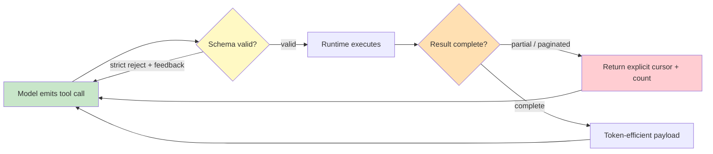

# Chapter 1.3 — Tool Calling Anatomy & Agent–Computer Interface (ACI) Design

*Part I — Fundamentals · Domain D1 · Reading time ~28 min · Prerequisites: Ch. 1.2*

## 1. The failure story

A fintech team shipped an account-reconciliation agent with a broad toolbox: forty-five tools, each documented with a single one-line description, all registered flat in one namespace. The definitions alone cost roughly 11,000 tokens on every request. In week two, a single production trace produced three distinct failures before anyone noticed.

First, the agent needed to look up customer accounts. Two tools matched loosely on name: `search_v2` (a legacy full-text search over transactions) and `search_accounts` (the correct, typed lookup). With only a one-line description to disambiguate, the model chose `search_v2`. Second, `search_v2` had no `limit` parameter — but the agent, pattern-matching from other tools, emitted `"limit": 100` anyway. The runtime ignored the unknown field silently rather than erroring, so the model received no signal that its mental model of the tool was wrong. Third, `search_v2` returned results in pages of 25. The response contained 50 matches across two pages, but the tool returned only page 1 and a `next_cursor` the agent never used. The agent proceeded as if 25 results were the complete set — half the data, silently dropped.

Downstream, a deterministic merge job deduplicated customer records against that 25-record set. It flagged 1 in 3 duplicate accounts as unique because their true match lived on the unseen page 2. Over four days, 380 accounts were double-created before an ops analyst noticed the reconciliation totals drifting. The postmortem blamed "model hallucination." It was nothing of the kind. The model reasoned correctly at every step given the interface it was handed. The interface let it pick the wrong tool, invent a parameter, and mistake a partial payload for a complete one.

Nobody had asked the question that governs this entire layer: *does our tool surface make the right call easy and the wrong call impossible, or does it make both equally available and hope the model chooses well?*

## 2. The mental model

### 2.1 The tool loop is the whole machine

An agentic system is, mechanically, a loop. The model emits a structured tool call. The runtime executes it against real systems. The result returns as new context. The model reads that result and emits the next call. Repeat until the model emits a final answer instead of a call. Everything you build — orchestration, memory, guardrails — sits on top of this loop.

Three properties of the loop matter for design. The model can request *parallel* tool calls in a single turn when the calls are independent, which cuts latency but complicates error handling because failures now arrive in batches — one call in the batch fails while three succeed, and your runtime must decide whether to surface the partial batch or block the turn. The runtime controls **tool choice mode** — forced (the model must call a specific tool), auto (the model decides), or none (text only) — and this is a control lever, not a detail. Forcing a specific first call is how you convert a fuzzy "the agent usually looks up the account first" into a guarantee; setting mode to `none` on a turn where you know reasoning suffices is how you stop **over-eager tool use** before it starts. And the tool result is *just more context*: a bloated or malformed result poisons every subsequent step, so the shape of what a tool returns is as important as the shape of what it accepts. Streaming interacts here too — a tool call cannot begin executing until the model has finished emitting its arguments, so oversized argument payloads delay the entire loop, not just the response text.

### 2.2 The ACI is a product surface, not plumbing

The **agent–computer interface** (ACI) is the complete contract between the model and your systems: tool names, descriptions, parameter schemas, return payloads, and error responses. **The tool name, description, and schema are prompts the model must obey under uncertainty; every ambiguity you leave in the interface is a failure mode you have delegated to a probabilistic system.**

This reframes tool design. You are not writing an API for a disciplined engineer who reads docs. You are writing for a fast, capable reader who pattern-matches under token pressure and never asks a clarifying question. The design disciplines follow directly. *Consolidate*: fewer high-level tools beat many primitive ones, because each additional tool raises both context cost and selection-error rate. *Namespace*: `crm.accounts.search` disambiguates where `search_v2` invites collision. *Return meaningful, token-efficient context*: a tool that returns a 4,000-token raw JSON blob when the agent needs three fields is spending money to degrade the next step.

### 2.3 Error surfaces are first-class design

What the agent sees on failure determines whether it recovers or loops. A tool that returns `{"error": "invalid request"}` gives the model nothing to act on, so it retries the same broken call or spirals. A tool that returns `{"error": "unknown parameter 'limit'; valid parameters are: query, account_type, cursor"}` hands the model the exact correction. The best error responses are **validation-with-feedback**: they name what was wrong and what would be right. This is the single highest-leverage, most-skipped investment in tool design.

The difference is visible in two versions of the same trace. With the opaque error, the model calls `search_v2` with `limit: 100`, receives `invalid request`, has no idea which field offended, and — because the call *looked* reasonable to it — retries the identical call, then a lightly reworded variant, burning three turns before giving up or fabricating a plausible-sounding answer. With the validation-with-feedback error, the model receives `unknown parameter 'limit'`, drops the field on the next turn, and resolves the task in one additional round trip. Same model, same task, same failure — opposite outcomes, decided entirely by what the tool chose to say on the way out. Error copy is not cosmetic; it is control flow.

### 2.4 The boring details are where the bugs live

Pagination, truncation, units, timezones, and IDs cause more production tool bugs than reasoning failures ever will. A tool that silently returns page 1 of N invites the exact incident above. A tool that accepts a bare number `amount: 1240` without a currency or minor-unit convention invites the reconciliation error of Ch. 1.2. A tool that returns timestamps without a timezone forces the model to guess. A tool that accepts a free-text account reference instead of a typed ID invites fuzzy matching on the wrong record.

### 2.5 Poka-yoke: make invalid calls unrepresentable

**Poka-yoke** — mistake-proofing — is the discipline of designing interfaces where the wrong action cannot be expressed. Enums instead of free text so the model cannot invent a category. Required fields so a call cannot be half-formed. Typed IDs so an account ID cannot be passed where a transaction ID belongs. Strict schemas that reject unknown parameters loudly instead of ignoring them silently. The principle borrows from physical design — a plug that only fits one way removes the instruction "insert correctly" — and applies verbatim to a probabilistic caller: every constraint you encode in the schema is a class of error the model can no longer commit, no matter how it reasons. **An agent is only as reliable as its worst tool interface; you do not raise reliability by instructing the model to be careful, you raise it by making careless calls unrepresentable.**

*Green: the model's move. Yellow: the schema gate that catches malformed calls. Orange/red: the partial-result seam where silent data loss originates unless completeness is made explicit.*

## 3. Production lens

Tool design shows up in the bill and the pager in three ways.

**Context cost of the registry.** Every registered tool's schema is sent on every request. Forty-five tools at ~250 tokens each is ~11,000 tokens of fixed overhead per call, before any conversation. At an illustrative input price of ~$3 per million tokens (verify at study time), that is ~$0.033 per call in tool definitions alone; across 200,000 calls/month, ~$6,600/month spent describing tools the agent mostly does not use on any given call. Prompt caching (Ch. 1.1) reclaims most of this *if* the tool block sits in a stable prefix — another reason tool definitions belong at the top of the context, not interleaved.

*Selection-error cost.* Selection accuracy degrades as the flat tool count rises. Suppose a 12-tool surface yields 97% correct tool selection and a 45-tool flat surface yields 89%. That 8-point gap is not abstract: each wrong selection costs a wasted round trip (~$0.01 and ~1.5s) plus a recovery turn, and sometimes a silent wrong answer that costs far more downstream. Cost *per resolved task* is the honest metric. If the flat surface resolves 89% of tasks cleanly and burns an average of 1.6 extra turns on the rest, while the consolidated surface resolves 97% in 1.1 turns, the consolidated design is cheaper per *resolved* task even though it exposes fewer capabilities.

*Silent-failure cost.* The most expensive tool failures return HTTP 200. A truncated payload, an empty result mistaken for "nothing found," a partial page — these produce confident wrong answers, not errors, and they surface days later in reconciliation drift rather than in logs.

**Monitoring signals and on-call reality.** The tool layer has a small set of leading indicators worth wiring into a dashboard before launch: the rate of strict-schema rejections (a spike means schema drift or a prompt-example mismatch), the tool-call-to-resolved-task ratio (a climb means over-eager use or a confusing surface), the fraction of paginated tools returning a `next_cursor` that is never followed (silent truncation risk), and mean tokens-per-tool-result (payload bloat and cost creep). The on-call reality is that none of these page you loudly — a tool-design failure almost never throws an exception. It manifests as a slow drift in a downstream business metric, which is why the reconciliation team, not the platform team, is usually the one who notices first. The mitigation is to instrument the tool boundary with the same rigor you would a payment gateway: assert completeness, count rejections, and alert on the *ratio* trends rather than waiting for a stack trace that will never come.

> **Doctrine check.** The deterministic core of this layer is the *validation-and-completeness contract* at the tool boundary: strict schema rejection with feedback, explicit result counts and cursors, and typed IDs. That validator is code, not prompt — it is the immutable seam where a probabilistic caller meets your systems. Verification cost is one schema-validation layer and one completeness assertion per tool; the design is wrong the moment a tool can accept an unknown parameter or return a partial payload without saying so.

## 4. Edge-case catalog

| # | Edge case | What it looks like | Detection | Mitigation |
|---|-----------|-------------------|-----------|------------|
| 1 | **Hallucinated tool / parameter** | Model calls `search_v2` for accounts; emits `limit` on a tool that has none | Log unknown-field and unknown-tool rejections; alert on nonzero rate | Strict schemas that reject unknown fields with feedback; allow-listed tool names; namespacing to kill near-duplicates |
| 2 | **Over-eager tool use** | Agent calls a lookup tool for a fact it already holds in parametric knowledge | Track tool-call-to-task ratio; flag sessions above a per-task budget | Per-task tool-use budget; tool-choice mode `none` when reasoning suffices; description says *when not* to call |
| 3 | **Silent partial failure** | Tool returns HTTP 200 with page 1 of 2 or a truncated list; agent treats it as complete | Assert returned count vs. reported total; monitor `next_cursor` presence with no follow-up call | Return explicit `total_count` and `cursor`; make pagination a required loop; fail loud on truncation |
| 4 | **Tool schema drift** | Backend renames a field; every prompt example and cached call is now subtly wrong | Contract test tool schema against live backend in CI; version the tool | Version tools (`accounts.search.v3`); coupled deploy of schema + examples; deprecate, don't mutate |
| 5 | **Ambiguous units / IDs** | `amount: 1240` with no minor-unit or currency; account ref accepted as free text | Type-check at the boundary; reject untyped numerics and string IDs | Typed IDs, explicit currency + minor-unit fields, enums for categories (poka-yoke) |
| 6 | **Bloated return payload** | Tool returns 4K-token raw record when 3 fields are needed | Monitor mean tokens-per-tool-result; correlate with downstream accuracy | Response-format discipline: return only decision-relevant fields; offer a `verbosity` enum |

## 5. Claude & MCP sidebar

Claude exposes tool use through a structured tool-calling API and, at the ecosystem layer, through the Model Context Protocol (MCP), which standardizes how tools, resources, and prompts are surfaced to the model. Everything in this chapter maps onto that stack: an MCP server's tool names, descriptions, and JSON schemas *are* the ACI, and the same consolidation, namespacing, error-surface, and poka-yoke disciplines apply directly. Claude supports parallel tool calls and tool-choice control, so the loop mechanics in §2.1 are concrete, not hypothetical. Anthropic's own guidance in *Writing Tools for Agents* and the SWE-bench ACI lessons — that consolidating and clarifying the tool surface often beats prompt-tuning the agent — is the canon behind §2.2. Treat every mechanism named here (tool-choice modes, parallel-call limits, strict-schema behavior, MCP primitives) as a fast-moving fact: confirm the current shape and constraints against docs.claude.com at study time rather than trusting any spec from memory. Chapter 2.1 takes this from a single tool surface to a portfolio of MCP servers, where the failure modes compound.

## 6. Design exercise

You inherit a CRM integration exposing 40 low-level tools: `get_contact`, `get_contact_by_email`, `get_contact_by_phone`, `list_contacts`, `search_contacts_v1`, `search_contacts_v2`, five near-identical note-creation tools, separate getters for every sub-resource, and so on. Redesign this into **≤12 agent-facing tools**. Then specify *one tool completely*: name (namespaced), description (including when *not* to call it), full parameter schema (types, enums, required fields, typed IDs), return payload shape (fields and pagination contract), and every error response the agent can receive with the corrective feedback each carries. Justify every consolidation and every schema choice in terms of a specific agent failure mode it prevents — cite the edge-case number from §4.

*Review standard:* the redesign passes if (a) no two tools can be confused by name or description, (b) the fully-specified tool cannot be called with an unknown parameter, an untyped ID, or an ambiguous unit, (c) its return payload makes partial results impossible to mistake for complete ones, and (d) each of its error responses names both what was wrong and what would be valid. A reviewer should be able to point at each design decision and name the incident it forecloses.

## 7. Self-test — judge each claim, justify in one sentence

1. "Exposing more tools always makes an agent more capable."
2. "A tool that returns `{\"error\": \"invalid request\"}` is adequate as long as it returns *some* error."
3. "Hallucinated parameters are a model quality problem that better models will eventually solve."
4. "Returning the full raw record from every tool is the safe default because the agent can ignore what it doesn't need."
5. "Pagination is a backend concern that doesn't affect agent correctness."

*(Answers are argued, not looked up: 1-false — each added tool raises context cost and selection-error rate, so beyond a point more tools lower cost-per-resolved-task; 2-false — an opaque error gives the model nothing to correct, so it retries or loops, whereas validation-with-feedback names the fix; 3-false — a strict schema that rejects unknown fields makes hallucinated parameters structurally impossible now, so it is an interface problem you can solve today rather than wait out; 4-false — bloated payloads spend tokens to degrade the next step's accuracy and cost, so response-format discipline is a design duty, not a nicety; 5-false — a silently truncated page produces a confident wrong answer on partial data, so pagination completeness is a correctness contract the tool must make explicit.)*

## 8. Spaced-review card *(re-answer in 7 days, from memory)*

- Draw the tool loop and mark the two seams where silent data loss originates (schema gate, completeness gate).
- List the five poka-yoke techniques that make invalid tool calls unrepresentable, and the edge case each kills.
- Explain why cost *per resolved task*, not raw capability count, is the metric that governs how many tools to expose.

---

*Part I is complete: you now hold the physics (1.1), the interface contract (1.2), and the tool surface (1.3). Next: Chapter 2.1 — Tools at Scale & the Model Context Protocol, where a team wires nine MCP servers into one agent, tool definitions alone consume 30K tokens per request, two servers collide on a tool name, and one ships a malicious update — cost, correctness, and security failing in a single afternoon.*
