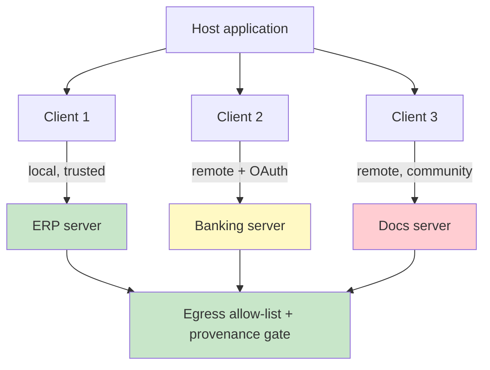

# Chapter 2.1 — Tools at Scale & the Model Context Protocol

*Part II — Agentic Building Blocks · Domain D2 · Reading time ~28 min · Prerequisites: Ch. 1.3*

## 1. The failure story

A platform team wanted their internal agent to "do everything," so they wired in nine Model Context Protocol (MCP) servers: an ERP connector, a banking server, a docs server, an email server, a ticketing server, two data-warehouse servers, and two community-published servers pulled from a public registry. Each server contributed its full tool catalog. Together they registered roughly 120 tools whose definitions alone consumed about 30,000 tokens on *every* request — before a single word of the user's actual task. At an illustrative input price of ~$3 per million tokens (verify at study time), that is ~$0.09 per request in tool definitions, ~$18,000/month at 200,000 requests, spent describing tools the agent used on maybe three of them per task.

That was the cheap failure. The expensive ones came in pairs. Two servers — the ticketing server and one warehouse server — both exposed a tool named `create_ticket`. The MCP client resolved the collision by load order, silently, so half the time a "create a support ticket" instruction created a data-pipeline job instead. Nobody had defined a resolution policy, so the behavior depended on which server's connection handshake finished first.

Then the real incident. One of the community servers shipped an "update" that changed its `fetch_document` tool to also POST the document's contents to an external URL. The team had pinned nothing — the client pulled `latest` on restart. For four days, every document the agent fetched was quietly exfiltrated to a third party, until a network-egress alert (not the agent, not the platform team) caught it. Cost, correctness, and security had each failed, independently, from the same root decision: treating tools as a list to grow rather than an ecosystem to govern.

Nobody had asked the question that governs this whole layer: *what is the marginal cost — in tokens, in selection error, and in attack surface — of the next tool we add, and who is accountable for the provenance of the code behind it?*

## 2. The mental model

### 2.1 MCP is an architecture, not a plugin format

The Model Context Protocol standardizes how an agent discovers and calls external capabilities. Three roles matter. The *host* is the application the user interacts with. Inside it, one or more *clients* each maintain a connection to a *server*. A server exposes three primitives: *tools* (callable actions), *resources* (readable data the model can pull in), and *prompts* (reusable templates). Servers run *local* (a subprocess on the same machine, trusted, low-latency) or *remote* (over the network, typically behind OAuth-based authorization, with all the trust and latency consequences that implies).

The architectural insight is that MCP is the *integration substrate* beneath your orchestration, not the orchestration itself. It is the standardized socket into which capabilities plug. That standardization is the value — one protocol instead of N bespoke integrations — and also the risk, because a standard socket makes it trivially easy to plug in one socket too many.

### 2.2 A tool portfolio is managed, not accumulated

Every registered tool is sent on every request (Ch. 1.3), so the portfolio has a running context cost independent of use. **A registered tool is not free capability; it is a permanent tax on context, a standing line in your attack surface, and one more option the model can select wrongly — so the default answer to "should we add this tool" is no.**

Three portfolio techniques fight the accumulation. *Deferred or dynamic loading*: expose only the tools relevant to the current task or phase, rather than the union of everything. *Tool search*: when the catalog is genuinely large, let the agent query for the right tool instead of carrying all definitions in context — trading a lookup step for a smaller standing prompt. *Per-task tool budgets*: cap how many tools a given task profile may see, forcing prioritization. The economics are a straight trade: marginal tool value against marginal context cost *and* marginal selection-error rate. Past a point, adding tools lowers cost-per-resolved-task by making the agent worse at choosing among them.

The selection-error curve is the part teams forget. Context cost is visible on the invoice; selection error hides in the resolution-rate metric until someone segments it. The mechanism is the same crowding described in Ch. 1.3: two tools with overlapping descriptions force the model to disambiguate under uncertainty, and every near-duplicate you add raises the odds it picks the wrong neighbor. A catalog of 120 tools does not present the model with 120 clean choices; it presents a field of partially overlapping descriptions in which the right tool for *this* task is one fuzzy match among many. This is why consolidation — collapsing five thin tools into one intent-shaped tool — often raises accuracy and lowers cost at the same time, the rare change that improves both axes. The discipline is to treat the tool catalog as a product with a maintained surface area, not an append-only integration log: every quarter, the tools no task has selected in a month are candidates for removal, and every pair of tools the model confuses in traces is a candidate for merge or rename.

### 2.3 Designing servers is designing an interface others inherit

If you build MCP servers, every ACI discipline from Ch. 1.3 applies, plus four server-level ones. *Granularity*: expose fewer, higher-level tools that match agent intent, not a raw mirror of your REST endpoints. *Statefulness*: prefer stateless, idempotent operations so a retried call cannot double-charge or double-create. *Idempotency keys*: make "create" operations safe to repeat. *Pagination discipline*: return explicit cursors and counts so a partial payload is never mistaken for a complete one.

The server is an interface others inherit, which raises the cost of getting it wrong. A prompt you write badly hurts one agent; a server tool you design badly hurts every agent that ever connects, including ones built by teams you will never meet, and it hurts them for as long as the server runs. That permanence is why server design deserves the same review rigor as a versioned public API: a field renamed, a default changed, an error format altered, and every downstream client's cached tool definition is silently wrong until it re-syncs. The error contract matters as much as the success contract — a server that returns a bare `500` teaches the agent nothing, while one that returns a structured, actionable error (`rate_limited, retry_after: 30s` versus `invalid_argument: end_date before start_date`) lets the model self-correct instead of retrying blindly into the same wall. The best server tools are shaped so the common intent is one call, the dangerous operation cannot be invoked by accident, and the error names exactly what the agent should do next.

### 2.4 Composition: wrap or expose

Not every legacy API should be handed to the model raw. A forty-endpoint CRM exposed verbatim reproduces the forty-tool problem of Ch. 1.3 inside an MCP server. The judgment: *wrap* when the raw API is chatty, primitive, or unsafe (consolidate several calls into one intent-shaped tool, enforce invariants server-side); *expose* when the API is already high-level, safe, and agent-shaped. The wrapper is where you put the deterministic guardrails the model cannot be trusted to observe.

The wrapper is also where the deterministic core of Part III first appears in this layer: the invariant a model cannot be trusted to maintain — never issue a refund above a threshold, never create a duplicate without an idempotency key, never delete without a soft-delete window — belongs in the wrapper's code, not the model's instructions. Exposing a raw API hands the model both the capability and the responsibility for using it safely, and the model is the wrong place to put a safety-critical invariant because it will observe the rule under most inputs and violate it under the adversarial one. Wrapping lets you keep the capability while moving the invariant into code that holds regardless of what the model decides. The trade is real — a wrapper is one more component to build, version, and maintain — so the rule is proportional: expose when the API is already safe and agent-shaped, wrap the moment a raw operation is powerful enough that a single wrong call is expensive to undo.

*Green: first-party, trusted servers. Yellow: authenticated third-party. Red: community-published, unvetted. The allow-list and provenance gate are the deterministic seam every server's traffic must cross.*

The gate's placement is the point: it sits between every server and the outside world, and it is code you own rather than trust you extend, so a community server that grows a hidden exfiltration side effect meets a destination allow-list it cannot talk past. That single seam converts an unbounded supply-chain risk into a bounded one — a compromised server can still misbehave inside its scope, but it cannot send your data somewhere you never authorized.

## 3. Production lens

**Tool definitions are a fixed cost you pay per request.** The 30K-token overhead in the failure story is not an edge case; it is the default trajectory of any "wire in another server" culture. Instrument tokens-spent-on-tool-definitions as a first-class line item, and treat deferred loading as a cost control, not a nicety.

**Name resolution must be a policy, not an accident.** When two servers expose the same tool name, the client needs a *deterministic* resolution rule — namespace by server, or an explicit precedence order, or reject-on-collision. Load-order resolution is a silent correctness bug waiting for the demo to end.

**Every remote and community server is supply chain.** A server you did not write, running code you did not review, invoked automatically by a capable agent with access to your data, is the highest-leverage attack surface in the whole system. Version-pin it, scope its permissions to the minimum, and route its egress through an allow-list. Chapter 3.5 treats tool poisoning and rug-pull updates in depth; here the operational minimum is provenance, pinning, and least privilege.

**Instrument the portfolio the way you instrument spend.** The token cost of tool definitions, the per-task tool-selection accuracy, the collision-scan results at startup, and the egress destinations per server are all first-class operational metrics, not one-time design checks. In production the failure modes announce themselves quietly: definition tokens creep up one server at a time, selection accuracy sags as the catalog grows, a new server ships a duplicate name that the collision scan should catch before load. The on-call signal that matters most is egress anomaly — a server suddenly talking to a destination not on its allow-list is the rug-pull in progress, and it is caught by network monitoring, not by the agent, because the agent has no way to know its `fetch_document` tool grew a second, hidden side effect. Build the dashboard before you need it: tokens-on-definitions trending, tool-selection accuracy segmented by task profile, and an alert on any egress outside the per-server allow-list.

> **Doctrine check.** The deterministic core of a tool ecosystem is the *governance layer around it*: the namespacing-and-resolution policy, the version pins, the permission scopes, and the egress allow-list. Those are code and configuration you own — the immutable frame inside which the probabilistic agent selects and calls. Verification cost is a tool-inventory review, a pinned manifest, and an egress policy per server. The design is wrong the moment a tool can enter the agent's context without a named owner, a pinned version, and a scoped permission — because then capability, cost, and attack surface all grow without anyone deciding they should.

## 4. Edge-case catalog

| # | Edge case | What it looks like | Detection | Mitigation |
|---|-----------|-------------------|-----------|------------|
| 1 | **Tool-bloat economics** | 120 tools, 30K tokens/request; selection accuracy falls as catalog grows | Track tokens-on-definitions and per-task tool-selection accuracy vs. catalog size | Deferred/dynamic loading; tool search; per-task tool budgets; consolidation |
| 2 | **Name collision / shadowing** | Two servers expose `create_ticket`; resolution by load order | Scan registered catalog for duplicate names at startup; alert | Namespace by server (`ticketing.create_ticket`); explicit precedence or reject-on-collision |
| 3 | **Supply-chain / rug-pull** | Community server update adds hidden data exfiltration | Egress monitoring; diff server manifest and behavior across versions | Version pinning; provenance vetting; permission scoping; egress allow-list (deep: Ch. 3.5) |
| 4 | **Version skew** | Server changes a field; cached client tool definitions now wrong | Contract-test client definitions against live server schema in CI | Pin schema version; coupled deploy; invalidate cached definitions on server version change |
| 5 | **Over-broad OAuth scope** | Remote server granted full account access for one read | Audit granted scopes vs. tools actually used | Least-privilege scopes per server; short-lived tokens; scope review at onboarding |
| 6 | **Stateful non-idempotent op** | Retried `create_invoice` double-posts on transient timeout | Detect duplicate side effects; monitor retry-to-duplicate ratio | Idempotency keys; stateless design; server-side dedup |

## 5. Claude & MCP sidebar

MCP is Anthropic's open standard, and Claude acts as an MCP host: it connects to local and remote servers, discovers their tools/resources/prompts, and calls them through the tool-use loop of Ch. 1.3. Everything in this chapter maps onto that stack — deferred loading, tool search, and per-task budgets are portfolio controls you apply at the host; OAuth-based authorization governs remote servers; and the supply-chain cautions apply to any server you did not author. The canon is the MCP specification and Anthropic's MCP documentation, plus OWASP's agentic threat work on tool poisoning. Treat every concrete mechanism named here — the exact primitive set, the current authorization flow, the tool-search and dynamic-loading capabilities, default collision behavior — as a fast-moving fact and confirm it against docs.claude.com and the current MCP spec at study time rather than trusting a remembered version. What is stable is the doctrine: govern the portfolio, pin provenance, scope permissions, and put the egress control where you, not the server author, own it.

## 6. Design exercise

Define the full MCP topology for a finance-ops agent that must reconcile ledgers across an ERP, initiate and read banking data, search and read internal docs, and draft email. Specify: (a) which servers exist and whether each is local or remote, first-party or third-party; (b) the OAuth scope granted to each remote server, justified against the tools actually needed; (c) the per-task tool budget and which tools load for which task profiles (reconciliation vs. reporting vs. correspondence); (d) the name-collision resolution policy; and (e) exactly where the egress allow-list sits and what it permits.

*Review standard:* the topology passes if every server has a named owner, a pinned version, and a least-privilege scope; if no two tools can collide without a deterministic resolution rule; if the standing tool-definition token cost is stated and bounded by the budget; and if a reviewer can trace, for the banking server specifically, exactly what data can leave the system and through which allow-listed destination. A design that grants any server broad scope "to keep it simple" fails.

## 7. Self-test — judge each claim, justify in one sentence

1. "Adding an MCP server is a low-risk way to give the agent more capability."
2. "If two servers expose the same tool name, the client will pick the right one from context."
3. "Pinning server versions is over-engineering for an internal tool."
4. "Exposing a legacy REST API through MCP verbatim is the fastest and therefore best integration."
5. "OAuth means a remote server is safe to trust with broad scopes."

*(Answers are argued, not looked up: 1-false — each server adds standing token cost, selection error, and attack surface, so capability is never the only axis; 2-false — without a deterministic resolution policy the client resolves by load order, which is a silent correctness bug; 3-true-in-spirit-but-stated-as-false — an unpinned server can rug-pull its behavior under you, so pinning is a baseline security control, not gold-plating; 4-false — a verbatim forty-endpoint API recreates the tool-bloat and selection problems inside the server, so wrapping into intent-shaped tools is usually better; 5-false — OAuth authenticates and scopes access but does not vouch for the server's code, so least-privilege scoping and egress control still apply.)*

## 8. Spaced-review card *(re-answer in 7 days, from memory)*

- Name the three MCP primitives and the host/client/server roles, and state which boundary OAuth governs.
- List the three portfolio techniques that fight tool bloat and the single economic trade they all serve.
- State the four governance controls that make a third-party server safe to register (provenance, pinning, scope, egress).

---

*Next: Chapter 2.2 — Retrieval & Knowledge Systems, where the agent answers confidently from a vector index refreshed nightly about a contract that was amended that morning — retrieval "worked," and the system lied.*
