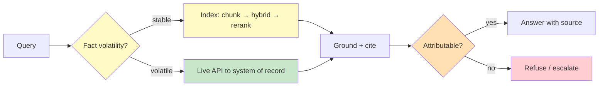

# Chapter 2.2 — Retrieval & Knowledge Systems

*Part II — Agentic Building Blocks · Domain D2 · Reading time ~28 min · Prerequisites: Ch. 2.1*

## 1. The failure story

A legal-operations team built an agent to answer questions about active client contracts. It worked beautifully in testing: ask about a renewal clause, get the clause back with a citation. The knowledge layer was a vector index over 240,000 contract chunks, re-embedded and refreshed by a nightly batch job at 2 a.m.

On a Tuesday, a client's master agreement was amended at 9:15 a.m. — a liability cap raised from $2M to $5M, signed and filed in the document system. At 11:40 a.m., a contracts manager asked the agent, "What's the liability cap on the Meridian account?" The agent answered "$2 million," with a citation to the contract, confidently and fluently. The citation was real. The chunk was real. Retrieval had returned exactly what it was asked to return. The index simply had not seen the amendment, because the next refresh was fourteen hours away.

The manager, trusting a cited answer, quoted $2M in a renewal negotiation. The error surfaced three days later when opposing counsel referenced the $5M figure from their copy of the signed amendment. The internal review called it a "retrieval bug." It was not a bug. Recall@10 on the eval set was 0.94. The reranker was tuned. Every metric the team monitored was green. The system had retrieved a true-yesterday fact and presented it as true-now, and nothing in the architecture distinguished the two.

Nobody had asked the question that governs every knowledge system: *for facts that change, what is our freshness guarantee, and what does the agent do when the index cannot meet it?*

## 2. The mental model

### 2.1 Retrieval is a system, not a library call

"Add RAG" hides a pipeline with at least five decision points, each with failure modes. **Chunking**: how documents are split determines whether a clause survives intact or gets severed from its heading. **Embedding choice**: which model maps text to vectors, and whether it captures your domain's semantics. **Hybrid retrieval**: combining lexical (keyword/BM25) and dense (embedding) search, because each catches what the other misses — exact identifiers and rare terms for lexical, paraphrase and concept for dense. **Reranking**: a second-stage model reorders the top candidates for precision. **Citation grounding**: binding each answer span to a source. Treating any one of these as a default rather than a design choice is how the system lies fluently.

Chunking deserves particular suspicion because it is the stage teams treat as a formatting detail and it is where retrieval quality is quietly decided. A fixed 512-token window that ignores document structure will sever a liability cap from the heading that scopes it, split a table mid-row so a retrieved fragment reports a number without its column, or orphan a defined term from the definition three chunks away. The chunk boundary is a semantic decision disguised as a preprocessing parameter: **structure-aware chunking** that keeps a clause with its heading, a table with its caption, and a definition with its term is the difference between a retrieved span that means something and one that is technically relevant and practically useless. Embedding choice compounds it — a general-purpose embedding model may map two legally distinct clauses to nearby vectors because they share surface vocabulary, so a domain where precision hinges on fine distinctions often needs either a domain-tuned embedding or a lexical channel strong enough to catch the exact terms the dense model blurs. None of these five stages is a default; each is a lever, and the failure story's team had pulled all five to "works in the demo" and none to "survives the amendment."

### 2.2 Static RAG versus agentic retrieval

One-shot RAG retrieves once, then answers. **Agentic retrieval** lets the model search iteratively — issue a query, read results, decide whether they suffice, refine or search again, and stop when it judges the evidence adequate. The trade is cost and latency against coverage on hard, multi-hop questions. A related axis: **just-in-time retrieval** (fetch when the model asks) versus **context preloading** (stuff likely-relevant material in upfront). Preloading spends tokens and courts **lost-in-the-middle** degradation (Ch. 1.1); just-in-time keeps context lean but adds round trips.

Agentic retrieval inherits the termination problem of Ch. 2.4 directly: an agent that decides for itself when the evidence suffices can also decide, on a hard question, that it never does, and search again indefinitely. So iterative retrieval needs the same budgets and stopping gates as any loop — a cap on search rounds, a confidence gate that stops when marginal results stop adding evidence, and a graceful "I could not ground this" when they run out. The right default for most systems is the simplest retrieval the task admits: one-shot for lookups whose answer sits in a single chunk, agentic only for genuinely multi-hop questions where a single query cannot assemble the evidence. Reaching for iterative search because it sounds more capable buys latency, cost, and a new failure mode for questions a single well-formed query would have answered — the retrieval-layer echo of the orchestration lesson that the cheapest pattern the task admits is usually the right one. **Retrieval is not a fact source; it is an evidence-gathering step whose output must be treated as a claim to be grounded, ranked, and dated — never as truth by virtue of having been retrieved.**

### 2.3 Freshness is an architecture, not a cron job

Every fact has a volatility. A signed contract clause, a live account balance, a current risk tier — these change on human timescales and cannot be served from a nightly index without a staleness guarantee. The design pattern is a **source-of-truth hierarchy**: the index serves stable, high-recall retrieval; a **live-API fallthrough** serves volatile facts directly from the system of record; and the agent knows which facts are which. The failure story had no fallthrough and no volatility model, so it served a fourteen-hour-old cache as current truth.

The volatility model is a classification the system owns, not a property the model infers. Each fact class carries a **freshness SLA** — a stable corpus of historical filings tolerates a nightly refresh, a signed-that-morning amendment tolerates minutes, a live balance tolerates nothing but a direct read. The architecture routes on that classification before it retrieves: a query about a liability cap is a query about a volatile, legally consequential fact, so it must consult the document system of record with a timestamp, not the embedding index that last saw the world at 2 a.m. The subtle trap is the fact that *used* to be stable and became volatile — a contract clause is stable until the day it is amended, and the system that cannot tell "this value has an amendment pending" from "this value is settled" will serve the settled-looking stale copy with full confidence. That is why freshness is an architecture and not a refresh cadence: no achievable index frequency closes the window between a 9:15 a.m. amendment and an 11:40 a.m. question, so the only correct design routes volatile facts to the live source and lets the index serve what genuinely does not change intraday. A team that answers "how do we handle freshness" with "we refresh often" has not built a freshness architecture; it has bought a smaller version of the same fourteen-hour lie.

### 2.4 Grounding and citation are product requirements

An answer that cannot be attributed to a source must be refused, not guessed. Citation is not decoration; it is the mechanism by which a human can verify, and the mechanism by which the system admits "I don't have grounds for this." A knowledge agent's contract is: every claim carries a source, or the claim is not made.

### 2.5 Retrieval metrics and answer quality diverge

Recall@k and MRR (mean reciprocal rank) measure whether the right chunk was retrieved and ranked well. They say nothing about whether the *answer* was correct, current, or faithful to the source. The failure story had excellent recall and a wrong answer. Measure both, and never let a green retrieval metric stand in for end-answer quality (Ch. 4.1).

*Yellow: the volatility routing decision. Green: the live source-of-truth path for facts that change. Orange/red: the grounding gate that refuses rather than fabricates.*

Two deterministic seams carry the whole diagram: the volatility router that decides index-versus-live before retrieval, and the attributability gate that decides answer-versus-refuse after it. Both are code, not model judgment. The router keeps a stale index from serving a volatile fact as current; the gate keeps an ungrounded claim from shipping as fact. A knowledge system that has neither can retrieve perfectly and still lie; a system that has both can only be stale or silent, never confidently wrong — which is the trade a regulated domain should always take.

## 3. Production lens

**Freshness is a per-fact SLA, not a global property.** Classify facts by volatility and assign each a retrieval path. Stable corpus → index. Volatile fact → live fallthrough to the system of record. Anything you cannot classify defaults to live-or-refuse, never to stale-and-confident.

**Grounding must be enforced, not requested.** A validator checks that every claim in the answer maps to a retrieved, cited span before the answer ships; unattributable claims are stripped or the answer is refused. This is the deterministic seam of the knowledge layer.

**Conflicting sources need a precedence policy.** When two documents disagree, the system needs a rule — recency, source authority, or surface-the-conflict-to-the-user — decided in advance. Silent selection of one source is how the agent picks the wrong one.

**Permissions are part of retrieval.** **ACL-aware retrieval** ensures the index never returns a document the requesting principal is not cleared to see. An index that ignores permissions is a data-leak surface wearing a search bar. The permission filter must run *before* ranking, not after — a system that ranks across everything and then hides the forbidden results still leaked them into the model's context, and a system that filters by permission first makes cross-principal leakage structurally impossible rather than merely unlikely.

**Measure the answer, not just the retrieval.** The failure story's dashboard was all green because it monitored recall@k and reranker quality — retrieval metrics — and never measured whether the shipped answer was correct, current, and faithful to its cited source. These diverge, and the divergence is exactly where the expensive errors live: high recall with a stale chunk, a correct chunk misread, a citation that points to a real span the answer misquotes. The production discipline is a separate end-answer accuracy track with source-timestamp sampling, so a cited $2M answer to a question about a contract amended that morning trips an alert on freshness even when every retrieval metric is perfect. On-call for a knowledge system watches two families of signal — did we retrieve the right evidence, and did we say something true with it — and treats a gap between them as the tell that the system is lying fluently.

> **Doctrine check.** The deterministic core here is the *grounding-and-freshness contract*: a volatility classifier that routes each fact to index or live source, plus a grounding validator that permits only attributable claims. Both are code, not prompt. Verification cost is a freshness SLA per fact class and a citation-coverage check on every answer. The design is wrong the moment the system can present an unattributable claim, or serve a volatile fact from a stale index, without saying so — because then "retrieval worked" and "the answer is true" have quietly become different statements the system cannot tell apart.

## 4. Edge-case catalog

| # | Edge case | What it looks like | Detection | Mitigation |
|---|-----------|-------------------|-----------|------------|
| 1 | **Stale index on volatile fact** | Cited $2M cap; amendment filed that morning | Compare answer facts against source-of-truth timestamps; sample audits | Volatility classification; live-API fallthrough; freshness SLA per fact class |
| 2 | **Retrieval injection** | Adversarial text in the corpus steers the agent's answer | Scan corpus for instruction-like content; monitor anomalous answers | Treat retrieved text as untrusted data, not instructions (Ch. 3.5); provenance on ingest |
| 3 | **Conflicting sources** | Two docs disagree on a value; agent silently picks one | Detect contradictory retrieved spans; log conflict rate | Precedence policy (recency/authority) or surface-conflict-to-user; never silent pick |
| 4 | **Chunking pathology** | Table split mid-row; heading orphaned from body | Inspect chunk boundaries; test on table/heading-heavy docs | Structure-aware chunking; keep tables and headers with bodies; overlap windows |
| 5 | **Index / permission skew** | Retrieval returns a doc the requester can't see | Audit returned docs against principal ACLs | ACL-aware retrieval; filter by permission before ranking |
| 6 | **Recall-good, answer-wrong** | Green recall@k, incorrect end answer | Track end-answer accuracy separately from retrieval metrics | Grounding validator; end-to-end eval (Ch. 4.1); faithfulness checks |

## 5. Claude & MCP sidebar

Claude consumes retrieved context like any other input — meaning retrieved documents occupy the same context window and obey the same economics and degradation curves as Ch. 1.1, so preloading a large corpus is both a cost and a lost-in-the-middle risk. Anthropic's contextual-retrieval work (prepending chunk-situating context before embedding) is canon for improving recall on fragmented corpora, and hybrid-plus-rerank stacks (Eugene Yan's RAG writing; production RAG literature) are the standard shape. Via MCP, a knowledge base can be exposed as a *resource* or a *search tool*, which turns static RAG into agentic retrieval — the model decides when and what to fetch. Critically, retrieved text is untrusted content: Claude should treat corpus contents as data, never as instructions, which is the seam that bridges to prompt-injection defense in Ch. 3.5. Confirm current embedding options, context-window sizes, and any managed retrieval features against docs.claude.com at study time; the durable lesson is architectural — classify volatility, ground every claim, and make retrieved text data, not command.

## 6. Design exercise

Design the knowledge layer for an audit agent under three hard constraints: every claim in every answer must carry a verifiable source; permissions differ per engagement, so an auditor on Engagement A must never retrieve Engagement B's documents; and 5% of the corpus changes daily. Specify: the chunking and hybrid-retrieval strategy; the volatility classification and which facts route to a live source versus the index; the ACL model and where permission filtering happens in the pipeline; the grounding/citation enforcement; and the precedence policy when two sources conflict.

*Review standard:* the design passes if no answer can contain an unattributable claim; if the permission filter provably runs before ranking so cross-engagement leakage is structurally impossible, not merely unlikely; if the 5%-daily churn is handled by a stated freshness mechanism rather than hoped away by index frequency; and if a reviewer can name, for a specific volatile fact, the exact source the agent will consult and the timestamp it will report. A design that relies on "the index is refreshed often enough" fails.

## 7. Self-test — judge each claim, justify in one sentence

1. "If retrieval returns the correct chunk, the answer will be correct."
2. "A nightly index refresh is fine as long as it's reliable."
3. "Dense (embedding) retrieval makes lexical search obsolete."
4. "Citations are a nice-to-have for user trust."
5. "Recall@k is a good proxy for how good the agent's answers are."

*(Answers are argued, not looked up: 1-false — the chunk can be correct but stale, out of context, or misread, so grounding and freshness still gate correctness; 2-false — for facts that change intraday, a nightly index serves stale-as-current unless a live fallthrough exists; 3-false — lexical catches exact IDs, codes, and rare terms that embeddings blur, so hybrid beats either alone; 4-false — citation is the enforcement mechanism for "attributable or refused," so it is a correctness control, not decoration; 5-false — recall measures retrieval, not answer correctness, and the two demonstrably diverge, so both must be measured.)*

## 8. Spaced-review card *(re-answer in 7 days, from memory)*

- Draw the five stages of the retrieval pipeline and name one failure mode of each.
- State the source-of-truth hierarchy and how a volatile fact is routed differently from a stable one.
- Explain why recall@k can be high while the answer is wrong, in one sentence.

---

*Next: Chapter 2.3 — Memory Architectures, where an agent "remembers" a customer's risk tier from four months ago and overrides the live system of record — memory beating truth, exactly the failure this chapter's freshness discipline was built to prevent.*
