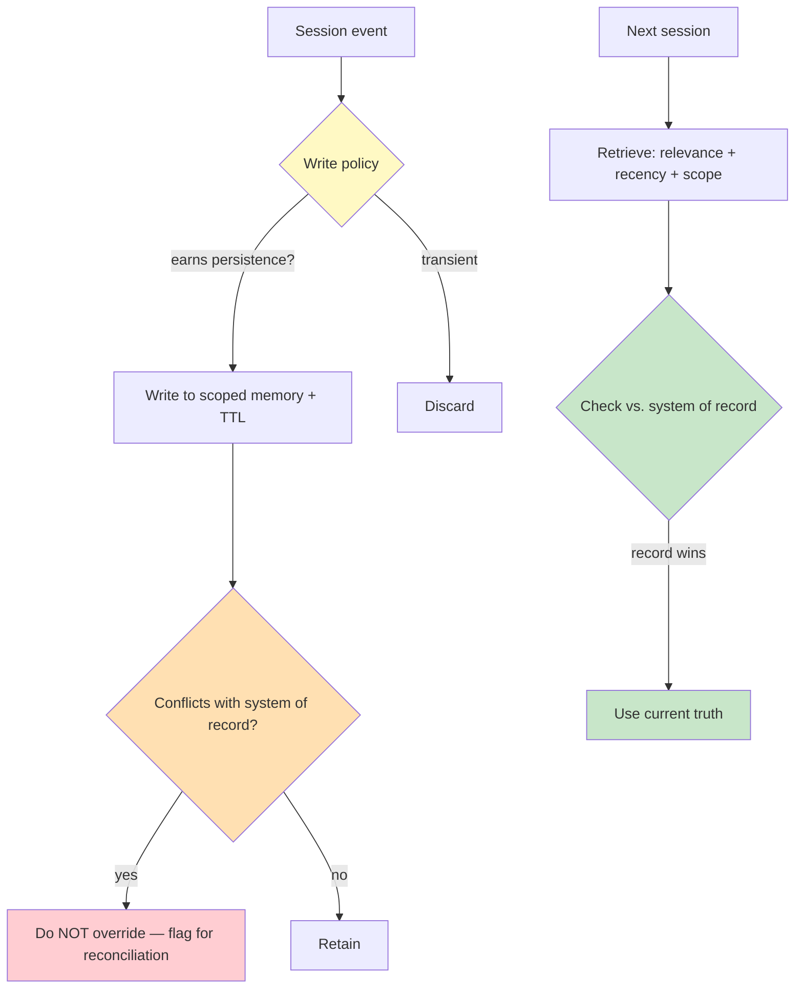

# Chapter 2.3 — Memory Architectures

*Part II — Agentic Building Blocks · Domain D2 · Reading time ~28 min · Prerequisites: Ch. 2.2*

## 1. The failure story

A wealth-management firm gave its client-service agent memory so it would stop asking returning clients the same onboarding questions. The implementation was the obvious one: after each session, summarize what was learned about the client and append it to a per-client memory store; on the next session, load that memory into context. It demoed as delightful — the agent greeted clients by name and recalled their stated risk appetite.

Four months later, a client named in the memory as "conservative risk tier, prefers capital preservation" had been formally reclassified in the firm's CRM to "aggressive" after a suitability review and a signed update. The CRM was the system of record; the reclassification was live and authoritative. But the agent's memory still held the four-month-old "conservative" note, loaded it into context, and — when the client asked about a higher-yield product — advised against it, citing the client's "preference for capital preservation." The memory had overridden the system of record. The agent was confidently, fluently wrong, and it was wrong in a regulated domain where suitability advice is legally consequential.

The numbers made it worse: the stale note had been loaded into 47 sessions across those four months, and in 9 of them it had shaped advice. Nobody caught it because memory writes were append-only and unreviewed — the "conservative" note had been written once, correctly, and then never expired, never reconciled against the CRM, never questioned. One true-once fact had become a standing lie with a four-month blast radius.

Nobody had asked the question that governs every memory system: *when stored memory disagrees with the system of record, which one wins — and who decided?*

**Memory is a cache of things that were true once, not a source of truth, so it needs a reconciliation gate that checks every stored fact against the system of record on read and lets the record win, plus a write policy, a scope partition, and a TTL that expires a true-once note before it becomes a standing lie.**

## 2. The mental model

### 2.1 A taxonomy, because "memory" is four different things

Conflating them is the root error. **Working memory** is the in-context state of the current session — transient, already covered by context engineering. **Episodic memory** records what happened (past interactions, events). **Semantic memory** holds facts and preferences (this client is risk-averse). **Procedural memory** holds learned how-tos (the steps that worked for a task). Each has different write triggers, retrieval rules, and expiry needs. A design that treats all four as one append-only log inherits the worst properties of each.

The reason the taxonomy is not academic is that the four types have opposite volatility profiles, and one storage policy cannot serve them all. Episodic memory is immutable by nature — what happened, happened, so its risk is bulk and relevance, not staleness; you compact it, you do not correct it. Semantic memory is exactly the opposite: a stored fact like a risk classification is *true as of a date* and can be silently invalidated by an event the memory never witnessed, which is precisely how the failure story's "conservative" note outlived its truth. Procedural memory has a third profile — a learned how-to is durable until the underlying tool or process changes, at which point the remembered steps become a confident recipe for a stale workflow. Treating these as one log means applying episodic memory's "never forget" instinct to semantic facts that must expire, and semantic memory's "latest wins" instinct to procedural knowledge that should be validated before reuse. The design starts by naming, for each thing the agent will remember, which of the four it is — because that answer determines whether the correct default is retain, expire, or re-verify.

### 2.2 Memory is a cache over truth, never truth itself

This is the doctrine the failure story violated. **Memory is a cache over the system of record; when the two disagree, truth wins by construction, and any architecture that lets a stored note override the live source of truth is not a memory system but a slow corruption of it.** A cache must have an invalidation story. Memory without expiry, without reconciliation against the source of truth, and without contradiction handling is not memory — it is an append-only diary that the agent mistakes for reality.

### 2.3 Write policy: what earns persistence

Not everything learned deserves to persist. A write policy answers: what earns a durable write (a stated, stable preference — not a one-off), who or what approves it (automatic for low-stakes, human-confirmed for consequential), and how a write that conflicts with the system of record resolves (it does not get to override; at most it flags for reconciliation). The absence of a write policy is why the failure story wrote "conservative" once and enshrined it forever.

### 2.4 Retrieval policy: what surfaces, scoped to whom

Stored memory must be retrieved with the same discipline as any knowledge (Ch. 2.2): relevance scoring so irrelevant notes do not crowd context, **recency weighting** so newer facts outrank older ones, and — critically — **scope isolation**. Memory is partitioned per-user, per-project, per-tenant, and a retrieval must never cross those boundaries. A memory system that can surface tenant A's notes to tenant B is a compliance incident, not a feature.

Scope isolation is a security boundary, which means it must be enforced in code at the retrieval path and tested with an explicit cross-tenant query, not assumed from correct usage. The failure mode is not a model that decides to leak; it is a retrieval function that scores by relevance across an unpartitioned store and happens to surface a neighboring tenant's note because it was semantically closest. Relevance and recency then interact with the **reconciliation gate**: a highly relevant but stale note can outrank the current truth on similarity alone, which is why recency weighting is not a nicety but part of how memory avoids re-committing the four-month lie. The retrieval contract is therefore three-layered — filter by scope first so cross-boundary results are structurally impossible, rank by relevance and recency within the scope, then reconcile the survivors against the system of record before any of them shapes an answer. Drop any layer and the store quietly promotes itself from cache toward authority.

### 2.5 Compaction and forgetting by design

Long-running agents accumulate context that must be compacted: turn-level compaction (summarize old turns), structured note-taking (extract durable facts to memory, drop the raw transcript), sub-agent scratchpads (isolate working memory that need not persist). And forgetting is a *designed* property: TTLs (time-to-live) so facts expire, user-initiated deletion (a GDPR obligation, not a nicety), and contradiction-triggered invalidation (a new fact that conflicts with a stored one invalidates the stored one). The failure story had no TTL and no contradiction trigger, so a stale fact lived indefinitely.

Forgetting feels like data loss and is actually correctness maintenance, which is why teams resist it and why the resistance is the bug. Every one of the three mechanisms answers a failure the append-only diary cannot: a TTL bounds how long a true-once fact is trusted before it must be re-confirmed, so "conservative, as of March" is not still being asserted in July; contradiction-triggered invalidation means the moment a session learns something that conflicts with a stored note, the stored note is flagged and the newer signal wins rather than both coexisting; and user-initiated deletion means an erasure request reaches derived memory, not just the primary row. The compaction side has a quieter trap — summarizing old turns into a durable note is itself a lossy write that can enshrine an error, because the summary is an interpretation, and an interpretation stored as a fact is a claim the agent will later treat as ground truth. So compaction inherits the write policy: a summary that touches a consequential attribute is a consequential write and needs the same gate as any other, not a free pass because it came from the agent's own transcript rather than a user statement.

*Yellow: the write gate. Orange/red: the reconciliation seam where a stored note is barred from overriding truth. Green: the source-of-truth check that current truth wins on read.*

The diagram has two gates for a reason: one on write, one on read, and skipping either is how memory drifts from cache toward authority. The write gate decides what earns persistence and bars a consequential note from being stored as fact without approval; the read gate reconciles whatever was stored against the live system of record before it shapes an answer, so even a note that slipped through write-time is caught at read-time by the rule that current truth wins the tie. The failure story had neither gate — it wrote "conservative" once, unreviewed, and read it back unreconciled for four months. A single one of these seams would have caught it: the write gate by flagging a suitability-touching write for confirmation, or the read gate by checking the note against the CRM before advising. Defense in depth here is cheap, because both gates are configuration and a comparison, not intelligence.

## 3. Production lens

**Memory is state, and state is governed.** Every durable write has an owner, a scope, a TTL, and a conflict rule. Append-only memory with none of these is the default path to the four-month lie. The reconciliation-against-source-of-truth check on read is the deterministic control that keeps memory a cache.

**Scope isolation is a security boundary.** Per-tenant partitioning must be enforced in code at retrieval, not assumed from correct usage. Test cross-tenant retrieval explicitly; a leak here is a breach.

**Deletion is an obligation with a deadline.** Under regimes like GDPR, a user's right to erasure includes derived memory, not just the primary record. If you cannot delete a fact from memory on request, you have built a compliance liability. (Deep treatment: Ch. 4.7 governance.)

**Memory can amplify sycophancy.** Stored "preferences" fed back each session can nudge the agent toward agreement over accuracy — telling the client what memory says they want to hear rather than what is currently suitable. Weight recency, reconcile against truth, and treat stored preferences as hints, not directives.

**Write provenance is a security property, not just a quality one.** A memory system with an open write path is a poisoning surface: a single erroneous or adversarial fact, once persisted, shapes every future session that retrieves it, and it does so invisibly because the note looks identical whether it was written from a verified user statement or injected through a compromised upstream input. This is the memory-specific face of the untrusted-content problem — content the agent ingests is data, not authority, and a fact it extracted from an untrusted document should not be granted the same durability as one a user confirmed. The controls are auditability and approval: every durable write carries its provenance so an influential memory can be traced to its source, and consequential writes require confirmation rather than silent persistence. The on-call signal is an anomalously influential memory — a single note shaping advice across many sessions — which in the failure story would have surfaced the "conservative" note's nine-session blast radius long before opposing counsel did.

> **Doctrine check.** The deterministic core of a memory system is the *reconciliation gate*: on every read, stored memory is checked against the system of record, and the record wins. That gate, plus the write policy, scope partition, and TTL, are code and configuration you own — the immutable frame around a fallible store. Verification cost is a memory-policy table (what/write-trigger/scope/TTL/conflict-rule) and a cross-tenant retrieval test. The design is wrong the moment stored memory can override the system of record, cross a tenant boundary, or persist past its usefulness without expiry — because then memory has quietly promoted itself from cache to truth.

## 4. Edge-case catalog

| # | Edge case | What it looks like | Detection | Mitigation |
|---|-----------|-------------------|-----------|------------|
| 1 | **Memory beats truth** | Stale risk tier overrides live CRM classification | Reconcile memory against system of record on read; flag disagreements | Reconciliation gate (record wins); TTL; contradiction-triggered invalidation |
| 2 | **Memory poisoning** | One erroneous/adversarial fact persisted, shapes all future sessions | Monitor write provenance; anomaly-detect influential memories | Write policy with approval; treat ingested content as untrusted (Ch. 3.5); auditable writes |
| 3 | **Cross-tenant leakage** | Tenant A's note surfaces for tenant B | Explicit cross-tenant retrieval tests; scope-tag every memory | Enforce scope partition in code at retrieval; per-tenant isolation |
| 4 | **Sycophancy / drift** | Stored preferences amplify agreement over accuracy | Track advice-vs-suitability divergence; audit preference-driven answers | Recency weighting; reconcile against truth; preferences as hints not directives |
| 5 | **Stale-memory conflict** | New fact contradicts stored fact; both retained | Contradiction detection between new and stored facts | Contradiction-triggered invalidation; recency precedence; surface conflict |
| 6 | **Undeletable memory** | Erasure request can't reach derived memory | Audit deletion coverage across all stores | User-initiated deletion propagating to memory; deletion tests (GDPR) |

## 5. Claude & MCP sidebar

Anthropic's context-engineering guidance frames the practical version of this chapter: manage what enters the context window deliberately, use compaction and structured note-taking to persist only durable facts, and give sub-agents isolated scratchpads so working memory does not leak upward. Lilian Weng's agent-memory taxonomy is the canonical source for the working/episodic/semantic/procedural split. In an MCP-based system, a memory store is typically exposed as a server (tools to read/write scoped memory, or resources the model can pull), which means every memory operation inherits the tool-design and supply-chain disciplines of Ch. 2.1 — scope the write tool's permissions, and never let a retrieval tool cross a tenant boundary. Any managed memory feature, its default retention behavior, and its deletion semantics are fast-moving facts to verify against docs.claude.com at study time. The durable doctrine is independent of any product: memory is a governed cache over truth, scoped and expiring, and the system of record always wins the tie.

## 6. Design exercise

Write the full memory-policy table for a wealth-management agent operating under GDPR, where the CRM is the immutable system of record. For each memory type the agent will keep (e.g., stated communication preference, prior-session summary, learned task procedure, risk classification), specify five columns: *what* is stored, the *write trigger* (and whether human approval is required), the *scope* (per-user/per-tenant), the *TTL*, and the *conflict rule* when it disagrees with the CRM. Then state where the reconciliation gate sits and how a client's erasure request propagates to every derived memory.

*Options:* CRM wins · Memory wins · Flag for reconciliation · Per-user · Per-tenant · Short TTL (days) · Medium TTL (weeks) · Long TTL (months) · No caching — live only · Human approval required · Automatic write

*Check:*

| Item | Answer | Why |
|---|---|---|
| Conflict rule — risk classification | No caching — live only | Risk classification is a suitability-consequential fact owned by the CRM; storing it at all creates the four-month-lie scenario from §1, so it must never be cached. |
| Conflict rule — stated communication preference | CRM wins | Communication preference is semantic memory that can be updated in the CRM; on disagreement the record is authoritative and the stored note must be flagged, not obeyed. |
| Conflict rule — prior-session summary | Flag for reconciliation | Episodic memory records what happened and is immutable by nature, so a conflict with the CRM signals a data-integrity anomaly to surface rather than silently resolve. |
| Conflict rule — learned task procedure | Flag for reconciliation | Procedural memory is durable until the underlying process changes; a conflict means the procedure may reflect a stale workflow, so it must be flagged and re-verified before reuse. |
| Write trigger — risk classification | No caching — live only | Because risk classification must never be cached, there is no write trigger; every read sources it live from the CRM. |
| Write trigger — stated communication preference | Human approval required | Communication preference is consequential enough to require a confirmed user statement before persistence, not an automatic extraction from unreviewed session content. |
| Scope — stated communication preference | Per-user | Communication preference belongs to one client; surfacing it across other users or tenants would be a scope-isolation breach. |
| Scope — prior-session summary | Per-user | Session history is tied to an individual client and must never cross tenant boundaries, consistent with the retrieval-path isolation doctrine in §2.4. |
| TTL — stated communication preference | Long TTL (months) | Preferences are stable semantic facts but not permanent; a months-long TTL forces periodic re-confirmation before the note can become a standing lie. |
| TTL — prior-session summary | Medium TTL (weeks) | Session summaries have episodic relevance that decays; a weeks-long TTL compacts the store and prevents old context from crowding newer, more relevant signal. |
| TTL — learned task procedure | Long TTL (months) | Procedures are durable until the underlying tool or process changes; a months-long TTL forces re-verification on a cadence that catches workflow drift. |

*Sample solution:* A complete memory-policy table for the wealth-management agent, grounded in the chapter's four-type taxonomy, write-gate/read-gate doctrine, and GDPR erasure obligations.

**Memory-policy table**

| Memory type | What is stored | Write trigger | Scope | TTL | Conflict rule |
|---|---|---|---|---|---|
| Risk classification | — (not stored) | No write — sourced live from CRM on every read | Per-user (read-path only) | No caching — live only | No caching — live only: agent always reads directly from CRM; storing a copy at any TTL recreates the four-month lie |
| Stated communication preference | Client's preferred contact channel and format, as explicitly confirmed | Client's confirmed spoken or written statement; human approval required before persistence | Per-user | Long TTL (months); re-confirmation required at renewal | CRM wins: if CRM record differs from stored note, note is flagged for reconciliation and the CRM value is used |
| Prior-session summary | Compacted summary of completed session (topic, actions taken, open items) | End-of-session automatic compaction; consequential attributes (suitability-touching) require write-gate review before persistence | Per-user | Medium TTL (weeks); older summaries compacted further or expired | Flag for reconciliation: episodic record is immutable in nature; a conflict with CRM surfaces as a data-integrity anomaly, not a silent override |
| Learned task procedure | Steps and tool sequence that succeeded for a class of task | Automatic write after verified task completion; procedure touching regulated workflow requires human approval | Per-tenant | Long TTL (months); invalidated immediately on tool or process change detected | Flag for reconciliation: a conflict means the underlying process may have changed; procedure is suspended and queued for re-verification before reuse |

**Where the reconciliation gate sits**

The chapter establishes two gates: one on write, one on read. For this agent:

- The **write gate** sits at the memory-write path immediately after session events are classified by type (§2.3). It checks whether the candidate fact is suitability-consequential and, if so, either bars persistence entirely (risk classification) or requires human confirmation (stated preference). It also checks whether the candidate conflicts with the CRM and, if so, bars the write and flags for reconciliation rather than letting memory override the record.
- The **read gate** sits at retrieval, before any stored fact shapes an answer (§2.4). It runs the three-layer retrieval contract: filter by scope first (cross-user/cross-tenant results are structurally impossible), rank by relevance and recency within scope, then check survivors against the CRM. Any note that conflicts with the live CRM is replaced by the CRM value; the note is flagged. Risk classification bypasses stored memory entirely at this gate — it is always fetched live.

**How an erasure request propagates**

Under GDPR, a client's right to erasure extends to all derived memory, not just the primary CRM record (§3, "Deletion is an obligation with a deadline"). The propagation path:

- The erasure request is received and logged with a deadline timestamp.
- The deletion job iterates every scoped memory store partitioned to that user (stated preferences, session summaries, any procedural notes tagged to the user).
- Each store confirms deletion and returns a receipt; the job is not complete until all stores confirm.
- Any compacted summary that contains the client's data is also deleted or re-compacted with the client's facts removed.
- The deletion event is written to the audit log with store-by-store confirmation and timestamp, allowing a reviewer to verify completion within the required window.
- If any store cannot confirm deletion (e.g., a backup not yet pruned), it is flagged as a compliance gap requiring escalation rather than silently skipped.

*Review standard:* the table passes if no row permits stored memory to override the CRM; if every consequential write (anything touching suitability) requires human confirmation or is barred from persistence; if every row has a scope and a TTL — no indefinite retention; if a risk classification is explicitly sourced live from the CRM rather than cached; and if a reviewer can trace an erasure request to deletion in every store within the required window. A row with "TTL: none" or "conflict rule: memory wins" fails.

## 7. Self-test — judge each claim, justify in one sentence

1. "Memory should be append-only so we never lose information."
2. "If a fact was true when we stored it, it's safe to reuse later."
3. "Per-tenant isolation is a usage convention we can enforce in review."
4. "Storing user preferences makes the agent more helpful, full stop."
5. "Deleting the primary record satisfies a user's right to be forgotten."

*(Answers are argued, not looked up: 1-false — append-only with no expiry or reconciliation lets a true-once fact become a standing lie, so forgetting must be designed; 2-false — facts have volatility, so a stored fact needs a TTL and a reconciliation check against the current source of truth; 3-false — scope isolation is a security boundary that must be enforced in code and tested, because review cannot catch every retrieval path; 4-partly-false — stored preferences can amplify sycophancy and override current suitability, so they must be hints reconciled against truth, not directives; 5-false — erasure obligations extend to derived memory, so deletion must propagate to every store, not just the primary record.)*

## 8. Spaced-review card *(re-answer in 7 days, from memory)*

- Name the four memory types and one distinct write-or-expiry rule for each.
- State the cache-over-truth doctrine and describe where the reconciliation gate sits in the read path.
- List the three forgetting-by-design mechanisms and the obligation (compliance or correctness) each satisfies.

---

*Next: Chapter 2.4 — Control Loops, Planning & Termination, where an agent ping-pongs between two tools for 340 turns because nobody set a budget — the loop discovered not by a monitor but by the invoice.*
