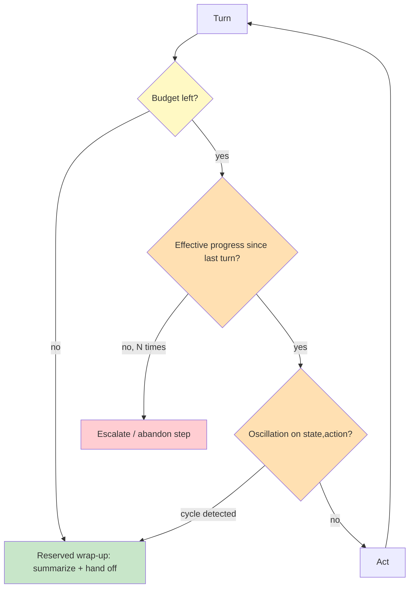

# Chapter 2.4 — Control Loops, Planning & Termination

*Part II — Agentic Building Blocks · Domain D2 · Reading time ~28 min · Prerequisites: Ch. 2.3*

## 1. The failure story

A research agent was built to answer analyst questions by searching, reading, and synthesizing. It used a simple reasoning loop: think, act, observe, repeat until done. "Done" was defined as "the model decides it has enough." For most questions it finished in six to ten turns. Then it met a question whose answer genuinely did not exist in the available sources.

Unable to find the answer, the agent did what an unbounded loop does: it kept trying. It called a web-search tool, read results that hinted the answer might be in a database, called a database tool, got results that hinted it might be on the web, and went back to search. Each tool's output was just plausible enough to justify trying the other. It oscillated between the two tools for 340 turns over 26 minutes, burning roughly $47 in tokens on a single query with a nominal budget of about $0.30. No monitor fired, because nothing had *errored* — every call returned 200, every turn looked like progress. The loop was discovered the next morning by a finance analyst reviewing an anomalous line on the API invoice.

The postmortem's first instinct was to blame the model for "not knowing when to stop." But the model was never given a way to stop that did not depend on its own judgment, and its judgment was exactly what the hard question had defeated. There was no turn cap, no cost ceiling, no oscillation detector, no notion of "effective progress." Termination had been left as an emergent hope rather than a designed property.

Nobody had asked the question that governs every agent loop: *what are the budgets, the gates, and the detectors that force this loop to stop, and does it reserve enough fuel to wrap up gracefully when they trip?*

## 2. The mental model

### 2.1 The loop family you choose is a design decision

Agent loops are not one thing. **ReAct** interleaves reasoning and acting turn by turn — flexible, the default, and the most prone to wandering. **Plan-then-execute** separates a planning phase from execution — more controllable, weaker when the plan meets surprise. **Reflection / self-critique** has the agent evaluate and revise its own output — powerful and dangerous, because a bad critique can overwrite a good answer. **Evaluator-in-the-loop** adds a separate judge. **Search over plans** explores multiple candidate plans. And **extended-thinking budgets** let a model reason longer before acting, trading tokens for depth. Choosing among these is choosing a cost surface and a failure surface, not a style.

The choice maps to task shape. ReAct fits open-ended tasks where the next action genuinely depends on what the last one returned — research, debugging, anything where the path cannot be known in advance — and it pays for that flexibility with the highest wandering risk, because nothing structurally stops it from exploring forever. Plan-then-execute fits tasks whose shape is knowable up front — a multi-step migration, a known reconciliation sequence — and trades adaptability for control, which is a good trade until execution surprises the plan and the agent keeps executing a plan the world has already invalidated. Reflection fits tasks where a first draft is genuinely improvable by critique — writing, code — but carries the specific danger that critique is itself model output and can be wrong, so an unbounded reflection loop can talk itself out of a correct answer one "improvement" at a time. The meta-point is that the failure story chose ReAct by default, for a task whose hardest input was a genuinely unanswerable question, and never asked what would stop a flexible loop when flexibility became thrashing. The loop family is a decision with a cost and failure profile you should be able to state before you pick it, not a framework default you inherit.

### 2.2 Termination is designed, not discovered

**Termination is a property you design into the loop with explicit budgets, gates, and detectors; an agent that can only stop when it decides it is done cannot be trusted to stop at all, because the hardest inputs are exactly the ones that defeat that judgment.**

The controls are concrete. **Max turns** and **token/cost budgets** are hard ceilings. **Confidence gates** stop when evidence is sufficient. **Progress metrics** stop when state stops changing. **Deadlock and oscillation detectors** catch the ping-pong before the invoice does. None of these depend on the model volunteering to quit.

### 2.3 Detecting the pathologies of a loop

Three loop pathologies recur. **Oscillation** — A/B tool ping-pong — is caught by cycle detection on (state, action) signatures: if the agent revisits the same state-action pair, it is looping, not progressing. **Sunk-cost retrying** — repeating a failed call with cosmetic variations — is caught by an escalate-after-N policy: after N failed attempts at a step, stop retrying and escalate or abandon. **Progress illusion** — burning tokens without changing state — is caught by measuring **effective progress** (did the world model actually advance?) rather than turn count, which always advances.

What unites the three is that none of them *errors* — every call returns cleanly, every turn looks like work, and that is exactly why a monitor watching for failures never fired in the failure story. The detectors have to watch for the absence of progress, not the presence of error, which is a different and less instinctive kind of instrumentation. Oscillation detection is cheap: hash the (state, action) pair each turn and flag a revisit, because an agent that returns to a state it has already acted on from is by definition not advancing. Effective-progress measurement is subtler because it requires a notion of state the runtime can compare across turns — a knowledge agent's state might be "facts gathered," a coding agent's might be "tests passing" — and the discipline is to define that signature explicitly so a flat state signature across rising turns becomes an alertable signal rather than an invisible burn. The escalate-after-N rule guards the third face, sunk-cost retrying, where the agent repeats a doomed call with cosmetic tweaks because each failure looks locally recoverable; the fix is not a smarter model but a hard count that says after N attempts at one step, the step is abandoned or escalated, no matter how confident the next retry feels.

### 2.4 Plans go stale

A plan made at turn one assumes a world that execution changes. **Plan staleness** means a committed plan no longer fits reality; **replanning triggers** (a failed step, a surprising result, a crossed sub-budget) tell the agent when to stop executing and re-plan. The tension is committing (cheap, brittle) versus exploring (robust, expensive); the design names when to switch.

The trap is that both extremes fail, in opposite ways. An agent that never replans executes a stale plan off a cliff — it keeps following step four when step three returned a result that invalidated the whole approach, because the plan is a commitment it was never told to reconsider. An agent that replans on every surprise never converges — it thrashes, discarding progress each time a minor result differs from expectation, and pays plan-generation cost on every turn. The design's job is to name the triggers precisely: replan on a failed step, on a result that contradicts a plan assumption, or on a crossed sub-budget, but *not* on ordinary variation the plan can absorb. That specificity is what separates a robust loop from a brittle one and from a thrashing one. It also connects back to loop family: plan-then-execute buys control by committing early, so it needs explicit replanning triggers most, while ReAct replans implicitly every turn and needs the opposite guard — something to stop it from re-deciding a settled direction. The control you add depends on which failure your chosen loop family is prone to.

### 2.5 Always leave fuel to land

Budgets must *propagate*: a parent task's budget flows to its sub-tasks, so a child cannot spend the parent into bankruptcy. And every budget reserves a margin for graceful wrap-up — the "always leave fuel to land" rule. An agent that spends its entire budget attempting the task and none summarizing what it found, or handing off cleanly, fails twice: no answer and no usable partial.

*Yellow: the budget ceiling. Orange: the progress and oscillation detectors. Red: the escalate path. Green: the reserved wrap-up that always leaves fuel to land.*

Every gate in the diagram sits outside the model's judgment, and that is the whole design. The budget ceiling, the progress check, the oscillation detector, and the reserved wrap-up are runtime logic the model cannot argue with — they fire whether or not the model believes it is making progress, which matters precisely because the inputs that trip them are the ones that have defeated the model's own sense of when to stop. Read the flow as a series of questions asked *about* the loop rather than *by* it: is there budget left, has state advanced, is this a state we have already acted on — each answered by code holding a signature or a counter, none answered by asking the model whether it feels done.

## 3. Production lens

**A loop without a cost ceiling is an uncapped liability.** The $47 query is not an outlier; it is what any unbounded loop does on its worst input. Every agent task carries a hard token/cost budget and a max-turn cap, enforced by the runtime, not the model.

**Detectors are cheap insurance against expensive tails.** Oscillation detection on (state, action) signatures and escalate-after-N on repeated failures are a few lines of runtime logic that cap the worst case. They pay for themselves the first time a hard input arrives.

**Effective progress, not turn count, is the health metric.** Monitor whether state advances, not whether turns accumulate. A rising turn count with a flat state signature is the invoice-surprise signature; alert on it.

**Reflection needs a freeze rule.** Self-critique loops can degrade a correct answer by "improving" it into a wrong one. Cap reflection iterations and freeze when the critique stops finding substantive faults, so the loop cannot talk itself out of a right answer.

**Budgets must propagate, or a child bankrupts the parent.** A sub-task spawned mid-loop inherits a slice of the parent's remaining budget, not a fresh one — otherwise a decomposition into ten children each with the parent's full ceiling multiplies the bill by ten while every individual loop looks well-behaved. The runtime threads the remaining budget down so a child cannot spend money the parent has already committed, and reserves a wrap-up margin at every level so even a task that hits its ceiling produces a summary or clean handoff rather than a silent stop. This is the "always leave fuel to land" rule made operational: the worst outcome is not an agent that fails to finish, it is one that spends its entire budget attempting and has nothing left to tell you what it found or where it stopped, so you pay full price for zero usable output. Decide the partial-result behavior before launch — on a hit ceiling, does the task ship what it has, retry a bounded amount, or escalate — because deciding it during the incident means deciding it while the invoice runs.

> **Doctrine check.** The deterministic core of a control loop is the *termination policy*: hard budgets, progress and oscillation detectors, an escalate-after-N rule, and a reserved wrap-up margin — all enforced by the runtime, outside the model's judgment. That policy is code you own; the model reasons inside it. Verification cost is a budget config plus a few detector checks, tested against a deliberately unanswerable input. The design is wrong the moment the only thing that can stop the loop is the model deciding it is finished — because the inputs that matter most are the ones that defeat that decision.

## 4. Edge-case catalog

| # | Edge case | What it looks like | Detection | Mitigation |
|---|-----------|-------------------|-----------|------------|
| 1 | **Oscillation / tool ping-pong** | 340 turns alternating two tools, each result justifying the other | Cycle detection on (state, action) signatures | Oscillation detector → wrap-up; max-turn cap |
| 2 | **Sunk-cost retrying** | Same failed call repeated with cosmetic tweaks | Count repeated failures at a step | Escalate-after-N policy; abandon-and-report |
| 3 | **Progress illusion** | Tokens burn, world state unchanged | Track effective progress (state delta) vs. turn count | Progress metric gate; alert on flat-state token burn |
| 4 | **Reflection degradation** | Self-critique overwrites a correct answer | Compare pre/post-reflection quality on evals | Cap reflection iterations; freeze rule when no substantive fault |
| 5 | **Plan staleness** | Committed plan no longer fits reality | Detect failed/surprising steps vs. plan | Replanning triggers; commit-vs-explore switch |
| 6 | **Budget starvation at wrap-up** | Entire budget spent attempting; no summary or handoff | Monitor budget remaining at termination | Reserve wrap-up margin; propagate parent budget to children |

## 5. Claude & MCP sidebar

Claude's agentic loops are built on the tool-use cycle of Ch. 1.3, and extended-thinking budgets let the model reason longer before acting — a lever you set, and therefore a cost you control. The canon here is deliberately held at arm's length: ReAct and Reflexion are *pattern sources*, not gospel — useful vocabulary, not architectures to copy verbatim — and 12-Factor Agents' insistence on *owning your control flow* is the operational spine of this chapter. Anthropic's agent-loop guidance describes the practical shape of budgets, gates, and wrap-up. Whatever the runtime, the termination policy is yours to enforce outside the model: the platform gives you turn and token accounting, but the max-turn cap, the oscillation detector, and the reserved wrap-up margin are things you build. Confirm current extended-thinking controls and any built-in loop limits against docs.claude.com at study time; the durable lesson is that you own control flow, and termination is a property you design, not a behavior you hope the model exhibits.

## 6. Design exercise

Specify the complete termination policy for a research agent with a hard cost ceiling of $2 per task and a 5-minute latency SLO. Define: the hard budgets (turns, tokens, cost, wall-clock) and how they are enforced; the confidence gate that lets it stop early when evidence suffices; the oscillation detector (what constitutes a (state, action) cycle) and the escalate-after-N threshold for repeated failures; the effective-progress metric that distinguishes real advancement from token burn; and the reserved wrap-up margin — how much budget is held back so the agent always produces a summary or clean handoff even when it hits a ceiling.

*Review standard:* the policy passes if no single input can drive cost past $2 or latency past 5 minutes regardless of the model's judgment; if oscillation and sunk-cost retrying are caught by detectors, not by the model noticing; if "progress" is measured as state change, not turn count; and if a deliberately unanswerable question still yields a graceful "here's what I found and why I stopped" rather than a silent budget burn. A policy whose only stop condition is "the model decides it's done" fails.

## 7. Self-test — judge each claim, justify in one sentence

1. "A well-prompted agent will know when to stop, so budgets are a backstop we rarely need."
2. "More turns means more progress."
3. "Reflection always improves the answer."
4. "A max-turn cap is sufficient termination design."
5. "It's fine to spend the whole budget on the task itself."

*(Answers are argued, not looked up: 1-false — the hardest inputs defeat the model's stop judgment precisely when it matters, so runtime budgets are primary, not backstop; 2-false — turns can accumulate with zero state change, so effective progress, not turn count, measures advancement; 3-false — self-critique can overwrite a correct answer, so reflection needs an iteration cap and a freeze rule; 4-partial — a turn cap bounds runaway length but misses oscillation, sunk-cost, and wrap-up starvation, so it is necessary but not sufficient; 5-false — spending everything on the attempt leaves no fuel to summarize or hand off, so a wrap-up margin must be reserved.)*

## 8. Spaced-review card *(re-answer in 7 days, from memory)*

- List the termination controls (max turns, cost budget, confidence gate, progress metric, oscillation/deadlock detection) and what each catches.
- Explain effective progress versus turn count, and why the distinction prevents the invoice-surprise loop.
- State the "always leave fuel to land" rule and how budget propagation keeps a child task from bankrupting the parent.

---

*Next: Chapter 2.5 — Orchestration Topologies, where a fan-out of 60 parallel sub-agents each re-fetches the same 20K-token corpus — the task succeeds and the unit economics die.*
