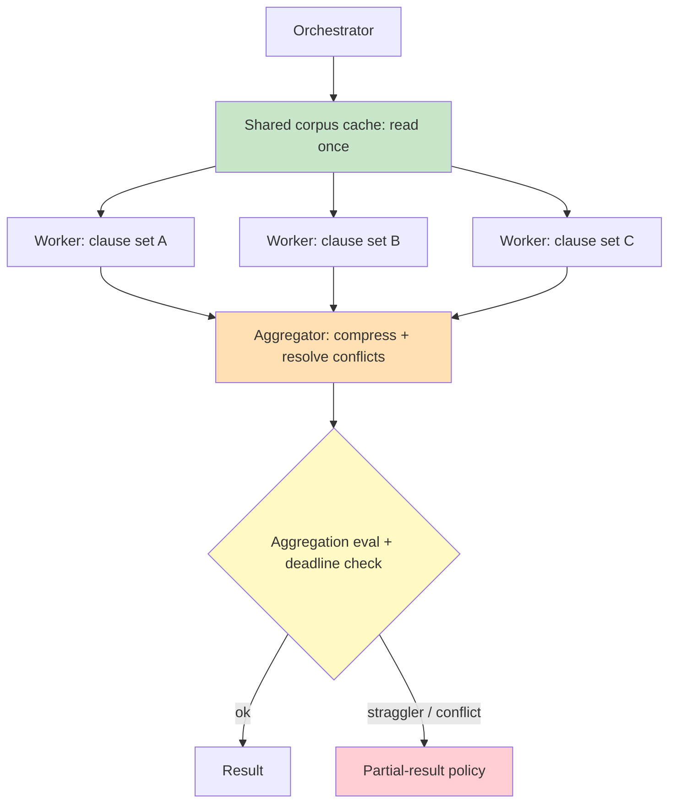

# Chapter 2.5 — Orchestration Topologies

*Part II — Agentic Building Blocks · Domain D2 · Reading time ~28 min · Prerequisites: Ch. 2.4*

## 1. The failure story

A team built a document-analysis agent to extract obligations from a 20,000-token master services agreement across every clause type. To go fast, they fanned out: an orchestrator spawned 60 parallel sub-agents, one per clause category, each tasked with finding its category's obligations. It was fast, and it was correct — the extraction quality was excellent, and the whole job finished in under a minute of wall-clock time.

Then the bill arrived. Each of the 60 sub-agents had been handed the *entire* 20,000-token contract as context, because that was the simplest way to make sure none of them missed anything. Sixty sub-agents times 20,000 tokens is 1.2 million input tokens per document, before any output, before the orchestrator's own overhead. At an illustrative input price of ~$3 per million tokens (verify at study time), that is ~$3.60 per document just in redundant corpus re-reading — for a task a single well-prompted pass could do for a fraction of it. At 50,000 documents a month, the fan-out design cost ~$180,000 where a shared-context or sectioned design would have cost a small multiple of a single read. The task succeeded on every quality metric and failed completely on unit economics.

The deeper problem was that nobody had chosen the topology deliberately. "Fan out to go fast" was a reflex, not a decision. No one had asked what each worker actually needed to see, whether the corpus could be read once and shared, or whether 60 workers was even the right decomposition versus, say, 6 workers each handling 10 related clause types with a shared cache. The topology had been inherited from the first idea that worked in a demo.

Nobody had asked the question that governs multi-agent design: *what is this topology's cost surface, its failure surface, and its aggregation semantics — and does the task's structure actually justify the parallelism we're paying for?*

## 2. The mental model

### 2.1 The topology catalog is a menu of trade-offs

Each pattern maps to a task structure and carries a distinct cost and failure profile. *Chaining* (sequential steps) is simple and cheap, fails by propagating an early error downstream. *Routing* (classify, then dispatch to a specialist) is efficient, fails when the router misclassifies. *Parallel sectioning* (split independent sub-tasks, run concurrently) is fast, fails on cost if workers duplicate work. *Parallel voting* (run the same task N ways, aggregate) buys reliability with N× cost. *Orchestrator–workers* (a lead decomposes and delegates dynamically) is flexible, fails at the aggregator. *Evaluator–optimizer* (generate, critique, refine) improves quality, risks the reflection-degradation trap of Ch. 2.4. *Hierarchical delegation* (workers spawn workers) scales, risks uncontrolled fan-out cost.

The catalog is ordered by escalating cost and coordination, and the discipline is to reach for the cheapest pattern the task actually admits rather than the most impressive one. Chaining is the right answer far more often than teams expect — many "agentic" tasks are a fixed sequence of steps wearing a fashionable name, and a chain is cheaper to run, easier to debug, and impossible to fan-out-explode. Routing earns its place when a task splits cleanly into specialist lanes, and its whole reliability rests on one component, the router, whose misclassification silently sends the task to the wrong expert. Parallel sectioning is justified only when sub-tasks are genuinely independent *and* the shared input can be read once, because the moment every worker needs the same corpus, the parallelism you bought for speed becomes the duplicate-context cost that killed the failure story. Voting buys reliability at a literal N× multiple and is defensible only where a wrong answer is expensive enough to justify paying N times for consensus. The single most common orchestration mistake is escalating up this ladder for a task whose structure did not require it — choosing orchestrator–workers because it sounds capable, when the task was a chain.

### 2.2 Topology is chosen from task structure, not speed reflex

**A topology is a cost surface and a failure surface before it is a performance trick; you choose it from the task's actual structure — independence, need for consensus, decomposability — not from the instinct that parallel is faster.** The failure story parallelized a task whose structure did not require handing every worker the whole corpus. The right question is what each worker *must* see, and whether the shared input can be read once.

### 2.3 Context strategy per topology

The most expensive multi-agent mistake is duplicated context. For each topology, decide what each worker sees: *isolation* (each worker gets only its slice — cheap, risks missing cross-cutting context) versus *shared context* (workers share a read — richer, needs a shared cache to avoid re-fetching). And decide *result compression on the way up*: workers should return compressed, decision-relevant results to the aggregator, not raw dumps, or the aggregator's context explodes. Sixty workers each returning 5,000 tokens is a 300,000-token aggregation problem.

Context strategy has two directions and both leak cost if left undesigned. On the way *down*, the question is what each worker must see to do its job — and the failure story's fatal answer was "the whole corpus, to be safe," which turned one 20K-token read into sixty. The corrective is a read-once shared cache: the corpus is fetched a single time, and workers reference it rather than each re-fetching it, so the input cost is the corpus plus per-worker slices, not the corpus times the worker count. Where workers truly need only their slice, isolation is cheaper still. On the way *up*, the mirror-image trap is the result dump: a worker that returns its raw 5K-token working output instead of a compressed, decision-relevant summary pushes its context cost onto the aggregator, and N workers doing so rebuild a giant context at exactly the point where the system can least afford it. The rule is that workers compress before they return — the aggregator should receive findings, not transcripts — and a worker's output contract is part of the topology design, not an afterthought. State the total token bill as workers × per-worker context in both directions before launch; if you cannot, the topology's economics are unowned.

### 2.4 Synchronous versus ambient agents

Not every agent runs while a user waits. *Synchronous* agents answer in real time. *Ambient / async* agents run in the background: queue-driven (process items off a queue), cron (scheduled), inbox-pattern (react to incoming events). These need *deadline and cancellation propagation* — a parent timeout must reach and stop straggler workers, and a cancelled job must not leave orphaned sub-agents burning budget.

### 2.5 Aggregation is where intelligence concentrates and fails

Merging parallel results is its own design problem: conflict resolution (workers disagree), quorum/voting rules (how many must agree), and the fact that the aggregator is a *single point of intelligence failure* — if it merges badly, excellent worker outputs produce a wrong final answer. Aggregation logic deserves its own evaluation, not a trusting `join`.

The aggregator is where the whole topology's intelligence concentrates, and therefore where it most quietly fails. Parallelism spreads the work across workers but funnels the judgment back through a single merge step, so a system can have fourteen correct worker analyses and one flawed reconciliation and ship a wrong number with full confidence — the parallel work beneath a bad merge is not just wasted, it is actively hidden, because each worker's correctness makes the final answer look well-supported. This is why the aggregation stage needs its own evaluation on exactly the cases that stress it: workers that disagree, workers that return partials, workers whose outputs double-count the same underlying fact. The merge rules must be explicit — which source wins a conflict, how many workers must agree to accept a value, how a double-count is detected and collapsed — and they must be tested as their own component, not trusted as a mechanical join of results that "should" combine cleanly. An orchestration that fans out to fourteen workers and reunites them through an unevaluated merge has moved its single point of failure, not removed it.

*Green: the read-once shared cache that kills duplicate-fetch cost. Orange: the aggregator, the single point of intelligence failure. Yellow/red: the eval-and-deadline gate and its partial-result fallback.*

Read the diagram as the correction to the failure story, element by element. The green shared cache is what the sixty-worker design lacked: read the corpus once, let workers reference it, and the input bill collapses from corpus-times-workers to corpus-plus-slices. The orange aggregator is where judgment reconcentrates after fanning out, so it carries its own eval rather than a trusting join. The yellow-and-red gate is the part every fan-out design forgets until the incident: a deadline check that stops stragglers and a partial-result policy that decides, before launch, whether a task with two failed workers ships the twelve, retries the two, or blocks. The topology is not the flowchart of who runs in parallel; it is the contract for what each worker sees, how results compress upward, how conflicts resolve, and what happens when a worker fails — and that contract is code you own, not a property parallelism gives you for free.

## 3. Production lens

**Fan-out multiplies cost before it multiplies speed.** Every parallel worker is a full inference with its own context. Before fanning out, compute the token bill: workers × per-worker context. If the same corpus is handed to every worker, a shared cache or a sectioned design is almost always the right answer. Duplicate-work elimination (shared caches, work claims so two workers don't do the same job) is a first-order cost control.

**The aggregator needs its own eval.** Worker quality does not guarantee merged quality. Test the aggregation stage on cases where workers conflict or return partials; a bad merge silently wastes all the parallel work beneath it.

**Deadlines must propagate or stragglers bankrupt you.** A parent timeout that does not reach the workers leaves them running past the point anyone is waiting. Define a partial-result policy: if 2 of 14 workers fail or time out, does the task ship the 12, retry the 2, or fail? Decide before launch, not during the incident.

**Router misclassification cascades.** A routing topology is only as good as its router; a misclassification sends the task to the wrong specialist and the error compounds downstream (bridge to model routing, Ch. 4.5). Monitor router accuracy as a first-class metric, and gate low-confidence routes to a fallback or human rather than committing them to a specialist the router is only marginally sure about, because a confident wrong route is more expensive than an admitted uncertain one.

> **Doctrine check.** The deterministic core of an orchestration is the *decomposition-and-aggregation contract*: what each worker sees (isolation vs. shared cache), how results compress on the way up, how conflicts resolve, and what happens when workers fail or time out. That contract — and the shared cache, work-claim, and deadline-propagation machinery — is code you own; the workers reason inside it. Verification cost is a token-budget calculation per topology and an aggregation-stage eval. The design is wrong the moment you cannot state the task's total token cost as workers × context, or the moment a worker failure has no defined partial-result policy — because then the topology's economics and reliability are both unowned.

## 4. Edge-case catalog

| # | Edge case | What it looks like | Detection | Mitigation |
|---|-----------|-------------------|-----------|------------|
| 1 | **Fan-out cost explosion** | 60 workers each re-fetch a 20K-token corpus | Compute workers × per-worker context; monitor tokens/task | Shared corpus cache; sectioned decomposition; duplicate-work elimination |
| 2 | **Aggregator failure** | Good worker outputs merged into a wrong answer | Aggregation-stage evals on conflict/partial cases | Explicit conflict-resolution + quorum rules; test the merge |
| 3 | **Deadline / straggler** | Parent times out; workers keep running | Track worker completion vs. parent deadline | Deadline + cancellation propagation; partial-result policy |
| 4 | **Router misclassification** | Wrong specialist handles the task | Monitor router accuracy; audit misroutes | Confidence-gated routing; fallback/human on low confidence (Ch. 4.5) |
| 5 | **Result-dump aggregation** | Workers return raw 5K-token payloads; aggregator context explodes | Monitor tokens returned per worker | Result compression on the way up; return decision-relevant only |
| 6 | **Orphaned sub-agents** | Cancelled job leaves children burning budget | Detect running children with no live parent | Cancellation propagation; parent-linked lifecycles; budget propagation (Ch. 2.4) |

## 5. Claude & MCP sidebar

Anthropic's *Building Effective Agents* is the canonical catalog for these patterns — chaining, routing, parallelization, orchestrator–workers, evaluator–optimizer — and its guidance is to prefer the simplest topology the task admits, escalating to multi-agent only when the structure genuinely requires it. Anthropic's multi-agent research-system write-up is the production companion: it documents exactly the cost and coordination lessons in this chapter, including that multi-agent systems can spend many times the tokens of a single agent and are justified only when the task's value and parallel structure warrant it. In an MCP-based system, workers and orchestrators share tools through the same server topology of Ch. 2.1, so a shared cache and least-privilege scoping apply across the whole fleet. Confirm any managed sub-agent or orchestration primitives, and their default context-sharing and cancellation behavior, against docs.claude.com at study time. The durable doctrine: match topology to task structure, read shared inputs once, compress results upward, and give the aggregator both an eval and a partial-result policy.

## 6. Design exercise

Pick and justify a topology for a quarterly-close variance analysis across 14 subsidiaries, where each subsidiary's ledger is independent but the final report must reconcile them against a group consolidation. Specify: the topology and why the task's structure selects it; what context each worker sees (per-subsidiary isolation vs. shared group data, and whether the group consolidation is read once and shared); the aggregation rules that merge 14 variance analyses into one report, including how conflicts or double-counts resolve; and the failure policy when 2 of the 14 workers fail — ship 12, retry 2, or block.

*Review standard:* the design passes if the total token cost is stated as workers × context and justified against a single-pass baseline; if no worker is handed data it does not need; if the aggregation stage has explicit conflict/double-count rules and its own eval rather than a trusting merge; and if the 2-of-14-failure case has a defined, defensible policy (not "it'll probably be fine"). A design that fans out because parallel "feels faster" without a token-budget justification fails.

## 7. Self-test — judge each claim, justify in one sentence

1. "Parallelizing a task with more sub-agents makes it faster and therefore better."
2. "If every worker produces good output, the final answer will be good."
3. "Giving each worker the full corpus is the safe default so nothing is missed."
4. "A parent timeout automatically stops the workers."
5. "Routing is free because it just sends the task to the right place."

*(Answers are argued, not looked up: 1-false — each worker is a full-cost inference, so fan-out multiplies token cost and can destroy unit economics even when it improves latency; 2-false — the aggregator is a single point of intelligence failure that can merge good outputs into a wrong answer, so it needs its own eval; 3-false — handing every worker the whole corpus is the duplicate-context mistake that killed the failure story's economics, so isolation or a shared cache is usually right; 4-false — deadlines must be explicitly propagated and workers explicitly cancelled, or stragglers run past the parent; 5-false — a router can misclassify and cascade the error to the wrong specialist, so router accuracy is a first-class monitored metric.)*

## 8. Spaced-review card *(re-answer in 7 days, from memory)*

- List the topology catalog (chaining, routing, parallel sectioning, voting, orchestrator–workers, evaluator–optimizer, hierarchical) and one failure mode of each.
- State the context-strategy question every topology must answer and why duplicated context is the top cost mistake.
- Explain why the aggregator needs its own eval and what a partial-result policy specifies.

---

*Part II is complete: you can now select and justify tools/MCP (2.1), retrieval (2.2), memory (2.3), control loops (2.4), and orchestration (2.5) for a given task profile. Next: Part III opens with Chapter 3.1 — The Deterministic Core, where the boundary between the code you can trust and the model you cannot becomes the central architectural decision of the whole system.*
