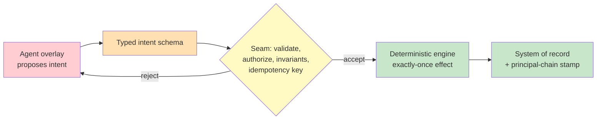

# Chapter 3.1 — The Deterministic Core & Agentic Overlay

*Part III — Systems Architecture · Domain D3 · Reading time ~28 min · Prerequisites: Ch. 1.3, Ch. 2.1*

## 1. The failure story

A fintech team gave their reconciliation agent write access to the general ledger. It was framed as an efficiency win: the agent already read the ledger to explain discrepancies, so letting it post the correcting entries "closed the loop." The tool was a thin wrapper over the accounting system's `post_journal_entry` endpoint, exposed to the model exactly as the internal API defined it.

On a Tuesday the agent proposed a $240,000 correcting entry to clear a suspense account. The tool call timed out at the gateway after 30 seconds — the ledger had accepted the write, but the acknowledgment never came back. The agent's runtime did what runtimes do on a timeout: it retried. The second call succeeded cleanly. The ledger now held two $240,000 entries, and the suspense account was off by exactly that amount in the other direction.

Nobody noticed for nine days, because both entries were individually valid, correctly formatted, and properly signed by the service account. When the month-end close flagged the imbalance, the team tried to reconstruct what happened and hit the second failure: there was no idempotency key, so the two writes were indistinguishable from two legitimately separate corrections. There was no compensation path, so undoing one entry meant a manual reversal that itself had to clear approval. And there was no attribution stamp, so proving which writes were agent-initiated versus human-initiated required cross-referencing timestamps against chat logs by hand.

The model did nothing wrong. It proposed one correct entry. The system turned one correct proposal into two irreversible, unattributable, uncompensated mutations of the source of truth — and never asked the question that would have prevented all of it: *should a probabilistic component ever hold a direct write handle to the ledger?*

## 2. The mental model

### 2.1 Agents propose, engines dispose, humans remain the source of truth

The standing thesis of this whole manual becomes an architectural rule here. A production agentic system is not "an agent that does things." It is a **deterministic core** that does things, wrapped in a **probabilistic overlay** that *proposes* what to do. The agent's output is never an action; it is an **intent** — a typed, validated request that the deterministic core may accept, reject, or modify before anything touches the world. The humans, and the systems of record they own, remain the immutable ground truth against which every intent is checked.

This is not a style preference. It is the only arrangement in which you can make correctness guarantees about a system whose smartest component is, by construction, occasionally wrong. **Anything that requires a correctness guarantee, an audit trail, or transactional integrity belongs in the deterministic core; the agent layer may only produce intents that the core validates and executes, because you cannot certify a system whose final authority is a probability distribution.**

### 2.2 Boundary criteria: what lives where

The seam between core and overlay is drawn by a single question asked of every capability: *does this need to be right, provable, or atomic?* If yes, it lives in the deterministic core — code you wrote, tested, and can reason about. If it is a judgment, a plan, a draft, or a proposal, it lives in the overlay. The ledger write is a correctness-critical, auditable, transactional operation, so it belongs entirely in the core; the *decision* to propose a correcting entry is judgment, so it belongs in the overlay. The failure story collapsed the two — it let a judgment component perform a correctness-critical operation — and inherited the worst of both.

Drawing the boundary well means resisting the convenience that erodes it. Every direct write you hand the overlay "just to close the loop" is a correctness guarantee you have traded for a probability. The discipline is to keep the core's surface small and typed, and to make the overlay reach it only through that surface.

### 2.3 Ports and adapters: the typed-intent seam

The classical ports-and-adapters pattern gives the **seam** its shape. The agent speaks only in **typed intent schemas** — `ProposeJournalEntry{account, amount, currency, evidence_ref, idempotency_key}` — and never in raw API calls. That schema is the **port**. Behind it, an **adapter** validates the intent against business invariants (does this account exist, is the amount within policy, does the evidence support it), authorizes it against the acting principal's rights, and only then executes it against the real system. The seam is where validation, authorization, and invariant enforcement live, deterministically, outside the model's judgment.

The power of the typed seam is that it makes whole classes of error unrepresentable rather than merely discouraged. The model cannot post an entry with a negative amount if the schema forbids it; it cannot skip the idempotency key if the field is required; it cannot write to an account it lacks rights to if the adapter checks authorization. Every invariant you move from "the model should respect this" to "the seam enforces this" is a failure mode you have deleted instead of monitored.

### 2.4 Idempotency, exactly-once effects, and compensation

The failure story's core wound was a retried write with no idempotency key. The fix is a discipline distributed systems settled decades ago, now applied to agent intents. Every mutating intent carries an **idempotency key** — a stable identifier derived from the intent's content or assigned at proposal time — so that the core can recognize a retry and return the original result instead of executing again. This buys **exactly-once effects**, which is the property you actually want, as distinct from exactly-once delivery, which is impossible. Delivery can happen many times; the key ensures the *effect* happens once.

Multi-system actions need more than a key. When an intent must touch two systems — debit here, credit there — a crash between them leaves an inconsistency no single idempotency key repairs. The answer is the **saga** pattern: each step has a defined **compensating action**, prepared before execution, so a partial failure can be rolled back by running the compensations in reverse. The core does not promise that nothing fails; it promises that every failure has a defined path back to a consistent state.

### 2.5 Attribution: the principal chain

The last thing the failure story lacked was the ability to prove who did what. Every mutation the core executes must be stamped with a **principal chain** — the human who authorized the session, the agent that proposed the intent, the tool that carried it — plus the intent ID and a pointer to the evidence the proposal rested on. This is not logging for its own sake; it is what makes an agentic system auditable, what lets you answer "which writes were agent-initiated" in one query instead of nine days of forensics, and what regulators will require the moment the system touches anything consequential. **Attribution** is a property you design into the seam, not a report you reconstruct after an incident.

*Red: the probabilistic overlay, trusted only to propose. Orange: the typed intent it must speak. Yellow: the deterministic seam that validates, authorizes, and dedupes. Green: the engine and system of record, where correctness is guaranteed by construction.*

## 3. The production lens

In production the deterministic seam is the single most load-bearing piece of the architecture, and it is worth building before the agent is impressive rather than after the first incident. The seam is where you enforce the invariants that keep a good model from doing damage on its bad day and a compromised model from doing damage on purpose — it is simultaneously your correctness control and, as Ch. 3.5 will develop, your security control, because an intent that cannot pass authorization cannot be weaponized regardless of what convinced the model to propose it.

The operational tell that a system lacks a real seam is that its incidents are irreversible. When a bad agent decision means a manual database repair, a customer apology, or a nine-day forensic reconstruction, the core did not exist — the overlay was writing directly. When a bad decision means a rejected intent, a logged proposal, and a clean retry, the seam is doing its job. On-call for a well-built agentic system is mostly reading rejected intents, because the expensive failures were converted into cheap, observable refusals at the boundary.

> **Doctrine check.** If your agent can perform any irreversible, unauthorized, or unattributable action without passing through a deterministic seam that could have refused it, you have not built an agentic system with a safety layer — you have built an unbounded actor with a chat interface, and its reliability is capped at the model's worst output on your hardest input.

The subtler production risk is **boundary erosion**. The seam is drawn correctly at launch, and then a series of small conveniences — a "quick" direct-write feature, a bypass "just for the internal tool," a cached credential that skips re-authorization — quietly move operations from the core back into the overlay. Because each erosion works fine until the day it doesn't, the drift is invisible without an **architectural fitness function**: an automated check that fails the build if the overlay acquires a code path to a system of record that does not pass through the seam. Treat the boundary as a tested invariant of the codebase, not a diagram in a design doc, because a boundary nobody enforces is a boundary that is already gone.

## 4. Edge-case catalog

| # | Edge case | What it looks like | Detection | Mitigation |
|---|-----------|--------------------|-----------|------------|
| 1 | Dual-write inconsistency | Agent updates system A, crashes before B; the two disagree | Reconciliation job comparing A and B; drift alert | Outbox pattern: write intent to a durable outbox first, then relay to both; reconcile from the outbox as source |
| 2 | Replay re-executing effects | Re-running a trace for debugging re-issues the real ledger write | Side effects observed during a replay run | Effect/simulation separation: replay reads the decision log but routes effects to a simulator, never the live core |
| 3 | Boundary erosion | A convenience feature grants the overlay a direct write; it works until it doesn't | Architectural fitness function fails the build on a non-seam write path | Enforce the seam as a tested invariant; no code path to a system of record bypasses validation |
| 4 | Missing idempotency key | A retried mutating intent executes twice, both valid and indistinguishable | Duplicate-effect monitor; content-hash collision on recent intents | Require an idempotency key on every mutating intent; the core dedupes on it before executing |
| 5 | Compensation gap | A multi-system saga fails mid-way with no defined rollback | Orphaned partial state; saga step count mismatch | Define every step's compensating action before execution; run compensations in reverse on partial failure |
| 6 | Attribution loss | An incident requires proving which writes were agent-initiated; the data isn't there | Audit query returns ambiguous or missing principal | Stamp every mutation with the human→agent→tool principal chain, intent ID, and evidence pointer |

## 5. Claude & MCP in this chapter

The MCP layer from Ch. 2.1 is where the seam physically lives for tool-mediated actions: a well-designed server *is* the adapter, wrapping a raw system behind an intent-shaped tool that enforces validation, idempotency, and authorization server-side rather than trusting the model to observe them. When you build an MCP server over a system of record, you are building the deterministic core's boundary, and every ACI discipline from Ch. 1.3 plus every server discipline from Ch. 2.1 is in service of making that boundary hold.

Claude's tool-use and extended-thinking behavior sits entirely on the overlay side of the seam: it proposes, reasons, and drafts, and it is exactly as trustworthy as any capable model — meaning trustworthy for judgment, never for final authority over correctness-critical state. Do not memorize product specifics here; capabilities and defaults move quickly. The durable rule is architectural, not model-specific: whatever the model, keep it on the proposing side of a seam you control, and check the current guidance at docs.claude.com for how a given model's tool and thinking features surface intents you can validate.

## 6. Design exercise

Design the intent schema and execution seam for a single capability: *agent-initiated vendor payment up to $10,000*. Specify (a) the typed intent schema, naming every field the seam needs to validate the payment — payee, amount, currency, invoice reference, idempotency key, evidence pointer; (b) the validation and authorization checks the adapter runs before execution, including the invariant that caps the amount and the principal-rights check that derives authority from the human on whose behalf the agent acts; (c) the idempotency and compensation design — how a retry is deduped and how a payment is reversed if a downstream system fails; (d) the attribution stamp written on success; and (e) the *exact* condition that routes an intent to human approval instead of auto-execution.

*Review standard.* A strong answer makes the dangerous action unrepresentable, not merely discouraged: the $10K cap is a schema and seam invariant, not a prompt instruction; the idempotency key is required, not optional; every payment carries a prepared compensation before it executes; and the human-approval trigger is a deterministic rule (amount threshold, new payee, anomalous pattern) evaluated by the seam, never a judgment left to the model. If your design relies on the model "being careful," it has not understood the chapter.

## 7. Self-test

1. *Claim: exactly-once delivery is the property an idempotency key buys you.* — False, and the distinction is the point. Delivery can and will happen many times; networks retry, gateways time out, runtimes re-issue. The key buys exactly-once *effects*: the core recognizes the retry and returns the original result rather than executing again. Chasing exactly-once delivery is chasing something impossible; engineering exactly-once effects is achievable and is what the ledger actually needs.

2. *Claim: putting a strong instruction in the prompt ("never post a duplicate entry") is an acceptable substitute for a seam-level idempotency check.* — False. A prompt instruction is a request to a probabilistic system that will be honored under most inputs and violated under the retry-after-timeout case that actually occurs. The seam check makes the duplicate unrepresentable; the prompt makes it merely less likely. You raise reliability by making bad effects impossible, not by asking the model to avoid them.

3. *Claim: attribution is a logging concern you can add later.* — False, or at least expensive. If the principal chain, intent ID, and evidence pointer are not stamped at execution time, they cannot be reconstructed faithfully afterward — the failure story's nine-day forensic reconstruction is what "add it later" looks like. Attribution is a property of the seam, designed in, because the moment you need it is precisely the moment it is too late to add.

4. *Claim: boundary erosion is a process failure, not an architectural one.* — Mostly false. Erosion happens through ordinary, well-intentioned conveniences, so relying on people to not erode the boundary fails predictably. The architectural answer is a fitness function that fails the build when the overlay acquires a non-seam path to a system of record, converting a discipline everyone forgets into an invariant the codebase enforces.

5. *Claim: the deterministic core makes the system slower and less capable, so it is a tax on the agent's usefulness.* — False in the way that matters. The core does not reduce what the agent can *propose*; it constrains what it can *execute*, which is exactly the constraint that lets you deploy the agent against consequential state at all. Without the seam the agent is not more capable, it is merely more dangerous — and its effective capability is capped at whatever you dare let it touch, which without a seam is very little.

## 8. Spaced-review card

- From memory, state the propose/dispose/source-of-truth doctrine and give the single boundary question that decides whether a capability lives in the core or the overlay.
- Reconstruct the difference between exactly-once delivery and exactly-once effects, and explain how an idempotency key delivers the latter.
- Name the five things a mutation must carry to be attributable, and explain why a fitness function — not a design doc — is what keeps the boundary from eroding.

---

*You now have a boundary that makes single actions safe, attributable, and reversible. But real agentic work is not a single action — it is a three-day onboarding, a five-day approval wait, a workflow that must survive a pod restart at hour 61. Next: Chapter 3.2 — State, Durable Execution & Long-Running Work, where the workflow engine, not the model loop, becomes the keeper of execution state.*
