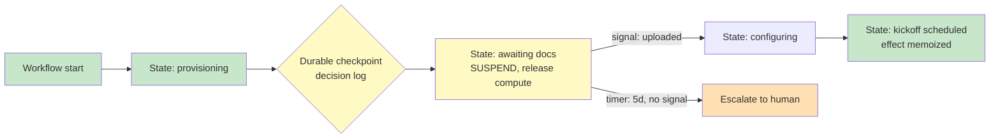

# Chapter 3.2 — State, Durable Execution & Long-Running Work

*Part III — Systems Architecture · Domain D3 · Reading time ~28 min · Prerequisites: Ch. 3.1*

## 1. The failure story

A B2B software company built an agent to run customer onboarding: a three-day workflow that provisioned accounts, requested documents, waited for the customer to upload them, configured integrations, and scheduled a kickoff call. The agent held the whole process in its running context — the plan, the progress, which steps were done — as an in-memory loop on a single pod.

At hour 61 of a particular onboarding, the pod restarted during a routine deployment. The workflow state lived only in that process's memory, so it vanished. The agent's supervisor did the sensible-looking thing and relaunched the task from its initial input. With no record that 61 hours of work had already happened, the agent started over from step one: it re-provisioned the account (creating a duplicate), re-sent the document-request email the customer had already answered, and re-scheduled a kickoff call that was already on the calendar.

The customer received the same "please upload your tax documents" email they had completed two days earlier, plus a second calendar invite, plus a confused note from their account manager. Three concrete failures stacked up: 61 hours of completed work were discarded, three side effects fired a second time, and the customer's trust took the hit that a polished product had spent weeks earning. The engineering post-mortem found the root cause in one sentence — the model loop was the keeper of execution state, and the model loop does not survive a pod restart.

Nobody had asked the question that separates a demo from a system: *where does this workflow's state live when the process running it dies?*

**A long-running workflow whose state lives only in process memory is a demo that works until the first restart, and the restart is not a question of if but when; durable execution means you can name the exact state of every task and resume it correctly after the process dies mid-step.**

## 2. The mental model

### 2.1 Durable execution: the engine keeps the state

The corrective is to move execution state out of the model loop and into a **durable workflow engine**. In a **durable execution** model, the workflow's progress is recorded as an **event-sourced log** — an append-only sequence of what was decided and what happened — that survives any single process. When a pod dies, the engine reconstructs the workflow's state by replaying the log up to the last checkpoint and continues from there, rather than starting over. The model loop becomes a participant in the workflow, not its memory.

The critical design distinction inside the log is between the **decision log** and the **effect log**. The decision log records what the workflow chose to do; the effect log records what actually happened in the outside world. Keeping them separate is what makes safe replay possible: on recovery you replay decisions to rebuild state, but you do not re-run effects that already fired. **The workflow engine, not the model loop, is the keeper of execution state; any long-running agent whose progress lives only in the model's context is one restart away from redoing everything it has already done.**

### 2.2 Suspension at human timescale

Agentic work waits on humans, and humans are slow. An onboarding waits days for a document; a loan waits for an underwriter; an approval waits for someone to come back from lunch. A naive implementation holds a process — and its compute — open for the entire wait, which is both wasteful and fragile. Durable execution suspends instead: the workflow parks itself, releases its compute, and registers to be woken by a **signal** (the document arrived), a **timer** (five business days elapsed), or an **escalation** (the timer fired with no signal, so route to a fallback). Waiting three days should cost you storage, not a held process.

Suspension is what lets a single engine manage thousands of concurrent long-running workflows: at any moment most are parked, waiting on a human or a clock, consuming no compute until an event wakes them. Designing the wait — which signals resume it, which timers bound it, what happens when a timer fires unanswered — is as much of the workflow as the active steps.

### 2.3 Resumability semantics: replay versus restore

Resuming a workflow raises a precise question: what must be *replayed* to rebuild state, and what must be *restored* from storage? Deterministic decisions can be replayed cheaply from the decision log. Expensive or nondeterministic results — an LLM call, an external API response, a random value — must be **memoized**: recorded on first execution and restored on replay, never re-issued. And the agent's working context, the reasoning it needs to continue intelligently, must be reconstructed on resume, because the model that wakes up to continue the onboarding has no memory of the 60 hours that preceded it and must be handed a faithful summary of where things stand.

The subtle failure here is treating an LLM call inside a replayed code path as a fresh call. If replay re-issues the model call, it may get a different answer than it got the first time, and the reconstructed state diverges from the real history — a workflow that "remembers" something that never happened. Memoization is not an optimization; it is a correctness requirement for any nondeterministic step inside a replayable workflow.

### 2.4 State schema design: explicit machines, contained reasoning

A durable workflow needs an explicit, enumerable **state machine**: the onboarding is in `awaiting_documents` or `configuring_integrations` or `scheduling_kickoff`, and the set of states and legal transitions is defined in code, not improvised by the model. Within a given state, the agent's free-form reasoning is welcome — deciding *how* to configure an integration is exactly the judgment the overlay is for — but the *transitions* between states are deterministic, gated by the seam from Ch. 3.1. This is the same core/overlay boundary applied to time: the state machine is the deterministic skeleton, the model's reasoning is the flesh inside each state, and the workflow can never end up in a state the machine does not define.

The payoff of an explicit state machine is that it makes the workflow inspectable, resumable, and migratable. You can query how many onboardings are stuck in `awaiting_documents`, resume a specific case from a known state, and reason about what "hour 61" even means — because the workflow's position is a named state in a durable log, not an opaque point in a model's context window.

### 2.5 Mid-flight versioning

Long-running workflows outlive their own code. An onboarding started on Monday may still be running Thursday, and on Wednesday you shipped a new version of the prompt, added a tool, or changed a step. Now you have in-flight workflows built on v1 running against a v2 system. **Mid-flight versioning** is the discipline of migrating them safely: pin running workflows to the version they started under, or define an explicit migration that maps v1 state into v2, so a logic change does not silently corrupt every case currently in progress. A system without a versioning story either freezes its own development or breaks its running work; naming the migration path is how you keep shipping without abandoning the workflows already underway.

*Green: active, checkpointed states the engine can rebuild after any crash. Yellow: the durable seam and the suspended wait that survives without holding compute. Orange: the escalation path when a human-timescale timer fires unanswered.*

## 3. The production lens

The operational difference a durable engine makes is visible the first time a deployment rolls during business hours. In the failure-story architecture, every in-flight workflow on a restarted pod either dies or restarts from zero, so deployments become high-risk events scheduled for 3 a.m. and dreaded. In a durable architecture, a pod restart is a non-event: workflows checkpoint, the engine reschedules them onto healthy workers, and they resume from their last durable state. You have decoupled the lifetime of the work from the lifetime of the process, which is the property that lets long-running agents exist in production at all.

The reliability signals worth watching are the ones that reveal state going wrong quietly. Workflows suspended longer than their timers should allow are **zombie workflows** — parked forever on a signal that will never come — and they accumulate invisibly until a **reaper policy** sweeps them. Workflows replaying more often than they should point to a crash loop hiding behind the engine's recovery. And a rising count in any single state, especially a `awaiting_*` state, is often the first sign that an upstream dependency (the document service, the approval queue) has stalled and is silently backing up every workflow behind it.

> **Doctrine check.** If you cannot answer "what state is this workflow in, and what happens if the process running it dies right now" for every long-running task, you do not have durable execution — you have a demo that works until the first restart, and the restart is not a question of if but when.

The deepest production trap in durable execution is nondeterminism leaking into replayed code. Anything that can return a different value on replay — an LLM call, `now()`, a random number, an unmemoized API response — will, on some recovery, rebuild a state that never actually existed, and the resulting bug is nightmarish to diagnose because it only appears after a crash-and-resume and cannot be reproduced by re-running the happy path. The discipline is absolute: every nondeterministic value inside a replayable workflow is memoized on first execution and restored, never recomputed, on replay. **Clock discipline** is a special case worth naming — human-timescale timers spanning days will cross a daylight-saving boundary, and a timer that means "five business days" must be computed in a way that survives the hour the clock jumps.

## 4. Edge-case catalog

| # | Edge case | What it looks like | Detection | Mitigation |
|---|-----------|--------------------|-----------|------------|
| 1 | Nondeterministic replay | An LLM call inside replayed code re-issues and returns a different answer, diverging state | Replayed-run state differs from original; nondeterminism audit | Memoize every nondeterministic value on first execution; replay restores, never recomputes |
| 2 | Poison-pill event | One malformed event wedges the workflow every time it is processed | Repeated failure on the same event; stuck workflow with a crash loop | Quarantine the event to a dead-letter lane; provide a manual-repair path; never block the queue on it |
| 3 | Zombie workflow | Suspended forever on a signal that will never arrive | Suspension duration exceeds the registered timer; no bounding timer present | TTL on every wait; a reaper policy that escalates or fails workflows past their deadline |
| 4 | Clock/DST bug | A "5 business day" timer fires an hour early or late across a DST boundary | Timer-fire timestamps drift against expected wall-clock | Compute human-timescale timers in a DST-safe way; test across the boundary explicitly |
| 5 | Mid-flight version skew | A v1 workflow runs against v2 logic after a deploy; state assumptions break | In-flight workflows failing right after a release; version mismatch in state | Pin running workflows to their start version or define an explicit v1→v2 state migration |
| 6 | Effect replay on debug | Replaying a trace to debug re-fires a real customer email | Side effect observed during a replay/debug run | Separate decision log from effect log; replay reads decisions, routes effects to a simulator |

## 5. Claude & MCP in this chapter

Durable execution is an architecture, not a model feature, so most of this chapter is model-agnostic by design — the engine that keeps state, suspends waits, and memoizes effects sits outside and around whatever model proposes the next step. Where the model does touch durability is memoization: a Claude tool call or extended-thinking step inside a replayable workflow is exactly the kind of nondeterministic result that must be recorded on first execution and restored on replay, never re-issued. Treat every model call in a durable workflow as an effect to be memoized, and the model's nondeterminism stops being a correctness hazard.

The MCP servers from Ch. 2.1 are the workflow's effect surface — the tools whose calls change the outside world — so their idempotency discipline from Ch. 3.1 and their memoization here are two views of the same requirement: a retried or replayed tool call must not double-fire. Product specifics around checkpointing frequency, suspension limits, and engine integrations move quickly and vary by platform; the durable rule is to keep execution state in an engine you can inspect and resume, and to verify current tooling and limits at docs.claude.com rather than memorizing them.

## 6. Design exercise

Model a *loan-origination agent* as an explicit, durable state machine. The process has two human gates (an initial eligibility review and a final underwriting sign-off) and one five-business-day external wait (a third-party income verification). Specify (a) the enumerable set of states and the legal transitions between them; (b) the checkpoint contents at each state — what must be persisted so the workflow can be rebuilt after a crash; (c) the resume behavior for a pod restart mid-verification, including which values are memoized and how the agent's working context is reconstructed; (d) the suspension design for the five-day wait — the signal that resumes it, the timer that bounds it, and the escalation when the timer fires unanswered; and (e) the v1→v2 migration story for a case already in progress when you change the underwriting logic.

*Options:* Memoize result, restore on replay · Re-issue the call on replay · Suspend, release compute, register signal + timer · Hold the process open · Escalate to human / fallback path · Discard the workflow · Pin to v1 or define explicit v1→v2 migration · Redeploy and rely on the new logic

*Check:* Each item below tests one structural correctness decision the chapter makes explicit — match it to the right option.

| Item | Answer | Why |
|---|---|---|
| (c) The income-verification API response is a nondeterministic value. On a pod-restart resume, the workflow should… | Memoize result, restore on replay | The chapter requires every nondeterministic value to be recorded on first execution and restored on replay; re-issuing it can produce a divergent state and would re-fire the verification request — reproducing the failure story. |
| (d) While the workflow waits five business days for the income report, the process should… | Suspend, release compute, register signal + timer | Durable suspension parks the workflow, releases compute, and registers both the wakeup signal and the bounding timer; holding the process open for five days is both wasteful and fragile. |
| (d) When the five-day timer fires with no signal received, the workflow should… | Escalate to human / fallback path | The chapter explicitly names escalation as the designed outcome when a bounding timer fires unanswered; discarding the workflow loses work and has no recovery path. |
| (e) When a code change ships while loan-origination cases are already in flight, the correct approach is… | Pin to v1 or define explicit v1→v2 migration | Running in-flight v1 workflows against v2 logic silently corrupts in-progress state; the migration story must name what happens to each case — pin it or migrate it explicitly. |

*Sample solution:* A complete design covers all five parts. Below is one defensible answer that satisfies the Review standard.

- **(a) States and transitions.** The state machine has seven enumerable states: `application_received` → `eligibility_review_pending` (first human gate; workflow suspends) → `income_verification_requested` (external wait) → `income_verification_received` or `income_verification_timed_out` (either signal or timer escalation) → `underwriting_review_pending` (second human gate; workflow suspends) → `decision_issued` (approved or declined). Legal transitions are defined in code; the model cannot introduce a new state at runtime.

- **(b) Checkpoint contents.** Each state persists: the workflow instance ID and current state name; all inputs and derived facts collected so far (applicant ID, requested amount, eligibility decision with timestamp, the income-verification reference ID and its memoized response once received, underwriting decision once issued); the version tag the workflow started under; and the timer registration with its deadline for any suspended state. This is the minimum needed to reconstruct working context after a crash.

- **(c) Resume after a pod restart mid-verification.** On recovery the engine replays the decision log up to the last checkpoint. The income-verification API call is nondeterministic, so its response is memoized on first execution and restored from the log — never re-issued. The agent's working context is reconstructed by passing the checkpointed summary (applicant facts, verification reference ID, elapsed time, prior decisions) as a prompt prefix; the resuming model instance has no inherent memory of the previous 61 hours and must receive this summary explicitly.

- **(d) Suspension design for the five-day wait.** On entering `income_verification_requested` the workflow suspends, releases its compute, and registers two things: (1) a **signal** — `income_report_received` — that resumes it when the third-party provider posts back; (2) a **timer** — five business days computed in a DST-safe calendar — that fires if no signal arrives. When the timer fires unanswered, the workflow transitions to `income_verification_timed_out` and escalates: it notifies the assigned loan officer, parks in a manual-intervention state, and waits for an operator decision (extend, proceed on partial data, or decline). Waiting costs only storage, not a held process.

- **(e) v1→v2 migration.** When new underwriting logic ships, any workflow already past `income_verification_received` is pinned to v1 until it reaches `decision_issued` — the engine records the version tag at start and routes replay through the correct logic branch. Any workflow not yet past the underwriting gate receives an explicit state migration: the v1 `underwriting_review_pending` record is mapped to the v2 equivalent with a migration function that backfills any new required fields with safe defaults, and the version tag is updated atomically. A redeploy without this migration would silently run in-flight v1 state through v2 assumptions, corrupting every case in progress.

**Review standard.** A strong answer treats the state machine as the deterministic skeleton and the model's reasoning as contained within states, never as the keeper of progress. The five-day wait must suspend and release compute, not hold a process. Every nondeterministic step inside the replayable path must be explicitly memoized. And the migration story must actually name what happens to an in-flight case — pinned to v1 or migrated to v2 — rather than assuming a redeploy is harmless. If your design would re-send the income-verification request after a restart, it has reproduced the failure story.

## 7. Self-test

1. *Claim: keeping the workflow's state in the agent's context window is fine as long as the context is large enough.* — False, and the size of the context is beside the point. Context lives in a process, and the process dies — on a deploy, a crash, an autoscaler decision — taking the state with it. Durability is about *where state lives relative to process lifetime*, not how much of it fits; a 61-hour workflow needs an engine that outlives any single pod, not a bigger window.

2. *Claim: on resume, re-running the LLM calls in the replayed path is acceptable because the model is deterministic enough.* — False. The model is not deterministic enough — it can return a different answer on replay — and even small divergence rebuilds a state that never happened. Memoization is a correctness requirement, not a performance nicety: record the result on first execution, restore it on replay, and never re-issue a nondeterministic call inside a replayable workflow.

3. *Claim: suspending a workflow to wait five days means holding a process open for five days.* — False, and this is the whole point of durable suspension. A well-designed workflow parks itself, releases its compute, and registers a signal and a bounding timer, so waiting costs storage rather than a held process. This is what lets one engine manage thousands of concurrent long-running workflows, most of them parked at any moment.

4. *Claim: separating the decision log from the effect log is an audit nicety.* — False; it is what makes safe replay possible at all. Replay must rebuild state by re-reading decisions without re-firing effects, so debugging a trace cannot re-send a customer email and recovery cannot re-post a ledger entry. Without the separation, every replay is a live re-execution, and you can neither debug safely nor recover cleanly.

5. *Claim: once the workflow works, versioning is a future concern.* — False in a way that bites early. Long-running workflows outlive the code that started them, so the first time you ship a logic change with cases in flight, you have v1 workflows meeting v2 logic. Without a pinning or migration story, that release silently corrupts every in-progress case — so the versioning story is part of shipping durable workflows, not a later cleanup.

## 8. Spaced-review card

- From memory, state where execution state must live and why the model loop is the wrong keeper of it, then give the difference between the decision log and the effect log.
- Reconstruct the suspend-and-resume design for a multi-day human wait: what parks the workflow, what wakes it, and what bounds it.
- Explain why memoization is a correctness requirement rather than an optimization, and name two nondeterministic values besides an LLM call that must be memoized in a replayable workflow.

---

*Your workflows now survive restarts, suspend across human-timescale waits, and resume without redoing their effects. But suspension for a human gate assumes the human oversight actually works — and the next chapter shows how easily it doesn't. Next: Chapter 3.3 — Human-in-the-Loop as an Engineered System, where oversight becomes a budgeted resource and approval a risk-tiered decision rather than a rubber stamp.*
