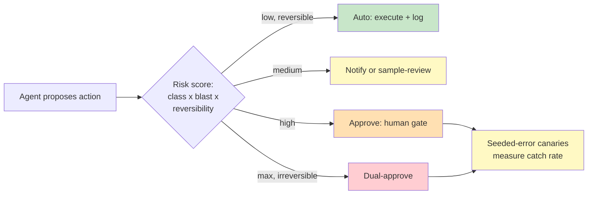

# Chapter 3.3 — Human-in-the-Loop as an Engineered System

*Part III — Systems Architecture · Domain D3 · Reading time ~28 min · Prerequisites: Ch. 3.1, Ch. 3.2*

## 1. The failure story

A claims-processing company deployed an agent and, to be safe, required human approval for every action it took. This felt like maximal oversight: nothing happened without a person signing off. Each reviewer handled roughly 400 approval items per day — one every 45 seconds across a seven-hour shift — clicking through a queue of agent proposals rendered as dense text documents.

Six months later an audit examined the approval record. The reviewers had approved 99.7% of everything the agent proposed. Buried in that stream were three catastrophic errors: a claim paid to a fraudulent payee, a settlement 40× larger than policy allowed, and a denial that violated a regulatory requirement. All three had been approved, in under a minute each, by a reviewer who had approved 399 other items that day and had no realistic way to tell the three that mattered from the 397 that didn't.

The oversight existed entirely on paper. On paper, a human reviewed every action. In practice, a human under a 45-second-per-item load, facing a 99.7%-benign stream rendered as undifferentiated text, was a rubber stamp with a pulse — and the three errors that slipped through were exactly the high-consequence cases the oversight was supposed to catch. The company had more human review than it could possibly use well, and less real oversight than a system with a tenth the approvals and a hundredth the volume.

The design never asked the question that makes oversight real: *given that human attention is finite, where should it be spent, and how do we know it is actually catching anything?*

## 2. The mental model

### 2.1 The risk-tiered autonomy matrix

Effective oversight starts by refusing to treat all actions alike. Every action the agent can take is scored on three axes — its *action class* (what kind of operation), its *blast radius* (how much damage the worst version does), and its *reversibility* (how hard it is to undo) — and that score maps to an oversight tier: *auto* (execute and log), *notify* (execute and tell a human after), *approve* (a human must sign off before), or *dual-approve* (two humans for the most dangerous class). A low-blast, fully reversible action like drafting a customer note runs auto; an irreversible high-blast action like a large payment demands dual-approve. **Human attention is a finite budget, and oversight only works when you spend it on the decisions that are consequential and irreversible, not uniformly across a stream in which 99.7% of items never needed a human at all.**

The matrix is what converts "review everything" — which reliably produces rubber-stamping — into "review what matters," which produces real scrutiny. The failure story had one tier for everything and therefore, in effect, no tiers.

### 2.2 Review ergonomics: designing the decision, not the document

When a human does review, the interface determines whether the review is real. A reviewer facing a wall of text will pattern-match to "looks fine" and approve; a reviewer facing a *diff* — this is what the agent proposes to change, here is the evidence, here is the one number that is unusual — can actually decide. Good review ergonomics surface the decision in one glance: the proposed action, the evidence and provenance behind it, and the specific dimension of uncertainty the reviewer should weigh. The goal is to make the *right* decision fast, not to make approval fast; those are different, and the failure story optimized the second.

Uncertainty surfacing matters especially. If the agent is 96% confident on a routine claim and 60% confident on this one, the interface should say so, because the reviewer's scarce attention should be pulled toward the case the agent itself is unsure about. A review surface that renders every item identically hides exactly the signal that would direct attention well.

### 2.3 Attention budgeting

Because attention is finite, it must be budgeted like any scarce resource. Approval-volume caps prevent the 400-per-day overload that guarantees rubber-stamping — if the queue exceeds what a reviewer can handle well, the answer is more automation of low-risk tiers, not faster clicking. Low-risk classes move to *sampling-based* review: instead of approving every low-blast action, a human spot-checks a random sample, catching systematic problems without gating every instance. Batch approval with spot audits handles the middle. The principle is that the number of items a human must genuinely consider should be small enough that they can consider each one genuinely.

Attention budgeting also has a temporal dimension the failure story ignored. A reviewer's judgment degrades across a shift — the hundredth approval of the day gets less real scrutiny than the tenth, regardless of the interface — so the budget must account for cognitive fatigue, not just raw count. High-tier decisions should be front-loaded where possible, distributed across reviewers rather than concentrated on one, and never queued behind a wall of trivial items that exhausts attention before the consequential decision arrives. The design target is not "a human looked at it" but "a human with attention left to spend looked at it," and those diverge sharply once volume climbs. A reviewer queue that treats attention as infinite is making the same category error as an architecture that treats context as free: the resource runs out silently, and the first sign of exhaustion is a consequential item waved through without real thought.

### 2.4 Escalation design

Oversight that waits on a human must define what happens when the human does not come. Escalation design specifies the timeout behavior (the approver has not responded in an hour — then what), the fallback approver chain (route to the on-call reviewer, then their manager), and the safe interim state the workflow holds while it waits (from Ch. 3.2's suspension). For an agent *fleet* running many workflows, this becomes an on-call discipline: who is paged when approvals back up, what the safe default is when no one responds, and how the system avoids either blocking forever or auto-approving out of impatience. The interim state should be safe-by-default — waiting is acceptable, silently proceeding on a high-tier action is not.

### 2.5 Trust calibration: measuring whether oversight works

The final and most-skipped piece is measuring whether the oversight is catching anything. A 99.7% approval rate is not evidence of a well-behaved agent; it is evidence of nothing, because a rubber stamp produces the same number. The honest metrics are the *rubber-stamp rate* (how often approval is granted with too little engagement to be real), the *catch rate on seeded errors* (deliberately inject known-bad proposals and measure how many reviewers catch), and *reviewer disagreement* (when two reviewers see the same item, do they agree). These numbers let you promote autonomy from evidence — expand the auto tier for a class the reviewers never override — and demote it when the catch rate falls. Trust becomes measured, not assumed, and the autonomy matrix becomes a living instrument tuned by data rather than a fixed guess.

*Green: the auto tier for low-blast reversible actions. Yellow: sampled review and the canary program that audits the review process itself. Orange and red: the human and dual-human gates reserved for high-blast and irreversible actions.*

## 3. The production lens

The counterintuitive production truth is that *more* human approval often means *less* real oversight. The failure story had a human on every action and caught nothing that mattered, because volume destroyed attention. A system that auto-executes 95% of actions and routes the consequential 5% to unhurried, well-instrumented review will catch far more of what counts. When you propose "review everything" as a safety measure, you are usually proposing rubber-stamping with extra steps; the safer design spends the same human hours on a hundredth the items.

The metric that tells you oversight is real is the seeded-error canary program, and it is worth treating as the honesty check on the entire review process. You inject known-bad proposals at a known rate and measure how many the reviewers catch. A review process that catches 90% of seeded errors is doing something; one that catches 15% is theater regardless of how many items it approves. This is the only metric that cannot be gamed by a rubber stamp — approval rate, throughput, and reviewer satisfaction all look fine in a broken process, but catch rate on seeded errors goes to the floor. On-call for an oversight system watches the canary catch rate the way on-call for a service watches error rate.

> **Doctrine check.** If your only evidence that human oversight works is that humans are technically in the loop, you have no evidence — measure the catch rate on seeded errors, because an approval rate near 100% is equally consistent with a flawless agent and a reviewer who stopped reading, and only the canary tells you which one you have.

Two production hazards deserve naming. The first is HITL latency destroying product value: a human gate on a time-sensitive action can make the agent useless even when the oversight is sound, so the review tier must be weighed against the product cost of the wait, and async or safe-by-default interim states used where a synchronous block would kill the experience. The second is the accountability gap — an approval is recorded, but the approver lacked the context to meaningfully consent. A signature on a decision the person could not actually evaluate is not oversight; it is liability laundering. Evidence-completeness requirements, where an item cannot be surfaced for approval unless the reviewer has what they need to judge it, are what keep approval meaningful.

## 4. Edge-case catalog

| # | Edge case | What it looks like | Detection | Mitigation |
|---|-----------|--------------------|-----------|------------|
| 1 | Rubber-stamping | Approval rate near 100%, seconds per item, catastrophic errors approved | Seeded-error canary catch rate collapses; time-per-item too low | Reduce volume via risk tiers; instrument catch rate as the primary oversight metric |
| 2 | HITL latency kills value | A human gate on a time-sensitive action makes the agent unusable | Product metrics (completion time, abandonment) crater on gated flows | Async approval UX; safe-by-default interim states; reserve synchronous gates for high tiers only |
| 3 | Accountability gap | Approval recorded, but the approver lacked context to consent meaningfully | Post-hoc review shows evidence absent from the approval surface | Evidence-completeness requirement: no item surfaced for approval without what's needed to judge it |
| 4 | Notification fatigue | Reviewers ignore a flood of alerts; an important one is missed | Alert acknowledge/response rate falling; missed high-tier items | Budget notifications; escalate unacknowledged high-tier alerts; treat ignored alerts as a security incident |
| 5 | Escalation black hole | An approval waits on someone who never responds; workflow stalls or auto-proceeds | Suspension exceeds timeout; no fallback approver fired | Timeout + fallback approver chain; safe-by-default interim state; never auto-approve high tiers on timeout |
| 6 | Stale autonomy tiers | A class was promoted to auto, but its error rate has since risen | Rising override/incident rate on an auto-tier class | Continuously recalibrate the matrix from catch-rate and override data; demote on evidence |

## 5. Claude & MCP in this chapter

The plan-preview and approval affordances that make oversight ergonomic are product-surface patterns, and Anthropic's own tools (plan mode, artifacts, tool-approval prompts) are useful case studies in surfacing a proposed action for a one-glance human decision rather than a wall of text. The durable lesson is design, not feature: whatever the interface, render the *diff and the evidence*, surface the model's uncertainty, and make the consequential decision fast rather than making approval fast.

The autonomy matrix connects directly to the seam of Ch. 3.1 — the tier an action lands in is a deterministic property enforced at the seam, so "this class requires dual-approve" is a rule the core evaluates, never a suggestion the model can route around. MCP tool calls inherit their tier from the action's risk score, and a well-built server surfaces the evidence a reviewer needs alongside the proposed effect. Product specifics for approval UIs and oversight tooling change quickly; the enduring requirement is a measured, risk-tiered oversight system, and current capabilities should be checked at docs.claude.com rather than assumed.

## 6. Design exercise

Build the human-in-the-loop system for an *insurance-claims agent* with twelve action classes (for example: acknowledge receipt, request documents, calculate a routine payout, approve a payout, deny a claim, refer to investigation, adjust a reserve, close a claim, and so on). Produce (a) the risk-tiered autonomy matrix — each of the twelve classes scored on action class, blast radius, and reversibility, mapped to auto / notify / approve / dual-approve; (b) the reviewer dashboard spec for the classes that require human sign-off, showing what evidence, diff, and uncertainty signal each item surfaces; (c) the seeded-error canary program — what known-bad proposals you inject, at what rate, and how you compute catch rate; and (d) the promotion criteria that must be met before a class is moved to a more autonomous tier, and the demotion trigger that moves it back.

**Review standard.** A strong answer spends human attention unevenly and on purpose: the reversible, low-blast classes run auto or sampled, and the scarce human review concentrates on the irreversible high-blast ones. The dashboard must render decisions, not documents. Crucially, the design must include the canary program — an oversight system with no way to measure its own catch rate is the failure story with better intentions — and the promotion/demotion criteria must be tied to measured evidence, not to how long a class has "seemed fine."

## 7. Self-test

1. *Claim: requiring human approval on every agent action maximizes oversight.* — False, and inverted. Approval on everything drives volume past the point where any single review can be real, producing the 99.7%-approval rubber stamp that catches nothing. Oversight is maximized by spending finite human attention on the consequential, irreversible minority and automating the rest — fewer approvals, each of them real.

2. *Claim: a 99.7% approval rate shows the agent is performing well.* — False; it shows nothing. A flawless agent and a reviewer who stopped reading produce the identical number. The only metric that distinguishes them is the catch rate on seeded errors, which is why a rubber-stampable statistic like approval rate must never be mistaken for evidence that oversight works.

3. *Claim: the review interface is a presentation detail separate from whether oversight is effective.* — False. The interface *is* the oversight, because a reviewer facing undifferentiated text pattern-matches to "approve" while a reviewer facing a diff, the evidence, and the uncertainty signal can actually decide. Rendering the decision well is what converts a recorded signature into meaningful consent.

4. *Claim: recording an approval discharges accountability regardless of what the approver could see.* — False, and dangerously so. An approval granted without the context to evaluate the decision is liability laundering, not oversight — the accountability gap. Evidence-completeness requirements, where nothing is surfaced for approval without what's needed to judge it, are what make the recorded signature mean something.

5. *Claim: once the autonomy matrix is set, it can be left alone.* — False. The matrix is a living instrument: a class promoted to auto can drift as inputs change, and a review tier can decay as reviewers fatigue. Continuous recalibration from catch-rate, override, and disagreement data — promoting on evidence, demoting on rising error — is what keeps the matrix matched to reality rather than to last quarter's guess.

## 8. Spaced-review card

- From memory, name the three axes that score an action's oversight tier and the four tiers they map to, and explain why one tier for everything produces rubber-stamping.
- Reconstruct why a near-100% approval rate is not evidence of a good agent, and state the one metric that actually tells you whether oversight is catching anything.
- Explain the accountability gap and the evidence-completeness requirement that closes it, in terms a reviewer signing off on a claim would recognize.

---

*You can now spend human attention where it counts and prove the oversight is real. But even a perfectly reviewed action can do unbounded damage if the agent's reach is unbounded — approval decides whether an action fires, not how much it can break. Next: Chapter 3.4 — Guardrails, Sandboxing & Blast-Radius Containment, where you bound the maximum damage of any single decision by construction.*
