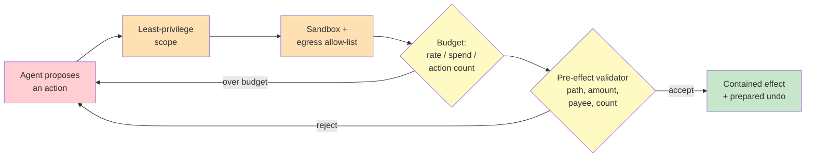

# Chapter 3.4 — Guardrails, Sandboxing & Blast-Radius Containment

*Part III — Systems Architecture · Domain D3 · Reading time ~28 min · Prerequisites: Ch. 3.1, Ch. 3.3*

## 1. The failure story

A developer-tools company gave its coding agent a shell. The reasoning was defensible: the agent's job was to fix failing builds, and fixing builds means running commands — installing packages, deleting stale artifacts, re-running tests. A shell is the honest interface for that work. The agent ran in a container, which the team described as "sandboxed."

One night the agent was asked to clean up a workspace that had filled its disk with build artifacts. It reasoned correctly that the fix was to remove the generated output directory and rebuild. It issued a recursive delete against what it believed was the build directory. The path it deleted resolved, through a mounted volume the container had inherited, to a directory on the production artifact server — the one holding the last ninety days of signed release binaries. The command was `rm -rf` against a legitimate-looking path. It executed in under a second. It was a completely legal command for a shell to run.

The container was real. What the team had not done was scope what the container could *reach*. The mount gave the agent a writable path into production storage; nothing between the agent and that storage asked whether a delete of ninety days of release binaries was a plausible thing for a build-cleanup task to do. There was no dry-run, no soft-delete window, no per-action budget that would have found "delete 4,000 files" surprising, no confirmation gate on destructive filesystem operations. Recovery took thirty-one hours and a restore from an offsite backup that was, fortunately, current.

The post-mortem kept circling one framing. Everyone wanted to know why the agent "decided" to delete production. That is the wrong question, because the agent will occasionally decide anything; it is a sampler over plausible next actions. The question the design never asked was: **for this capability, what is the worst thing a single legal action could reach — and why was that reachable at all?**

## 2. The mental model

### 2.1 Blast radius is a property of the capability, not the agent

Start by refusing the seductive framing that the story ends with. You will not make the agent reliable enough to never issue a catastrophic command. Reliability buys you a lower *rate* of bad actions; it does not bound the *damage* of the ones that get through, and at production volume the rate never reaches zero. Containment is the discipline of making the worst reachable outcome small *regardless of how the agent behaves*, so that a bad decision costs a retry instead of a restore.

The unit of analysis is the capability, not the agent. For every tool or permission you grant, do a blast-radius analysis: enumerate the worst plausible single action that capability enables, and trace what that action can reach. A shell's worst action is not "run a helpful command"; it is "delete or overwrite anything the process can write to." A payment tool's worst action is not "pay a valid invoice"; it is "pay the maximum amount to an arbitrary payee." An email tool's worst action is "send anything to anyone the address book can name." You are not estimating likelihood here — you are measuring the size of the crater. **Blast-radius analysis asks a single question of every capability you grant: if this tool fires the worst legal call it is capable of, what is the largest amount of money, data, or trust that call can reach — and containment is the engineering that makes that reachable maximum small by construction, before you have said one word about how often it will happen.**

The output of the analysis is not a risk score. It is a list of reachable maxima, and each one is a design defect until you have contained it.

### 2.2 The containment stack: no single control is load-bearing

Containment is layered on purpose. Any single control fails — classifiers get bypassed, a permission is misconfigured, a budget is set too high, a human waves something through. Defense in depth means the layers are independent, so that a failure in one is caught by the next. Picture a stack that any action must pass through before it becomes an effect in the world.

The first layer is *capability-scoped permissions*: least privilege granted per task, not per agent. The coding agent did not need write access to production storage to clean a build directory; it needed write access to that one workspace. Scoping is the cheapest and highest-leverage layer because it shrinks the blast radius at the source — a capability the agent never holds cannot be the worst action.

The second layer is *sandboxed execution*: the agent runs in an environment whose filesystem, network, and process reach are enumerated and denied by default. Containers are necessary but not sufficient; the story's container was real. What was missing was filesystem scoping (no writable mount into production) and network egress control (an allow-list of destinations the process may reach). Egress control matters more than it looks — it is the same layer that, in the next chapter, stops a compromised agent from exfiltrating data.

The third layer is *budgets*: rate, spend, token, and action limits, enforced deterministically outside the model. "Delete at most 50 files without a confirmation" and "spend at most $500/day across all tasks" are budgets. They convert a runaway into a bounded loss and buy time for a human or a detector to intervene.

The fourth layer is *reversibility and preview*: dry-run and plan-preview modes that show what an action would do before it does it, and staged rollout — act on one item, verify the result, then act on the rest. The build-cleanup delete, run as a dry-run that printed "would delete 4,000 files in /mnt/artifacts," would have been caught by the first human who read the plan.

The fifth layer is *kill switches*: per-task, per-agent, and fleet-wide stops that actually preempt in-flight work. A kill switch that only stops *new* tasks while the current `rm -rf` runs to completion is decoration.

### 2.3 Guardrail placement: where the check runs decides what it can guarantee

A guardrail is a check that can block or modify an action. Guardrails come in three placements, and the placement determines the strength of the guarantee, so it is worth being precise about all three.

*Pre-model* guardrails run on the input before the model sees it: strip or flag known-bad content, enforce input size limits, reject malformed requests. They are cheap and they shape what the model is asked to do, but they cannot see what the model decides.

*Post-model* guardrails run on the model's proposed action before it executes: classify the proposed output, check it against a policy, validate its structure. This is where content classifiers live, and it is genuinely useful — but it is judgment checking judgment. A classifier deciding whether a proposed action is "safe" is itself a probabilistic system, bypassable by phrasing the classifier did not anticipate.

*Pre-effect* guardrails run at the seam between intent and effect — the deterministic core from Chapter 3.1 — and check the action against rules that do not depend on interpreting intent: does this delete exceed the file budget, is this payee on the allow-list, is the amount under the per-transaction cap, is this path inside the permitted directory. **The controls you can actually certify are the deterministic ones at the effect seam, because they check facts — an amount, a path, a count, an identity — rather than interpreting meaning, and a check that reasons about facts cannot be argued out of its conclusion the way a check that reasons about intent can.** Content classifiers reduce the rate of bad proposals; deterministic validators at the effect seam bound the damage of the ones that slip through. You want both, and you must never confuse the first for the second.

### 2.4 Reversibility engineering: prepare the undo before the act

The cheapest containment is the one that makes the worst action recoverable. Reversibility is not a property actions have; it is a property you engineer into the seam. Before a destructive action executes, the core prepares its inverse: a soft delete that tombstones rather than erases, with a recovery window; a compensating transaction staged and ready (the saga pattern from Chapter 3.1); a snapshot taken immediately before a bulk overwrite. The discipline is to prepare the undo *before* the action runs, not to hope one exists afterward.

Reversibility interacts with autonomy directly. From Chapter 3.3, an action's tier depends on its blast radius *and its reversibility*. Engineering reversibility is therefore also an autonomy lever: a delete with a 30-day soft-delete window and one-click restore is a fundamentally lower tier than a hard delete, and can be granted more autonomy for the same underlying operation. You are not just containing damage; you are buying back the ability to let the agent move without a human in the path, by making its mistakes cheap to unwind.

### 2.5 Guardrails as a product surface, not just a safety mechanism

The last piece of the model is that guardrails have their own cost and their own failure mode, and you must instrument them like any other component. A guardrail adds latency and spend to every action it inspects — a post-model classifier on every tool call is a per-call tax, exactly like the token tax on tools from Chapter 2.1. And a guardrail that fires too often trains the humans around it to ignore it. False-positive fatigue is the guardrail-side version of the approval-fatigue failure from Chapter 3.3: a validator that blocks legitimate actions half the time becomes a validator everyone overrides by reflex, which is a validator that no longer exists. Measure guardrail precision — how often a block was correct — as a first-class product metric, and treat a low-precision guardrail as a defect to fix, not a safety feature to celebrate.

*Red: the agent's raw proposal, capable of the worst legal action. Orange: the isolation layers that shrink what it can reach. Yellow: the deterministic budget and validator at the effect seam, checking facts the agent cannot argue past. Green: the effect, now bounded and reversible. No single layer is load-bearing; a hole in one is caught by the next.*

## 3. The production lens

The finance-ops agent from Chapter 2.1 has real capabilities: it can create tickets, and in a fuller build it can initiate payments and send email. Run the blast-radius analysis on each. The ticket tool's worst action is noise — spam a queue — contained by a rate budget. The payment tool's worst action is "pay the per-transaction maximum to an arbitrary payee," contained by a payee allow-list and an amount cap at the effect seam, plus dual-approval above a threshold (Chapter 3.3). The email tool's worst action is "send arbitrary content to any addressable recipient," contained by a recipient allow-list and an egress rule, and — crucially — by the fact that email is an exfiltration channel, which is where this chapter hands off to security in Chapter 3.5.

Notice how the layers compose. Least-privilege scoping means the agent only holds the payment tool for tasks that need it. The sandbox means the process cannot reach the network except to the payment provider's API. The budget means no single day's payments exceed a cap. The pre-effect validator means every payment is checked against the allow-list and the amount cap deterministically. The preview mode means large payments render as a plan a human approves. The kill switch means an operator can halt all payments in flight. Remove any one layer and the system still contains most failures; that is the point of depth. The design defect in the story was not a missing container — it was a stack one layer deep, where the single layer had a hole.

Instrument the stack in production. Track how often each layer fires and whether the firing was correct: budget-exhaustion events, validator rejections and their precision, kill-switch activations, dry-runs that a human then rejected. A layer that never fires may be dead code or may be perfectly upstream-protected — you cannot tell without the data. A layer that fires constantly with low precision is fatiguing its operators. The containment stack is not a set-and-forget configuration; it is a live system with its own telemetry, and it degrades silently if you stop watching it.

> **Doctrine check.** Containment operationalizes "engines dispose." The deterministic core is not only where effects execute — it is where they are *bounded*. Every load-bearing guardrail lives at the effect seam, checks facts rather than intent, and enforces a limit the agent cannot argue past. The agent proposes; the core disposes within a blast radius you sized on purpose.

## 4. Edge-case catalog

| # | Edge case | What it looks like | Detection | Mitigation |
|---|---|---|---|---|
| 1 | Guardrail bypass via encoding | A blocked action slips through base64-encoded, split across calls, or obfuscated past a content classifier | Classifier pass rate diverges from effect-seam rejection rate; encoded payloads in logs | Put the load-bearing check at the effect seam on decoded facts (amount, path, identity), not on content strings |
| 2 | False-positive fatigue | Operators override the guardrail by reflex because it blocks legitimate work constantly | Override rate high; guardrail precision low; overrides cluster on specific action types | Measure guardrail precision as a product metric; tune or narrow the rule; escalate only true positives |
| 3 | Budget race condition | Parallel workers each pass a shared budget check, then collectively blow past it | Aggregate spend exceeds cap while every worker "stayed under" | Atomic budget reservation — decrement-and-check as one operation, not read-then-spend |
| 4 | Kill-switch not reaching in-flight work | Stop signal halts new tasks but the running `rm -rf` or payment completes | Damage continues after the stop was pressed; in-flight calls absent from the preemption log | Design kill switch to preempt queued and in-flight tool calls, not just new task admission |
| 5 | Mount / scope inheritance | Sandbox inherits a writable mount or credential that reaches production | Reachability audit shows a path or endpoint outside the task's need | Enumerate reach explicitly; deny by default; scope filesystem, network, and credentials per task |
| 6 | Irreversible action with no prepared undo | A destructive effect executes with no snapshot, tombstone, or compensation staged | Recovery requires offsite backup; no soft-delete window exists | Engineer reversibility before the act: soft delete, snapshot, or staged compensation as a precondition of the effect |

## 5. Claude & MCP in this chapter

Claude's agentic products ship with containment primitives you should treat as first-class design inputs rather than incidental features. Coding-agent surfaces expose permission modes, plan-preview before execution, and sandboxed execution environments; the MCP layer lets you scope which servers and tools a given agent can reach, which is capability-scoped permissioning in practice. The important discipline is to map each product control onto the layer of the stack it occupies — a plan-preview is a reversibility/preview layer, tool-scoping is least-privilege, an execution sandbox is the isolation layer — and then check for the layers the product does *not* give you for free, which you must build at your own effect seam: your budgets, your allow-lists, your deterministic validators.

The exact names, defaults, and capabilities of these controls change quickly. Verify the current permission model, sandboxing guarantees, and egress behavior against the official documentation at docs.claude.com at study time rather than trusting a memorized configuration — a sandbox whose network defaults you assumed but did not check is the container in the failure story.

## 6. Design exercise

Produce the full containment spec for an agent with two capabilities: **send email** and **initiate a payment**. Deliver:

1. A blast-radius analysis for each capability: the worst plausible single action and everything it can reach.
2. The five-layer containment stack for each capability — least-privilege scope, sandbox/egress, budgets, preview/reversibility, kill switch — with the specific rule at each layer (actual amounts, allow-list scopes, budget caps).
3. For every guardrail, its placement (pre-model, post-model, or pre-effect) and a one-line justification for why it lives there.
4. The estimated latency and cost overhead each layer adds per action, and which layer you would remove first if you had to cut the overhead in half.
5. The kill-switch design: what it preempts, how fast, and how you would test that it actually stops in-flight work.

**Review standard.** Every load-bearing control sits at the effect seam and checks a fact, not an interpretation; no single layer is the only thing standing between the agent and a catastrophic action; the payment amount cap, payee allow-list, and email recipient scope are stated as concrete deterministic rules; the reversibility layer prepares its undo before the action; and you can name, for each capability, the exact reachable maximum after all five layers are in place — and defend that it is small.

## 7. Self-test

1. *"We put the agent in a container, so its blast radius is bounded."* — Incomplete. A container isolates the process but says nothing about what that process can *reach*: mounts, credentials, and network egress inherited by the container are all in the blast radius. Isolation without reachability-scoping is the exact hole in the failure story. Bounding requires enumerating and denying reach, not just running in a sandbox.

2. *"A good content classifier on the agent's outputs is our primary safety control."* — Dangerous as stated. A content classifier is judgment checking judgment — probabilistic, bypassable by phrasing it did not anticipate, and placed post-model where it can only see proposals, not enforce facts. It reduces the *rate* of bad actions; it does not *bound* their damage. The primary control must be a deterministic validator at the effect seam.

3. *"Reversibility is just about having backups."* — Too narrow. Backups are recovery after the fact; reversibility engineering prepares the undo *before* the action — soft deletes with recovery windows, snapshots taken immediately prior, compensating transactions staged and ready. It is a designed precondition of the effect, and it doubles as an autonomy lever, because a reversible action can be granted a lower tier than an irreversible one.

4. *"Each parallel worker checked the budget before spending, so we can't exceed it."* — False, and a classic race. If each worker reads the budget, sees room, then spends, several workers can all pass the check before any of them writes their spend back. The aggregate blows past the cap. The fix is atomic reservation: decrement-and-check as a single operation, so the budget is claimed before the spend, not after.

5. *"Our guardrails almost never let anything bad through — operators override them constantly, but that's fine because they catch the real issues."* — Contradictory and unsafe. A guardrail that operators override by reflex is a guardrail that no longer functions; false-positive fatigue has trained the humans to wave everything past, including the true positives. Low precision is not a sign of a strict guardrail — it is a defect that has quietly disabled the control. Measure precision and fix it.

## 8. Spaced-review card

- From memory: state the blast-radius question you ask of every capability, and why it is about damage rather than likelihood.
- From memory: name the five layers of the containment stack in order, and give one concrete rule you would place at each for a payment tool.
- From memory: explain why the load-bearing guardrail belongs at the effect seam and checks facts, while content classifiers belong earlier and only reduce rate.

---

*Next: Chapter 3.5 — Security & Identity for Agentic Systems, where the same egress channel you allow-listed here becomes the third leg of the lethal trifecta, and containment stops being about accidents and starts being about an adversary writing instructions into the content your agent reads.*
