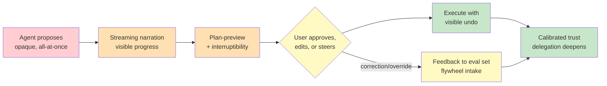

# Chapter 3.6 — Agentic Product Design, UX & Trust

*Part III — Systems Architecture · Domain D3 · Reading time ~28 min · Prerequisites: Ch. 3.3, Ch. 3.4*

## 1. The failure story

A company shipped an agent that was, by every engineering measure, excellent. Its deterministic core was sound, its retrieval was well-grounded, its containment stack was layered, its security model broke every trifecta. In offline evaluation it resolved tasks correctly 91% of the time. The team was proud of it, and they were right to be — the machine worked.

It posted 60% weekly churn. Users tried it once, sometimes twice, and left. The engineering team was baffled, because the logs showed the agent doing good work. So they watched session recordings, and the problem was immediate and total. Users would give the agent a task and then stare at a spinner for ninety seconds with no indication of what was happening — was it working, was it stuck, had it understood? When output finally appeared, it arrived all at once, fully formed, with no visible reasoning, so users could not tell whether to trust it; many redid the work themselves to check. When the agent started down a wrong path, users could see it going wrong but had no way to interrupt and correct — they could only wait for it to finish being wrong, then start over. And the first time the agent made a visible mistake, users did not file feedback and try again; they concluded the agent could not be trusted and never returned.

Every layer below the product worked. The 91% task success was real. But task success is a machine metric, and the users were not experiencing the machine — they were experiencing a black box that made them wait, could not be steered, and gave them no basis to trust it. The team had built a system that was correct and a product that was unusable, and had measured only the first.

The question the roadmap never asked: **what does the human need to see, control, and believe for this system's correctness to become the user's confidence?**

## 2. The mental model

### 2.1 Trust is the product loop

For a deterministic tool, trust is not a design variable — a calculator that returns the right answer is trusted by default, because the user can verify the output and the tool has no agency to misuse. An agent is different. It acts with autonomy on the user's behalf, often on tasks the user cannot fully verify, and so the user must *decide how much to delegate to it*. That decision — recalibrated after every interaction — is the core loop of an agentic product. Get it right and the user grants more autonomy over time, which is the honest measure of a working agent. Get it wrong and the user either abandons the product or, worse, over-delegates past its reliability envelope and gets burned.

Trust is not a feeling to be maximized; it is a *calibration* to be made accurate. The automation literature — Lee and See's work on trust in automation is the canonical reference — is precise about this: the goal is trust that matches the system's actual reliability, neither more nor less. Overtrust leads the user to delegate tasks the agent cannot handle; undertrust leads them to check everything and capture none of the value. **The job of an agentic product is not to make users trust the agent more, but to make their trust *accurate* — to give them, at every moment, a truthful picture of what the agent is doing and how reliable it is, so the autonomy they grant matches the autonomy the agent has earned.** A product that inflates trust is setting up the catastrophic-approval failure of Chapter 3.3 from the user's side; a product that cannot build trust at all churns like the failure story.

### 2.2 The interaction patterns that build calibrated trust

Trust is built or destroyed in specific, designable moments, and the field has converged on a small set of patterns that work. *Plan-preview → approve → execute*: the agent shows what it intends to do before it does it, the user approves or edits, then it executes. This is the reversibility and preview layer from Chapter 3.4 surfaced as a product affordance — the same dry-run that contains blast radius also gives the user a basis to trust the action. *Streaming narration*: the agent shows its work as it happens — "searching the knowledge base… found three relevant documents… drafting the summary" — so the ninety-second spinner becomes ninety seconds of visible, legible progress. This single change often moves churn more than any model improvement, because it converts opaque waiting into observable work.

*Interruptibility and mid-task steering*: the user can stop the agent mid-flight and redirect it, rather than waiting for it to finish being wrong. This requires the durable, suspendable execution of Chapter 3.2 — you can only interrupt an agent whose state you can pause and resume — which is why the product affordance and the architecture are the same decision viewed from two sides. *Undo as a visible affordance*: the reversibility you engineered in Chapter 3.4 is worthless to trust if the user does not know it exists. A soft-delete window the user cannot see does not reduce their fear of the agent; a visible "undo" button does. The backend capability and the UX surface are different things, and only the surfaced one builds trust.

### 2.3 Expectation architecture: scope, refusal, and error as trust events

Users calibrate trust against expectations, so the product must set expectations deliberately. *Explicit scope* — a clear statement of what the agent will and will not do — prevents the overtrust that leads users to delegate past the envelope. An agent that says "I can draft the reply but I won't send it without your approval" is architecting expectation, and the honesty buys more durable trust than a capability claim would. *Graceful refusal* matters as much as capability: how an agent declines a task it should not attempt is a trust event, and a refusal that explains itself preserves trust while a silent failure or an overconfident wrong attempt spends it.

*Error messaging* is the highest-leverage and most-neglected surface. Blame asymmetry is brutal and real: one visible agent error costs more trust than ten silent successes earn. This means the moment of failure is not a footnote — it is the single most important trust interaction in the product. An error that is honest, specific, and paired with a clear recovery path ("I couldn't complete the payment because the payee isn't on your approved list — here's how to add them") preserves the relationship. An error that is vague, that hides what went wrong, or that leaves the user stranded ends it. You design the failure flow with more care than the success flow, because the failure flow is where retention is won or lost.

### 2.4 Feedback as flywheel intake

Every correction, edit, and override a user makes is two things at once: a trust event in the moment, and a data point for the system's improvement over time. A product that treats feedback as a support ticket wastes it; a product engineered for the flywheel routes every correction into the evaluation datasets that make the next version better. When a user edits the agent's draft, that edit is a labeled example of what "right" looks like for this user. When a user overrides an agent decision, that override is a signal that the agent's confidence was miscalibrated. Capturing these as first-class UX events — not friction to minimize but signal to harvest — is what connects the product surface to the evaluation and continuous-improvement machinery of Part IV. This is the bridge to Chapters 4.3 and 5.4: the feedback surface you design here is the intake pipe for the eval datasets there.

The design tension is that good feedback capture can add friction, and friction is exactly what a smooth product tries to remove. The resolution is to make the highest-signal feedback the most natural action: the edit the user was going to make anyway becomes the training label, the "that's not right" the user was going to think becomes a one-click override that routes into the eval set. You harvest the feedback the user was already going to give, rather than interrupting them to ask for feedback they weren't.

### 2.5 Latency and the metrics that tell the truth

Latency in an agentic product is a UX-economics problem, not just an engineering one. Perceived latency and actual latency diverge, and streaming narration is the lever: a task that takes ninety seconds *feels* fast if the user watches legible progress the whole time, and *feels* broken if they watch a spinner. Spend the latency budget where it buys the most product value — visible early progress, a fast first token, a quick plan-preview — rather than optimizing total time uniformly.

And measure the product with metrics that reflect the human loop, not just the machine. Task success rate is necessary and radically insufficient — it was 91% in a product that churned 60%. The metrics that tell the truth about an agentic product are: *intervention rate* (how often users must correct or take over — falling intervention is the agent earning trust), *delegation depth over time* (users granting more autonomy is the honest NPS of an agent, the signal that trust is being built accurately), *trust-adjusted retention* (do users come back, which the failure story's 91% completely failed to predict), and *recovery rate after first failure* (given blame asymmetry, whether the product survives its first visible mistake is often the whole ballgame). These are the metrics that would have caught the failure story on day one; task success alone hid it until the churn report arrived.

*Red: the black-box agent of the failure story, opaque and unsteerable. Orange/yellow: the affordances that make its work legible and correctable — narration, preview, interrupt, and the corrections that feed the flywheel. Green: execution the user can undo, and the calibrated trust that lets delegation deepen over time. The machine's correctness becomes the user's confidence only across this loop.*

## 3. The production lens

Take the claims agent that has run through this whole part — deterministic core, human-in-the-loop tiers, containment stack, security model. It is, by now, a sound machine. The product question is how a claims adjuster experiences it, and whether that experience produces accurate trust.

Design the interaction as a trust-building loop. When the adjuster hands the agent a claim, it narrates: "pulling policy details… checking coverage… the claim is within policy limits, drafting an approval for your review." The ninety-second wait becomes visible work. It surfaces a plan-preview — "I'll approve $4,200 to the policyholder; here's the coverage basis" — which is the Chapter 3.4 dry-run as a trust affordance and the Chapter 3.3 approval gate as a product surface, the same decision seen from three chapters. The adjuster can interrupt if the reasoning looks wrong, which requires the suspendable execution of Chapter 3.2. If the agent must decline — a claim it is not authorized to settle — it refuses gracefully and explains the scope boundary. If it errs, the error is specific and paired with recovery, because this adjuster's first visible agent error is the moment that decides whether they ever delegate to it again.

Then measure the loop honestly. Do not report "the agent resolved 91% of claims" to the roadmap; report intervention rate trending down, delegation depth trending up (are adjusters moving claims from "draft for my review" to "handle routine approvals autonomously"?), retention of adjusters who hit a first failure, and recovery rate after that failure. Instrument the feedback: every time an adjuster edits a draft or overrides a decision, route it into the eval set (Part IV) so the agent improves where real usage disagrees with it. The product is not the model's accuracy; it is the adjuster's accurately-calibrated willingness to delegate, and that is a thing you design, surface, and measure as rigorously as anything below it.

> **Doctrine check.** The product layer is where "humans remain the immutable source of truth" stops being an architecture principle and becomes a felt experience. Every deterministic gate, every containment layer, every identity boundary below has a human-facing surface — a preview, a narration, an interrupt, an undo, an honest error — and if that surface is missing, the human's authority is real in the system and invisible in the product. The agent proposes visibly; the human disposes knowingly; and trust is the measure of whether the human's knowledge matches the machine's behavior.

## 4. Edge-case catalog

| # | Edge case | What it looks like | Detection | Mitigation |
|---|---|---|---|---|
| 1 | Overtrust / anthropomorphism | Users delegate past the reliability envelope, treating the agent as more capable than it is | Rising delegation depth with rising intervention/error rate on delegated tasks | Deliberate friction and explicit scope at the envelope's edge; confidence display that never overstates |
| 2 | Transparency backfire | Exposing raw reasoning erodes confidence or leaks sensitive process | Trust drops after adding reasoning display; users confused by chain-of-thought | Show legible narration and decisions, not raw model reasoning; disclose at the right altitude |
| 3 | The autonomy cliff | Users toggle between full manual and full delegation with no usable middle | Bimodal usage; no adoption of intermediate autonomy settings | Design the gradient explicitly (mirrors Ch. 3.3's matrix, user-side) with promotion gates between levels |
| 4 | Blame asymmetry after first failure | One visible error ends the relationship despite many prior successes | Sharp retention drop concentrated on users' first observed agent error | Engineer the recovery/repair flow with more care than the success flow; measure recovery rate |
| 5 | Opaque waiting | Users abandon during long, unnarrated latency, unsure if the agent is working | High drop-off during processing; churn uncorrelated with task success | Streaming narration; fast first token; make perceived progress visible even when total time is fixed |
| 6 | Invisible reversibility | A real undo/soft-delete exists but users don't know, so fear of irreversibility suppresses use | Users redo work to "be safe"; undo capability exists but is rarely invoked | Surface undo as a visible affordance; state the recovery window in the UI at the moment of action |

## 5. Claude & MCP in this chapter

The clearest way to internalize these patterns is to study products that embody them. Claude Code's plan mode is a plan-preview → approve → execute loop in production: it shows the intended plan before touching anything, which is exactly the trust affordance this chapter argues for. Artifacts are a case study in making agent output legible and steerable — visible, editable, re-runnable — rather than a wall of text delivered all at once. Treat these surfaces as pattern libraries: identify which trust interaction each one implements (preview, interruptibility, visible output, graceful refusal) and map it back onto your own product's loop.

Product surfaces and their names evolve quickly. The durable references are the human-AI interaction canon — Microsoft's HAX guidelines and the Lee & See trust-calibration literature — rather than any specific current feature; verify the current Claude product patterns and capabilities at docs.claude.com at study time, and use the shipped products as living examples of the principles, not as fixed prescriptions.

## 6. Design exercise

Design the trust ladder for the claims agent. Deliver:

1. Five user-grantable autonomy levels, from most supervised to most autonomous — the user-side mirror of Chapter 3.3's autonomy matrix. State what the agent does and does not do at each level.
2. For each transition between levels, the specific UI affordance by which a user grants the next level of autonomy — where it appears, what it says, and what it makes visible about the risk.
3. For each transition, the measured criterion that must clear before the product *offers* the next level — the honest evidence (intervention rate below X on this task class, recovery rate above Y) that the agent has earned the promotion. The product offers autonomy the agent has proven, not autonomy the user merely wants.
4. The narration, plan-preview, interrupt, and undo affordances present at each level, and how they change as autonomy increases.
5. The four product metrics you would put on the dashboard, and specifically how each one would have caught the 60%-churn failure that a 91% task-success metric hid.

**Review standard.** The ladder is a genuine gradient with a usable middle, not a manual/autonomous toggle; each promotion is gated on measured earned trust, not user preference alone; every autonomy level surfaces the human-facing affordances (narration, preview, interrupt, undo) appropriate to its blast radius; the error/recovery flow is designed with visible care; and your metrics measure the human's calibrated delegation, not just the machine's accuracy.

## 7. Self-test

1. *"Our agent has 91% task success, so it's a strong product."* — This is precisely the failure story's mistake. Task success is a machine metric; it was 91% in a product that churned 60%. Users experience visibility, steerability, and trust, none of which task success measures. A strong product is measured by intervention rate, delegation depth, trust-adjusted retention, and recovery rate — the metrics of the human loop, not the model.

2. *"To build trust, we should make users trust the agent as much as possible."* — Wrong goal. The goal is *calibrated* trust — trust that matches actual reliability. Maximizing trust produces overtrust, where users delegate past the reliability envelope and get burned, which is the Chapter 3.3 approval-fatigue failure seen from the user's side. The product's job is to make trust accurate, sometimes by deliberately adding friction at the envelope's edge.

3. *"We built a full undo capability into the backend, so users don't need to fear irreversible mistakes."* — Only if they can see it. A backend soft-delete the user doesn't know about does nothing for their fear — they still redo work "to be safe." Reversibility builds trust only when surfaced as a visible affordance, with the recovery window stated at the moment of action. The backend capability and the UX surface are different things, and only the surfaced one counts.

4. *"The first time the agent makes a mistake, we'll capture the feedback and improve — one error isn't a big deal."* — Blame asymmetry says otherwise. One visible error costs more trust than ten successes earn, and the first visible failure often ends the relationship outright. The recovery flow must be designed with more care than the success flow, and recovery rate after first failure is a metric worth watching closely — because for many users, it is the whole ballgame.

5. *"More transparency is always better, so we should expose the model's full reasoning to users."* — Not always. Transparency can backfire: raw chain-of-thought can confuse users, erode confidence, or leak sensitive process. The goal is *legibility* at the right altitude — narration of what the agent is doing and the decisions it reached — not a raw dump of model reasoning. Show the work that builds calibrated trust, not all the work there is.

## 8. Spaced-review card

- From memory: state why trust is the core loop of an agentic product but not of a deterministic tool, and what "calibrated trust" means.
- From memory: name four interaction patterns that build calibrated trust, and for each, the earlier-chapter architecture it depends on or surfaces.
- From memory: name the four agent-product metrics that tell the truth about the human loop, and explain how each would have exposed the 91%-success-60%-churn failure.

---

*Part III is complete. You have built the system: a deterministic core the agent proposes into, durable state that survives restarts, human oversight spent where it counts, containment that bounds every blast radius, a security model that assumes the input is an adversary, and a product surface that turns all of it into calibrated human trust. Next: Part IV — Production Operations, the center of gravity, where Chapter 4.1 begins with the discipline that governs everything you just built: evaluation, the product's immune system, without which you cannot know whether any of it actually works.*
