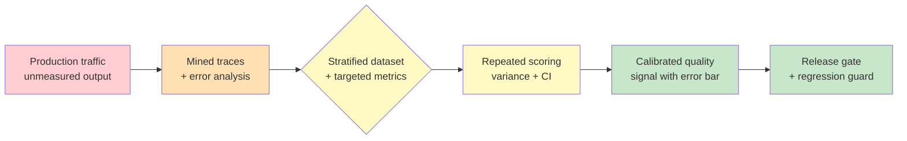

# Chapter 4.1 — Evaluation Foundations

*Part IV — Production Operations · Domain D4 · Reading time ~30 min · Prerequisites: Ch. 1.1, Ch. 3.6*

## 1. The failure story

A support-automation team shipped an agent on the strength of a test suite they were proud of: fifty hand-picked cases, each one a real customer question, each one with a carefully written ideal answer. The agent passed forty-eight of the fifty. They called that 96% and shipped.

Production traffic looked nothing like the suite. The fifty cases were the questions the team *thought of* — clean, well-formed, one intent each. Real customers sent multi-part questions, questions with an angry preamble, questions about a product edge case the team had never documented, questions in the second language the product supported and the suite did not. Roughly 40% of production traffic was some kind of edge case the fifty cases never imagined. On that 40%, the agent was not at 96%. Nobody knew what it was at, because there was no measurement of production quality at all — the fifty cases ran in CI, passed, and that was the last time quality was quantified.

The failure surfaced not as a metric but as a mood. Support leads started saying the agent "felt worse lately." Escalations crept up. A large customer complained that the agent had confidently given a wrong answer about data retention — a compliance-adjacent error. When the team went looking for how often this happened, they found they could not answer. They had no production eval, no error taxonomy, no way to segment quality by question type. They had a number from before launch and a bad feeling now, and nothing in between. Rebuilding took a quarter, and most of that quarter was spent constructing the measurement apparatus that should have existed on day one.

The question the team never asked: **not "does the agent pass our tests," but "how will we measure quality on the traffic we haven't imagined yet, continuously, after launch?"**

## 2. The mental model

### 2.1 Evaluation is the product's immune system, not its final exam

The fifty-case suite failed because it was conceived as a *gate you pass once* rather than a *system that lives with the product*. A final exam asks "is it good enough to ship." An immune system asks "is it still healthy, right now, against threats that did not exist when it was designed." Agentic systems need the second, because their input distribution is open-ended and non-stationary: the world changes, users find new phrasings, the product adds features, the model gets swapped. A static suite measures the agent against yesterday's imagination of the problem, and yesterday's imagination is exactly the 60% that was easy.

The immune-system framing has three consequences that organize the rest of this chapter. Evaluation must be *continuous* — sampling production reality, not just gating pre-launch. It must be *evolving* — new failure modes become new eval cases, so the suite grows toward the hard tail rather than sitting on the easy center. And it must be *diagnostic*, not just a scalar — a single "92%" tells you nothing about *what* is failing or *for whom*, and a number you cannot decompose is a number you cannot act on. **Evaluation is not a gate the system passes before launch; it is the measurement apparatus that tells you, continuously and in enough detail to act, whether the system is doing its job on the real distribution of inputs — and a system without it is not "probably fine," it is unmeasured, which in production is the same as unknown.**

### 2.2 Metric taxonomy: outcome versus process, capability versus regression

Not all metrics measure the same kind of thing, and conflating them is a common way to be confidently wrong. The first split is *outcome* versus *process*. Outcome metrics measure whether the task was accomplished: task success rate, resolution rate, whether the customer's problem was actually solved. These are what you ultimately care about. Process metrics measure whether the steps along the way were right: tool-call correctness (did it call the right tool with the right arguments), grounding rate (were claims supported by retrieved evidence), step efficiency (did it take four turns or forty). Process metrics are diagnostic — when the outcome is bad, they tell you *where* it went wrong — and they are often available when outcome is expensive to judge.

You need both, and you need to not confuse one for the other. A high process score with a low outcome score means the agent is executing good-looking steps that do not add up to a solved problem. A high outcome score with poor process scores might mean the agent is getting lucky in ways that will not generalize. The second split is *capability* evals versus *regression* suites. Capability evals ask "can the system do this hard new thing" — they push the frontier and are how you decide whether a new version is *better*. Regression suites ask "did we break anything that used to work" — they protect the floor and are how you decide whether a new version is *safe to ship*. They have different dynamics: capability evals should be hard and rotate as the system improves; regression suites should be stable and comprehensive and grow every time you fix a bug.

### 2.3 Reliability is the production statistic: pass@k versus pass^k

Here is a distinction that separates people who have run agents in production from people who have only demoed them. **pass@k** asks: given *k* attempts, does *at least one* succeed? It is the right metric for a system with a verifier and cheap retries — code generation against a test suite, where you can try five times and keep the one that passes. **pass^k** (pass-to-the-k) asks: given *k* independent attempts, do *all* of them succeed? It is the right metric for reliability, because production does not get to retry-until-lucky on an action that already sent the email, moved the money, or told the customer something wrong.

The gap between these two is enormous and it is where naive optimism lives. An agent that succeeds 90% of the time per attempt has a pass@5 near 99.999% — it looks nearly perfect if you get five tries. But its pass^5 — succeeding on five consecutive independent tasks — is 0.9^5 ≈ 59%. Run it across a thousand customers a day and it fails a solved-looking task hundreds of times daily. **Reliability, not peak capability, is the production statistic, because a user does not experience your average success rate — they experience the specific outcome of their specific task, and an agent that is brilliant four times out of five is an agent that visibly fails every fifth person who trusts it.** When you report an eval number, know which question it answers: "could it, with retries" or "will it, every time." The second is the one that predicts production, and it is almost always lower than the demo suggested.

### 2.4 Dataset engineering and the discipline of looking first

An eval is only as good as its dataset, and building the dataset is most of the work. There are three honest sources. *Golden sets* come from expert annotation — a human who knows the domain writes the input and the ideal output, giving you high-quality but expensive labels. *Mined production traces* come from real traffic (this is where the observability of Chapter 4.3 pays off): you pull real inputs, especially the ones that went wrong, and turn them into eval cases, which keeps the suite anchored to reality. *Synthetic data* is generated — back-translation from verified outputs, mutation and perturbation of existing cases, combinatorial coverage of input dimensions — and it is powerful for coverage but carries validity threats, because a synthetic case tests the world your generator imagined, which may not be the world users inhabit.

Whatever the source, the dataset must be *stratified*: deliberately covering task types, difficulty levels, and edge conditions in known proportions, so you can measure quality *per stratum* and not just in aggregate. The fifty-case suite was unstratified and centered on the easy region; stratification is what would have forced the team to include the multi-part, second-language, edge-case rows they omitted. And underneath dataset work sits the single most important discipline in this chapter, associated most closely with Hamel Husain's teaching: *look at the transcripts first*. Before you compute any metric, read a few dozen actual agent transcripts — open-code what went wrong, build a failure taxonomy from what you observe, and only *then* design metrics that target those failure modes. Metrics before error analysis measure what is easy to measure; error analysis before metrics measures what is actually breaking. The taxonomy comes first, the numbers second.

### 2.5 Statistics for small n: when 3% is noise

Agentic evals often run on small datasets — hundreds of cases, not millions — and against a stochastic system, and both facts make naive comparison a trap. Because the system is nondeterministic, the *same* version scored twice gives two different numbers; there is run-to-run variance baked in. So when version B scores three points above version A, the first question is not "why is B better" but "is three points larger than the noise." Answering it requires the basic apparatus of small-sample statistics: measure variance across repeated runs, compute a bootstrap confidence interval on the score, and know your *minimum detectable effect* — the smallest true difference your dataset size can distinguish from noise. If your MDE is five points and you are excited about a three-point gain, you are excited about noise.

This matters enormously in practice because the whole release process (Chapter 4.6) gates on eval deltas, and a gate that fires on noise either blocks good changes or passes bad ones at random. Treat every eval number as an estimate with an error bar, never a point. The team that ships on "48 out of 50" is not just using a small sample — they are using a sample with no error bar at all, on which a change from 48 to 46 is indistinguishable from a change in the weather.

*Red: raw production output nobody has measured. Orange: traces mined and error-analyzed into a failure taxonomy. Yellow: the stratified dataset, targeted metrics, and repeated scoring that convert observations into numbers with variance. Green: a calibrated quality signal — an estimate with an error bar — that a release gate can actually trust.*

### 2.6 Simulation: rehearsing the distribution before it arrives

Everything above measures the system against cases that already exist — mined from production or authored from failures. But the highest-stakes moments are the ones with no production history yet: the launch itself, a new task stratum, an adversarial campaign that has not happened. For these, the missing instrument is **simulation**: generating the encounter before reality does. Three forms earn their keep. A **user simulator** — an LLM role-playing the customer, configured with personas and goals drawn from the Ch. 0.3 task spec — drives full multi-turn conversations against the agent, turning "we tested 40 hand-written dialogues" into "we ran 2,000 simulated sessions stratified by persona, and the frustrated-customer stratum fails 4× the median." **Synthetic edge-case generation** takes each edge-case catalog row and the spec's exception inventory and asks a model to produce structured variants — the malformed loss date, the policy block the SOP forgot — populating the tail of the dataset that production has not yet supplied. And **adversarial simulation** runs the Ch. 3.5 attack classes as standing eval strata rather than a one-time red-team event.

Two disciplines keep simulation honest. First, the *simulation-to-reality gap* is itself a measurable quantity: once production traffic arrives, score the same metrics on real sessions and compare; a simulator whose failure ranking disagrees with production's is miscalibrated and must be tuned like any other instrument. Second, simulated cases are labeled as such in the dataset forever — they answer "what might happen," never "what our success rate is," and a release gate (Ch. 4.6) may *block* on simulated failures but should never *claim* reliability from simulated successes. Used this way, simulation is the pre-production proving ground that makes the first day of production traffic a confirmation rather than an experiment.

## 3. The production lens

In production the eval suite is a living system with a maintenance regime, and the tell of a mature team is that the suite grows every week from real failures. Wire it to the observability layer of Chapter 4.3 so that production traces feed the dataset: sample live traffic, stratified by task type and customer tier rather than uniformly (uniform sampling drowns the rare, high-consequence tail in routine volume), score the sample, and route the failures into the regression suite as new cases. This is the flywheel the whole discipline is built around — production reveals a failure, the failure becomes an eval case, the eval case prevents the regression forever after — and it is the concrete form of the feedback loop that Chapter 3.6 designed the product surface to capture. Every user correction and override is eval data; the product surface is the intake and the eval suite is the destination.

Run the suite at two cadences. Offline, in CI, the regression suite gates every release with statistical thresholds (Chapter 4.6). Online, continuously, sampled scoring watches the live distribution for drift — a rising failure rate on a stratum, an input distribution shifting away from what the suite covers, an eval-metric SLO breached. The online layer is what would have caught the failure story in week one instead of quarter two: a drift detector on the second-language stratum, an alert when edge-case volume exceeded suite coverage, a quality metric that fell before the customer complained.

> **Doctrine check.** Evaluation is where "you cannot manage what you cannot measure" meets the probabilistic core. The deterministic seam of Chapter 3.1 bounds what the agent can *do*; evaluation bounds what you *know* about how well it does it. A system whose quality you cannot state as a number with an error bar, segmented by who it serves and what they ask, is a system running on faith — and faith is not an operating posture for something that acts on users' behalf at scale.

Guard against the failure modes that make eval numbers lie even when the apparatus exists. *Saturation and contamination*: a suite the system has implicitly memorized reports high scores that mean nothing, so rotate cases and keep strict holdouts. *Non-stationary ground truth*: correct answers that change as the world changes, so freshness-tag cases and expire stale ones. *Simpson's paradox*: an aggregate that rises while a critical segment falls, which is why you *always* stratify and never trust the blended number. And *Goodharting*: the moment a metric becomes a target, teams optimize the metric artifact instead of the user outcome, so treat any metric as a proxy that must be periodically re-validated against ground-truth user value, and rotate the specifics so they cannot be gamed.

## 4. Edge-case catalog

| # | Edge case | What it looks like | Detection | Mitigation |
|---|-----------|--------------------|-----------|------------|
| 1 | Eval saturation / contamination | Scores climb while real quality doesn't; the system has memorized the suite | Held-out fresh cases score far below the standing suite | Rotate cases; strict train/eval holdout hygiene; keep a sealed set the system never trains or tunes against |
| 2 | Non-stationary ground truth | A case's "correct" answer changed with the world; the agent is marked wrong for being right | Correct-looking outputs fail; failures cluster on time-sensitive cases | Freshness-tag cases; expire and re-annotate; separate timeless from time-sensitive strata |
| 3 | Simpson's paradox | Aggregate metric up, a critical segment (compliance, a language, a tier) down | Stratified view diverges from the blended number | Always report per-stratum; gate on worst critical segment, not just the average |
| 4 | Goodharted metric | Team optimizes the score; user outcomes flat or worse | Metric-to-outcome correlation weakens over time | Re-validate proxy against ground-truth value; rotate metric specifics; watch outcome, not just proxy |
| 5 | pass@k mistaken for reliability | Impressive "best of k" number; production fails routinely | Per-attempt (pass^k) reliability far below reported pass@k | Report pass^k for effectful tasks; reserve pass@k for verifier-plus-cheap-retry settings |
| 6 | Small-n noise as signal | A 3% "gain" celebrated and shipped; next run reverses it | Change is within the run-to-run variance / confidence interval | Compute variance, bootstrap CI, and MDE; require the delta to exceed the noise floor before shipping |

## 5. Claude & MCP in this chapter

Evaluation is largely provider-neutral discipline — the taxonomy, the flywheel, the statistics apply regardless of which model sits underneath — but Anthropic publishes concrete eval guidance and tooling worth mapping onto this frame: how to structure eval datasets, how to run graded evals (which Chapter 4.2 develops into judge validation), and how to think about capability versus safety evals. Treat that guidance as a source of patterns and defaults, and treat the doctrine here — error analysis first, stratify always, reliability over peak capability, error bars on every number — as the invariant that survives any particular tool.

The specifics of eval frameworks, harnesses, and any published benchmark numbers move quickly and are exactly the kind of fast-moving fact to verify at study time against docs.claude.com rather than trust from memory. A benchmark score you memorized is a non-stationary ground truth of its own — likely stale, possibly contaminated, and never a substitute for measuring your own system on your own stratified data.

## 6. Design exercise

Design the v1 evaluation suite for a contract-review agent (it reads a contract and flags risky clauses, missing protections, and deviations from a playbook). Deliver:

1. **Dataset sources and plan:** how you build the golden set, what you mine from production traces once you have them, where you use synthetic data and the specific validity threat you accept when you do.
2. **Stratification plan:** the strata (contract type, clause category, difficulty, jurisdiction, edge conditions) and the coverage proportions, with a note on which stratum is highest-consequence.
3. **Three outcome metrics and four process metrics,** each with a one-line definition and why it belongs in this suite; identify which are diagnostic for which failure modes.
4. **CI gate thresholds with statistical justification:** the pass bar per stratum, the minimum detectable effect your dataset size supports, and how you keep a 2% run-to-run wobble from either blocking good releases or passing bad ones.
5. **The error-analysis protocol** you run *before* finalizing any of the above: how many transcripts, coded how, into what taxonomy.

**Review standard.** Error analysis precedes metric design, not the reverse; the suite is stratified and gates on the worst critical segment rather than the aggregate; at least one metric is a reliability (pass^k-style) statistic, not a best-of-k; every threshold carries an error bar and an MDE; and you can name how a production failure becomes a new eval case, closing the flywheel.

## 7. Self-test

1. *"Our agent passed 48 of 50 test cases, so it's 96% accurate."* — Two errors in one sentence. First, fifty unstratified, hand-picked cases measure the easy center, not the production distribution, so "96%" describes the suite, not reality. Second, there is no error bar: against a stochastic system a 48/50 could be 46/50 on the next run, and a sample this small cannot distinguish a real regression from noise. The honest statement is "96% ± a lot, on the questions we thought of."

2. *"We hit 90% task success, and best-of-five is 99.99%, so reliability is basically solved."* — This confuses pass@k with pass^k. Best-of-five (pass@5) only helps if you have a verifier and can cheaply retry — which you cannot on an effectful action already taken. The production-relevant statistic is pass^k: five consecutive tasks all succeeding is 0.9^5 ≈ 59%. The user experiences their one task, not your best of five. Reliability is not solved; it is 59%.

3. *"Let's compute the metrics first, then read some transcripts if the numbers look off."* — Backwards, and it is the most common mistake in the field. Metrics computed before error analysis measure what is easy to quantify, not what is actually breaking. Reading transcripts first builds the failure taxonomy that tells you *which* metrics to compute. Look first, taxonomize, then measure the failures you found — Husain's discipline exists precisely because numbers-first evaluation systematically misses the real problems.

4. *"Our overall score went from 88% to 91%, so the new version is better — ship it."* — Not established. Two questions come first: is three points larger than the run-to-run variance and the confidence interval (small-n noise), and did any critical *segment* fall while the aggregate rose (Simpson's paradox)? A three-point aggregate gain hiding a ten-point drop in the compliance stratum is a regression wearing an improvement's clothes. Stratify and check the noise floor before you ship.

5. *"We built a great eval suite at launch; now we just run it on every release."* — A suite that does not grow is a suite decaying toward irrelevance. Production is non-stationary: new phrasings, new features, new failure modes appear that the launch suite never imagined — exactly the 40% edge cases from the failure story. Evaluation is an immune system, not a final exam: it must continuously sample production, absorb new failures as new cases, and rotate against saturation. A frozen suite measures an increasingly obsolete version of the problem.

## 8. Spaced-review card

- From memory: state the immune-system framing of evaluation and the three properties it demands (continuous, evolving, diagnostic), and contrast it with the final-exam framing that produced the failure story.
- From memory: define pass@k and pass^k, give the setting each one is right for, and compute pass^5 for a 90%-per-attempt agent.
- From memory: name the order — error analysis, taxonomy, then metrics — and explain why reversing it systematically measures the wrong things; then name three ways an eval number can lie even when the apparatus exists.

---

*Next: Chapter 4.2 — LLM-as-Judge & Grader Validation, where the metric you just designed runs into a hard problem — for most agentic outputs there is no cheap automatic scorer, so you reach for a model to grade a model, and discover that an unvalidated judge is a measurement instrument you have never calibrated, cheerfully reporting 92% while the truth is 71%.*
