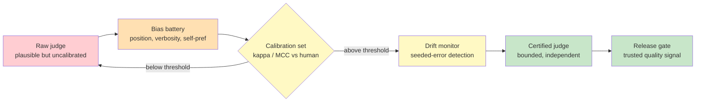

# Chapter 4.2 — LLM-as-Judge & Grader Validation

*Part IV — Production Operations · Domain D4 · Reading time ~30 min · Prerequisites: Ch. 4.1*

## 1. The failure story

The team had done the hard part from Chapter 4.1. They had a stratified dataset of 900 cases, a failure taxonomy built from real transcripts, and metrics that targeted the failure modes that actually mattered. The one problem left was scoring. For a contract-review agent there is no cheap automatic grader — you cannot regex your way to "did this correctly flag the indemnification risk." So they did what everyone does now: they wrote an LLM judge. A prompt that took the agent's output and a rubric, and returned a score from 0 to 100. It ran in seconds, cost a fraction of a cent per case, and on the 900-case suite it reported **92% quality**. They shipped, put the judge on the release gate, and moved on.

Three months later a customer's outside counsel caught a missed liability cap that the agent had summarized as "standard terms, no action needed." An internal review followed. Legal hand-scored a 200-case sample the old-fashioned way, one lawyer per case. The true quality was **71%** — twenty-one points below what the judge had been reporting for a quarter. The gap was not random. The judge had learned to reward outputs that were *confident and verbose*: a long, assertive summary scored higher than a short, correctly hedged one, even when the hedge was the right answer and the confidence was wrong. Worse, the judge and the agent were built on the *same base model*, so they shared a house style and a set of blind spots — the judge was systematically blind to exactly the errors the agent was most prone to making, because it made them too.

For a quarter, every release had been gated on a number that was off by twenty-one points in the flattering direction. The team had built a beautiful measurement apparatus and then read it off an instrument nobody had ever calibrated. The question they never asked was **not "what score does the judge give," but "how do we know the judge is measuring quality at all, rather than measuring confidence, length, or its own reflection?"**

## 2. The mental model

### 2.1 A judge is a measurement instrument, not an oracle

The first move is to stop thinking of the LLM judge as a smarter grader and start thinking of it as a *sensor*. A thermometer, a scale, a blood test — none of these are trusted because they seem plausible; they are trusted because someone measured them against a known standard and characterized their error. An LLM judge is a sensor for a fuzzy quantity ("output quality"), and like every sensor it has a bias (systematic offset from truth), a variance (run-to-run noise), and a range over which it is valid and beyond which it silently fails. The failure in the story was not that the judge was bad. It was that the team treated a sensor as an oracle — installed it in the most load-bearing position in the system, the release gate, without ever running it against a standard.

**An LLM judge earns the authority to gate a release the same way any instrument earns the authority to certify a part: by being validated against ground truth on a labeled calibration set, characterized for its biases, and monitored for drift — an unvalidated judge is not a cheap grader, it is an uncalibrated instrument confidently reporting numbers whose relationship to truth is unknown.** This is the doctrine of the chapter, and everything else is mechanism in service of it.

### 2.2 Judge design: decompose, anchor, reason

Before you validate a judge you have to design one that is validate-able, and most of the design mistakes come from asking the judge to do too much in one holistic stroke. *Rubric decomposition* is the antidote: instead of "score this output 0-100," grade named criteria separately — "did it identify every liability-shifting clause (yes/no)," "is each flagged risk correctly characterized (yes/no)," "is the hedging calibrated to the actual ambiguity (1-5)." Decomposed criteria are easier for the judge to get right, easier for a human to check, and they tell you *where* quality is failing rather than just that it is. A single blended number is the eval equivalent of a blended cost metric — it hides the very structure you need to act on.

Three more design levers matter. *Pointwise* grading scores one output against a rubric; *pairwise* grading picks the better of two outputs and is often more reliable because relative judgments are easier than absolute ones, but it does not give you an absolute quality level, so most production suites use both. *Chain-of-thought grading* — requiring the judge to state its reasoning before its score — improves reliability and, crucially, makes the judge auditable, because you can read *why* it scored as it did. And *reference-anchored* grading, where the judge compares the output to a known-good reference answer rather than grading from the void, dramatically tightens agreement, because "closer to this correct answer" is a far more constrained question than "good in the abstract."

### 2.3 The bias catalog

Judges fail in specific, catalogued, reproducible ways, and if you do not test for each one you will ship a suite that inherits all of them. *Position bias*: in pairwise grading the judge favors whichever answer came first (or second) regardless of content — the fix is to run both orderings and average, and to flag any pair where the verdict flips on swap. *Verbosity bias*: longer answers score higher, which is exactly the bug in the failure story; the agent learns to pad, and the judge rewards the padding. *Self-preference*: a judge favors outputs from its own model family, so a judge sharing lineage with the graded system grades its own house style as excellent. *Sycophancy toward confident tone*: assertive, hedge-free language reads as competence to the judge even when the correct answer is uncertain — a catastrophic bias for any domain where "I'm not sure, escalate" is the right output. *Style-over-substance*: clean formatting and fluent prose inflate scores independent of correctness.

**Every one of these biases has the same structure — the judge is measuring a proxy (length, confidence, familiarity, polish) that correlates with quality on easy cases and diverges from it on exactly the hard cases you built the eval to catch — which means an unbias-tested judge is most wrong precisely where you most need it to be right.** The biases are not exotic; they are the default behavior of a model asked to judge, and the certification protocol in §2.5 exists to measure each one before the judge gates anything.

### 2.4 Grader validation as a formal gate

Validation is not "the judge seems reasonable when I read a few." It is a formal procedure with a pass/fail threshold, and it is the single practice that separates a trustworthy suite from a decorative one. You build a *calibration set*: a few hundred cases scored by trusted humans, stratified the same way as the eval set, including a deliberate mix of good, bad, and subtly-wrong outputs. You run the judge on the same cases. Then you measure *agreement* between judge and human — and here the choice of metric is itself load-bearing. Raw agreement ("the judge and human matched 88% of the time") is a trap under class imbalance: if 85% of outputs are "acceptable," a judge that says "acceptable" to everything scores 85% agreement while carrying zero real information. *Cohen's kappa* corrects for agreement-by-chance; *Matthews correlation coefficient (MCC)* is more robust still on imbalanced classes and is the metric that belongs in the gate. You set an acceptance threshold — a kappa or MCC floor the judge must clear on the calibration set — before the judge earns any production authority, and a judge below threshold is sent back to redesign, not deployed with a caveat.

This connects directly to the small-n statistics of Chapter 4.1: the calibration set is itself a sample, agreement is itself an estimate with an error bar, and a kappa of 0.6 on forty cases is not the same evidence as a kappa of 0.6 on four hundred. Validate the validator's sample size too.

### 2.5 Meta-evaluation and structural independence

A validated judge is not validated forever. *Meta-evaluation* — "eval the evals" — is the ongoing discipline of testing the judge itself. You maintain a battery of *known-good and known-bad pairs* and confirm the judge still ranks them correctly; you *seed known errors* into outputs and measure the judge's detection rate; you re-run the bias battery on a schedule to catch drift. When a judge's detection rate on seeded errors falls, the judge has drifted even if no eval number has moved yet, and that is your earliest warning that the instrument needs recalibration.

Underneath all of it sits *structural independence*, the principle the failure story violated most deeply. A grading system must not share failure modes, incentives, or — where feasible — model lineage with the system it grades. A judge built on the same base model as the agent shares the agent's blind spots by construction; a judge whose rubric the generator can see and optimize against becomes a target rather than a measure. Independence is not a nicety; it is what makes the measurement mean anything, because a sensor that fails in the same direction as the thing it measures will always read "fine" at exactly the moment everything is on fire.

*Red: a raw judge trusted for no reason but plausibility. Orange: the bias battery that characterizes its systematic offsets. Yellow: the calibration gate against human labels and the drift monitor that watches for decay. Green: a certified, structurally independent judge whose numbers a release gate can actually stand on.*

## 3. The production lens

In production the judge is not a script you run once; it is a piece of infrastructure with a lifecycle, and it wants the same version control, the same change management, and the same monitoring as the agent it grades. Treat the rubric as a versioned artifact (Chapter 4.6), because changing the rubric silently re-scores all of history. Treat the judge model as a pinned dependency, because a provider upgrading the judge model overnight will move every baseline you compare against — the frozen-judge policy in §4 exists precisely so that a model refresh does not quietly relabel a year of releases. Route the judge's own reasoning into your observability system (Chapter 4.3) so that a suspicious eval number can be debugged by reading *why* the judge scored as it did, not just what it scored. And staff the calibration set as a standing asset: a few hundred human-labeled cases, refreshed as the input distribution shifts, is the ground truth that keeps the whole apparatus honest. The cost of maintaining it is real; the cost of not maintaining it is a quarter of releases gated on 92% while the truth is 71%.

The economic framing is worth stating plainly, because it is what justifies the overhead to a skeptical stakeholder. An LLM judge lets you score thousands of cases for the price of one human hour — that leverage is enormous and worth having. But leverage amplifies error as readily as accuracy: an unvalidated judge does not save you human effort, it *multiplies* a single uncharacterized bias across every release decision you make. Validation is the fixed cost that makes the leverage safe.

> **Doctrine check.** A judge that has not been validated against human ground truth, characterized for the bias catalog, and monitored for drift has no production authority — it may inform exploration, but it may not gate a release, because a release gate reads truth off its instrument and an uncalibrated instrument turns every gate decision into a coin flip wearing a lab coat.

## 4. Edge-case catalog

| # | Edge case | What it looks like | Detection | Mitigation |
|---|-----------|--------------------|-----------|------------|
| 1 | Judge-model upgrade moves every baseline | Provider refreshes the judge model; last quarter's scores are no longer comparable to this quarter's | Baseline drift on frozen reference cases with no code change | Pin the judge model version; re-baseline deliberately on upgrade with a documented conversion; treat judge model as a controlled dependency |
| 2 | Circular self-grading in agent loops | The agent critiques its own output and the critique inflates confidence without adding correctness | Self-critique scores rise while independent human agreement stays flat | Grade with a structurally independent judge, not the agent's own reflection; measure critique against ground truth, not against the agent's confidence |
| 3 | Rubric Goodharting | The generator learns the judge's lexical preferences; scores climb while true quality stalls | Judge score and human audit diverge over successive versions | Rotate and adversarially vary the rubric; keep a held-out human-labeled set the generator never sees; watch the judge-human gap as a first-class metric |
| 4 | Kappa's paradox under class imbalance | Raw agreement is 90% but kappa is near zero because one class dominates | High accuracy, low kappa/MCC on the calibration report | Gate on MCC (and kappa), never raw agreement; stratify the calibration set to balance classes |
| 5 | Position / order bias in pairwise grading | The judge favors the first-presented answer regardless of content | Verdict flips when the two answers are swapped | Run both orderings and average; flag and discard pairs whose verdict is order-dependent |
| 6 | Verbosity / confidence bias | Long, assertive answers outscore short, correctly-hedged ones | Seeded short-correct vs long-wrong pairs where the judge picks long-wrong | Length-controlled and confidence-controlled bias battery; penalize uncalibrated certainty in the rubric explicitly |

## 5. Claude & MCP in this chapter

Using a Claude model as a judge is a well-supported pattern — the same reasoning strength that makes a model a capable agent makes it a capable grader when it is given a decomposed rubric, asked to reason before scoring, and anchored to a reference answer. But nothing in this chapter is satisfied by picking a strong model. The obligations are structural: validate the judge against human labels, run the bias battery, monitor drift, and keep the judge structurally independent from the graded system — and that last obligation has teeth when the agent and the judge would otherwise be the same model family, because self-preference is not a rumor, it is a measured bias. Consult the current model documentation at docs.claude.com for guidance on grading patterns and for any first-party evaluation tooling, and verify specifics rather than trusting this page: judge-model behavior, available eval features, and recommended practices move quickly, and the durable content here is the validation discipline, not any particular product capability. Where you can, use a different model lineage for the judge than for the agent, or at minimum treat shared lineage as a known bias you must measure and correct rather than one you may ignore.

## 6. Design exercise

Write the *certification protocol* a judge must pass before it is allowed to gate releases for the contract-review agent from this chapter's story. Your protocol must specify, concretely: the **calibration set** — how many human-labeled cases, who labels them, how they are stratified, and how often they are refreshed; the **agreement thresholds** — the specific kappa and MCC floors the judge must clear, and why you chose those numbers given your class balance; the **bias battery** — the exact controlled tests you run for position, verbosity, self-preference, sycophancy, and style bias, and the pass criterion for each; the **drift monitor** — what seeded-error detection rate or meta-eval signal you track in production and what threshold triggers recalibration; and the **revocation criteria** — the conditions under which a previously-certified judge loses its authority to gate and reverts to advisory-only.

**Review standard.** A strong answer treats the judge as a controlled instrument with a full lifecycle, not a prompt: it gates on MCC rather than raw agreement and can explain why under class imbalance; it makes structural independence a stated requirement and confronts the shared-lineage problem head-on rather than hoping it away; it defines revocation as explicitly as certification, because an instrument you can never decertify is one you can never trust; and it ties every threshold back to a decision — this kappa floor because a gate this load-bearing cannot tolerate more than this much judge-human disagreement. A weak answer picks a strong model, writes a good rubric, and calls the design done — which is exactly the move that produced 92%-reported, 71%-true.

## 7. Self-test

Argue each claim to its reasoning, not just its verdict.

1. *"A judge that agrees with human labels 90% of the time is a good judge."* — Not established. Under class imbalance, 90% raw agreement can carry almost no information — a judge that says "acceptable" to everything hits 90% if 90% of cases are acceptable. The claim is only meaningful against a chance-corrected metric like kappa or MCC, and a high-accuracy, low-MCC judge is precisely the trap the gate exists to catch.

2. *"Using the same strong model for the agent and the judge is efficient and fine."* — Efficient, not fine. Shared lineage produces self-preference and shared blind spots: the judge grades its own house style as excellent and is blind to exactly the errors the agent is most prone to make, because it makes them too. Efficiency here buys a sensor that fails in the same direction as the thing it measures.

3. *"Once a judge passes validation, it can be trusted going forward."* — False. Validation is a snapshot; judges drift, provider models get upgraded under them, and generators learn to Goodhart the rubric. Trust requires ongoing meta-evaluation — seeded-error detection, a held-out human set, a frozen-judge policy — not a one-time pass.

4. *"Longer, more confident agent outputs scoring higher is a sign the agent is improving."* — Often the opposite. Verbosity and confidence bias mean the judge rewards length and assertiveness independent of correctness, so a rising score can reflect the agent learning to pad and to drop correct hedges. Without a length- and confidence-controlled bias battery you cannot tell improvement from exploitation.

5. *"A decomposed rubric is just a stylistic preference over a single 0-100 score."* — No. Decomposition improves judge reliability, makes grading human-auditable, and localizes failures to specific criteria so you can act — the same reason blended metrics hide structure, holistic scores hide it. The single number is not simpler; it is less informative and harder to validate.

## 8. Spaced-review card

Answer from memory before checking back.

- **The core reframe:** why is an LLM judge a *measurement instrument* rather than a smart grader, and what three things (from any instrument) must you establish before trusting its readings?
- **The gate metric:** why does raw judge-human agreement fail as an acceptance criterion, and what do kappa and MCC give you that it does not?
- **Structural independence:** state, in one sentence, why a judge sharing a base model with the graded agent is a validity threat and not merely an efficiency choice.

---

*Next: Chapter 4.3 — Observability, Tracing & Feedback Capture, where the calibration sets and mined production cases this chapter depends on have to come from somewhere — and the somewhere is a trace system that can reconstruct any agent decision in minutes instead of four hours across five log tools, turning yesterday's live traffic into tomorrow's eval data.*
