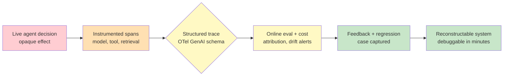

# Chapter 4.3 — Observability, Tracing & Feedback Capture

*Part IV — Production Operations · Domain D4 · Reading time ~30 min · Prerequisites: Ch. 4.1, Ch. 4.2*

## 1. The failure story

The message came in at 9 a.m.: "The agent was wrong yesterday for customer X — it approved a claim it should have flagged. What happened?" A reasonable question. It took four hours to answer.

The agent's model calls were in the LLM provider's dashboard, keyed by request ID. The tool calls were in the application logs, keyed by a different request ID with no link between the two. The retrieval step that pulled the customer's policy went through a vector database with its own logs and its own IDs. The guardrail that should have caught the issue logged to a fourth system. And the final decision — the thing the customer actually saw — was in the product database, timestamped, with no trace back to the reasoning that produced it. To reconstruct one decision, an engineer opened five tabs and hand-matched timestamps, guessing which model turn went with which tool call because nothing tied them together. By the time they found it — the retrieval had returned a stale policy version, and the model had reasoned correctly over the wrong document — half a day was gone, and the answer arrived too late to matter for the customer.

The numbers underneath the incident were their own indictment. *Five* disconnected log systems. *Zero* traces linking a tool call to the model turn that requested it. *Four hours* to reconstruct a single decision that the system had made in *eight seconds*. And because reconstruction was so expensive, it almost never happened — which meant the stale-retrieval bug had been misfiring for weeks, quietly, across an unknown number of customers, because no one could afford to look. The question the team had never engineered an answer to was **not "was the agent wrong," but "when the agent is wrong, can we reconstruct exactly why in minutes — and can we turn that reconstruction into the raw material that makes the eval suite better?"**

## 2. The mental model

### 2.1 Observability is the precondition for everything in Part IV

The two prior chapters quietly assumed this one. Chapter 4.1's mined production traces, Chapter 4.2's calibration sets built from real cases — both require that production traffic be *captured in a form you can inspect, replay, and turn into eval data*. Observability is not a monitoring nice-to-have bolted on after launch; it is the sensory system of the entire production loop. An agent you cannot observe is an agent you cannot evaluate, cannot debug, cannot improve, and cannot defend when a regulator or a customer asks what happened. The failure story is what "unobservable" costs in practice: a bug that runs for weeks because looking is too expensive to do routinely.

**Observability for agents means every decision the system makes is reconstructable — the full causal chain from user input through each model turn, tool call, retrieval, and guardrail check to the final effect — in minutes rather than hours, because a system whose decisions you cannot cheaply reconstruct is a system you are operating blind, no matter how good its outputs look in aggregate.** This is the doctrine, and the rest of the chapter is the structure that makes reconstruction cheap.

### 2.2 The trace model: session, trace, span

The organizing structure is a three-level hierarchy borrowed from distributed-systems tracing and adapted to agents. A **session** is the whole interaction with a user — a conversation, a task, a work order. Within it, a **trace** is one end-to-end request-response cycle: the user says something, the agent does a bunch of work, the agent responds. Within a trace, **spans** are the individual operations, each a timed, nested unit: a span for each model call, a span for each tool execution, a span for each retrieval, a span for each guardrail check. Spans nest — the model-call span that decided to search contains, causally, the tool-execution span that did the searching — and it is exactly this nesting that the failure story lacked. When spans carry parent-child links, "which tool call did this model turn request" is not a timestamp-matching guess; it is a pointer you follow.

The neutral standard for this is **OpenTelemetry GenAI semantic conventions** — an emerging vocabulary for how to name and structure the spans, attributes, and events specific to LLM and agent systems. Adopting a standard rather than inventing your own schema matters for a boring but decisive reason: it keeps your traces portable across tools and vendors, so you are not locked into one observability platform's proprietary shape, and it means new team members and new tools already speak the language. Standardize the trace vocabulary early, because retrofitting a consistent schema onto a year of ad-hoc logs is the four-hour problem multiplied across your whole history.

### 2.3 What to capture, and the redaction tension

A span is only as useful as what it carries. The high-value payload for an agent trace is: the full prompt and completion for each model call (this is what lets you *replay* a decision), the tool inputs and outputs, token counts and latencies per call, cache hits, and — critically — the *model version, prompt version, and tool version* in effect, because without them a trace cannot be tied to the release that produced it (Chapter 4.6). Also capture budget consumption per step, so cost is a first-class trace attribute and not a monthly surprise (§2.4).

Capturing full prompts and completions collides immediately with privacy. Prompts contain user data; completions contain more; and a trace store full of raw PII is a liability and often a compliance violation (Chapter 4.7). **The tension between debuggability and privacy is real and cannot be waved away — full traces are what make reconstruction possible, and full traces are also the most sensitive data your system holds — so the resolution is not "capture everything" or "capture nothing" but a deliberate redaction policy paired with scoped access and tiered retention.** Redact or tokenize the sensitive fields, keep the structural and reasoning content that makes a trace debuggable, gate raw access behind role and audit, and retain the most sensitive tier for the shortest defensible window. Design this before launch; retrofitting redaction onto a leaking trace store is done under incident pressure, which is the worst time to design anything.

### 2.4 Cost attribution and online evaluation

Because spans carry token counts and model versions, the trace system is also your unit-economics instrument. Aggregate the per-span costs upward and you can answer the questions Chapter 4.5 will demand: cost *per feature*, *per customer*, *per task type* — never a single blended monthly number, which hides the one feature that loses money on every request behind the average of the ones that make it. **Cost attribution** is not a separate system; it is a view over the traces you are already capturing, which is why capturing token counts per span is non-negotiable.

The same trace stream feeds **online evaluation**. Offline evals (Chapter 4.1) run on a fixed dataset; online eval samples *live* traffic, scores it with your validated judges (Chapter 4.2), and watches for two things: **input drift** (the distribution of what users are asking has shifted away from what your eval set covers) and **output-quality drift** (scores are sliding even though nothing was deployed). Online eval is what turns "we tested it before launch" into "we are measuring it continuously in production," and it is only possible because the traces exist to sample. When an online eval metric crosses an SLO threshold, it pages a human — quality has an alarm, not just a launch report.

### 2.5 Feedback capture and the debug loop

The last thing the trace system harvests is *feedback*, in two flavors. **Explicit feedback** is what users tell you directly: thumbs, ratings, written corrections. **Implicit feedback** is what they reveal by acting: edits to the agent's output, retries of the same request, and — the loudest signal of all — **abandonment**, the user who gives up mid-task. Implicit signals are more abundant and less biased than explicit ones (most users never click thumbs-down; almost all of them abandon when it is bad), and routing both kinds back into your eval datasets is how the suite stays anchored to reality instead of calcifying around the cases you imagined at launch.

This closes the loop the whole part is built around: *trace → hypothesis → offline reproduction → fix → regression case*. A production failure surfaces in a trace; you form a hypothesis about the cause; you reproduce it offline against the captured inputs; you fix it; and — the step teams skip — you convert the failing case into a permanent regression test (Chapter 4.6) so the same failure can never ship again. The trace is not just a debugging aid; it is the seed of the eval case that keeps the fix fixed.

*Red: a live decision that leaves no reconstructable trail. Orange: instrumented spans capturing each model turn, tool call, and retrieval. Yellow: a structured trace on a standard schema, scored online and attributed to cost and version. Green: feedback routed into regression cases, and a system whose every decision can be reconstructed in minutes.*

## 3. The production lens

The operational discipline that makes observability pay is *sampling*, and it is where most teams quietly break their own instrument. You cannot store and score every trace at scale, so you sample — but *uniform* sampling is a trap, because the failures you most need to see live in the tail, and uniform sampling drowns the tail in the common case. A stale-retrieval bug affecting 2% of a specific customer tier is invisible under uniform 1% sampling and obvious under sampling *stratified* by task type and customer tier. Sample to see the tail, not to see the average; keep every trace for high-stakes or flagged actions, and sample the routine ones. The related failure mode is **cardinality explosion**: per-tool, per-customer, per-version metrics multiply into millions of unique series that overwhelm the metrics backend, so decide your aggregation strategy deliberately — which dimensions you keep at full cardinality and which you roll up — rather than discovering the bill when the dashboard slows to a crawl.

There is a subtler hazard that connects back to Chapter 4.2: *feedback loops that calcify errors*. If logged outputs re-enter your training or eval data uncritically, a confident wrong answer that the system produced yesterday becomes ground truth tomorrow, and the error is now baked into the very set you use to measure quality. The trace pipeline that feeds evals must be curated, not merely plumbed — human review before a mined case becomes a golden case, and vigilance that the online-eval judge is not scoring the system's own past mistakes as correct. Observability makes the loop possible; discipline is what keeps the loop from teaching the system its own bad habits.

> **Doctrine check.** If reconstructing why the agent made a specific decision for a specific user takes more than minutes, you do not have an observability system — you have logs, which is to say you have the raw materials for a four-hour archaeology dig each time something goes wrong, and a bug budget that is spent entirely on looking rather than fixing.

## 4. Edge-case catalog

| # | Edge case | What it looks like | Detection | Mitigation |
|---|-----------|--------------------|-----------|------------|
| 1 | PII in traces | Full prompts/completions in the trace store contain names, account numbers, health data | Data-scanning the trace store finds sensitive fields; a compliance review flags retention | Redact/tokenize sensitive fields at capture; scoped role-based access to raw traces; tiered retention with shortest window on the most sensitive tier |
| 2 | Cardinality explosion | Metrics backend slows and costs spike from per-tool × per-customer × per-version series | Series count and metrics bill climbing faster than traffic | Deliberate aggregation strategy: full cardinality only on dimensions you act on, roll up the rest; cap and bucket high-cardinality tags |
| 3 | Sampling bias hiding tail failures | A bug affecting one customer tier is invisible in aggregate dashboards | Tail failure surfaces via a customer complaint, not the dashboard | Stratified sampling by task type and customer tier; retain all flagged/high-stakes traces; oversample known-risky segments |
| 4 | Feedback loop calcifying errors | Yesterday's confident wrong output becomes today's golden eval case | Eval "ground truth" contains outputs the system itself produced; scores stop moving on real regressions | Human curation before mined cases enter eval sets; keep a human-labeled held-out set the pipeline cannot overwrite |
| 5 | Orphaned spans / broken causality | Tool-call spans with no parent model turn; reconstruction still requires guessing | Traces with missing parent links; debug time not actually dropping | Enforce parent-child linkage in instrumentation; reject spans without trace context in CI on the telemetry layer |
| 6 | Version fields missing from traces | A trace cannot be tied to the prompt/model/tool release that produced it | Post-incident, no way to attribute the failure to a specific release | Make model/prompt/tool version required span attributes; fail closed if a call runs without version stamps |

## 5. Claude & MCP in this chapter

An agent built on Claude and MCP has a natural set of span boundaries, and using them is most of the battle. Every model call is a span; every MCP tool invocation is a span with typed inputs and outputs that are far easier to capture cleanly than free-form logs; every retrieval and guardrail check is a span. Because MCP tool calls are structured, they instrument well — the tool name, arguments, and result are already discrete, which is exactly what a trace wants. The work is to emit these spans on a standard schema (OpenTelemetry's GenAI conventions are the neutral target), to stamp each span with the model, prompt, and tool versions in effect, and to apply your **redaction policy** at the point of capture rather than hoping to scrub later. Consult docs.claude.com and the current OpenTelemetry GenAI documentation for the live conventions and any first-party tracing or monitoring support, and verify rather than assume: telemetry standards and available tooling are moving quickly, and the durable content of this chapter is the trace model, the sampling discipline, and the feedback loop — not any specific product's current instrumentation surface.

## 6. Design exercise

Specify the **trace schema and dashboard set** for the claims-processing agent from Chapter 3.3 — the one with a human reviewer in the loop. Your design must define: the *span taxonomy* — what spans you emit for each model call, tool call, retrieval, guardrail check, and human-review step, and what attributes each carries; the *capture-and-redaction policy* — which fields you store in full, which you tokenize, and the access and retention tiers for each; the *cost-attribution view* — how you roll spans up to cost per claim, per customer, and per task type; the **three alerts that page a human** — the specific online-eval or operational thresholds that warrant waking someone, and why those three and not others; and the *sampling plan* — how you stratify sampling so the weekly eval refresh sees the tail, and which traces you retain in full regardless of sampling.

**Review standard.** A strong answer makes every agent decision reconstructable end-to-end with parent-child span linkage, so "why did it decide this for this claim" is a pointer-follow and not a timestamp hunt; it resolves the debuggability-privacy tension with an explicit redaction-and-retention policy rather than capturing everything or nothing; it stamps version fields on every span so traces tie back to releases; it picks exactly three page-worthy alerts and defends the restraint, because an observability system that pages on everything trains its humans to ignore it; and it stratifies sampling to surface tail failures rather than uniformly sampling the average. A weak answer logs prompts and completions to one store, calls it observability, and rediscovers the four-hour dig the first time something breaks.

## 7. Self-test

Argue each claim to its reasoning, not just its verdict.

1. *"Good logging is the same thing as observability."* — No. Logs are disconnected records; observability is the ability to reconstruct a *causal chain* cheaply. Five log systems with no linking IDs is excellent logging and zero observability — the failure story had abundant logs and still needed four hours. The differentiator is parent-child span structure, not log volume.

2. *"You should capture full prompts and completions for every request and keep them."* — Overstated and dangerous. Full capture is what makes reconstruction possible, but it is also your most sensitive data. The correct posture is deliberate redaction, scoped access, and **tiered retention** — not indiscriminate permanent capture, which converts a debugging asset into a compliance liability.

3. *"Uniform sampling at 1% gives a representative view of production."* — Representative of the *average*, which is exactly the wrong target. Failures cluster in the tail — specific customer tiers, specific task types — and uniform sampling drowns them. Stratified sampling that oversamples risky segments and retains all flagged traces is what surfaces the tail.

4. *"Feeding logged production outputs back into the eval set keeps evals current."* — Only with curation. Uncritically recycling outputs lets a confident wrong answer become tomorrow's ground truth, calcifying the error into your measurement. The loop needs human review and a protected held-out set, or observability becomes a mechanism for teaching the system its own mistakes.

5. *"Cost monitoring is a separate concern from tracing."* — Not if spans carry token counts. Cost attribution is a *view* over traces — per feature, per customer, per task type — and building it separately means reconstructing from billing data what the traces already know. Capturing token counts per span makes unit economics a query, not a project.

## 8. Spaced-review card

Answer from memory before checking back.

- **The hierarchy:** define session, trace, and span, and explain why parent-child span linkage is the specific thing that turns a four-hour reconstruction into a minutes-long one.
- **The core tension:** state the debuggability-versus-privacy conflict in one sentence and name the three-part resolution (redaction, scoped access, tiered retention).
- **The loop:** trace the five steps from a production failure to a permanent fix, and say why the last step (regression case) is the one teams skip and why skipping it is expensive.

---

*Next: Chapter 4.4 — Reliability Engineering for Nondeterministic Systems, where the traces and alerts you just designed meet their first real test — a provider degradation — and you learn that the naive reflex to retry a failing call can convert a partial outage into a total one, with a five-figure token bill as the receipt.*
