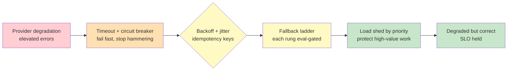

# Chapter 4.4 — Reliability Engineering for Nondeterministic Systems

*Part IV — Production Operations · Domain D4 · Reading time ~30 min · Prerequisites: Ch. 3.4, Ch. 4.3*

## 1. The failure story

At 2:14 p.m. the model provider entered a degraded window — not an outage, just elevated error rates, maybe one call in five timing out. The agent handled it the way the code had always handled a failed call: it retried. Immediately, no backoff, up to five times. That single design choice turned a manageable brownout into a self-inflicted catastrophe.

Here is the arithmetic that ended the afternoon. Under normal load the system made, say, 1,000 calls a minute. With one in five failing and each failure retried up to five times with no delay, every failed call became a burst of retries slamming the provider in the same instant the provider was already struggling. Request volume didn't rise by 20% — it *tripled*, because the retries stacked on top of the retries. The tripled volume blew straight through the provider rate limit, which meant calls that would have succeeded now failed with 429s, which the code also retried, which added more volume. The system had built itself a feedback loop whose only stable state was "everything fails." A 40-minute provider brownout that should have caused a 20% quality dip instead caused a *full outage* for the entire window, and because every retry consumed tokens on the attempts that did get through, the incident arrived with a *five-figure token bill* as a parting gift.

The postmortem was short. The provider's degradation was ordinary — brownouts happen, that is why SLAs are not 100%. What was not ordinary was that the system amplified it. The team had written retry logic that assumed failures were rare and independent; under a correlated degradation, that assumption inverted the retry from a safety mechanism into an accelerant. The question they had never asked was **not "what do we do when a call fails," but "what does our system do to the failure — does it absorb a degradation or amplify it — and have we designed our own degraded state as deliberately as we designed the happy path?"**

**A system whose response to a degrading dependency is to send it more traffic is not resilient, it is an amplifier that converts an ordinary brownout into a total outage with a token bill attached; resilience means backoff, circuit breakers, and budget ceilings that make your degraded state a design you chose, not an accident you discover.**

## 2. The mental model

### 2.1 SRE discipline meets a probabilistic core

Site reliability engineering spent two decades building the discipline of running systems that fail — timeouts, retries, circuit breakers, error budgets, graceful degradation. All of it applies to agents, with one twist that changes everything: the core component is *probabilistic*, so "failure" is no longer binary. A traditional service call either returns or it doesn't. An agent call can return a perfectly well-formed HTTP 200 containing a confidently wrong answer — a *quality* failure that every availability metric will score as a success. This means the reliability engineering of Part IV cannot import SRE unmodified; it has to widen the definition of "error" to include the errors that look like successes.

**Reliability for an agentic system is not just keeping the service responding; it is keeping the service *correct* under stress — which means your error budget must count quality failures alongside availability failures, and your degraded states must be designed as deliberately as your happy path, because a system that stays up while silently getting worse has not stayed reliable, it has merely stayed online.** This is the doctrine, and the rest of the chapter is the machinery for absorbing stress instead of amplifying it.

### 2.2 SLOs that include quality

You cannot engineer reliability you have not defined, and for agents the definition has to be measurable and it has to include quality. A **service-level objective** is a target you commit to: not "the agent is good" but "95% of tasks resolve successfully" or "99% of answers are grounded in retrieved evidence" or "p95 latency under eight seconds." The move that separates agentic SLOs from ordinary ones is folding *task resolution* and *grounded-answer rate* in alongside latency and availability, so that the **error budget** — the amount of failure you are willing to tolerate before you stop shipping features and fix reliability — is spent by quality regressions too. When the grounded-answer rate drops below its SLO, that is an incident with the same standing as the service being down, even though every request returned a 200. Define success measurably, budget for its absence, and give quality failures a seat at the incident table.

### 2.3 The resilience stack

Absorbing a degradation instead of amplifying it comes down to a **resilience stack** — a set of well-understood mechanisms, each guarding against a specific failure shape. **Timeouts**, per-call and per-task, cap how long you wait before giving up, so one slow call cannot hang a whole task. Retries with **backoff and jitter** are the direct fix for the failure story: instead of retrying immediately and in lockstep, each retry waits longer (exponential backoff) by a randomized amount (jitter), which spreads the retry load over time and prevents the synchronized stampede that tripled the volume. *Idempotency keys on every effectful call* mean a retried action executes exactly once even if the first attempt actually succeeded before timing out — without them, a retry of "issue the refund" issues a second refund, which is the Chapter 3.4 blast-radius problem wearing a reliability costume. **Circuit breakers**, per provider and per tool, detect that a dependency is failing and stop calling it for a cooling-off period, so the system fails fast and stops feeding the fire instead of hammering a downed provider. **Bulkheads** isolate workloads so that one runaway task type cannot consume all the capacity and starve the others.

**Every element of the resilience stack exists to break a specific amplification path — backoff-plus-jitter breaks the synchronized-retry stampede, circuit breakers break the hammer-a-downed-dependency loop, idempotency keys break the double-effect-on-retry hazard, bulkheads break the one-workload-starves-all failure — and a system missing any of them has an open path from a small degradation to a total outage.** The failure story was a system with retries but no backoff, no jitter, and no circuit breaker: three missing bricks, one open path, one afternoon lost.

### 2.4 Fallback chains and the quality cliff

Timeouts and breakers keep you from making things worse; **fallback chains** are how you stay useful when a dependency is genuinely down. The pattern is a ladder of progressively degraded but still-valuable responses: model failover (provider A fails, route to provider B), then capability degradation (full agent → a constrained deterministic workflow → a cached prior answer → a human queue). Each rung does less than the one above it but more than an error page. The essential and most-skipped discipline here is **quality-cliff awareness**: each fallback rung has its own quality level, and silently dropping to a weaker model can violate your grounded-answer SLO while every availability metric stays green. A failover that trades a 95%-quality primary for a 70%-quality backup has kept the service up and quietly breached the promise the service exists to keep.

This is why fallbacks need their *own eval gates* (Chapter 4.1). You evaluate the degraded path as rigorously as the primary, you know its quality number, and you decide in advance which rungs are acceptable for which task types — a low-stakes summary can fall back to a cached answer; a claims denial cannot fall back to anything below the human queue. Degradation is a product decision, not an infrastructure default, and designing the ladder deliberately is what makes "we stayed up" mean "we stayed trustworthy" rather than "we stayed online while getting quietly worse."

### 2.5 Load shedding, admission control, and multi-provider reality

When demand exceeds capacity — a traffic spike, a rate-limit ceiling, a partial degradation — something has to give, and the choice is whether it gives *deliberately* or *randomly*. **Load shedding** and **admission control** make it deliberate: you assign tasks to **priority classes** and, under pressure, you shed the low-priority work to protect the high-priority work, rather than letting everything degrade uniformly until nothing works. A revenue-critical task and a background summarization should not fail at the same rate when capacity runs short; priority classes are how you encode that.

The multi-provider dimension is where a subtle correctness risk hides. Routing across providers (A→B) is standard reliability practice, but for probabilistic systems it is *not just an ops detail* — provider B is a different model with different behavior, so a prompt tuned on A may quietly underperform on B, and a capability that exists on A (a specific tool format, a context length) may be absent on B. Failover that treats providers as interchangeable commodities imports a correctness risk under the banner of reliability. Treat the backup provider as a first-class evaluated target with its own quality number, audit that your "independent" providers are not secretly correlated (§4), and know the capability-parity gaps before an outage forces you to discover them live.

*Red: a provider brownout arriving as elevated errors. Orange: timeouts and circuit breakers that fail fast instead of amplifying. Yellow: backoff-plus-jitter and idempotency keys that make retries safe, feeding an eval-gated fallback ladder. Green: priority-based load shedding that protects high-value work, holding the quality SLO through a degraded state designed on purpose.*

## 3. The production lens

The reliability posture that most distinguishes a mature agent operation from a fragile one is **budget-aware retries**, and it is the direct lesson of the five-figure bill. In an ordinary service, a retry costs a little latency and a little compute; in an agentic system, a retry costs *tokens*, and tokens are money, so a retry storm is simultaneously an availability incident and a spending incident. The policy that follows is specific: retry only steps that are idempotent, cheap, and high-value, cap the retry budget per task in *dollars* as well as in attempts, and never let a retry loop run unbounded against a degrading provider. This is where Chapter 4.3's observability earns its keep — cost-per-span in the traces is what lets a retry budget be enforced in real dollars instead of guessed at, and the online alerts are what page a human when the retry rate spikes before the bill does.

The second production discipline is treating the *degraded state as a monitored, evaluated, first-class mode* rather than an untested branch that only runs during incidents. The most dangerous fallback is the one nobody has exercised: the failover to provider B that has never been eval'd, the "constrained workflow" rung that was written once and never run, the human queue that overflows because no one modeled its capacity. Exercise the fallbacks deliberately — game-day drills, shadow traffic through the degraded path, eval gates on every rung — because a fallback you have never tested is not a safety net, it is a second failure waiting to compound the first. Reliability is not the absence of failure; it is the presence of well-rehearsed, well-measured behavior *during* failure.

> **Doctrine check.** If your system's response to a dependency degrading is to send it more traffic — retries without backoff, no circuit breaker, no budget ceiling — you have not built resilience, you have built an amplifier, and the next ordinary brownout will be converted by your own code into a total outage with a token bill attached, because a small correlated failure hitting an amplifier is exactly how partial outages become complete ones.

## 4. Edge-case catalog

| # | Edge case | What it looks like | Detection | Mitigation |
|---|-----------|--------------------|-----------|------------|
| 1 | Retry amplification of cost | A provider brownout triples request volume and produces a five-figure token bill | Retry rate and token spend spiking during a degradation, decoupled from user demand | Budget-aware retry policy: backoff + jitter, per-task dollar ceiling, retry only idempotent/cheap/high-value steps |
| 2 | Fallback quality cliff | Failover to a weaker model keeps availability green while grounded-answer rate quietly breaches SLO | Quality SLO drops during a failover window while uptime looks fine | Eval-gate every fallback rung; know each rung's quality number; forbid rungs below a task's minimum quality |
| 3 | Correlated "independent" providers | Providers A and B both fail together because they share a cloud region | Both failovers degrade simultaneously; true independence never audited | Audit real independence (region, upstream infra); choose backups with genuinely disjoint failure domains |
| 4 | Thundering herd on recovery / cache expiry | Provider recovers and every queued request fires at once, re-triggering the outage | Synchronized traffic spike at recovery or at cache-expiry boundaries | Staggered warm-up, request coalescing, jittered cache TTLs; ramp traffic back gradually |
| 5 | Double effect on retry | A timed-out-but-succeeded effectful call is retried and executes twice (double refund) | Duplicate effects traced to retried calls with no idempotency key | Idempotency keys on every effectful call; the deterministic seam dedupes on the key (Ch. 3.4) |
| 6 | Uniform degradation under load | A traffic spike degrades revenue-critical and background tasks at the same rate | High-value tasks failing at the same rate as low-value ones during pressure | Priority classes with load shedding / admission control; shed low-priority work first to protect high-value |

## 5. Claude & MCP in this chapter

The resilience stack in this chapter is model-agnostic — timeouts, backoff, breakers, idempotency, bulkheads, and fallback ladders are properties of how you *call* a model and its tools, not of the model itself — which means most of the work lives in your orchestration layer and your MCP tool wrappers rather than in any provider feature. Two connections are worth making concrete. First, idempotency keys belong on the *effect seam* from Chapter 3.4: the deterministic engine that executes an agent's proposed action is where the key is checked and the double-effect-on-retry hazard is neutralized, so reliability and blast-radius containment are the same seam viewed from two angles. Second, multi-provider abstraction is a correctness question, not just an availability one, so if you route across model families you owe each family its own eval (Chapter 4.1) and its own behavioral baseline. Consult docs.claude.com for current rate limits, error semantics, retry guidance, and any availability or failover features, and verify these against the live documentation rather than this page: rate limits and reliability tooling change, and the durable content here is the resilience discipline — absorb, don't amplify; degrade on purpose; budget your retries — not any specific provider's current numbers.

## 6. Design exercise

Design the full *resilience policy* for a customer-facing agent with a **99.5% availability target** (roughly 3.6 hours of allowed downtime per month) that also carries a *grounded-answer quality SLO*. Your policy must specify: the *SLO set* — the exact availability, latency, and quality targets, and how the error budget is split across them; the *resilience-stack settings* — per-call and per-task timeouts, the retry budget (attempts and dollars) with backoff-and-jitter parameters, circuit-breaker thresholds per provider/tool, and the bulkhead boundaries; the *four-stage degradation ladder* — full agent → constrained workflow → cached answer → human queue, with the specific quality metric guarding each transition and the task types allowed to descend to each rung; and the *load-shedding plan* — the priority classes and the rule for what gets shed first under a rate-limit ceiling.

*Options:* Exponential backoff with jitter · Immediate retry, fixed count · Circuit breaker per provider · Single global circuit breaker · Idempotency key on every effectful call · Retry without idempotency key · Eval-gate every fallback rung · Ship fallback untested · Priority-class load shedding · Uniform degradation under load

*Check:* Each item below names a structural decision in the resilience policy; choose the mechanism the chapter prescribes.

| Item | Answer | Why |
|---|---|---|
| Retry shape to prevent synchronized stampede | Exponential backoff with jitter | Randomized, lengthening delays spread retry load over time, breaking the lockstep surge that tripled volume in the failure story |
| Scope of circuit breakers | Circuit breaker per provider | Per-provider granularity isolates a failing dependency without taking down unaffected paths; a single global breaker is too coarse |
| Guard against double-effect on retry | Idempotency key on every effectful call | Keys let the effect seam deduplicate a retried action that already succeeded, preventing double-refund-class hazards |
| Quality assurance for each fallback rung | Eval-gate every fallback rung | Each rung's quality number must be known in advance so a transition never silently breaches the grounded-answer SLO |
| Capacity allocation under a rate-limit ceiling | Priority-class load shedding | Shedding low-priority work first protects revenue-critical tasks; uniform degradation wastes scarce capacity equally across low- and high-value work |

*Sample solution:* A complete resilience policy for the 99.5%-availability, grounded-answer-SLO agent should address all four specified areas as follows.

**SLO set and error-budget split.**
- Availability target: 99.5% (≈3.6 h/month allowed downtime). Allocate roughly half the error budget here.
- Latency target: p95 ≤ 8 s end-to-end for full-agent tasks; p99 ≤ 20 s.
- Quality target: grounded-answer rate ≥ 95% (measured via automated LLM-judge grader per Ch. 4.2). Allocate the remaining budget here so a quality regression triggers an incident exactly as an availability dip does.
- When the quality SLO is breached during a failover window, that window counts against the error budget; "uptime green, quality red" is still an incident.

**Resilience-stack settings.**
- Per-call timeout: 10 s for model calls; 3 s for tool/MCP calls.
- Per-task timeout: 60 s total wall-clock; the orchestrator cancels and routes to the next degradation rung once exceeded.
- Retry budget: maximum 3 attempts per call; exponential backoff starting at 1 s with ×2 multiplier; ±50% jitter on each interval (so attempt 2 waits 1–3 s, attempt 3 waits 2–6 s). Dollar ceiling: no single task may spend more than 2× its average token cost in retries; a per-task retry-spend counter aborts the loop when the ceiling is hit.
- Circuit-breaker thresholds (per provider and per MCP tool): open after 5 failures in a 30 s window; half-open probe after 60 s cooling-off; require 3 consecutive successes to close. Separate breakers for Provider A and Provider B ensure one degradation does not mask the other.
- Idempotency keys: every effectful tool call (writes, payments, notifications) carries a UUID generated at task start; the effect seam deduplicates on the key before executing, so any retry of a timed-out call that already succeeded is a no-op.
- Bulkheads: separate thread/connection pools for (a) real-time customer-facing tasks and (b) background/batch tasks; a batch surge cannot exhaust the connection pool that serves interactive requests.

**Four-stage degradation ladder.**
- Rung 1 — Full agent: primary provider, full tool set, full context. Quality baseline: grounded-answer rate ≥ 95%. All task types allowed.
- Rung 2 — Constrained deterministic workflow: provider B (eval'd independently; known quality number ≥ 88%); tool set restricted to read-only calls; no long-horizon planning steps. Transition trigger: primary circuit breaker open OR grounded-answer rate drops below 92% in a 5-min window. Allowed task types: all except claims denial and high-stakes financial actions.
- Rung 3 — Cached answer: return the most recent eval-verified answer for the same intent class, stamped with a recency indicator. Quality floor: cached answers must be ≤ 24 h old and must have passed the grounded-answer eval at cache time. Transition trigger: Rung 2 circuit breaker open OR quality on Rung 2 drops below 85%. Allowed task types: low-stakes informational queries only.
- Rung 4 — Human queue: route to a human agent with full task context attached. No quality floor (human handles it). Transition trigger: Rung 3 unavailable OR task type is claims denial / high-stakes financial. Claims denial and high-stakes financial tasks may only descend as far as Rung 4 and may never use Rung 2 or 3.
- Every rung except Rung 4 has been exercised in game-day drills and carries its own eval-suite quality number. The human queue has a modeled capacity ceiling; overflow pages on-call when the queue depth exceeds 80% of that ceiling.

**Load-shedding plan.**
- Priority class P0 (protect always): real-time customer-facing tasks with a revenue or compliance dimension (checkout, claims, account recovery). Never shed.
- Priority class P1 (shed last): interactive informational queries (product questions, status checks). Shed only when P0 demand alone saturates capacity.
- Priority class P2 (shed first): background and batch tasks (digest generation, bulk summarisation, analytics enrichment). Shed as soon as a rate-limit ceiling is approached.
- Admission-control rule: when the rate-limit utilisation metric exceeds 80%, reject new P2 tasks immediately with a retriable error and a Retry-After header. At 95% utilisation, also queue P1 tasks behind P0; if P1 queue depth exceeds 200 requests, start shedding P1 as well. P0 is never subject to shedding at any utilisation level.

**Review standard.** A strong answer designs the degraded state as deliberately as the happy path: every fallback rung has a known, eval'd quality number and an explicit quality-metric guard, so no failover silently breaches the quality SLO; retries are budgeted in dollars as well as attempts and carry backoff-plus-jitter, so a brownout cannot be amplified into an outage; idempotency keys sit on the effect seam so retries cannot double-execute; and the answer treats a backup provider as a distinct evaluated target with audited independence, not an interchangeable commodity. A weak answer adds retries and a failover, assumes the backup is as good as the primary, and rebuilds the exact amplifier that lost the afternoon in the failure story.

## 7. Self-test

Argue each claim to its reasoning, not just its verdict.

1. *"Retrying failed calls makes a system more reliable."* — Only with backoff, jitter, a budget, and a circuit breaker. Naive retries under a correlated degradation *amplify* the failure — synchronized retries triple volume, blow the rate limit, and convert a brownout into an outage. The retry is a safety mechanism or an accelerant depending entirely on how it is shaped.

2. *"If every request returns a 200, the system is reliable."* — False for probabilistic systems. A 200 can carry a confidently wrong answer — a quality failure invisible to availability metrics. Reliability must include a quality SLO and count grounded-answer failures against the error budget, or the system can stay online while getting steadily, unmeasuredly worse.

3. *"Failing over to a backup provider is purely an operations concern."* — No. Provider B is a different model with different behavior and possibly different capabilities, so failover can import a correctness regression — a prompt tuned on A underperforming on B. The backup needs its own eval and behavioral baseline; treating providers as interchangeable is a correctness risk wearing a reliability label.

4. *"A fallback chain guarantees graceful degradation."* — Only if each rung is eval-gated and guarded by a quality metric. An untested fallback is a second failure waiting to happen, and a fallback to a weaker model can silently breach the quality SLO. Graceful degradation is a designed, measured behavior, not a free property of having a fallback.

5. *"Under overload, degrading all tasks equally is fair."* — Fair and wrong. Uniform degradation lets a background summarization fail at the same rate as a revenue-critical task, wasting scarce capacity on low-value work. Priority classes with load shedding protect high-value tasks by shedding low-value ones first — deliberate triage beats uniform collapse.

## 8. Spaced-review card

Answer from memory before checking back.

- **The amplifier:** walk through exactly how a naive retry policy converts a 40-minute provider brownout into a full outage, and name the three resilience-stack elements whose absence opens that path.
- **Quality in the SLO:** explain why an agentic error budget must count quality failures, and give an example of a failure that every availability metric scores as a success.
- **The quality cliff:** state why a fallback chain needs its own eval gates, and what "quality-cliff awareness" protects against during a failover.

---

*Next: Chapter 4.5 — Cost & Latency Operations, where the token bill that arrived as a souvenir in this chapter becomes the main subject — because the same levers that make a system fast and cheap on the happy path (caching, cascades, routing, output discipline) each carry a quality side effect, and a feature that is wildly popular can still lose money on every single request.*
