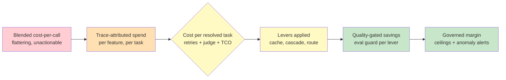

# Chapter 4.5 — Cost & Latency Operations

*Part IV — Production Operations · Domain D4 · Reading time ~30 min · Prerequisites: Ch. 4.3, Ch. 4.4*

## 1. The failure story

The feature launched to a standing ovation. A support agent that resolved customer tickets end-to-end — read the ticket, pulled the account, checked the policy, drafted and sent the resolution. Adoption was immediate and enormous; within three weeks it was handling 40% of inbound volume, the support team was thrilled, and leadership put it in the board deck. It was also, on every single request, losing money.

Nobody found out until finance ran the quarterly reconciliation. The pricing page had been written months earlier, in the planning phase, by someone who reasoned that a "typical" ticket was one model call — a few thousand tokens, a fraction of a cent, priced at a comfortable margin. The reality that shipped was nothing like that model. A real resolved ticket was not one call; it was the agent reading the ticket, three or four tool calls to pull account and policy data, a retrieval step, a couple of reasoning turns, an LLM-judge check on the draft (Chapter 4.2), a guardrail pass, and — for the third of tickets the agent got wrong on the first try — a full *retry* of most of that. The true cost was **$1.10 per resolved task**. The feature was priced, effectively, at **$0.40**. Every ticket the agent resolved widened the loss, and the more successful the launch, the faster the money burned — a business whose unit economics get worse with scale.

The board deck said the feature was a triumph. The general ledger said it was a subsidy. Both were right, because the two numbers that mattered had never been put in the same sentence. The question the team had never asked — and the pricing page had silently assumed away — was **not "what does a model call cost," but "what does a *resolved task* cost, counting every call, retry, judge, and guardrail on the path to done, and does that number sit under the price?"**

## 2. The mental model

### 2.1 Cost per resolved task is the only honest unit

The root error in the failure story is a unit error, and it is the most common financial mistake in agentic systems. Teams instrument *cost per request* or *cost per model call* because those are the numbers the provider bills and the dashboard shows. But a request is not the thing the business sells; the business sells a *resolved task* — a closed ticket, a reviewed contract, a completed booking — and the **cost per resolved task** includes everything spent on the way to resolving it. That means the successful calls *and* the failed attempts, the retries from Chapter 4.4, the judge calls from Chapter 4.2, the guardrail checks, the retrieval infrastructure, and — for tasks that take several tries — all the tokens burned on the tries that didn't work. Cost per call flatters you; cost per resolved task tells the truth.

**The unit economics of an agentic system must be measured as cost per *resolved task* — inclusive of retries, judge and guardrail calls, failed attempts, and the amortized infrastructure behind them — because that is the only number that can be honestly compared against the price, and a system optimized on cost-per-call will happily report shrinking call costs while the fully-loaded cost of actually getting a customer's job done climbs past what they pay for it.** This is the doctrine, and every lever in this chapter is measured against its effect on this one number.

### 2.2 The lever catalog and its side effects

There is a well-understood catalog of levers on the cost/latency/quality frontier, and the discipline is not knowing them — it is knowing each one's *side effect*, because every lever that lowers cost or latency pushes on quality somewhere. **Prompt caching** reuses the expensive prefix of a prompt across calls, which is why prompts should be designed *cache-first* — stable content at the front, variable content at the back — but it couples your prompt-iteration velocity to your cache economics (§4). **Semantic caching** serves a stored answer for a sufficiently-similar new request, hugely cheaper but carrying the risk of serving a *wrong* cached answer at scale (§4). **Model cascades and routing** send the cheap, fast model first and escalate to the expensive one only on uncertainty — enormous savings, but only as good as the uncertainty estimate that decides when to escalate (§3). **Output-length discipline** — asking for less generated text — cuts cost and latency directly, because output tokens are the expensive ones, at the risk of truncating genuinely needed content. **Batch processing** runs non-urgent work at lower cost when latency doesn't matter. *Parallelization* cuts latency by fanning calls out, but multiplies cost and can multiply it for work you end up discarding.

The through-line is that none of these is free, and treating them as pure wins is how quality erodes invisibly. A cascade that saves 60% by routing to a cheap model is a triumph if escalation is accurate and a quality disaster if hard tasks get stuck on the cheap model; the lever and its side effect are the same mechanism seen from two directions.

### 2.3 Latency is a budget, and perceived latency is a design

Cost has a twin: latency, and it behaves like a budget you allocate rather than a single number you minimize. The key distinction is **time-to-first-token** (TTFT) versus *total time*. Total time is how long the whole task takes; TTFT is how long until *something* appears. These decouple through **streaming**: an agent that streams its output starts showing text almost immediately even if the full response takes many seconds, and because humans experience waiting by when feedback starts, streaming can make a slow system *feel* fast without making it actually faster. This is **perceived-latency design**, and it connects straight to Chapter 3.6's trust work: progress narration, streamed reasoning, and visible intermediate steps all convert dead waiting time into legible progress. Speculative and parallel calls can cut real latency for the steps on the critical path, but the highest-leverage latency work is often not making the system faster — it is making the wait *legible*, so a seven-second task with immediate streamed feedback beats a four-second task that shows a blank spinner.

### 2.4 Budget governance: ceilings and anomalies

Unit economics tells you the average; **budget governance** protects you from the tail. The mechanism is ceilings at every meaningful scope — per task, per user, per tenant — so that no single runaway interaction can consume unbounded spend. A per-task ceiling (in dollars, as in Chapter 4.4's budget-aware retries) stops one pathological task from looping up a five-figure bill; a per-tenant ceiling stops one customer's usage from eating the margin on all the others. On top of the ceilings sits **anomaly detection on spend**: the trace-derived cost data from Chapter 4.3 feeds a monitor that pages a human when spend deviates from its expected shape — a retry storm (Chapter 4.4), a cache that stopped hitting, a prompt change that tripled token usage. Governance is what turns cost from a monthly surprise into a real-time controlled variable, and it is only possible because the observability layer already attributes cost per span, per feature, and per customer. Without that attribution, a budget ceiling is a number you cannot enforce and an anomaly is something you discover in the quarterly reconciliation — which is exactly where the failure story's team discovered theirs.

### 2.5 Total cost of ownership beyond tokens

The final reframe is that tokens are not the whole bill, and a team that optimizes only the token line will still miss its margin. The **total cost of ownership** of an agentic feature includes the retrieval infrastructure (vector databases, embedding compute), the trace storage from Chapter 4.3 (which at full-capture scale is a real line item), the human-review labor from Chapter 3.3 (every escalation to a human has a cost per resolved task too), and the engineering time to maintain the eval suites, judges, and calibration sets that keep the whole thing honest. These hidden costs are exactly the ones the planning-phase pricing model omits, because they are invisible in the provider's bill. When you compute cost per resolved task for a real business decision — pricing, margin, build-versus-buy — include the TCO, not just the tokens, or you will price against a number that is confidently, systematically too low, and rediscover the gap the way the support team did: in a reconciliation, after the pricing page is already public.

*Red: a blended cost-per-call number that flatters and cannot be acted on. Orange: spend attributed per feature and task from the trace layer. Yellow: the honest unit — cost per resolved task, retries and judges and TCO included — against which levers are applied. Green: each lever guarded by an eval so savings don't quietly cost quality, under budget ceilings and anomaly alerts that keep margin a controlled variable.*

## 3. The production lens

The lever that most rewards and most punishes attention in production is the *model cascade*, because its entire value rests on one hard sub-problem: **uncertainty estimation**. A cascade routes the easy 70% of tasks to a cheap model and escalates the hard 30% to an expensive one, and the savings are real and large — but only if the router can tell which task is which. Misrouting a hard task to the cheap model produces a confident wrong answer at a discount, which is the worst possible trade. So the production discipline is to measure the router itself, exactly as Chapter 4.2 measures a judge: treat escalation as a classifier and measure its *precision and recall* against ground truth. Recall matters most — a hard task that should have escalated but didn't is a quality failure the cheap-model savings cannot justify — and a cascade shipped without measuring escalation recall is a cost optimization that is silently trading quality it never counted. The uncertainty estimate is the whole game; the price cut is just the visible surface.

The second production hazard is **semantic cache poisoning**, and it is the caching lever's version of the same lesson. A semantic cache serves a stored answer to a sufficiently-similar query; if a *wrong* answer ever lands in the cache, it is now served at scale to every near-match, turning a single error into a broadcast. The defenses are cache-entry *provenance* (know which version and which validation produced each cached answer) and disciplined *invalidation* (a prompt or model change must invalidate the entries it could have changed, and a low-confidence or unvalidated answer should never be cached at all). This is where the cache lever collides with change management: cached prefixes and cached responses are stateful artifacts that a prompt-iteration cycle can silently invalidate or, worse, silently *not* invalidate, and reconciling prompt-iteration velocity with cache economics is a change-management problem (Chapter 4.6) as much as a cost one.

> **Doctrine check.** If you cannot state your cost *per resolved task* — retries, judge calls, guardrails, failed attempts, and infrastructure TCO all included — and put it in the same sentence as your price, you do not know whether your feature makes money, and a wildly popular launch on those terms is not a triumph, it is a subsidy that scales its own losses, discovered in a reconciliation rather than a plan.

## 4. Edge-case catalog

| # | Edge case | What it looks like | Detection | Mitigation |
|---|-----------|--------------------|-----------|------------|
| 1 | Router misrouting hard tasks to the cheap model | Cascade saves cost but quality drops on the hard segment | Escalation recall low; hard-stratum quality below SLO while blended quality looks fine | Measure escalation precision/recall against ground truth; tune the uncertainty threshold for recall; audit the hard stratum separately |
| 2 | Semantic cache poisoning | A wrong answer enters the cache and is served at scale to near-matching queries | A single error appearing across many users; cached answers diverging from fresh ones | Cache-entry provenance; never cache low-confidence/unvalidated answers; invalidate on prompt/model change |
| 3 | Hidden TCO beyond tokens | Token cost looks fine but the feature still misses margin | Fully-loaded cost per resolved task exceeds price despite low token bill | Include retrieval infra, trace storage, and human-review labor in cost-per-resolved-task; price against TCO |
| 4 | Prompt iteration vs. cache economics | A prompt edit silently breaks cache hits (cost spikes) or fails to invalidate stale prefixes | Cache hit rate dropping or stale answers persisting after a prompt change | Change-managed cached prefixes (Ch. 4.6); tie cache invalidation to prompt/model version; monitor hit rate as a release metric |
| 5 | Cost-per-call optimized while resolved-task cost climbs | Per-call cost falls but retries and judge calls push resolved-task cost up | Divergence between per-call trend and per-resolved-task trend | Report cost per resolved task as the primary metric; count retries, judges, and failed attempts in the unit |
| 6 | Output-length cuts truncating needed content | Shorter outputs save tokens but drop necessary detail on some tasks | Quality regression concentrated on tasks needing longer answers | Length discipline per task type, not global; eval the length change on the affected stratum before rollout |

## 5. Claude & MCP in this chapter

Every lever in this chapter touches the provider surface, and every provider number in it moves, so this is the chapter where "verify against the live docs" is not a caveat but the method. Prompt caching, batch pricing, model-tier price differences, and context-window economics all have concrete current numbers at docs.claude.com, and using a stale number from memory is how a pricing model goes wrong — so pull the current figures rather than trusting any value printed here. The durable content is structural: design prompts cache-first so the stable prefix is reusable; build cascades across model tiers and measure the router's escalation recall as rigorously as you measure a judge; attribute cost per resolved task from the MCP-tool and model spans your trace layer already captures (Chapter 4.3); and remember that MCP tool calls are themselves cost and latency, not free glue — a chatty tool integration can dominate a task's budget. Treat the model tiers as a cost/quality frontier to route across, verify the current prices and caching mechanics against official documentation before you model margin, and re-verify when you re-price, because the arithmetic that decides whether a feature makes money is only as current as the numbers you fed it.

## 6. Design exercise

You have a measured baseline of **$1.10 per resolved task** and a target price that demands **$0.40 per resolved task** — the exact gap from the failure story. Produce the *cost-reduction plan* that closes it. Your plan must include: a *ranked lever list* — which of prompt caching, semantic caching, model cascade/routing, output-length discipline, and batch processing you apply, in what order, and why that order; the *expected savings* per lever, stated against cost per *resolved task* (not per call), with the retries and judge calls included; the *quality risk* each lever introduces and the *eval gate* (Chapter 4.1) that protects against it before the lever ships; and the *governance* you put in place — the per-task and per-tenant ceilings and the spend-anomaly alert — so the new economics stay in range after launch.

**Review standard.** A strong answer optimizes the honest unit — cost per resolved task including retries, judges, and TCO — never cost per call, and can show its arithmetic; it pairs *every* lever with a named quality risk and a specific eval gate, treating the cascade's escalation recall and the semantic cache's poisoning risk as first-class rather than afterthoughts; it sequences levers by return-on-risk, not just by savings; and it closes with governance (ceilings, anomaly alerts) so the margin is a controlled variable and not a quarterly surprise. A weak answer lists levers and sums their advertised savings with no quality gates — reproducing the original error one level up, optimizing a number that flatters while the fully-loaded cost of getting the job done stays above the price.

## 7. Self-test

Argue each claim to its reasoning, not just its verdict.

1. *"Cost per model call is the right metric for unit economics."* — No. The business sells resolved tasks, not calls, and a resolved task includes retries, judge calls, guardrails, failed attempts, and infrastructure. Cost per call falls while cost per resolved task climbs — precisely the divergence that let a popular feature lose money on every request. Only the resolved-task unit compares honestly to price.

2. *"A model cascade is a pure cost win."* — Only if escalation is accurate. The savings come from routing easy tasks to a cheap model, but a misrouted hard task is a confident wrong answer at a discount. The cascade is only as good as its uncertainty estimate, which is why escalation recall must be measured — an unmeasured cascade trades uncounted quality for counted savings.

3. *"Making the system faster is the best way to improve latency experience."* — Often not. Perceived latency is dominated by when feedback starts, not total time, so streaming and progress narration can make a slower system feel faster. The highest-leverage move is frequently making the wait legible, not shorter — a decision that lives as much in UX (Ch. 3.6) as in infrastructure.

4. *"Semantic caching is a safe way to cut cost."* — Safe only with provenance and invalidation. A wrong answer in a semantic cache is served at scale to every near-match, broadcasting a single error. Without cache-entry provenance, disciplined invalidation on version change, and a rule against caching low-confidence answers, the cache converts one mistake into many.

5. *"If the token bill is under budget, the feature is profitable."* — Not established. Tokens are not the whole cost — retrieval infra, trace storage, and human-review labor are real TCO the provider bill never shows. A feature can be under token budget and still miss margin because the hidden costs push resolved-task cost past price.

## 8. Spaced-review card

Answer from memory before checking back.

- **The unit:** state why cost per resolved task, not cost per call, is the only honest unit, and list the four things beyond the successful calls that belong inside it.
- **Lever and side effect:** pick any three levers (caching, cascade, output-length, semantic cache) and name, for each, the specific quality risk that makes it not-free.
- **Perceived latency:** explain how TTFT and streaming let a slower system feel faster, and connect this to the trust work of Chapter 3.6.

---

*Next: Chapter 4.6 — Change Management & Release Engineering, where the cached prefixes, judges, prompts, and model versions you have been tuning turn out to be a single coupled system — and shipping a prompt change on the same weekend the provider silently updates and a new tool is registered produces a 12% drop with three suspects and zero attribution.*
