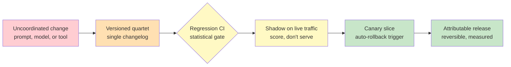

# Chapter 4.6 — Change Management & Release Engineering

*Part IV — Production Operations · Domain D4 · Reading time ~30 min · Prerequisites: Ch. 4.1, Ch. 4.2*

## 1. The failure story

The prompt change was small and well-reasoned. Version 47 tightened the agent's instructions for handling refund edge cases, it had passed the offline eval suite, and it shipped Friday evening because that is when the engineer finished it. Monday morning the dashboard showed task-resolution down **12%** — a serious, revenue-affecting regression. The obvious move was to roll back the prompt to v46. They did. The metric didn't recover.

It didn't recover because the prompt was not the only thing that had changed over the weekend, and nobody had a record that could say so. Three changes had landed in the same window. The engineer had shipped prompt v47. The model provider had, sometime Saturday, pushed a silent update under the *same model name* — same string, different behavior. And a separate team had registered a new tool in the agent's toolset on Sunday, changing the set of actions available at inference time. Three coupled changes, three suspects, and a monitoring system that could see the 12% drop but could not attribute it to any one of them, because the prompt, the model, and the tools were tracked — where they were tracked at all — in three different places with no unified changelog. Rolling back the prompt tested one hypothesis and cleared it. There were two more, and no fast way to isolate them.

It took the better part of a week to find that the regression was an *interaction*: v47's tightened instruction was benign on the old model behavior and regressive on the silently-updated one. The prompt was not wrong and the model was not wrong; the *combination* was, and no test had ever evaluated the combination because the two changes were owned by different teams tracking different artifacts. The question the team had never operationalized was **not "was the prompt change safe," but "what is the complete set of things that can change this agent's behavior, and can we attribute any regression to exactly one of them — because a system with three independent change vectors and no unified ledger cannot be debugged, only guessed at?"**

## 2. The mental model

### 2.1 The behavior is a system, not a prompt

The failure story's root cause is a category error that is nearly universal in early agentic operations: teams treat the *prompt* as "the thing they change" and everything else as fixed background. But an agent's behavior is the joint output of at least four independently-changeable artifacts — the *prompt*, the *model*, the *tools*, and the *judge* that measures it — and any one of them shifting can move behavior, sometimes only in combination with another. The prompt is the one you edit most visibly, which is exactly why it becomes the default suspect and the others hide. Change management for agents begins by naming all four as versioned artifacts of one coupled system, so that "what changed" has a complete and honest answer.

**Every artifact that can move an agent's behavior — prompt, model, tool schema, and judge — must be versioned, and every release must be a coupled unit recorded in a single changelog, because behavior is the joint product of all four, regressions are frequently interactions between them, and a change you did not record is a change you cannot roll back, attribute, or reason about when the metric drops.** This is the doctrine, and the machinery below is how you make all four changeable *safely*.

### 2.2 The versioned quartet

Making the four artifacts governable means giving each one real version discipline. The *prompt* lives in a registry — every version stored, diffable, attributable to an author and a rationale — not edited in place in a config file where the last change overwrites the evidence of the previous one. The *model* is governed by a *pinning policy*: you reference specific model versions deliberately, you know your exposure to silent provider-side updates (§4), and you decide when to move rather than being moved. *Tool schemas* are versioned because the set and shape of available tools changes what the agent can do — adding a tool, changing an argument, altering a description all shift behavior, and an unversioned tool registry is the Sunday change nobody could see. The *judge* is versioned because, as Chapter 4.2 established, changing the grader silently re-scores all of history, so a judge update is a change to your *measurement*, not just your system, and must be recorded as carefully as a prompt.

The point of the quartet is not bureaucracy; it is *attribution*. When the four are versioned into a single coupled release with one changelog, a regression has a bounded list of suspects and a fast path to isolation. When they are not, you get the failure story: three vectors, three owners, three trackers, and a week of guessing.

### 2.3 The gate ladder: regression, shadow, canary, A/B

Version discipline tells you *what* changed; the gate ladder controls *whether a change reaches users*, in ascending order of confidence and cost. First, *regression suites in CI*: the eval sets from Chapter 4.1 run automatically on every proposed change, and — critically — they gate on the *statistical thresholds* from that chapter, so the suite blocks a change only when the delta exceeds the minimum detectable effect, not when it wiggles within the noise. Second, *shadow deployment*: the new version runs silently against live traffic, scoring but not serving, so you see its real-world behavior on the real distribution before a single user is exposed. Third, *canary rollout*: the new version serves a small slice of real traffic with *automatic rollback triggers* wired to metric thresholds, so a regression that only appears in production is caught on 2% of users and reverted automatically rather than discovered on 100% on Monday. Fourth, *A/B testing* with agent-appropriate metrics and horizon, to measure whether the change is actually *better*, not merely not-worse.

Each rung catches what the rung before it cannot. Regression suites catch known failure modes on a fixed dataset; shadow catches distribution surprises the dataset missed; canary catches production-only interactions (like the prompt-model coupling) with a bounded blast radius; A/B measures true improvement. Skipping rungs is how a change that passed offline evals still ships a 12% regression — offline was rung one, and the interaction lived at rung three.

### 2.4 A/B for agents runs on a longer clock

The A/B rung deserves special care because agentic changes break the assumptions of ordinary A/B testing in one specific way: *horizon*. Classic A/B tests measure per-request outcomes that resolve in seconds — click, convert, bounce. Many agentic changes have effects that only appear over *weeks*: a change to the agent's memory behavior alters outcomes only after the memory accumulates; a change that makes the agent slightly more cautious builds or erodes *user trust* (Chapter 3.6) over many interactions, showing up as retention and adoption shifts long after the per-request metrics have settled. An A/B test cut off at the per-request horizon will declare a long-horizon change "neutral" and miss the trust erosion that surfaces in month two. So agent A/B tests must match their measurement window to the *mechanism* of the change — short for a phrasing tweak, long for anything touching memory, trust, or cumulative behavior — and the metrics must include the slow signals, not just the fast ones.

### 2.5 Model migration and baseline management

The hardest scheduled change is a *model migration* — moving to a new model version, forced by a provider deprecation or chosen for a capability gain — because it moves the largest artifact in the quartet, often coupled with prompt re-tuning. The playbook is deliberate: a *side-by-side eval protocol* (old and new model scored on the same suite), a *dual-running window* where both are live so you can compare on real traffic, an honest accounting of the *prompt re-tuning cost* (prompts tuned for the old model rarely transfer perfectly), and a rollback path if the new model regresses on a stratum the aggregate hid. Underneath migration sits *baseline management*, the quiet discipline that keeps all of this comparable. When you change the *judge* or the *dataset*, historical scores stop being comparable to new ones — a v47-vs-v46 comparison is meaningless if the judge changed between them. So changes to measurement require a *re-baselining protocol*: you re-score the reference point under the new judge or dataset, you record the discontinuity, and you never compare across it as if nothing happened. A baseline you silently moved is a ruler whose markings shifted mid-measurement, and every delta you read off it afterward is fiction.

*Red: an uncoordinated change to any of the four behavior-moving artifacts, landing with no record. Orange: the versioned quartet recorded in one changelog, giving a bounded suspect list. Yellow: regression CI gating on statistical thresholds and shadow deployment scoring against the real distribution. Green: a canary slice with automatic rollback and a release that is attributable, reversible, and measured.*

## 3. The production lens

The discipline that most separates a team that ships confidently from one that ships on Friday and prays is *coupling the release*. In practice this means no artifact in the quartet changes production behavior alone: a prompt change, a model pin change, a tool registration, and a judge update each enter through the same gated pipeline, each carries a version and a rationale, and they land as recorded units in one changelog even when different teams own them. The Sunday tool registration in the failure story was invisible not because tools are hard to version but because tool changes went through a *different* path than prompt changes — the fix is one path, one ledger, for everything that can move behavior. Freeze windows around high-risk periods, a required rationale on every change, and an owner-of-record per release turn "three suspects and a week of guessing" into "one changelog and a ten-minute bisect."

The second production reality is *eval-gate erosion*, and it is a human problem disguised as a technical one. Gates that are slow get routed around: an engineer facing a two-hour regression suite on a Friday finds the "emergency" path, and the emergency path becomes the normal path, and the gates that were supposed to protect production now protect nothing because everyone bypasses them. This makes *gate latency a first-class engineering target* — the regression suite must be fast enough that running it is easier than skipping it, or it will be skipped. A gate that is too slow to use is worse than no gate, because it creates the appearance of protection while training the team to bypass it. Invest in gate speed the way you invest in test speed, and monitor the bypass rate as a signal that your gates have become theater.

> **Doctrine check.** If a regression can be caused by any of prompt, model, tool, or judge, and those four are not versioned into one coupled changelog, then when the metric drops you cannot roll back with confidence or attribute the cause — you can only guess, one hypothesis at a time, while the regression runs in production, which is precisely how a small safe-looking change costs a week and a revenue dip it never actually caused alone.

## 4. Edge-case catalog

| # | Edge case | What it looks like | Detection | Mitigation |
|---|-----------|--------------------|-----------|------------|
| 1 | Silent provider-side model update | Behavior shifts under a stable model name with no code change | Frozen-reference eval cases move with no deploy; behavioral fingerprint drifts | Pin model versions; run a behavioral-fingerprint canary that flags silent updates; re-baseline deliberately on detected change |
| 2 | Prompt×model interaction regression | A prompt change is benign on model A, regressive on model B | Offline pass but production regression; delta appears only in the combination | Test the compatibility matrix (prompt × model), not each in isolation; couple prompt and model changes through one gated release |
| 3 | Eval-gate erosion | Teams route around a slow regression suite via an "emergency" path that becomes normal | Rising bypass rate; regressions reaching production despite gates existing | Make gate latency a first-class target; monitor bypass rate; keep suites fast enough that running beats skipping |
| 4 | Long-horizon A/B blindness | A memory/trust change reads neutral per-request but shifts retention over weeks | Fast metrics flat, slow metrics (retention, adoption) diverging later | Match A/B window to the change mechanism; include slow signals; hold long-horizon changes for longer measurement |
| 5 | Silent judge/dataset change breaking comparability | A v47-vs-v46 delta is meaningless because the judge changed between them | Historical scores discontinuous at a measurement change with no re-baseline | Version the judge and dataset; require a re-baselining protocol; never compare across an unrecorded measurement change |
| 6 | Unversioned tool registration | A new or altered tool changes behavior with no record in the release ledger | A behavior change traced to a tool nobody logged as a release | One gated pipeline and one changelog for tool changes too; version tool schemas as part of the quartet |

## 5. Claude & MCP in this chapter

The versioned quartet maps cleanly onto a Claude-plus-MCP system, and the mapping is where the discipline becomes concrete. The *prompt* is your system and task prompts under a registry. The *model* is the specific Claude model version you reference, governed by a pinning policy and an awareness of provider deprecation timelines — which is exactly where docs.claude.com is load-bearing: model version strings, deprecation schedules, and migration guidance are published there, they change, and a migration planned against a remembered deprecation date is a migration planned wrong, so verify the current lifecycle facts against the live documentation rather than this page. The *tools* are your MCP servers and their schemas, and MCP's structured tool definitions are an asset here because a tool schema is a versionable artifact by nature — but only if tool registration flows through the same gated release path as prompts, not a side door. The *judge* is your evaluation model and rubric from Chapter 4.2, versioned because it is your ruler. Treat all four as one coupled release, pin deliberately, and check the current model-lifecycle and deprecation documentation before any migration, because the fast-moving facts here are precisely the ones that turn a routine upgrade into an unplanned scramble.

## 6. Design exercise

Write the **release checklist and auto-rollback spec** for a coupled **prompt + model upgrade** to a revenue-critical agent. Your spec must define: the **coupled release unit** — how the prompt version, model version, tool schema, and judge version are recorded together in one changelog, with rationale and owner; the **gate ladder** — the regression-suite thresholds (using Chapter 4.1's statistics so the gate fires on signal not noise), the **shadow duration** and what you measure during it, and the **canary slices** (what percentage, for how long, on which traffic); the **auto-rollback triggers** — the specific metrics and thresholds that revert the release without a human in the loop, and why those thresholds; and the **re-baselining step** — how you keep scores comparable across the model change so your before/after deltas are real. Note explicitly how your design would have caught the failure story's prompt×model interaction before it reached 100% of users.

**Review standard.** A strong answer couples all four artifacts into one recorded release so attribution is possible, and it tests the *combination* (prompt × model) rather than each artifact alone — the specific gap that caused the failure story; it gates regression on statistical thresholds so it neither blocks noise nor passes real drops; it uses shadow and canary with automatic, threshold-defined rollback so a production-only interaction is caught on a small slice and reverted without waiting for a human; and it includes a re-baselining step so the model change does not silently invalidate the comparison that judges the release. A weak answer checklists the prompt change, ships behind an offline eval, and leaves model, tools, and judge as untracked background — rebuilding the exact three-suspect, zero-attribution situation that cost a week.

## 7. Self-test

Argue each claim to its reasoning, not just its verdict.

1. *"Rolling back the prompt fixes a regression caused after a prompt change."* — Only if the prompt was the cause. Behavior is the joint output of prompt, model, tools, and judge; a regression can be an interaction (prompt benign on the old model, regressive on a silently-updated one), in which case rolling back the prompt clears one suspect and leaves the metric down. Attribution requires versioning all four, not assuming the visible change is the culprit.

2. *"A change that passes the offline eval suite is safe to ship to everyone."* — Not established. Offline is the first gate and catches known failure modes on a fixed dataset; it misses distribution surprises (caught by shadow) and production-only interactions (caught by canary). Skipping the upper rungs is how an offline-passing change ships a real regression — the gate ladder exists because each rung catches what the last cannot.

3. *"Updating the judge is a measurement improvement with no release risk."* — False. Changing the judge silently re-scores all of history, so a judge update breaks comparability between before and after — a v47-vs-v46 delta measured across a judge change is fiction. A judge change is a change to your ruler and needs versioning and a re-baselining protocol, not a quiet swap.

4. *"Agent A/B tests can use the same short horizons as classic A/B tests."* — Not for every change. Memory and trust effects accumulate over weeks and read as neutral on per-request metrics, so a short-horizon test misses trust erosion that surfaces in month two. The measurement window must match the change mechanism, and the metrics must include the slow signals.

5. *"A thorough regression suite is always worth its runtime."* — Only if teams actually run it. A suite too slow to use gets routed around via an emergency path that becomes the norm, so the gate protects nothing while appearing to. Gate latency is a first-class target: a fast suite that runs beats a thorough one that is bypassed, and bypass rate is the metric that tells you which you have.

## 8. Spaced-review card

Answer from memory before checking back.

- **The quartet:** name the four artifacts that can move an agent's behavior and explain why tracking only the prompt is the error that makes regressions unattributable.
- **The ladder:** list the four gates in order (regression CI, shadow, canary, A/B) and state, for each, the specific class of problem it catches that the previous rung cannot.
- **Baselines:** explain why changing the judge or dataset breaks historical comparability, and what a re-baselining protocol does about it.

---

*Next: Chapter 4.7 — Compliance, Audit & Governance, where the changelogs, traces, and versioned artifacts you have built stop being an operational convenience and become legal evidence — when a regulator asks for the decision record behind 200 agent-assisted denials, and the system worked fine but the *proof that it did* was never designed to exist.*
