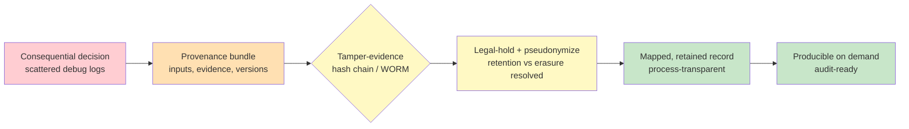

# Chapter 4.7 — Compliance, Audit & Governance

*Part IV — Production Operations · Domain D4 · Reading time ~30 min · Prerequisites: Ch. 4.3, Ch. 4.6*

## 1. The failure story

The letter was routine, as these things go. A financial regulator, conducting a periodic review, asked the lender to produce the *decision record* behind **200 agent-assisted loan denials** from the previous eighteen months — for each one, what the applicant submitted, what evidence the system considered, which model and policy version made the call, and what human oversight was applied. A standard request. The lender had ninety days to answer.

They could not answer it. Not because the system had done anything wrong — an internal review found the denials were, on the merits, correct and defensible. They could not answer it because the *evidence that the system had decided correctly did not exist in retrievable form*. The traces were there, sort of, but scattered: some in a logging system with a **90-day** retention window, so anything older than three months was simply gone. The logs that remained were not *tamper-evident* — nothing proved they hadn't been altered — so even the surviving records carried no evidentiary weight. They were not *mapped* to the decisions: a regulator asking about applicant #4471's denial could not be handed the specific trace that produced it, because nothing linked the business decision to the reasoning behind it. And a routine privacy-deletion job, doing exactly what it was designed to do under the company's GDPR policy, had *partially deleted* applicant data that the audit now required — the retention policy and the audit obligation were in direct, unresolved conflict, and the privacy job had won.

The system worked. The *proof that it worked* had never been designed to exist. Ninety days of scrambling produced a partial, contestable reconstruction and a regulatory finding anyway — not for making bad decisions, but for being unable to demonstrate that the decisions were good. The question the team had never asked was **not "does the agent decide correctly," but "when someone with legal authority demands proof of how a specific consequential decision was made, does a complete, tamper-evident, retention-compliant record exist and can we produce it — because a correct decision you cannot evidence is, to a regulator, indistinguishable from a wrong one?"**

## 2. The mental model

### 2.1 Auditability is an architectural property, not a report

The deepest lesson of the failure story is that *auditability cannot be added later*. The team had a working system and assumed that if a regulator ever asked, they would assemble the answer from whatever logs existed. But the evidence a regulator needs — complete, mapped to decisions, tamper-evident, retained for the legally-required window — is not something you can reconstruct after the fact from logs designed for debugging. It has to be *designed in*: the record must be produced as a byproduct of the decision itself, at the moment of the decision, in a form built to be evidence. This reframes compliance from a documentation exercise the legal team does into an *engineering property* the system must have, the same way reliability (Chapter 4.4) or observability (Chapter 4.3) is a property and not a memo.

**Auditability is an architectural property that must be designed into the system before the first consequential decision is made: every such decision must emit, at the moment it happens, a complete and tamper-evident record — inputs, evidence, model and policy versions, and the human oversight applied — retained for the legally-mandated window, because you cannot reconstruct after the fact the proof you did not architect to exist, and a correct decision without producible evidence is, to anyone with authority to ask, a liability rather than an asset.** This is the doctrine, and it turns the operational infrastructure of the whole Part into a compliance asset.

### 2.2 The regulatory landscape as engineering requirements

Compliance frameworks read as legal abstractions but translate into concrete engineering requirements, and the translation is the skill. The *EU AI Act* is the sharpest example. Its Article 12 (record-keeping / automatic logging) is, in engineering terms, a requirement that high-risk AI systems maintain automatic logs of their operation — which is a *trace and retention* requirement your Chapter 4.3 observability already half-satisfies, if the retention and completeness are right. Its Article 14 (human oversight) is a requirement that a human can *effectively* oversee and intervene — which is the human-in-the-loop architecture of Chapter 3.3, plus *evidence* that the oversight was real and not a rubber stamp. The Act's risk tiers determine which of your agentic use cases carry these obligations at all: a low-risk internal helper and a high-risk credit or hiring decision live in different regulatory worlds, and classifying your use case correctly is the first engineering step, because it sets the entire requirement set.

Two complementary frameworks provide the *management scaffolding* around the technical controls. The *NIST AI Risk Management Framework* organizes the work into govern / map / measure / manage — which maps almost one-to-one onto the eval-and-observability stack you have already built (measure is your evals, manage is your release gates and monitoring). *ISO/IEC 42001* is an AI management-system standard that provides the auditable process wrapper. The point is not to memorize the frameworks; it is to recognize that they demand the artifacts Part IV already produces — traces, evals, versioned releases, oversight records — and to arrange those artifacts so a framework audit finds them ready rather than absent.

### 2.3 Audit artifacts: provenance bundles and tamper-evidence

The concrete deliverable that satisfies "prove how this decision was made" is a *provenance bundle*: a per-consequential-decision record binding together the inputs the system received, the evidence it considered, the model / prompt / tool / policy versions in effect (the versioned quartet of Chapter 4.6, now doing double duty as legal evidence), and the approvals or human oversight applied. The bundle is *mapped* to the business decision — applicant #4471's denial points to exactly the bundle that produced it — which is the mapping the failure story lacked. This is where Chapter 4.6's versioning stops being an operational nicety and becomes the backbone of a legal record: a decision you cannot tie to the exact system version that made it is a decision you cannot defend.

A record is only evidence if it cannot have been quietly altered, which is what *tamper-evidence* provides. Techniques like *hash chains* (each record cryptographically linked to the previous, so any alteration breaks the chain) and *write-once-read-many (WORM) storage* (records that physically cannot be modified after writing) give the bundle evidentiary weight. Without tamper-evidence, a record proves nothing, because the obvious rebuttal — "you could have edited this after the fact" — has no answer. The failure story's surviving logs failed exactly here: present, but not provably unaltered, and therefore worthless as proof.

### 2.4 The honest limits of reproducibility

Here is where agentic compliance departs from traditional software audit, and where honesty is itself a design requirement. A regulator's instinct is to ask for *reproducibility*: "re-run the decision and show us it produces the same output." For a nondeterministic system, this is not fully possible — the same input can produce different outputs across runs, so you cannot offer a re-runnable proof the way a deterministic rules engine can. Pretending otherwise is both false and fragile. The correct posture is to shift what you promise: you provide the logged trace as *the record of what actually happened* — not a re-runnable proof, but a faithful, tamper-evident account of the specific reasoning and evidence behind the specific decision. You can honestly claim *process transparency* (here is exactly what the system did, step by step, and here is the human oversight that governed it); you cannot honestly claim *mechanistic reproducibility* (here is the deterministic why that will recur on re-run).

**The honest compliance answer for a nondeterministic system separates what you can prove from what you cannot: you can prove *what happened* through a complete tamper-evident trace and *what governed it* through documented oversight and versioning, but you cannot prove *re-runnable determinism*, so you design the audit story around the record of the actual decision rather than around a reproducibility you would have to fake.** Designing the honest answer in advance — and telling regulators plainly where the line is — is far stronger than being caught claiming a determinism the system does not have.

### 2.5 Data governance and the deletion-versus-retention conflict

The last piece is the one that actually bit the failure story: *data governance*, and specifically the direct collision between *privacy deletion* and *audit retention*. GDPR (and its kin) grants a right to erasure — delete this person's data on request, or on a retention schedule. Audit and financial regulation demand the *opposite* — retain the decision record for years so it can be produced on demand. These are not in tension; they are in direct contradiction, and a naive privacy job that deletes indiscriminately will destroy records the law separately requires you to keep, which is precisely what happened. The resolution is not to pick one but to architect the conflict away: *legal-hold tiers* that exempt audit-required records from routine deletion, and *pseudonymization* that lets you retain the decision record and its reasoning while severing or protecting the direct personal identifiers, so you satisfy the audit obligation without retaining raw personal data longer than privacy law allows. Add residency and retention *schedules* that encode which data lives where and for how long, and the two regimes coexist. Ignore the conflict, and one regime silently overwrites the other — with the privacy job usually winning, because it runs on a schedule while the audit request arrives by surprise.

*Red: a consequential decision leaving only scattered, deletable debug logs. Orange: a provenance bundle binding inputs, evidence, and versions to the decision. Yellow: tamper-evidence that makes the record proof, and legal-hold-plus-pseudonymization that resolves the deletion-versus-retention conflict. Green: a mapped, retained, process-transparent record that can be produced on demand — auditability as an architected property.*

## 3. The production lens

The reframe that turns this chapter from a cost center into a strategy is that *auditability is a commercial advantage in regulated domains*, not merely a tax. The lender who can answer the regulator's 200-denial request in a day — complete bundles, tamper-evident, mapped, retained — does not just avoid a finding; it can *sell into* regulated buyers who will not touch a vendor that cannot. In finance, healthcare, hiring, and public sector, the ability to produce a clean audit trail is a gating requirement for the deal, which means the provenance infrastructure of this chapter is a market-access asset. The teams that treat compliance as an architectural property early get to compete for contracts the teams that bolted on logging cannot bid on at all. Framed this way, the provenance bundle is not overhead on top of the product; in a regulated market, it is part of the product.

The connecting insight for the whole Part is that *compliance consumes what operations already built*. The traces from Chapter 4.3 become audit logs when their retention and tamper-evidence are right. The versioned quartet from Chapter 4.6 becomes the model/policy provenance in the bundle. The human-in-the-loop records from Chapter 3.3 become the Article 14 oversight evidence. The eval suites from Chapter 4.1 become the "measure" pillar of the NIST framework. A team that built Part IV well has most of a compliance program already sitting in its infrastructure; the compliance work is arranging those existing artifacts to meet a legal specification, not building a parallel system. This is why compliance comes last in the Part — not because it matters least, but because it is the discipline that harvests everything the other six chapters produced.

> **Doctrine check.** If a decision your agent makes could ever have to be defended to someone with legal authority, and no complete, tamper-evident, retention-compliant, decision-mapped record is produced at the moment that decision is made, then you have built a system that can be right but cannot *prove* it was right — and in a regulated domain, unprovable correctness is treated as, and carries the liability of, incorrectness.

## 4. Edge-case catalog

| # | Edge case | What it looks like | Detection | Mitigation |
|---|-----------|--------------------|-----------|------------|
| 1 | Explainability demanded on a probabilistic decision | A regulator asks "why exactly did the model decide this," expecting mechanistic determinism | Requests for re-runnable proof the system cannot honestly provide | Offer process transparency (the logged trace of what happened + oversight), state the reproducibility limit plainly, design the honest answer in advance |
| 2 | Cross-border agent action | An agent acts from region A on data in region B under contract law of region C | Jurisdiction of a decision is ambiguous; residency rules conflict | Map data residency and applicable law per action; encode jurisdiction in the provenance bundle; constrain actions by region policy |
| 3 | Third-party model opacity | Your compliance story depends on a model vendor whose internals you cannot inspect | An audit asks for assurances about a model you do not control | Obtain supplier attestations and model/system cards; negotiate contractual eval rights; document the vendor boundary honestly |
| 4 | Audit-log injection | Adversarial content in a trace becomes an attack when the audit viewer renders it | Malicious payloads in logged inputs (Ch. 3.5) targeting the audit tooling | Treat audit logs as untrusted content on render; sanitize/escape in the viewer; isolate the audit reader from privileged context |
| 5 | Deletion job destroys audit records | A GDPR erasure or retention job deletes data the audit separately requires | Records missing exactly where privacy jobs ran; retention gaps at deletion boundaries | Legal-hold tiers exempting audit-required records; pseudonymize to keep the decision record while protecting identifiers |
| 6 | Retention window shorter than audit horizon | Debug-grade 90-day retention silently drops records needed for years | Requested records older than the retention window are simply gone | Separate audit-retention tier sized to the legal horizon, distinct from debug retention; verify retention against the obligation |

## 5. Claude & MCP in this chapter

Nothing in this chapter is satisfied by a model choice; it is satisfied by *architecture around* the model, and the model-and-MCP layer contributes specific evidence rather than the whole answer. The MCP tool calls and model turns your trace layer already captures (Chapter 4.3) are the raw material of the provenance bundle — structured tool invocations are easier to render as clean evidence than free-form logs — and the versioned quartet (Chapter 4.6) supplies the model, prompt, and tool versions the bundle must record. Where the vendor boundary matters most is third-party model opacity: your compliance story depends in part on a provider whose internals you cannot inspect, so you rely on published *model and system cards*, documented intended-use, and any compliance attestations, all of which live on and around docs.claude.com and all of which move as products and regulations evolve. Verify the current compliance documentation, data-handling terms, and available attestations against the live sources rather than trusting this page, and treat regulatory facts — EU AI Act obligations, NIST and ISO specifics, sector rules — as authoritative only from primary legal sources and qualified counsel, because this is a domain where a confidently-remembered but outdated requirement is a liability, and the durable content here is the architecture of auditability, not any specific current statute or product attestation.

## 6. Design exercise

Produce the **audit-readiness specification** for an agent participating in **credit decisions** — a high-risk use case under frameworks like the EU AI Act. Your spec must define: the **provenance-bundle schema** — exactly what each consequential decision records (inputs, evidence considered, model/prompt/tool/policy versions, human oversight applied) and how the bundle is mapped to the business decision; the **retention matrix** — which data lives in which tier, for how long, reconciling the audit horizon against privacy-erasure obligations via legal-hold tiers and pseudonymization; the **oversight evidence** — how you demonstrate Article-14-style effective human oversight was real and not a rubber stamp (drawing on Chapter 3.3); the **tamper-evidence mechanism** — how the bundle is made provably unaltered (hash chain, WORM, or equivalent); and the **regulator-facing narrative** — the honest account of how nondeterminism is governed, stating clearly what you can prove (what happened, what governed it) and what you cannot (re-runnable determinism).

**Review standard.** A strong answer treats auditability as architected-in, emitting a complete tamper-evident bundle at the moment of each decision and mapping it to the business record, so the 200-denial request is answerable in a day; it resolves the deletion-versus-retention conflict explicitly with legal-hold tiers and pseudonymization rather than letting a privacy job silently win; it draws its oversight evidence and version provenance from the Chapter 3.3 and 4.6 infrastructure rather than building a parallel system; and — the mark of real understanding — its regulator narrative is *honest about nondeterminism*, promising process transparency and refusing to claim a reproducibility the system does not have. A weak answer promises re-runnable determinism it cannot deliver, keeps one retention window for everything, and assumes debug logs will suffice as legal evidence — reproducing the failure story's ninety-day scramble.

## 7. Self-test

Argue each claim to its reasoning, not just its verdict.

1. *"If the agent makes correct decisions, compliance is essentially handled."* — No. Compliance is about *provable* correctness, not correctness. The failure story's denials were correct on the merits and still produced a regulatory finding, because the evidence was scattered, non-tamper-evident, unmapped, and partially deleted. To an authority that can compel proof, a correct decision you cannot evidence carries the liability of a wrong one.

2. *"Auditability can be added when a regulator actually asks."* — False, and this is the core error. The evidence a regulator needs — complete, mapped, tamper-evident, retained — cannot be reconstructed after the fact from debug logs. It must be emitted at the moment of decision by design. Auditability is an architectural property like reliability, not a report you write on demand.

3. *"For a regulator, we should promise to re-run the decision and reproduce the output."* — Dangerous and dishonest for a nondeterministic system. The same input can yield different outputs, so re-runnable determinism cannot be truthfully promised. The honest and stronger posture is process transparency — a tamper-evident record of what actually happened and what governed it — with the reproducibility limit stated plainly.

4. *"A privacy-deletion policy and an audit-retention policy can each run independently."* — No — they are in direct contradiction, and run independently one destroys what the other requires, which is exactly how the audit records got partially deleted. They must be reconciled architecturally with legal-hold tiers and pseudonymization, so audit records survive erasure jobs while personal identifiers are still protected.

5. *"Compliance is pure overhead with no upside."* — Not in regulated domains. The ability to produce a clean, tamper-evident audit trail is a gating requirement for finance, healthcare, hiring, and public-sector contracts, so provenance infrastructure is market access — a commercial asset that lets you bid where competitors who bolted on logging cannot.

## 8. Spaced-review card

Answer from memory before checking back.

- **The core reframe:** explain why "the system decides correctly" does not satisfy an auditor, and what four properties a decision record must have to count as evidence.
- **The honest limit:** state what you *can* prove about a nondeterministic decision and what you *cannot*, and why designing the audit story around the first is stronger than faking the second.
- **The conflict:** describe the GDPR-erasure-versus-audit-retention contradiction and the two-part architectural resolution (legal-hold tiers, pseudonymization).

---

*Next: Part V — Advanced & Expert opens with Chapter 5.1 — Multi-Agent Systems, where the disciplines of the whole manual are stress-tested by the most over-applied pattern in the field: a five-agent "team" that debates its way to a confident, unanimous, wrong answer at eleven times the cost of a single agent — and lower accuracy — teaching when coordination genuinely pays and when it is theater.*
