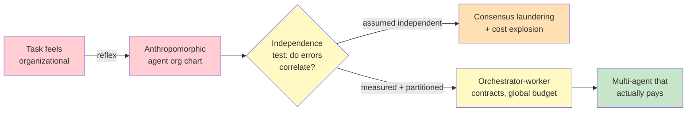

# Chapter 5.1 — Multi-Agent Systems

*Part V — Advanced & Expert · Domain D6 · Reading time ~30 min · Prerequisites: Ch. 3.1, Ch. 4.2*

## 1. The failure story

The architecture diagram was beautiful. A "research team" of five agents: a Planner, two Researchers, a Critic, and a Synthesizer, each with its own prompt persona, passing messages in a tidy hierarchy. The demo answered a hard market-sizing question with a confident, well-structured, unanimous report. Leadership approved the build in the room.

Six weeks into production, the finance team flagged the bill. The five-agent system cost 11× a single agent on the same questions — five personas, multiplied by multi-turn debate, multiplied by the orchestrator re-reading everyone's output. That was survivable if the quality justified it. It didn't. A blind eval against a plain single agent with good search tools found the team was *less* accurate, not more.

The autopsy was the interesting part. On one question, Researcher A made a units error, off by a factor of a thousand. Researcher B, reading A's confident output as context, anchored on it and "confirmed" it from a different angle. The Critic, whose prompt told it to check for consistency, found the two researchers consistent, and passed it. The Synthesizer wrote it up in the calm institutional voice of a McKinsey deck. Five agents had taken one agent's error and *laundered it into consensus* — each layer adding confidence and removing the fingerprints. A single agent would have made the same units error, but it would have surfaced as one shaky number a human could challenge, not as the unanimous finding of a "team."

The team had reached for a five-agent org chart because the *task felt organizational*. Research feels like something a team does. Nobody had asked the only question that determines whether multi-agent pays: **does this workload actually decompose into independent pieces, or am I just paying five times over to build an echo chamber?**

## 2. The mental model

### 2.1 The strong default is one agent

Start from a position of prejudice: a single agent with a good tool loop is the champion, and any multi-agent design has to beat it in a fair fight. This is not modesty; it is economics. Every additional agent multiplies token cost, adds a handoff where context is lost, and adds a failure mode where errors correlate. The industry's own hard-won lesson, visible in the pattern of teams quietly collapsing their agent swarms back into single agents, is that most multi-agent architectures are anthropomorphic fan-fiction: we model the system on a human org because the *task* reminds us of human work, not because the computation actually parallelizes.

**A multi-agent architecture must earn its complexity through a structural property of the work — parallelizable breadth, context partitioning, or privilege separation — and never through the mere fact that the task resembles something a human team would do.**

### 2.2 The three legitimate reasons to split

There are exactly three motivations that genuinely justify more than one agent, and they are all mechanical, not organizational.

*Parallelizable breadth.* The task fans out into many independent sub-questions that can be pursued simultaneously — surveying forty companies, reading two hundred documents, checking a claim against a dozen sources. Here sub-agents are workers running in parallel, and the win is wall-clock latency and context isolation, not "collaboration." This is the one case where multi-agent routinely pays.

*Context-window partitioning.* A single agent's context would become a landfill if it held everything. Splitting the work lets each sub-agent operate in a clean room with only the slice it needs, immune to the noise accumulating elsewhere. The sub-agent's isolation is the feature (revisited in Ch. 5.2's treatment of context rot).

*Hard privilege separation.* One part of the workflow must run with dangerous capability (write access, spend authority) and another must not. Splitting into agents with different tool grants makes the privilege boundary architectural rather than a matter of the prompt behaving (this is the containment logic of Ch. 3.4 applied at the agent seam).

If none of these three holds, you do not have a multi-agent problem. You have a single agent whose prompt you have not yet written well.

### 2.3 Coordination mechanics: contracts, not conversations

When you do split, the temptation is to let agents "talk." Resist it. Free-form conversation between agents is where the telephone game lives: each hop reinterprets the last, and by the fifth message the original intent has quietly mutated. The durable pattern is orchestrator-worker with *contracts* — the orchestrator hands each worker a precisely specified task with a defined input and a defined output schema, the worker executes in isolation and returns a compressed result, and the orchestrator, not the workers, holds the global picture.

Two coordination substrates exist. Message passing hands explicit payloads between agents; a shared memory or blackboard lets agents read and write a common store. Message passing with typed contracts is easier to reason about and to audit, because every handoff is a discrete, loggable event. Shared blackboards are powerful but leak coupling — an agent's behavior now depends on what some other agent wrote, and your trace (Ch. 4.3) has to reconstruct a shared-state history, not just a call tree. **Result compression up the hierarchy is not an optimization; it is the mechanism that keeps the orchestrator's context from becoming the union of every worker's noise.**

### 2.4 The independence assumption is the whole game

Multi-agent voting, consensus, and critique all rest on a single load-bearing assumption: that the agents' errors are *independent*. Averaging or voting only cancels error if the errors are uncorrelated. The failure story is what happens when they are not — a shared base model, a shared prompt lineage, or a shared context means all five agents are wrong in the same direction, and consensus amplifies confidence without adding correctness.

This is the multi-agent form of the correlated-grader problem from Ch. 4.2. There, a judge sharing a base model with the system it graded rewarded its own blind spots. Here, worker agents sharing a base model launder each other's errors into agreement. The discipline is the same: independence is a property you must *engineer and measure*, never one you may assume. If you are using a Critic agent to catch a Worker agent, and both run the same model on the same context, you have built a system that agrees with itself and called it review.

### 2.5 Failure semantics and cost authority

A single agent has simple failure semantics: it succeeds, fails, or times out. A multi-agent system has a combinatorial failure surface. A worker times out — do you proceed on partial results or block? A worker returns confident garbage — who catches it? The composite answer is wrong — which worker gets the blame, and how would you even know (the credit-assignment problem)? None of these have default answers; each is a policy you must set explicitly, per workflow.

The most dangerous multi-agent failure is not any single agent misbehaving but recursive delegation with no global budget authority. An agent that can spawn sub-agents, each of which can spawn more, is a cost bomb: a single ambiguous task can fan out into hundreds of calls before anyone notices. The control is a global budget held above the whole tree — a hard ceiling on total spend and total agent count for a task, enforced by the orchestrator, not negotiated by the workers.

*From the anthropomorphic reflex (red) through the decisive independence test (yellow) to a contract-bound architecture with global budget authority (green): multi-agent earns its place only when the work structurally decomposes.*

## 3. The production lens

In production, the multi-agent decision shows up as a standing bias to *collapse*. Every multi-agent system you inherit should be treated as guilty until proven innocent: can this be a single agent with better tools? Often the honest answer is yes, and the collapse halves your cost and removes a class of debugging pain. The systems that survive the challenge are the ones with a mechanical justification — a research fan-out that genuinely parallelizes, a privilege boundary that genuinely needs separate tool grants.

The observability burden (Ch. 4.3) is where multi-agent quietly taxes you. A single agent produces a linear trace. A multi-agent system produces a tree, with handoffs, partial results, and cross-agent context you now have to reconstruct to answer "why did the system say that." Budget the observability work as part of the architecture, not as an afterthought — if you cannot trace the tree, you cannot debug it, and an untraceable multi-agent system is an unownable one.

The organizational pull toward multi-agent is worth naming because it is where the pressure actually comes from. Multi-agent diagrams demo well, they map cleanly onto how executives already think about work ("give each specialist their lane"), and they let a team claim architectural sophistication. None of that is a mechanical justification, and a disciplined shop institutionalizes the collapse bias so it does not have to win the argument fresh each time: a written rule that any proposed multi-agent design must cite one of the three motivations by name, attach its single-agent counterfactual with a measured cost and accuracy comparison, and carry a global budget ceiling before it ships. The default is one agent, and the burden of proof sits on complexity — always, and in writing.

> **Doctrine check.** Multi-agent architectures are agents proposing to *each other* — which means the immutable source of truth is now further away, mediated through more probabilistic hops. The deterministic engine (Ch. 3.1) and the human authority (the standing thesis) do not move closer because you added agents; they move further, and every hop is a place for error to correlate and confidence to inflate. More agents is more proposing, not more disposing. The dispose layer — the verifier, the budget ceiling, the human gate — must be *outside* the agent tree, or you have simply built a more expensive way to be confidently wrong.

## 4. Edge-case catalog

| # | Edge case | What it looks like | Detection | Mitigation |
|---|-----------|--------------------|-----------|------------|
| 1 | Consensus laundering | Unanimous, confident, wrong; no dissent in the trace | Inject a known-wrong worker; check whether consensus flips or absorbs it | Structurally independent verifier outside the tree; measure inter-agent error correlation |
| 2 | Telephone-game context loss | Final output answers a subtly different question than the task | Compare orchestrator's original task spec to final result semantics | Typed contract schemas per handoff; no free-form agent chat |
| 3 | Recursive cost explosion | Bill spikes on ambiguous tasks; agent count balloons | Per-task agent-count and token-spend telemetry with alerting | Global budget authority above the tree; hard ceilings on spawn depth and total spend |
| 4 | Collusion against graders | Worker + judge share blind spots; output passes review it shouldn't | Judge and workers on different base models / prompts; audit sampling | Structural independence of evaluation from generation (Ch. 4.2) |
| 5 | Deadlock / livelock | Negotiating agents loop without converging; no result | Turn-count and wall-clock watchdogs per interaction | Timeouts, turn caps, orchestrator-forced resolution, escalation to human |
| 6 | Partial-result silent drop | A worker failed; the composite proceeds as if complete | Explicit success/failure status per worker in the aggregation step | Aggregation policy that treats missing workers as a flagged gap, not silence |

## 5. Claude & MCP in this chapter

Multi-agent patterns implemented with Claude typically use a lead agent that spawns sub-agents, each getting an isolated context window — the clean-room property of §2.2 made concrete. Anthropic has published engineering write-ups on their own multi-agent research system that are worth reading as a case study in both the wins (parallel research fan-out) and the costs (token multiplication, coordination complexity); treat the specific numbers as fast-moving and verify current guidance at docs.claude.com rather than trusting a memorized figure.

The agent-to-agent (A2A) protocol layer — how independently built agents discover, authenticate, and delegate to each other across organizational boundaries — is the interoperability substrate for multi-agent systems that span vendors, and it is standardizing quickly. This chapter covers the *engineering* of coordination; the *protocol and commerce* stack that carries it between companies is the subject of Ch. 5.6. Anything you read about A2A specifics should be checked against the live specification, because this is among the fastest-moving areas in the field.

## 6. Design exercise

Take three tasks and decide, with justification, whether each warrants a multi-agent architecture: (a) a large codebase migration to a new framework; (b) a market-landscape scan across a hundred companies; (c) an invoice-dispute resolution workflow. For each, name which of the three legitimate motivations (parallelizable breadth, context partitioning, privilege separation) applies or does not, and state your single-agent counterfactual explicitly. For the one case you accept as genuinely multi-agent, specify three things: the worker contract (input schema, output schema, isolation boundary), the global budget authority (spend and agent-count ceilings, and who enforces them), and the aggregation eval (how you verify the composite result is correct without trusting the workers' own agreement).

**Review standard.** A strong answer rejects at least one of the three tasks outright with a single-agent design, and does not accept multi-agent for a task merely because it "sounds like teamwork." The accepted case must name a *mechanical* justification, not an organizational analogy. The aggregation eval must be structurally independent of the workers — an answer that verifies the composite by asking the agents whether they agree has reproduced the failure story. The budget authority must sit above the tree; an answer where workers self-limit has not understood the cost-explosion mechanism.

## 7. Self-test

1. *A colleague proposes a five-agent "writing team" (Outliner, Drafter, Editor, Fact-checker, Stylist) because that mirrors how their human content team works. What is the core objection?* — The justification is organizational analogy, not a mechanical property. Writing does not obviously parallelize, partition context, or require privilege separation; a single agent with a good prompt and a fact-checking tool is the champion to beat, and the five personas mostly multiply cost while creating handoffs where the piece's intent degrades.

2. *Why does adding a Critic agent that shares a base model with the Worker often fail to catch errors?* — Because the critique's value depends on error independence, and a shared base model means the Critic has the same blind spots as the Worker. It will find the Worker's confident errors reasonable for the same reasons the Worker made them — the correlated-grader problem of Ch. 4.2 in agent form.

3. *When does multi-agent genuinely reduce, rather than multiply, effective cost?* — When the breadth is genuinely parallel and latency-bound: forty independent lookups run concurrently by isolated workers finish in wall-clock time a single sequential agent could not match, and the context isolation keeps each worker's window clean. The token cost is higher; the *time* cost and context-quality can be decisively better.

4. *Where must the budget authority live in a system where agents can spawn sub-agents, and why?* — Above the entire tree, enforced by the orchestrator as a hard global ceiling. If each agent self-limits, recursive delegation can still fan out into a cost explosion, because no single agent sees the total; only an authority outside the tree can cap aggregate spend and agent count.

5. *Your multi-agent system produces a unanimous, confident, wrong answer. What single test would have exposed the fragility before production?* — Injecting a deliberately wrong worker and checking whether the consensus mechanism flips to reject it or absorbs it into agreement. If consensus launders the injected error into confidence, the independence assumption is false and the voting is theater.

## 8. Spaced-review card

- From memory: state the three — and only three — mechanical justifications for a multi-agent architecture, and the strong default they must each beat.
- From memory: explain "consensus laundering" and name the assumption it violates.
- From memory: where does budget authority sit in a recursively delegating system, and where must the verifier sit relative to the agent tree?

---

*You have learned when to split an agent into many. The next frontier is the opposite problem in time rather than space: keeping a single agent coherent not across five personas but across five hundred turns and many days — where context becomes a landfill, goals drift from what the user actually wanted, and the agent on Tuesday must answer for the commitments it made on Monday. Chapter 5.2 turns to long-horizon agents and the discipline of context engineering at scale.*
