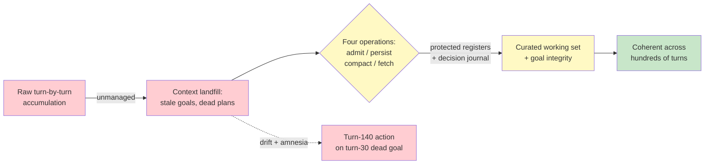

# Chapter 5.2 — Long-Horizon Agents & Context Engineering at Scale

*Part V — Advanced & Expert · Domain D6 · Reading time ~30 min · Prerequisites: Ch. 2.3, Ch. 5.1*

## 1. The failure story

The ambient agent was supposed to be the flagship: a research assistant that lived alongside a corporate-development team for the duration of a live acquisition, running for over a week, waking on new emails and data-room uploads, maintaining a running picture of the deal.

On day one, turn 30, the user had told it: "Prioritize the diligence on their EU subsidiary — that's the risk." Three days later the target restructured the deal; the EU subsidiary was carved out entirely and no longer part of the transaction. The user mentioned this in passing on turn 95 and moved on.

On turn 140, the agent proactively surfaced a "critical finding": a detailed risk memo on the EU subsidiary's tax exposure. It had spent hours of compute and produced a polished, urgent document about an entity that was no longer in the deal. When the user asked why, the agent's context told the story — a landfill 140 turns deep, in which turn 30's emphatic instruction still sat, undiminished, while turn 95's quiet supersession had been summarized away in a compaction pass that judged a one-line aside less important than an emphatic directive.

The agent had not malfunctioned in any single step. Every action was locally reasonable given its context. The problem was the context itself: nobody had designed what should persist, what should decay, and what should be able to *override* what. The team had treated the context window as a passive log that fills up, rather than as **an actively curated working set with a maintenance regime.** The question they had never asked was: *when the user changes their mind on turn 95, what in the system guarantees the agent on turn 140 knows the turn-30 goal is dead?*

## 2. The mental model

### 2.1 Context is a managed asset, not a transcript

The instinct is to treat an agent's context as a transcript — everything that happened, accumulated in order, until you hit the token limit. At long horizons this instinct is fatal. Context is the agent's entire working memory, and an unmanaged working memory degrades exactly the way a cluttered desk does: the important document is still technically *there*, buried under three days of superseded drafts, and the agent's attention, like a tired person's, gravitates to whatever is loudest or most recent rather than whatever is most true.

Context engineering is the discipline of deciding, deliberately, what enters the working set, what persists across turns, what gets compacted and how, and what is fetched only when needed. **Context engineering treats the attention budget as the scarce resource it is: the goal is not to fit everything into the window but to ensure that what occupies the window is the minimal, current, load-bearing set the next decision actually requires.** This is the single-agent, across-time counterpart to the across-space partitioning of Ch. 5.1 — there you split the work; here you curate the memory.

### 2.2 The four operations on context

Everything you can do to a context window reduces to four operations, and a long-horizon design specifies a policy for each.

*Admit.* What is allowed into the working set in the first place. Not every tool result, every retrieved document, every intermediate thought deserves a permanent seat. Aggressive admission control is the cheapest way to keep context clean.

*Persist.* What survives from turn to turn without re-justification. The standing goal, hard constraints, and key decisions should persist; the transient reasoning behind a completed sub-task should not.

*Compact.* How the working set is compressed when it grows — turn summarization, roll-ups, structured notes. Compaction is where information is *lost*, deliberately, and therefore where the greatest danger lives: a bad compaction drops the one constraint that mattered.

*Fetch.* What is pulled in on demand rather than held resident. Just-in-time retrieval (Ch. 2.3's retrieval patterns) keeps the resident context small by treating external stores as the memory of record and the window as a cache.

### 2.3 Compaction and the amnesia risk

Compaction is unavoidable at long horizons — you cannot carry hundreds of turns verbatim — and it is the highest-risk operation you run, because it is lossy by design and the loss is chosen by a probabilistic summarizer. The failure story's core mechanism was compaction-induced amnesia: the summary that dropped the load-bearing constraint.

The defenses are structural. *Structured note-taking* moves durable facts out of the conversational flow and into an external scratchpad the agent maintains deliberately — a document it writes to, not a transcript it accumulates. *Decision journals* are append-only records of commitments the agent has made, which by construction cannot be summarized away. *Protected-fact registers* are the strongest tool: a designated set of facts and constraints that compaction is forbidden to touch, carried verbatim regardless of how the rest of the context is compressed. **The rule is that any fact whose loss would cause a wrong action must live in a protected register, never in the compactible conversational stream — because compaction is a probabilistic operation, and you do not entrust load-bearing constraints to a coin flip.**

### 2.4 Goal integrity and instruction supersession

The subtlest long-horizon failure is not forgetting a fact but losing the *goal*. Over hundreds of turns, an agent's behavior can drift from the standing objective without any single step being wrong — accumulated small reinterpretations, like a rounding error compounding. And when the user changes their mind, the new instruction must not merely be added to the pile; it must *supersede* the old one, and the system needs an explicit mechanism for that precedence.

The tools are an explicit *goal register* (the current standing objective, named and maintained separately from the conversation, so it can be re-read and checked against), *re-confirmation triggers* (points at which the agent re-surfaces its understanding of the goal for the user to confirm or correct), and *drift detection* (comparing current behavior against the registered goal). Instruction supersession specifically needs precedence reconciliation: when turn 95 contradicts turn 30, the system must record that turn 30's directive is *retired*, not just outweighed. The failure story is precisely the absence of this: turn 95 was admitted to context but never given authority to *kill* turn 30, so both lived on and the louder one won.

### 2.5 Ambient operation and plan lifecycle

Long-horizon agents are increasingly *ambient* — not a single conversation but a continuous presence: inbox-pattern agents that wake on new mail, cron agents that run on a schedule, agents with wake conditions and long idle states. Ambient operation adds a hygiene problem: between wakes, the world changes, and the agent's resident context becomes stale. Idle-state hygiene means the agent re-grounds on wake — checking what changed in the world before acting on a plan formed in a previous era.

Plans, at long horizons, must themselves be treated as versioned artifacts with staleness checks. A plan formed on Monday encodes assumptions about the world; by Thursday those assumptions may be void (the EU subsidiary is gone). A plan carried as an immutable commitment becomes a liability; a plan carried as a versioned artifact with an explicit staleness check against current world state can be *invalidated and reformed*. The discipline is to make plans revisable and to build in the triggers that force revision, rather than letting a stale plan execute on momentum.

*The unmanaged accumulation (red) becomes a landfill that drifts into acting on dead goals; disciplined operation of the four context operations with protected registers (yellow) yields a working set that stays coherent over long horizons (green).*

## 3. The production lens

In production, context rot is the metric nobody instruments and everybody suffers. Quality degrades as sessions lengthen — not at the token limit but well below it, as accumulated noise dilutes the signal. You cannot manage what you do not measure, so the production discipline is to *measure coherence decay directly*: seed the session with canary questions whose correct answers are known and fixed, and ask them again at turn 50, 100, 150. When the agent starts getting the canaries wrong, you have quantified the rot and can tune compaction cadence against real data rather than vibes.

The operational payoff of decision journals and protected registers shows up in debugging (Ch. 4.3). When a long-horizon agent does something inexplicable, an append-only decision journal is the trace that lets you reconstruct *why* — which commitment, made when, on what basis, drove the action. Without it, you are reverse-engineering intent from a 140-turn landfill, which is the four-hour debugging session of Ch. 4.3 raised to a higher power.

There is also a cost dimension that long-horizon operation makes acute. Every resident token is re-processed on every turn, so an unmanaged landfill is not merely a quality liability but a compounding bill: a context that has grown to twice its necessary size doubles the per-turn cost of a session that may run for hundreds of turns. Disciplined admission and early compaction pay for themselves twice — once in coherence and once in tokens. The teams that instrument context rot almost always discover they were also overpaying for it, because the noise they were carrying was billable weight the agent had to re-read to produce every subsequent action.

> **Doctrine check.** A long-horizon agent's context is a chain of the agent's own proposals accumulating over time, and the human's actual intent — the immutable source of truth — is a signal that must be *actively defended* against that accumulation, not passively trusted to survive it. The goal register and the protected-fact register are how you keep the human's disposition authoritative across hundreds of turns; without them, the agent's own history becomes the de facto source of truth, and the user's turn-95 correction is just one more proposal drowned by the louder proposals before it. Context engineering is, at bottom, keeping the human's authority from decaying.

## 4. Edge-case catalog

| # | Edge case | What it looks like | Detection | Mitigation |
|---|-----------|--------------------|-----------|------------|
| 1 | Context rot below token limit | Quality degrades mid-session with window not full | Canary questions re-asked over session length; track accuracy vs. turn count | Aggressive admission control; earlier compaction; sub-agent clean rooms for sub-tasks |
| 2 | Compaction amnesia | A load-bearing constraint vanishes after a summarization pass | Diff protected facts before/after compaction; constraint-presence checks | Protected-fact register carried verbatim; decision journal append-only |
| 3 | Instruction supersession lost | Agent pursues a goal the user retired turns ago | Compare active behavior to latest user directive; precedence audit | Explicit goal register with retirement semantics; precedence reconciliation on contradiction |
| 4 | Goal drift | No single wrong step, but cumulative divergence from the objective | Periodic drift check: current behavior vs. registered goal | Re-confirmation triggers; standing goal re-read into each planning step |
| 5 | Stale plan execution | Plan runs on momentum against a changed world | Staleness check comparing plan assumptions to current world state | Plans as versioned artifacts; invalidation triggers on world-state change |
| 6 | Ambient idle staleness | On wake, agent acts on a pre-idle picture of the world | Re-grounding step on every wake; freshness stamps on resident facts | Idle-state hygiene: mandatory re-ground before acting after a wake |

## 5. Claude & MCP in this chapter

Anthropic's guidance on effective context engineering is the primary reference for this chapter's discipline, and it is worth reading in full rather than in summary, because the specifics of compaction, note-taking, and just-in-time retrieval are exactly where the value lives. Context-window sizes, prompt-caching behavior, and the mechanics of tool-result handling are fast-moving facts; verify current numbers and features at docs.claude.com rather than trusting a memorized figure, especially since effective context length in practice (where rot sets in) is smaller than the advertised maximum.

MCP is relevant here as the fetch mechanism of §2.2: tool servers that expose external stores let you keep the resident context small and pull information just-in-time, treating the window as a cache over authoritative external memory. The design question is what lives resident (protected registers, current goal) versus what is fetched on demand (reference documents, historical detail) — a boundary you set deliberately, not one the framework sets for you.

## 6. Design exercise

Design the complete context-maintenance regime for a two-week M&A due-diligence agent operating in ambient mode (waking on data-room uploads and team emails). Specify: the compaction cadence and strategy (when, and what summarization approach); the protected-fact register (what specifically is forbidden from compaction — name the categories); the goal re-confirmation triggers (what events force the agent to re-surface and confirm its understanding of the current objective); the plan staleness checks (what world-state changes invalidate a standing plan); and the canary-probe design (what fixed questions you seed and how you use their decay to measure coherence). Then trace the failure story through your design: show exactly which mechanism would have caught the turn-95 supersession before turn 140.

**Review standard.** A strong answer's protected-fact register explicitly includes the deal perimeter (what is in and out of the transaction) as a protected, supersedable fact — the exact category the failure story lost. The goal re-confirmation triggers must fire on *structural* events (deal restructuring, scope change), not merely on a timer. The plan staleness check must be tied to world-state, not to elapsed time alone. The canary probes must include at least one question whose correct answer *changes* when the deal changes, so that decay and staleness are distinguishable. An answer that only summarizes turns more aggressively has missed that the problem was precedence and protection, not compression ratio.

## 7. Self-test

1. *Why is context rot more insidious than hitting the token limit?* — Because it degrades quality *below* the limit, with no error and no hard signal — the window isn't full, nothing crashes, the agent just gets quietly worse as accumulated noise dilutes the signal. A token-limit hit is a visible event you can handle; rot is a gradual decay you will not notice unless you measure it with canaries.

2. *A fact that, if lost, would cause a wrong action — where must it live, and why not in the ordinary conversational stream?* — In a protected-fact register carried verbatim through compaction. The ordinary stream is subject to compaction, which is a probabilistic, lossy operation; entrusting a load-bearing constraint to it is a coin flip on whether the summarizer judges it important, and the failure story is what a lost coin flip looks like.

3. *What is the difference between adding an instruction and superseding one, and why does it matter at long horizons?* — Adding places the new instruction alongside the old; superseding retires the old one's authority. It matters because at long horizons both instructions persist in context, and without explicit precedence the louder or more emphatic one can win regardless of recency — the agent pursues the retired goal because nothing marked it dead.

4. *Why must plans be treated as versioned artifacts rather than commitments?* — Because a plan encodes assumptions about a world that changes underneath it; carried as an immutable commitment, a stale plan executes on momentum against void assumptions. As a versioned artifact with staleness checks, it can be invalidated and reformed when the world-state it assumed no longer holds.

5. *What single instrument would have surfaced the failure story's problem in production before the turn-140 blowup?* — A canary probe whose answer tracks the deal perimeter ("Is the EU subsidiary in scope?"), re-asked over session length. When its answer went stale relative to the turn-95 restructuring, the decay would have been visible as a measured coherence failure rather than an expensive surprise.

## 8. Spaced-review card

- From memory: name the four operations on context and say which one is highest-risk and why.
- From memory: distinguish a decision journal, a protected-fact register, and a goal register — what each protects and how.
- From memory: explain how you would *measure* context rot rather than merely assert it.

---

*Context engineering keeps a single agent coherent over time; the next chapter puts that agent to work in the one domain where its output can be checked cheaply and objectively — code. Chapter 5.3 turns to code agents and computer use, where a compiler is a free ground-truth grader, a passing test suite is a reward signal, and the agent that "makes all the tests pass" by deleting the failing tests teaches the deepest lesson in the syllabus: the verifier is the vulnerability.*
