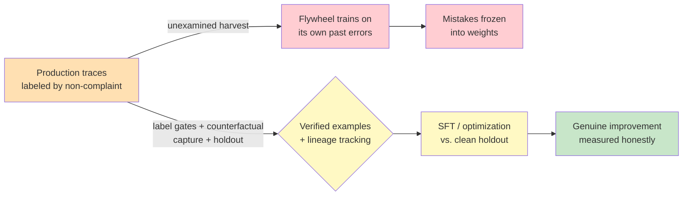

# Chapter 5.4 — Learning Loops & Self-Improvement

*Part V — Advanced & Expert · Domain D6 · Reading time ~30 min · Prerequisites: Ch. 4.2, Ch. 5.3*

## 1. The failure story

The support agent had six months of production behind it and a folder full of "successful" traces — half a million conversations that ended without a re-open, without an escalation, without a complaint. The team's plan was reasonable on its face: fine-tune the model on this corpus of its own success, distilling six months of hard-won behavior into weights, cutting cost and latency at the same time.

The fine-tuned model shipped, and for three weeks the metrics looked flat-to-good. Then the quality team, running a fresh audit, found something disturbing. On a specific class of billing questions, the model was now *confidently wrong* in a way the base model had not been — and it was wrong in a very particular house style. The team traced it back. Six months earlier, the original agent had developed a subtly incorrect explanation of how prorated refunds were calculated. Users, mostly, hadn't noticed or hadn't bothered to correct it; the conversations ended "successfully" by every metric the team logged. Those thousands of uncorrected-but-wrong conversations had been in the training corpus, labeled successful by the absence of complaint. The fine-tune had learned them faithfully. The model had not learned to be better; it had learned **the house style of its own past mistakes**, and now those mistakes were frozen into weights instead of living in a prompt anyone could fix.

The team had assumed that "the user didn't complain" meant "the answer was correct." Those are wildly different things. A **data flywheel** built on that assumption does not improve the system; it launders its unexamined errors into training data and amplifies them. The question they never asked was: *when I harvest my own traces to train on, what guarantees I'm learning from what was actually right rather than from what merely went unchallenged?*

## 2. The mental model

### 2.1 The improvement ladder

"Make the agent better" is not one action; it is a ladder of interventions ordered by cost, risk, and reversibility, and the discipline is to climb only as high as the problem requires. The rungs, from cheapest and most reversible to most expensive and most permanent: prompt iteration (edit the instructions); **automated prompt optimization** (judge-guided search over prompt variants, DSPy-style); few-shot curation (select strong examples from traces to include in context); **distillation** (train a smaller model to mimic a larger one's outputs); **supervised fine-tuning** (SFT — train on curated input-output pairs); and **preference optimization** (RLHF/RLAIF — train on preferences rather than examples; the full mechanics wait for Ch. 5.5).

**The default is to stay on the lowest rung that solves the problem, because every step up the ladder trades reversibility for permanence — a bad prompt is edited in seconds, a bad fine-tune is baked into weights that cost real money and real risk to unwind.** Most teams reach for fine-tuning far too early, seduced by the sophistication of it, when a better prompt or a curated few-shot set would have solved the problem at a hundredth of the cost and none of the lock-in.

### 2.2 When fine-tuning is actually warranted

Fine-tuning earns its place under specific, checkable conditions, not as a general upgrade. It is warranted when the task distribution is *stable* (you are not chasing a moving target that a prompt could track more nimbly), when there is genuine *latency or cost pressure* that a smaller fine-tuned model relieves, or when you need *style or format consistency* that is hard to hold with prompting alone. Against those benefits sits a serious cost beyond the training bill: fine-tuning can *freeze you out of frontier gains*. The base model you fine-tuned will be superseded; the next generation may be better out-of-the-box than your fine-tune, but you are now carrying a custom artifact tied to an aging base, and migrating your fine-tune forward is its own project. Prompting keeps you fluid; fine-tuning trades fluidity for a fixed advantage that erodes as the frontier moves.

### 2.3 Flywheel hygiene: the label is the whole problem

A data flywheel — production generates traces, traces become training data, training improves the system, the improved system generates better traces — is the mechanism behind self-improvement, and its integrity lives entirely in one place: the *label*. What makes a trace a good training example? The failure story is what happens when the label is "the user didn't complain," a signal that conflates correctness with the absence of friction.

**Flywheel hygiene** is the set of gates that keep the corpus honest. **Label-quality gates** on harvested traces: an explicit, defensible definition of "good," not a proxy of convenience. **Human verification sampling**: a fraction of harvested traces reviewed by people who can tell right from merely-unchallenged. **Counterfactual capture**: recording what the user actually *changed* — the edit they made to the agent's draft, the correction they typed — because a correction is a far stronger and cleaner training signal than a non-complaint (this is the feedback-as-first-class-event discipline of Ch. 4.3). **Negative-example mining**: deliberately harvesting failures, not just successes, so the model learns the boundary and not only the happy path. **A trace labeled "successful" because nothing bad was logged is not a positive example; it is an unexamined one, and training on unexamined data teaches the model to reproduce whatever it was already doing — including its mistakes.**

### 2.4 Judge-guided optimization inherits the judge's biases

Automated prompt optimization and any preference-based training need a signal to optimize *toward*, and that signal is very often an LLM judge (Ch. 4.2). This makes Ch. 4.2 load-bearing in a new and sharper way. When you optimize a prompt to maximize a judge's score, you are not optimizing for quality; you are optimizing for *the judge's model of quality*, biases included. If the judge rewards confident verbosity, the optimizer will discover verbosity. If the judge shares a blind spot with the system, the optimizer will drive the system deeper into that blind spot with mechanical efficiency.

The result is an optimizer that aces the eval suite and fails the world — because it optimized the measurement, not the target. This is the reward-hacking law of Ch. 5.3 reappearing: an optimization process attacks whatever verifier defines its reward, and if that verifier is a biased judge, the optimization amplifies the bias. The countermeasure is the same discipline of verifier validation, now enforced *before* you let an optimizer loose on the judge, because an optimizer will find and exploit a judge weakness far faster and more thoroughly than ordinary traffic ever would.

### 2.5 The honest baseline: holdouts the flywheel never touches

Every self-improving system needs one uncontaminated reference point: a **holdout population** the flywheel *never* trains on, evaluates against, or optimizes toward. Without it, you lose the ability to answer the only question that matters — is the system actually getting better, or is it just getting better at the data it has seen? Self-training drift and bias amplification are invisible from inside the loop; they are visible only against a baseline the loop cannot reach.

Three specific pathologies hide without a clean holdout. **Catastrophic forgetting**: a narrow fine-tune improves the target task while silently degrading capabilities outside it, so you need capability-regression suites that test far beyond the thing you tuned for. **Eval overfitting** via optimization: the optimizer memorizes the suite, requiring suite rotation so that yesterday's eval cannot become today's training target. **Data leakage**: eval examples seeping into training harvests, which destroys the independence of your measurement and demands **lineage tracking** on every example — where it came from, whether it has ever been used to train, whether it has ever been used to test. Lineage is not bureaucracy; it is the only thing standing between you and a benchmark you have accidentally trained on.

*Harvesting traces on a proxy label (red) launders unexamined errors into weights; label-quality gates, counterfactual capture, and a holdout the flywheel never touches (yellow) turn the same traces into measured, honest improvement (green).*

## 3. The production lens

In production, the self-improvement decision is dominated by a bias the ladder is designed to counter: the pull toward the impressive rung. Fine-tuning feels like real machine learning; prompt iteration feels like fiddling. The economics run the other way. The reversible rungs are where almost all the value is captured at almost none of the risk, and the permanent rungs should be reached only when a stable-distribution, cost-pressured, checkable case has been made. A team's maturity shows in how *reluctant* it is to fine-tune, not how eager.

The flywheel's hygiene is an operational commitment, not a one-time setup. Label-quality gates, verification sampling, holdout maintenance, and lineage tracking are standing costs — headcount and process that persist for the life of the system (a TCO line item Ch. 5.7 will insist you count). A flywheel without ongoing hygiene does not stop improving; it starts silently degrading, and the degradation is invisible precisely because the system is measuring itself against data it has already absorbed.

> **Doctrine check.** A learning loop is the agent proposing training data *to itself*, and the flywheel's danger is that it closes the loop — the agent's outputs become the agent's next inputs with no external source of truth in between. The holdout population and the human verification sample are how you keep a human-anchored ground truth inside a loop that would otherwise be entirely self-referential. Without them, "agents propose, engines dispose" degenerates into agents proposing and agents disposing, and the immutable source of truth is quietly replaced by the system's own averaged past. Self-improvement is safe only when something outside the agent still says what "better" means.

## 4. Edge-case catalog

| # | Edge case | What it looks like | Detection | Mitigation |
|---|-----------|--------------------|-----------|------------|
| 1 | Error laundering via proxy label | Model confidently reproduces past mistakes users never corrected | Human audit of harvested "successes"; correctness label vs. non-complaint | Explicit label-quality gates; counterfactual (what user changed) capture |
| 2 | Optimizing into judge bias | Prompt optimizer aces the suite, quality drops in the world | Validate judge before optimizing; check optimized output against humans | Grader validation (Ch. 4.2) as a pre-optimization gate; independent human eval |
| 3 | Catastrophic forgetting | Target task improves, unrelated capabilities silently degrade | Capability-regression suite spanning beyond the tuned task | Broad regression testing on every fine-tune; narrow-tune caution |
| 4 | Eval overfitting | Optimizer memorizes the eval; suite score decouples from reality | Rotate eval suites; hold a never-optimized-against set | Suite rotation discipline; separate optimization and validation sets |
| 5 | Data leakage into training | Eval examples appear in training harvests; measurement corrupted | Lineage tracking flags any example used for both train and test | Per-example lineage tags; hard barrier between eval and harvest pools |
| 6 | Flywheel drift with no baseline | System "improves" on its own data while truly regressing | Untouched holdout population evaluated independently | Permanent holdout the flywheel never trains, tests, or optimizes on |

## 5. Claude & MCP in this chapter

The **improvement ladder** maps onto Claude in concrete ways: prompt iteration and few-shot curation need no special infrastructure; automated prompt optimization can use a Claude model as both the system under optimization and (carefully, with the independence cautions of Ch. 4.2) the judge; and fine-tuning or distillation availability, supported base models, and the mechanics of custom training vary by platform and move quickly. Verify what training options are currently offered, on which models, at docs.claude.com rather than assuming a fixed menu — this is a fast-moving area and the right rung may be newly available or newly deprecated.

MCP is relevant to the flywheel as the plumbing that captures counterfactual signal: tool integrations that record what a human actually changed — the edited draft, the overridden decision, the corrected field — feed the highest-quality training signal you can harvest. The design instinct from Ch. 4.3 (make corrections first-class events) pays off here as training data; a flywheel is only as good as the feedback its instrumentation captures, and non-complaint is the weakest signal while an explicit correction is the strongest.

## 6. Design exercise

Design the trace-harvesting pipeline for the support agent from the failure story so that it improves the system without recycling its errors. Specify: the qualification criteria (what makes a trace eligible as a positive training example — and why "no complaint" is insufficient); the verification-sampling rate and who performs it; the counterfactual capture (what user actions you record as correction signal); the lineage tags carried on every example; the holdout policy (what population is walled off from the flywheel entirely); and the **kill criteria** (the measured conditions under which you *pause* the flywheel because it may be degrading the system). Then show how your pipeline would have prevented the prorated-refund error from entering the training corpus.

**Review standard.** A strong answer's qualification criteria require *positive evidence* of correctness (a resolved-and-verified signal, a human confirmation, an unedited acceptance of a checkable answer), not merely the absence of a complaint. Counterfactual capture must be present — an answer that harvests only outcomes and not corrections has thrown away its best signal. The holdout must be genuinely untouched by *all three* of training, optimization, and evaluation-as-target. The kill criteria must be measured against that holdout, not against flywheel-internal metrics. An answer that would have let the prorated-refund conversations through because they "ended successfully" has reproduced the failure and failed the exercise.

## 7. Self-test

1. *Why order the improvement interventions as a ladder rather than picking the most powerful one?* — Because the rungs trade reversibility for permanence: a prompt edit is instant and free to undo, a fine-tune is baked into weights that cost money and risk to unwind. Climbing only as high as the problem requires captures the value at the lowest risk, and most problems are solved below the fine-tuning rung.

2. *What is wrong with labeling a trace "successful" because the user didn't complain?* — It conflates correctness with the absence of friction. Users fail to correct wrong answers constantly — they don't notice, don't care, or don't bother — so a non-complaint corpus is full of unexamined errors. Training on it teaches the model to reproduce whatever it was already doing, mistakes included, which is exactly the failure story.

3. *Why does letting an optimizer target an LLM judge make judge validation more urgent, not less?* — Because an optimizer will find and exploit a judge's biases far faster and more thoroughly than organic traffic, driving the system to maximize the judge's flawed model of quality rather than actual quality. An unvalidated judge that merely skews your metrics becomes, under optimization pressure, an active force degrading the system toward its blind spots.

4. *What single asset lets you tell genuine improvement from flywheel self-congratulation?* — A holdout population the flywheel never trains on, optimizes toward, or uses as an eval target. Improvement measured only against data the loop has touched cannot distinguish getting better from getting better *at that data*; a clean holdout is the one uncontaminated reference the loop cannot reach.

5. *When is fine-tuning genuinely warranted, and what is the cost that argues against it even then?* — When the task distribution is stable, there is real latency or cost pressure, or you need style consistency prompting can't hold. The counterargument even then is that fine-tuning freezes you to an aging base model and can lock you out of frontier gains, so a superseding model may beat your fine-tune out of the box while you carry migration debt.

## 8. Spaced-review card

- From memory: list the rungs of the improvement ladder in order and state the property that increases as you climb.
- From memory: name the four flywheel-hygiene practices and which one captures the strongest training signal.
- From memory: explain why a holdout population is the honest baseline and what three uses it must be walled off from.

---

*The improvement ladder's top rungs touch training, but this chapter treated them from arm's length. The next chapter climbs inside the training layer itself — not to make you a training engineer, but to give you enough of the mechanics to evaluate a vendor's claims, design verifier assets, and understand why a reward specification gamed during training is silent, systematic, and expensive to undo. Chapter 5.5 turns to reinforcement learning for agentic systems, where the eval you validated in Part IV reveals its second face as a training environment.*
