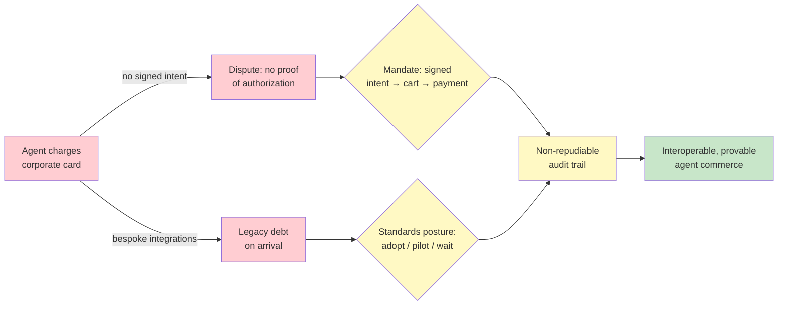

# Chapter 5.6 — The Agent Interoperability & Commerce Stack

*Part V — Advanced & Expert · Domain D6 · Reading time ~30 min · Prerequisites: Ch. 3.4, Ch. 5.1*

## 1. The failure story

The procurement agent was a genuine success by its own metrics: it had autonomously sourced and purchased a piece of SaaS tooling the engineering team needed, negotiating with the vendor's sales agent and paying with the shared corporate card on file. Fast, cheap, hands-off. Everyone was pleased until two things happened in the same week.

First, a dispute. The vendor's agent had upsold a tier the team didn't need, and when the finance team tried to contest the charge, they discovered there was no *cryptographic proof of what the human had actually authorized*. The corporate card had simply been charged. There was a chat log of the two agents negotiating, but nothing that separated "what the company genuinely intended to buy" from "what the agent, mid-conversation, agreed to." The bank's dispute process wanted a record of authorization; the company had a transcript of a probabilistic system talking to another probabilistic system.

Second, a slower and more strategic pain. The agent's integrations with two partner companies' agents had been built bespoke — point-to-point, custom-coded to each partner's idiosyncratic interface. That week both partners announced they were standardizing on open agent-to-agent protocols. The company's hand-rolled integrations were now legacy liabilities the day they shipped, and someone would have to rip them out and rebuild on the standard.

The team had built agent commerce the way you'd wire up a one-off API integration, without asking the two questions this emerging stack exists to answer: *when my agent pays or commits on my behalf, where is the deterministic, non-repudiable proof of what a human actually authorized — and am I building on a standard, or on bespoke integration debt during the exact window when the standards are settling?*

## 2. The mental model

### 2.1 The layered stack: tool, agent, payment

The connective tissue between agents resolves into three layers, and keeping them distinct is the first discipline. The *tool layer* is how an agent talks to a tool or system — this is MCP (Ch. 2.4), agent-to-software. The *agent layer* is how independently built agents talk to *each other* across organizational boundaries — discovery, identity, task delegation — which as of 2026 is coalescing around A2A (agent-to-agent), now under Linux Foundation governance, with signed "Agent Cards" that advertise what an agent is and can do, plus multi-tenancy and delegation semantics. The *payment layer* is how agents *pay* each other, and it is the newest and fastest-moving: a family of protocols for agent commerce including mandate-based schemes that carry cryptographically signed proof of intent, HTTP-native micropayment approaches, and in-conversation commerce standards, alongside merchant-side schemes for verifying that a counterparty is a legitimate agent.

**These three layers answer three different questions — who talks to whom, who vouches for whom, and who pays whom — and conflating them is how you end up with the failure story's bespoke tangle where authorization, identity, and payment are all smeared into one undifferentiated chat log.**

### 2.2 Mandates: the deterministic core, vindicated by the payments industry

The single most important idea in this chapter is that the payments industry, working entirely independently, has rediscovered this course's founding doctrine and built it into the agent-commerce stack. A *mandate* is a cryptographically signed, deterministic record of what a human actually authorized — structured as a chain from *intent* (what the human wanted) to *cart* (the specific goods and terms) to *payment* (the executed transaction), where each step is signed and non-repudiable. The probabilistic agent operates *inside* the envelope of the mandate; the mandate itself is deterministic proof that sits outside the agent's discretion.

This is exactly the deterministic-core thesis of Ch. 3.1 — agents propose, engines dispose, humans are the immutable source of truth — reappearing at inter-company scale, invented by people who had never read this syllabus and arrived at it because commerce forced them to. **When the payments industry independently converges on wrapping probabilistic agent behavior in deterministic, verifiable proof of human intent, that is the strongest possible evidence that the deterministic seam is not a stylistic preference but a structural necessity of building trustworthy agentic systems.** The failure story's dispute is precisely what the absence of a mandate looks like: a charge with no signed intent behind it.

### 2.3 Identity proves *who*, not *how well*

Signed Agent Cards and identity-verification schemes answer a real question — is this counterparty who it claims to be — and they answer it well, cryptographically. But they answer only *that* question. Identity is not competence, and it is not trustworthiness of behavior. A verified agent can be verifiably *bad*: correctly identified, properly signed, and adversarial or simply incompetent in what it does.

This is the open gap in the stack, and it is a familiar one. Part IV was entirely about measuring behavioral quality; Ch. 4.2 was about validating that a grader tracks truth. The interoperability stack has solved identity and left *behavioral attestation* — proof not of who an agent is but of how well it performs — as the unsolved layer. **A signed card tells you the counterparty is really Acme's agent; it tells you nothing about whether Acme's agent is any good, which means counterparty *evals* matter more than counterparty *certificates*.** This gap is also an opportunity: whoever builds the reputation-and-attestation layer — the validated behavioral verifiers of §5.5 applied to counterparties — is building the missing piece, and doing so with an asset this course has taught you to value.

### 2.4 Delegation chains: where authority and liability live

Agent commerce creates chains: a human authorizes an agent, which delegates to a counterparty's agent, which may act further. At each hop, three things must be locatable — *authority* (what is this hop permitted to do), *liability* (who is responsible if it goes wrong), and *audit evidence* (what signed record proves what happened). The mandate architecture exists to keep these locatable across hops: the signed intent-cart-payment chain is the audit evidence, scoped authority is what the mandate permits, and liability follows the signatures.

The design failure to avoid is a delegation chain where authority is ambient (the agent can do whatever the corporate card allows), liability is unassigned (nobody signed anything specific), and audit evidence is a transcript (a probabilistic conversation, not a deterministic record). That is the failure story. The discipline is that every hop in a cross-organizational delegation must carry its own scoped authority and leave its own signed evidence — the containment logic of Ch. 3.4 extended across company lines, where the blast radius is now measured in real money and real contracts.

### 2.5 Enterprise posture: adopt, pilot, or wait — per layer

Because the three layers are maturing at different rates, a single blanket strategy is wrong. The tool layer (MCP) is stable enough to *adopt*. The agent layer (A2A) is standardizing and worth *piloting* on real but bounded use cases. The payment layer is the fastest-moving and least settled, where the posture for most enterprises is to *wait and track* while running small, contained experiments — not to bet the treasury on a standard that may shift under you. **Protocol-tracking should be a standing strategy function, not a one-time technology selection, because the entire stack is in a standardization window where today's bespoke integration is tomorrow's legacy debt and today's leading protocol may be next year's footnote.** The failure story's second pain — bespoke integrations obsoleted on arrival — is the specific cost of building permanently during a window that demanded provisional, standards-tracking bets.

*Ambient authority and bespoke wiring (red) produce undisputable charges and instant legacy debt; signed mandates plus a per-layer adopt/pilot/wait posture (yellow) yield a non-repudiable, interoperable commerce trail (green) — the deterministic core at inter-company scale.*

## 3. The production lens

In production, this chapter's leverage is mostly *strategic restraint*. The pressure to build agent-to-agent and agent-commerce integrations now, bespoke, to capture an opportunity, is real — and mostly wrong during a standardization window. The production discipline is to run contained pilots that build capability and understanding without committing to hand-rolled infrastructure that the standards will obsolete. A standing protocol-tracking function, however small, is cheaper than the rip-and-replace the failure story bought.

Where you cannot wait — where an agent genuinely acts with money or makes binding commitments — the non-negotiable is the mandate: a deterministic, signed record of human intent wrapping every consequential action, so that when a dispute or an audit comes (and the Ch. 4.7 auditor will come), you have proof and not a transcript. This connects the whole back half of the course: the mandate is the audit evidence of Ch. 4.7, the containment boundary of Ch. 3.4, and the deterministic seam of Ch. 3.1, all instantiated at the moment an agent spends your money on another company's agent.

> **Doctrine check.** This chapter is the doctrine's external vindication. Everything the course has argued — deterministic engines disposing of probabilistic proposals, humans as the immutable source of truth, authority scoped and evidenced at every boundary — was argued from first principles about how to build one company's systems. Here an entire industry, chasing the practical necessity of letting agents transact, independently built the same architecture into open standards: mandates are signed human intent disposing of agent behavior. When commerce forces the deterministic core into being at global scale, the thesis stops being one author's opinion and becomes an observed property of what trustworthy agentic systems require. Agents propose; mandates dispose; the human who signed the intent remains the source of truth, now cryptographically.

## 4. Edge-case catalog

| # | Edge case | What it looks like | Detection | Mitigation |
|---|-----------|--------------------|-----------|------------|
| 1 | Verified-but-malicious counterparty | Identity check passes; behavior is adversarial or incompetent | Counterparty behavioral evals, not just certificate validation | Reputation/attestation layer; demand counterparty eval evidence, not identity alone |
| 2 | No proof of authorization | Charge disputed; only a chat transcript exists | Audit for signed mandate on every consequential action | Mandate architecture: signed intent → cart → payment on every spend/commit |
| 3 | Mandate scope ambiguity | Pricing/commerce model the mandate language never anticipated | Scope-boundary checks; flag actions outside explicit mandate terms | Escalation-to-human as a protocol-level requirement, not an app-level nicety |
| 4 | Protocol version skew | Counterparties on incompatible protocol versions mid-transaction | Version negotiation handshake; compatibility monitoring | Gateway/negotiation strategy; graceful degradation and abort rules |
| 5 | Cross-org incident attribution | Delegated task fails; unclear whose verification failed | Per-hop signed evidence; contractual metric definitions | Define attribution metrics and evidence in the contract before integrating |
| 6 | Bespoke integration debt | Hand-rolled integrations obsoleted by standard adoption | Protocol-landscape tracking; standardization-signal monitoring | Adopt/pilot/wait per layer; contained pilots over permanent bespoke builds |

## 5. Claude & MCP in this chapter

MCP is the tool layer of this stack — the stable, adoptable base on which the higher layers build — and it is the one piece of the three-layer model this course has treated in depth (Ch. 2.4). The agent layer (A2A) and the payment layer sit above it and are far less settled; anything you read about A2A's specification, Agent Card format, or governance, and especially anything about the payment protocols (mandate schemes, micropayment approaches, in-conversation commerce), should be verified against the live primary sources, because this is explicitly the fastest-moving layer in the entire syllabus and any memorized detail will age in months.

The practical Claude connection is that an agent you build with Claude will increasingly be a *participant* in this stack — exposing an Agent Card, honoring mandates, transacting with counterparties — and the safety-relevant design work is exactly this course's material: scoped tool grants (Ch. 3.4), validated behavioral evals for counterparties (Ch. 4.2, Ch. 5.5), and audit-grade evidence (Ch. 4.7). Verify current protocol support and any commerce features at the primary specifications and docs.claude.com rather than trusting a fixed description, and treat the whole commerce layer as a track-and-pilot area rather than a settled foundation.

## 6. Design exercise

Define the interoperability posture for a bank piloting agent-to-agent procurement with two named vendors. Specify: the protocol selection per layer (what you adopt at the tool layer, pilot at the agent layer, and how you handle the payment layer); the mandate policy (what human-intent signatures are required before an agent spends, and the spend ceilings that bound each mandate); the identity-verification requirements for counterparties; the counterparty eval demands (what behavioral evidence you require beyond a signed card); and the unanticipated-case escalation rules (what forces a human into the loop when an action falls outside mandate scope). Then state your standing protocol-tracking commitment: who watches the standards, and what signal would move you from "wait" to "adopt" on the payment layer.

**Review standard.** A strong answer treats the three layers *differently* — adopting the stable tool layer, piloting the agent layer, and explicitly waiting-with-tracking on the payment layer rather than committing. The mandate policy must require signed human intent for consequential spend with explicit ceilings, directly answering the failure story's dispute. The counterparty requirements must demand *behavioral* evidence, not merely identity — an answer satisfied by a signed Agent Card has missed the verified-but-malicious gap. The escalation rules must make out-of-scope actions a protocol-level human trigger, not an afterthought. An answer that builds bespoke integrations to move fast has bought the failure story's second pain.

## 7. Self-test

1. *Name the three layers of the stack and the distinct question each answers.* — Tool layer (MCP): how an agent talks to software — who talks to what. Agent layer (A2A): how independently built agents talk to each other — who vouches for whom and who delegates to whom. Payment layer (mandate/commerce protocols): how agents pay each other — who pays whom, with proof of authorization. Conflating them produces undifferentiated integration tangle.

2. *What is a mandate, and why is its emergence significant for this course's thesis?* — A cryptographically signed, deterministic record of what a human actually authorized, structured intent → cart → payment, inside which the probabilistic agent operates. It is significant because the payments industry independently reinvented the deterministic-core doctrine — deterministic proof disposing of probabilistic agent behavior — which is strong external evidence the seam is a structural necessity, not a stylistic choice.

3. *Why do counterparty evals matter more than counterparty certificates?* — Because identity verification proves *who* an agent is, not *how well* it behaves; a verified agent can be verifiably adversarial or incompetent. Behavioral attestation is the unsolved layer, so trusting a counterparty requires evidence of its performance (an eval), not merely a valid signature on its identity.

4. *Why is "wait and track" the right posture for the payment layer but not the tool layer?* — Because the layers are at different maturities: the tool layer (MCP) is stable enough to adopt, while the payment layer is the fastest-moving and least settled, where committing to a standard now risks building obsolete infrastructure. A per-layer posture with standing protocol-tracking beats one blanket strategy during a standardization window.

5. *An agent charges a corporate card after negotiating with a vendor agent, and the charge is disputed. What architectural element was missing, and what does it prove?* — A mandate: a signed, deterministic record of the human's authorized intent, separate from the agents' negotiation transcript. It proves *what the human actually authorized* in a non-repudiable form, giving the dispute (and any later audit) deterministic evidence rather than a probabilistic conversation log.

## 8. Spaced-review card

- From memory: name the three layers (tool/agent/payment) and the leading protocol or scheme at each as of 2026.
- From memory: define a mandate's intent → cart → payment chain and connect it to the Ch. 3.1 deterministic core.
- From memory: state why identity ≠ trust and what the missing behavioral-attestation layer implies for counterparty diligence.

---

*The stack that lets agents transact raises the final question of the course: not how to build or connect agents, but whether to — the economics, organization, and strategy of agentic systems as business objects. Chapter 5.7 closes Part V with the honest ROI calculation that includes the eval engineers and the human reviewers and the trace storage and the compliance overhead, the build-buy-wait decision against the frontier's capability half-life, and the organizational failure mode of the orphan agent that no team actually owns.*
