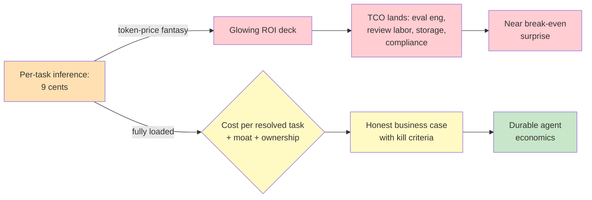

# Chapter 5.7 — Economics, Organization & Strategy

*Part V — Advanced & Expert · Domain D6 · Reading time ~30 min · Prerequisites: Ch. 4.5, Ch. 5.4*

## 1. The failure story

The board deck was triumphant. The new agentic workflow — automating a chunk of the claims-processing operation — showed a per-task cost of nine cents against a manual cost of four dollars. Forty-fold savings, glowing ROI, unanimous approval to scale. The team hired against the projected savings and set aggressive expansion targets.

A year later the CFO's office ran a full accounting, and the forty-fold savings had evaporated into something closer to break-even. The nine-cent inference cost had been real. Everything *around* it had not been counted. There was a two-person eval-engineering function maintaining the test suites and graders that kept the agent trustworthy — permanent headcount the original model omitted. There was a human-review operation that scaled *with volume*: every ambiguous claim the agent flagged went to a person, and as the agent processed more claims, the review queue and its staffing grew in lockstep. There was trace storage measured in terabytes for the audit retention Ch. 4.7 demanded. There was an incident-response rotation. There was compliance overhead. The nine cents of inference sat inside a denominator three times larger that nobody had put in the deck.

The initiative wasn't a failure — near-break-even automation of a real workload has strategic value. The *business case* was a failure, because it had been built on a token-price fantasy. The team had computed the cost of the model and called it the cost of the system. The question the deck never asked was: **what is the fully loaded cost of a resolved task — including the eval engineers, the human reviewers who scale with volume, the storage, the incidents, and the compliance — and does the value still clear that bar?**

## 2. The mental model

### 2.1 ROI honestly computed

An agent's return is not (task value − inference cost). It is a subtraction with a much larger, more honest subtrahend:

*(task value × success rate × volume) − (inference + verification + oversight labor + failure cost × blast radius + platform amortization).*

Every term earns its place. *Success rate* matters because a task the agent gets wrong has negative value, not zero — it consumes a failure cost. *Verification* is the eval engineering and grader maintenance that is permanent, not one-time. *Oversight labor* is the human review, and its danger is that it often scales with volume. *Failure cost × blast radius* is the expected damage of the errors that get through, weighted by how far they propagate (the containment logic of Ch. 3.4 as a line item). *Platform amortization* is the observability, reliability, and release infrastructure of Part IV, spread across the tasks it serves. **The honest ROI of an agentic system is dominated not by the token price but by the human and infrastructure costs that surround the model, and any business case that computes inference cost and stops has measured the cheapest part and ignored the rest.**

### 2.2 Build, buy, or wait — against the capability half-life

The most consequential strategic question is often *not to build yet*. The frontier moves fast enough that a capability you build laboriously today may be absorbed into next year's base model, delivered for free. So the build/buy/wait decision has to be made against a *capability half-life*: will the frontier model make this obsolete in twelve months? If yes, building a sophisticated custom solution is investing in a depreciating asset, and waiting (or buying a thin, replaceable solution) is correct.

Moat analysis is the flip side. A thing worth building has a defensibility that the frontier will not absorb — proprietary *data*, *distribution*, or *workflow lock-in* — as opposed to a thin wrapper around a model's capability, which the model will eventually swallow. **The strategic question is not "can we build this?" but "will this still be ours to own after the frontier's next release?" — and the honest answer for most thin capabilities is no, which makes disciplined waiting a strategy rather than a failure to act.** The validated verifiers of Ch. 5.5 are one of the few assets that reliably appreciate rather than depreciate against the frontier, which is why they keep recurring as the enterprise's durable edge.

### 2.3 Pricing: you can only price what you can measure

Agentic products can be priced per-seat, per-usage, or per-outcome, and the trend toward *outcome pricing* — charge for resolved tickets, not consumed tokens — is where the strategic subtlety lives. Outcome pricing aligns you with the customer and captures value, but it has a hard dependency most teams miss: you can only price an outcome you can *measure*, which means your evals (Part IV) become *revenue infrastructure*, not just quality infrastructure. If you cannot reliably tell a resolved ticket from an abandoned one, you cannot price resolution, and any outcome metric you can't measure precisely will be disputed or gamed.

Margin exposure is the other pricing hazard. If you price per-outcome at a fixed rate but your cost is per-token and the provider raises prices or a task turns out to need more reasoning than modeled, your margin is exposed to inputs you don't control. The Ch. 4.5 discipline — cost per *resolved task*, segmented — is what tells you whether an outcome price is a margin or a subsidy, and the failure story's negative-margin feature (a popular workflow that lost money per request) is what happens when you price an outcome you never costed.

### 2.4 Team topology and Conway's law

How you organize determines what you can build, and agentic systems have their own topology questions. A *platform team* that owns shared eval, observability, and reliability infrastructure serves *embedded agent engineers* who build specific workflows on top — the alternative, every team rolling its own eval and tracing, guarantees duplicated effort and inconsistent quality. A distinct and underappreciated role is the *eval owner*: someone accountable for the validated verifiers that, as Ch. 5.5 argued, are the compounding asset. And agent fleets need *on-call* the way any production system does, which raises the question of who carries the pager for an agent's 3 a.m. misbehavior.

Conway's law — systems mirror the communication structure of the organizations that build them — bites hard here. **An organization that builds agents with no clear operational owner will produce agents with no operational ownership, and the resulting "orphan agent" fleet — shipped by teams that moved on, owned by no one, degrading silently — is an organizational failure expressing itself as a technical one.** The org chart is an architecture decision.

### 2.5 Vendor strategy and the shape of lock-in

Lock-in in the agentic stack is subtler than a contract. It accumulates in *traces* (your observability history lives in a vendor's format), in *memory* (your agent's accumulated context and knowledge), and in *fine-tunes* (custom weights tied to a provider's base model, per Ch. 5.4). Each raises exit costs quietly. The countermeasure is a deliberate multi-provider posture — not necessarily running two providers at once, but architecting so you *could*, which preserves negotiating leverage and resilience (the multi-provider reliability point of Ch. 4.4, now as commercial strategy). A single-provider architecture is a fine engineering choice and a weak negotiating position; knowing which you've made is the point.

### 2.6 The economic pathologies

Three economic failure modes deserve names because they are common and counterintuitive. The *cheap-agent-expensive-babysitter trap*: review labor that scales with volume can dominate cost, so that "cheaper per task" produces "more expensive in total" as volume grows — the failure story's review operation. *Jevons effects*: when a task gets radically cheaper, demand for it can explode, and induced volume can drive net spend *up* even as unit cost falls, which means cheap agents need demand governance, not just cost optimization. And *outcome-metric gaming*: per-outcome pricing invites disputes over what counts as an outcome, so contractual metric definitions become a product surface — the same measurement-integrity problem as Ch. 4.2 and Ch. 5.5, now in the commercial contract. **Cheaper unit costs do not guarantee lower total costs, and a leader who optimizes the per-task price without governing the volume it induces and the review it demands can automate their way to a larger bill.**

*The token-price fantasy (red) collapses when total cost of ownership lands; a fully loaded cost-per-resolved-task model with moat analysis and clear ownership (yellow) yields economics that survive contact with the CFO (green).*

## 3. The production lens

In production, this chapter's discipline is mostly a defense against your own optimism. The per-task cost is seductive because it is small, concrete, and easy to compute; the surrounding costs are large, diffuse, and easy to omit — so the natural business case is systematically wrong in the same direction every time. The correction is to make the fully loaded denominator mandatory: no agentic business case advances without the eval headcount, the volume-scaled review labor, the storage, and the compliance overhead in the model, and no scaling decision proceeds without a Jevons check on induced demand.

The organizational failure mode is the one leaders underweight most. Every prior chapter's discipline — evals, observability, reliability, release, audit — presupposes an *owner*, a team accountable for the agent in production. The orphan-agent fleet is what happens when agents are shipped as projects rather than owned as products, and it is invisible until something breaks and no one answers the page. Kill criteria are the honest counterpart: a program that cannot name the two measured conditions under which it would be *stopped* has not been evaluated as an investment, only sold as one.

> **Doctrine check.** The whole course reduces, economically, to a single line: the value an agent creates by proposing must exceed the full cost of the human and deterministic machinery required to safely dispose of what it proposes. Evals, reviewers, containment, audit — the entire dispose layer — is not overhead to be minimized away; it is the cost of making probabilistic proposals trustworthy, and it is exactly what the token-price fantasy omits. The immutable source of truth has a payroll. A business case that treats the agent's proposal as the product, and the human disposition as a rounding error, has inverted the thesis and will meet the CFO's correction. Agents propose cheaply; disposing of their proposals responsibly is where the money is, and honest economics counts it.

## 4. Edge-case catalog

| # | Edge case | What it looks like | Detection | Mitigation |
|---|-----------|--------------------|-----------|------------|
| 1 | Cheap-agent-expensive-babysitter | Per-task cost low, total cost high as review scales with volume | Model review labor as a function of volume, not a constant | Automate triage to shrink review rate; count oversight labor in ROI |
| 2 | Jevons induced demand | Unit cost falls, volume explodes, net spend rises | Track total spend and volume together, not just unit cost | Demand governance and budgets on induced volume (Ch. 4.5) |
| 3 | Outcome-metric gaming | Disputes over what counts as a "resolved" outcome | Audit outcome classifications; measure dispute rate | Precise contractual metric definitions; validated outcome evals |
| 4 | Depreciating moat | Custom build absorbed by next frontier release | Capability-half-life review each planning cycle | Build only defensible assets (data, distribution, verifiers); buy/wait on thin capability |
| 5 | Silent vendor lock-in | Exit cost balloons via traces, memory, fine-tunes | Periodic exit-cost estimate; portability audit | Multi-provider-capable architecture; portable trace/memory formats |
| 6 | Orphan agent fleet | Agents in production owned by no current team | Ownership audit: every agent maps to an on-call owner | Ship agents as owned products; assign eval owner and on-call before launch |

## 5. Claude & MCP in this chapter

The economics in this chapter are provider-agnostic, but the specific numbers that drive them — model pricing, prompt-caching discounts, batch-processing rates, context-window costs — are set by providers and move frequently, so any ROI or margin model must be built on *current* pricing verified at docs.claude.com rather than a memorized figure, and rebuilt when pricing changes. The Ch. 4.5 discipline of cost-per-resolved-task, segmented, is the calculation to run against live prices; this chapter simply insists that the denominator also include the human and infrastructure costs the price sheet never mentions.

MCP and the interoperability stack (Ch. 5.6) matter to strategy as *lock-in and leverage* considerations: an architecture built on open, portable interfaces preserves the multi-provider optionality that is both a reliability posture (Ch. 4.4) and a negotiating one (§2.5). When evaluating build/buy/wait, the portability of your integrations, traces, and memory is part of the exit-cost calculation, and standards-based interfaces are worth a premium precisely because they lower future switching costs during a fast-moving frontier.

## 6. Design exercise

Build the 18-month business case for an agent platform in a regulated vertical of your choice (credit, claims, tax, audit). Produce: a fully loaded TCO model (inference, eval engineering, volume-scaled review labor, storage/retention, incident response, compliance overhead, platform amortization); a pricing structure (per-seat, usage, or outcome — and if outcome, the eval that makes the outcome measurable); a staffing plan (platform team, embedded engineers, the eval owner, on-call ownership); and the two kill criteria — the specific, measured conditions under which you would *end the program*. Then stress-test it: identify the single largest cost you are least certain about and the Jevons risk if the workflow succeeds.

**Review standard.** A strong TCO model makes review labor a *function of volume*, not a fixed line, and includes eval engineering as permanent headcount — the two omissions that sank the failure story. If the pricing is outcome-based, the answer must specify the eval that makes the outcome measurable, treating evals as revenue infrastructure. The staffing plan must assign explicit operational ownership and an eval owner, defusing the orphan-agent mode. The two kill criteria must be *measured and specific* ("cost per resolved task exceeds X for two quarters," not "if it's not working") — a business case that cannot name the conditions for stopping has been sold, not evaluated. The Jevons stress-test must acknowledge that success can raise total spend.

## 7. Self-test

1. *Why is per-task inference cost a systematically misleading basis for an agentic business case?* — Because it is the small, concrete, easily computed part, while the dominant costs — eval engineering, volume-scaled review labor, storage, incidents, compliance, platform amortization — are large, diffuse, and easily omitted. The business case is therefore biased wrong in the same direction every time, computing the cheapest component and calling it the cost of the system.

2. *What is the capability half-life, and how should it change a build decision?* — It is the time until the frontier model absorbs a capability and delivers it for free. If a capability's half-life is short, building a sophisticated custom version invests in a depreciating asset, so buying thin or waiting is correct; you should build only what remains defensibly yours after the frontier's next release — proprietary data, distribution, workflow lock-in, or validated verifiers.

3. *Why do evals become revenue infrastructure under outcome pricing?* — Because you can only price an outcome you can measure: charging for resolved tickets requires reliably distinguishing resolved from abandoned, which is an eval. If the outcome isn't measurable, it can't be priced without dispute or gaming, so the validated eval that quantifies the outcome is a direct dependency of the revenue model, not merely a quality tool.

4. *Explain the Jevons trap for a leader who just cut per-task cost tenfold.* — Radically cheaper tasks can induce exploding demand, and enough induced volume can drive *total* spend up even as unit cost falls. So optimizing per-task price without governing induced volume can automate the organization into a larger bill; cheap agents require demand governance, not just cost optimization.

5. *What organizational structure produces the orphan-agent fleet, and what is the fix?* — Building agents as projects shipped by teams that then move on, with no assigned operational owner — Conway's law turning an ownership gap into a fleet of unowned, silently degrading agents. The fix is to ship agents as owned products, assigning on-call ownership and an eval owner before launch, so every agent in production maps to an accountable team.

## 8. Spaced-review card

- From memory: write the honest ROI equation and name the term most often omitted from business cases.
- From memory: state the build/buy/wait question in terms of capability half-life and moat, and name an asset that appreciates against the frontier.
- From memory: name the three economic pathologies (babysitter, Jevons, metric-gaming) and one governance response to each.

---

*Next: Chapter 5.8 — The Agent Platform, where a routine model-deprecation notice forces a bank to spend five weeks discovering it owns 47 agents — eleven of them owned by no one, two of them silently coupled — because every agent was built responsibly and nobody was assigned the question that outranks all of them: who governs the fleet, and could they enumerate it today?*
