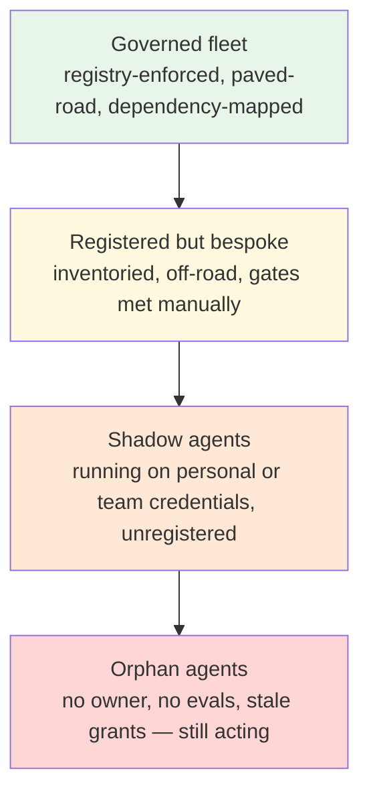

# Chapter 5.8 — The Agent Platform: Fleet Architecture & Portfolio Governance

*Part V — Advanced & Expert · Domain D6 · Reading time ~28 min · Prerequisites: Ch. 5.7, 4.1–4.6, 3.1, 3.3*

---

## 1. The failure story

Eighteen months after its first agent shipped, a mid-size bank had, by its own eventual count, **47 agents** in some form of production use. Nobody had that number on the day it mattered. The count came from a forced inventory, triggered when the model provider announced a 90-day deprecation of an older model version and the platform lead realized she could not answer the follow-up question: *which of our agents are pinned to it?*

The inventory took five weeks and read like an archaeology dig. Eleven agents had no identifiable owner — built by employees who had left, or by teams that had reorganized twice since. Nine had no eval suite at all; their teams had copied a colleague's agent scaffold and swapped the prompt. Six were running with tool permissions broader than any current policy would grant, grandfathered from a time before the Ch. 3.4 containment standards existed. Three were discovered only because they appeared in the trace store under service accounts nobody recognized. And two — this was the expensive part — turned out to be *coupled*: a collections-outreach agent consumed case summaries written by a hardship-assessment agent, and when the hardship team had quietly improved their summary format four months earlier, the collections agent's misclassification rate had risen from roughly **2% to 9%**. Nobody caught it, because each agent's team monitored only its own dashboards, and the dependency existed in no diagram anywhere. Estimated cleanup: **$1.4M** in remediation engineering, plus one regulatory finding for the over-permissioned agents that no one could produce change records for.

Every individual agent had been built more or less responsibly by the standards of Parts III and IV. The failure was not in any agent. It was in the space *between* them — and in the question nobody had been assigned to ask: **who governs the fleet, and could they enumerate it if a regulator, a provider, or an incident demanded it today?**

---

## 2. The mental model

### 2.1 The fleet is a second system

Everything before this chapter hardened a single agent: its seam (Ch. 3.1), its containment (3.4), its evals (4.1–4.2), its economics (4.5, 5.7). The unit of those disciplines was one agent and its task. But organizations do not stop at one. Success breeds copies, and the copies interact — through shared tools, shared data stores, shared model providers, and each other's outputs. A fleet of *n* agents has up to *n(n−1)/2* **pairwise interaction paths**, none of which belongs to any single agent's design review. At 5 agents that is 10 paths; at 47 it is 1,081. The bank did not have 47 risks; it had 47 risks plus a thousand unexamined seams.

This is why the fleet is a second system with its own architecture, not a pile of first systems. The single-agent disciplines are necessary and jointly insufficient: each agent can pass its own review while the portfolio drifts into unowned, unenumerable, mutually coupled sprawl. The shift in this chapter is the same shift IT management made decades ago from "is each server configured well?" to "do we have a CMDB?" — except the assets here are probabilistic, coupled through language, and capable of acting.

### 2.2 The registry is the control plane

The foundational artifact of fleet governance is the **agent registry**: a single, mandatory, machine-readable inventory in which every production agent has an entry, and an agent without an entry does not get production credentials. Minimum viable schema, in prose: identity and named human owner (a role, not a departed individual); business task and its Ch. 0.3 spec version; model and version dependencies; the full tool grant with scopes (the Ch. 3.4 permission set, referenced not paraphrased); autonomy level per action class (Ch. 3.3); eval suite location and last passing run; declared upstream and downstream dependencies — *which agents or systems consume this agent's output, and whose output it consumes*; data classifications touched; kill-switch mechanism and its last test date; and cost center.

Two design rules make a registry real rather than aspirational. First, it must be enforced at the **credential layer**: the registry entry is the thing that grants API keys, tool scopes, and network egress, so an unregistered agent is not merely non-compliant — it is non-functional. A registry maintained by goodwill decays into the bank's archaeology dig within a year. Second, it must be *queryable in incident time*: "which agents use model X," "which agents can write to the payments system," "which agents consume agent Y's output" must each be one query, because the moments you need them — provider deprecation, tool compromise, upstream format change — are moments with a clock running. **A fleet you cannot enumerate is a fleet you cannot govern, and every property of the fleet you cannot query is an incident you have pre-committed to discovering manually.**

### 2.3 Paved roads: the platform's economic bargain

With an inventory in place, the next question is how 47 agents get built without 47 bespoke stacks. The answer this curriculum has been assembling all along is the **paved road**: a platform team operates shared infrastructure — the trace store and observability pipeline (Ch. 4.3), the eval harness and dataset tooling (4.1–4.2), the release gates (4.6), the policy and containment engine (3.4–3.5), prompt/config versioning, and the cost-metering layer (4.5) — and product teams build agents *on* it. The bargain is explicit: teams that take the paved road get all of that for free and ship faster; teams that leave it must independently satisfy every gate it automates, at their own expense. Golden path, not mandate — but a golden path with teeth, because the release gate of Ch. 4.6 does not distinguish how you satisfied it, only whether you did.

The economics compound. An eval harness is expensive the first time and nearly free the ninth; a trace schema shared across the fleet makes cross-agent forensics possible at all; a single policy engine means a new containment rule deploys to every agent in one change instead of 47 pull requests. This is also where Ch. 5.7's team-topology question lands concretely: the platform team owns the roads, product teams own their agents' outcomes, and the registry records which is which — because the alternative, discovered in the failure story, is that reorganizations quietly convert owned agents into orphans.

*The fleet-governance gradient. Green is cheap to govern and queryable in incident time. Yellow is legitimate but expensive. Orange is undiscovered risk. Red is the failure story: software with agency, permissions, and no human answerable for it.*

### 2.4 Cross-agent hazards: where the new failure modes live

The genuinely new content of the fleet — what no single-agent chapter covers — is the interaction hazards. Four dominate. **Emergent coupling**: agent B consumes agent A's output without a contract, so A's team "improving" a format is, from B's side, silent input drift — the bank's 2%-to-9% incident. The mitigation is treating agent-to-agent outputs as versioned interfaces with schema contracts and consumer tests, exactly as microservices learned, plus the registry's **dependency edges** so the blast radius of a change is queryable. **Common-mode failure**: 47 agents that share one model provider, one trace store, or one policy engine share one outage and one behavioral shift; a silent model update (Ch. 1.1, 2.5) is a *fleet-wide* simultaneous change, which is why fleet-level canarying of provider changes belongs on the paved road. **Feedback loops**: one agent's output re-enters another's context — or its own, through a shared knowledge base — and small biases amplify around the loop; Ch. 5.2's goal-drift pathologies return here at portfolio scale, and the detection is fleet-level lineage tracing, not per-agent dashboards. **Resource contention**: agents sharing tools, rate limits, and budgets can starve each other in ways each agent's own monitoring reads as "the API got slow," which is why cost and quota metering (4.5) must aggregate at the fleet level with per-agent attribution.

### 2.5 Portfolio governance: lifecycle, kill criteria, and the orphan problem

The last discipline is treating the fleet as a managed portfolio with a lifecycle. Every agent enters production with three things recorded in the registry: the business metric it exists to move (Ch. 0.3's intent layer), its Ch. 5.7 unit economics, and — decided at launch, not at crisis — its **kill criteria**: the conditions under which it is retired. Sensible defaults: sustained negative unit economics after the babysitter costs are counted; an owner vacancy unfilled after a defined grace period; a failed re-validation after a major dependency change; or the business process it served changing beneath it (Ch. 0.3's spec–reality drift, escalated to termination). A **quarterly portfolio review** walks the registry: every agent re-attests owner, evals green, grants still minimal, economics still positive. Attestation lapses convert to escalations automatically.

The orphan agent — Ch. 5.7 named it as an organizational pathology — is here a *governance* problem with a mechanical solution: ownership is a registry field checked by machine, attestation is periodic and mandatory, and an agent whose owner field goes stale loses credentials on a timer. Brutal, and correct: an agent with no owner and live permissions is not an asset that happens to lack a maintainer; it is an unattended actor inside your systems, and the deprecation clock in the failure story found eleven of them.

---

## 3. Production lens

Fleet governance has a P&L, and pretending otherwise is how it gets skipped. A credible platform team for a 30–50 agent fleet in a regulated org runs 4–8 people (registry and credential plumbing, eval and trace infrastructure, policy engine, portfolio operations) — call it $1–2M/year loaded. Against it: the marginal cost of each new agent drops steeply (teams report weeks-to-production falling to days on a mature paved road), a provider deprecation becomes a query plus a targeted migration instead of a five-week dig, and one avoided fleet-scale incident — the bank's was $1.4M plus a regulatory finding — pays for a year of the team. The trap to name in any business case is the reverse: platform *under*-investment is invisible while agent count grows, because every cost it would have prevented books to someone else's incident budget.

Operationally, the fleet gets its own dashboard, distinct from any agent's: registry coverage (production credentials with no registry entry — target zero, alert on any); orphan and attestation-lapse counts; fleet cost and its concentration (one agent quietly consuming 40% of spend is a 4.5 conversation someone should be having); cross-agent dependency-graph churn (new edges are new seams needing contracts); provider-version dispersion (how many model versions the fleet spans — high dispersion is migration debt, dispersion of one is common-mode exposure; you are choosing a point on that tradeoff, so choose it consciously); and kill-criteria breaches aging without action. On-call changes shape too: fleet-level incidents — provider outage, shared-tool compromise, a poisoned shared knowledge base — need a rotation that owns the *space between* agents, with the registry as its first-response map.

> **Doctrine check.** The doctrine scales one level up, intact. Each agent proposes; its engine disposes. At the fleet layer, *teams* propose — new agents, new grants, new dependencies — and the **platform disposes**: the registry, the credential layer, and the release gates are the deterministic core of the portfolio itself, turning governance from a policy document into a machine that mechanically enforces enumeration, ownership, and least privilege. And the humans-as-source-of-truth clause becomes literal infrastructure: the owner field in the registry *is* the named human answerable for each agent, checked by attestation, with credentials as the enforcement. If your fleet's deterministic core cannot answer "which agents, whose, doing what, with what rights" in one query, the doctrine holds everywhere in your architecture except the level that governs all the others.

---

## 4. Edge-case catalog

| # | Edge case | What it looks like | Detection | Mitigation |
|---|---|---|---|---|
| 1 | **The orphan agent** | Owner left or team reorganized; agent keeps running with live permissions, stale evals, ungoverned grants; discovered during an unrelated incident | Registry attestation lapses; owner field pointing at a departed identity; eval last-run age exceeding policy | Ownership as a machine-checked registry field bound to roles not individuals; mandatory periodic re-attestation; credentials auto-expire on sustained lapse |
| 2 | **Shadow agents** | Teams stand up agents on personal API keys or generic service accounts, bypassing the registry entirely; the official inventory is a subset of reality | Reconcile provider billing and egress logs against registry entries; unrecognized service accounts in the trace store; API spend not attributable to any registered agent | Enforce registration at the credential layer (no entry → no keys, no egress); make the paved road faster than the workaround so bypass loses its incentive |
| 3 | **Emergent coupling / silent input drift** | Agent B consumes agent A's output with no contract; A's team improves a format and B degrades quietly for months; neither team's dashboard covers the seam | Fleet-level lineage tracing across the shared trace store; dependency edges declared in the registry and diffed against observed data flows; consumer-side input-schema monitors | Agent-to-agent outputs treated as versioned interfaces with schema contracts and consumer tests; producer changes gated on downstream re-validation (Ch. 4.6, applied across team boundaries) |
| 4 | **Common-mode provider/model failure** | A silent model update or provider outage shifts behavior across dozens of agents simultaneously; per-agent on-call sees dozens of unrelated tickets, not one event | Provider-version dispersion tracked in the registry; fleet-wide canary suite run against provider changes; correlated eval-metric movement across agents flagged centrally | Fleet-level canarying and staged provider rollouts on the paved road; deliberate dispersion decisions; a fleet incident-command role that owns cross-agent correlation |
| 5 | **Inter-agent feedback loops** | One agent's output enters another's context — or its own, via a shared knowledge base — and bias amplifies around the loop; each agent looks locally sane | Lineage queries for cycles in the dependency graph; drift monitors on shared stores that agents both read and write; provenance tags on agent-generated content | Break or gate cycles: provenance-aware retrieval that discounts or quarantines agent-authored content (Ch. 5.4's contamination discipline, fleet-scale); human review on any write path into a shared store |
| 6 | **Portfolio Goodhart** | Fleet dashboard optimizes agent count and aggregate automation rate; teams ship low-value registered agents to hit adoption targets while the hard, valuable tasks stay manual | Unit economics per agent (5.7) reviewed alongside adoption metrics; value-delivered distribution across the portfolio (a long tail of near-zero-value agents is the tell) | Portfolio reviews gate on per-agent business outcomes against the Ch. 0.3 intent layer, not on counts; kill criteria enforced so the registry sheds agents as readily as it adds them |

---

## 5. Claude & MCP sidebar

The fleet pattern maps directly onto Claude's stack, and the mapping is worth studying because the stack is itself converging on paved-road primitives (verify current mechanics at [docs.claude.com](https://docs.claude.com); the architecture is durable, the surface moves). **MCP is the fleet's shared tool plane**: one governed MCP server per system of record, consumed by every agent, means tool logic, authentication, and audit live in one place instead of 47 — and a tool-scope change is a server-side policy edit, not a fleet-wide migration. The **Claude Agent SDK** functions as paved-road scaffolding: permission modes, hooks, and session management give every agent the same containment and observability posture by default, which is precisely the golden-path bargain of Section 2.3. Organization-level API key management, workspace-scoped spend limits, and usage reporting are the credential-layer and metering primitives a registry enforces through. What the vendor stack does not ship is the registry itself, the dependency graph, or your portfolio governance — those are yours to build, because they encode *your* ownership model and kill criteria. Check the current platform documentation before designing, and resist assuming any remembered quota, admin feature, or SDK surface still exists in the form this paragraph implies.

---

## 6. Design exercise

A national health insurer has 23 production agents built by six product teams over two years: intake triage, prior-authorization drafting, provider-correspondence summarization, member-service copilots, claims-adjudication support, and a handful of internal back-office agents. There is no registry. Three agents are known to consume other agents' outputs; the true dependency graph is unknown. The CISO has given you one quarter and a platform budget for four engineers.

Design the fleet-governance program: (1) the registry schema — fields, and for each field *what query or incident it exists to serve*; (2) the enforcement mechanism that makes registration mandatory rather than aspirational, and the migration path for the 23 incumbents including the ones nobody owns; (3) the paved-road service list in priority order for a four-engineer team, with the explicit bargain offered to product teams; (4) the cross-agent hazard controls for the known and unknown dependencies; (5) the quarterly portfolio-review protocol including default kill criteria; and (6) the fleet dashboard's six headline signals.

*Review standard:* your registry must be enforced at the credential layer (if compliance depends on goodwill, the design fails); every schema field must justify itself by a named query or incident; your migration plan must state what happens to an incumbent agent whose owner cannot be found within the quarter — and "leave it running while we investigate" is an answer you must explicitly defend against the failure story, not assume.

---

## 7. Self-test — judge each claim, justify in one sentence

1. "If every agent in the fleet individually passes the Part III–IV disciplines, the fleet is governed."
2. "An agent registry maintained as a documentation requirement will converge on the true inventory."
3. "Standardizing the whole fleet on a single model version is the safest posture."
4. "Agent-to-agent data flows inside one company need interface contracts, like public APIs do."
5. "Kill criteria should be defined when an agent starts failing, by the team that knows it best."

*(Answers are argued, not looked up: 1-false — per-agent discipline leaves the n(n−1)/2 interaction seams, common-mode dependencies, and ownership drift unexamined, which is exactly where the failure story lived; 2-false — goodwill inventories decay as teams reorganize; only credential-layer enforcement, where no registry entry means no working keys, keeps the map matching the territory; 3-false — it trades migration debt for maximal common-mode exposure to one silent update or outage; dispersion is a tradeoff to set consciously, not a hygiene score to maximize in either direction; 4-true — an undocumented consumer of another agent's output experiences every producer improvement as silent input drift, so schema contracts, consumer tests, and gated producer changes apply with full force inside the walls; 5-false — kill criteria defined at crisis time by the owning team are negotiated, not applied; they must be set at launch and enforced by the portfolio review precisely so retirement is mechanical when attachment and sunk cost argue loudest.)*

## 8. Spaced-review card *(re-answer in 7 days, from memory)*

- Write the minimum agent-registry schema from memory and, for each field, the incident-time query it serves.
- Name the four cross-agent hazard classes and one detection signal for each.
- State the paved-road bargain in one sentence and explain why enforcement lives at the credential layer, not in policy documents.

---

*This chapter closes Part V and, with it, the instructional arc of the course — from the deterministic-core philosophy of Part 0, through specification, building blocks, architecture, and production operations, to the frontier and finally the fleet. What remains is to prove the knowledge under load. Part VI turns to the capstones and certification: end-to-end design of a regulated-domain agent platform, a red-team exercise against your own architecture, and the mock certification exam that samples every domain by its production weight. The failure stories were the curriculum; the capstones are where you demonstrate you can prevent them.*
